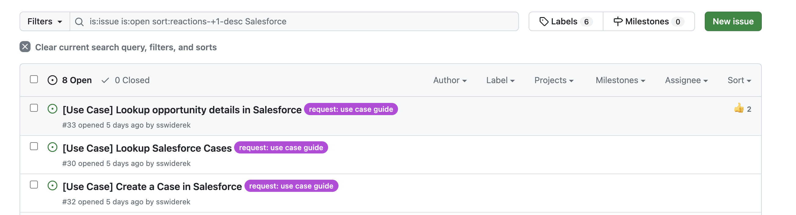
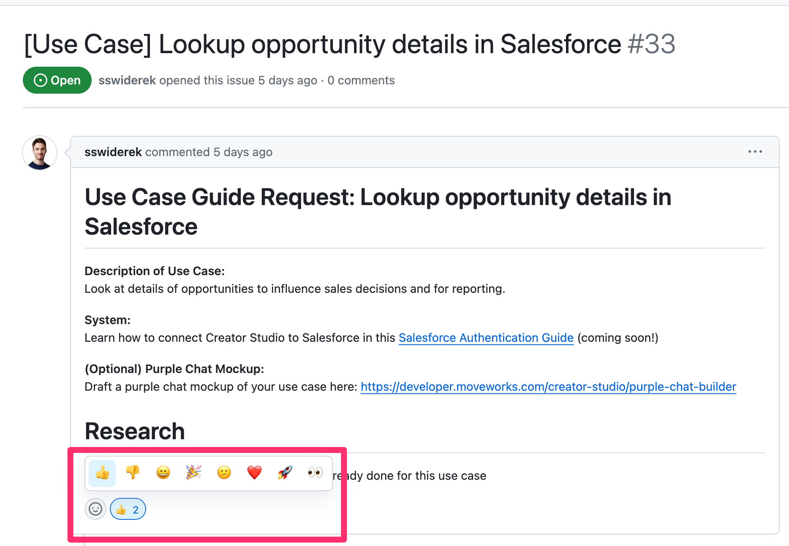

Test Change to be removed (PR Check)
# Tutorial & Guides Library

Welcome to our [Tutorials and Guides Library](https://developer.moveworks.com/creator-studio/resources/), designed to inspire you and enhance your experience with Creator Studio. Find detailed instructions and best practices for quick and effective implementation.

There are several types of guides and tutorials:

1. **Authentication Guide** (`./authentication-guides`): Follow these authentication guides to connect your copilot to your favorite systems in Creator Studio.
2. **Design Patterns** (`./design-patterns`): Learn to combine triggers, slots, actions, and guidelines to accomplish common copilot tasks. [Read more on design patterns](https://developer.moveworks.com/creator-studio/design-patterns/overview/).
3. **Use Case Guides** (`./use-case-guides`): Follow our use case guides for end-to-end tutorials on the most popular use cases.

You can search all our guides [on our developer site](https://developer.moveworks.com/creator-studio/resources/) for a better experience.

## How do I request a guide?

You’ll need a Github account to request a guide. You can [create one for free](https://github.com/signup). 

If you’re looking for a guide, but don’t see one, try to **upvote an existing request for a guide**.

1. Go to our [most-popular open issues](https://github.com/moveworksinc/developer-docs/issues?q=is%3Aissue+is%3Aopen+sort%3Areactions-%2B1-desc)
2. Search for your guide in the _Filters_ search box
    
    
    
3. Upvote the issue
    
    
    

If there is no existing request for that guide, you can **submit a new request**

1. Click here to [create a new issue](https://github.com/moveworksinc/developer-docs/issues/new/choose)
2. Pick the type of guide you'd like to request
3. Tell us about your guide!

## Adding & Editing Guides

Our library grows in value with each contribution. You can edit any guide that feels wrong or unclear. You can also add your own guides if you have one to share with the community.

[Learn to contribute here.](./.github/CONTRIBUTING.md)

## Closing Thoughts

Thank you for contributing to our resource library. Your effort will go a long way in enhancing the experience of developers just like you. If you need further assistance, please reach out.

- [Academy](https://academy.moveworks.com/page/persona-developer)
- [Community](https://community.moveworks.com/developer-hub-6)
- [Support](https://developer.moveworks.com/creator-studio/support/)

***Disclaimer:** This code is provided as an example only and is not designed for production use. You should fully understand the code and consider all the security implications before using it in a live environment.
