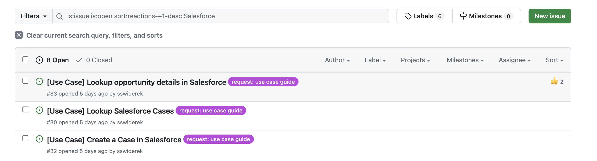
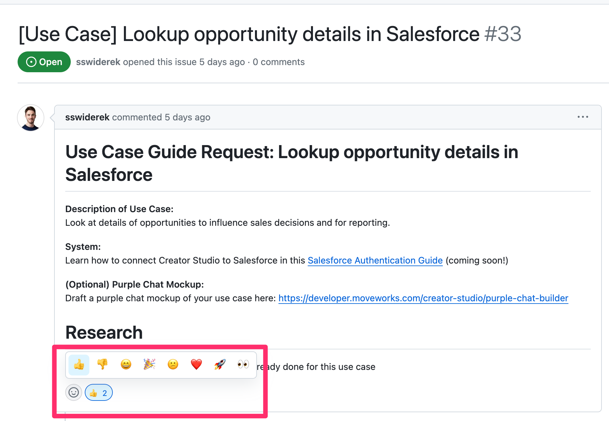

# Plugin Library

Welcome to our [Plugin Library](https://developer.moveworks.com/creator-studio/resources/), designed to help you discover and add plugins to your Moveworks Copilot in minutes.

1. **Plugins** (`./plugins`): Add new plugins to your copilot
3. **Connectors** (`./use-case-guides`): Authenticate with new business systems.

You can search the entire library [on our developer site](https://developer.moveworks.com/creator-studio/resources/) for a better experience.

## How do I request a plugin?

You’ll need a Github account to request a plugin. You can [create one for free](https://github.com/signup).

If you’re looking for a plugin, but don’t see one, try to **upvote an existing request for a plugin**.

1. Go to our [most-popular open issues](https://github.com/moveworksinc/developer-docs/issues?q=is%3Aissue+is%3Aopen+sort%3Areactions-%2B1-desc)
2. Search for your plugin in the _Filters_ search box

    

3. Upvote the issue

    

If there is no existing request for that guide, you can **submit a new request**

1. Click here to [create a new issue](https://github.com/moveworksinc/developer-docs/issues/new/choose)
2. Tell us about your plugin!

## Adding & Editing Plugins

Our library grows in value with each contribution. You can edit any plugin or connector that feels wrong or unclear. You can also add your own plugins if you have one to share with the community.

[Learn to contribute here.](./.github/CONTRIBUTING.md)

## Closing Thoughts

Thank you for contributing to our library. Your effort will go a long way in enhancing the experience of developers just like you. If you need further assistance, please reach out.

- [Academy](https://academy.moveworks.com)
- [Community](https://community.moveworks.com/developer-hub-6)
- [Support](https://developer.moveworks.com/creator-studio/support/)

***Disclaimer:** This code is provided as an example only and is not designed for production use. You should fully understand the code and consider all the security implications before using it in a live environment.
