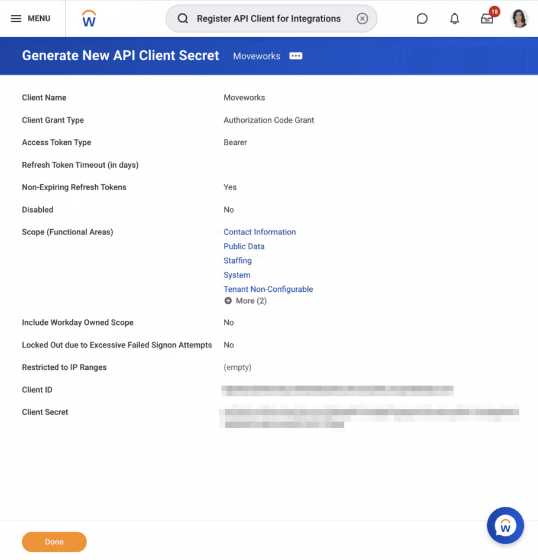
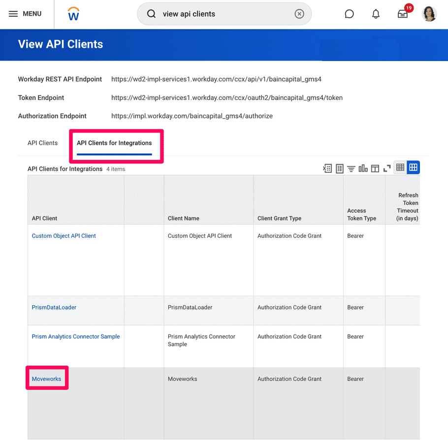
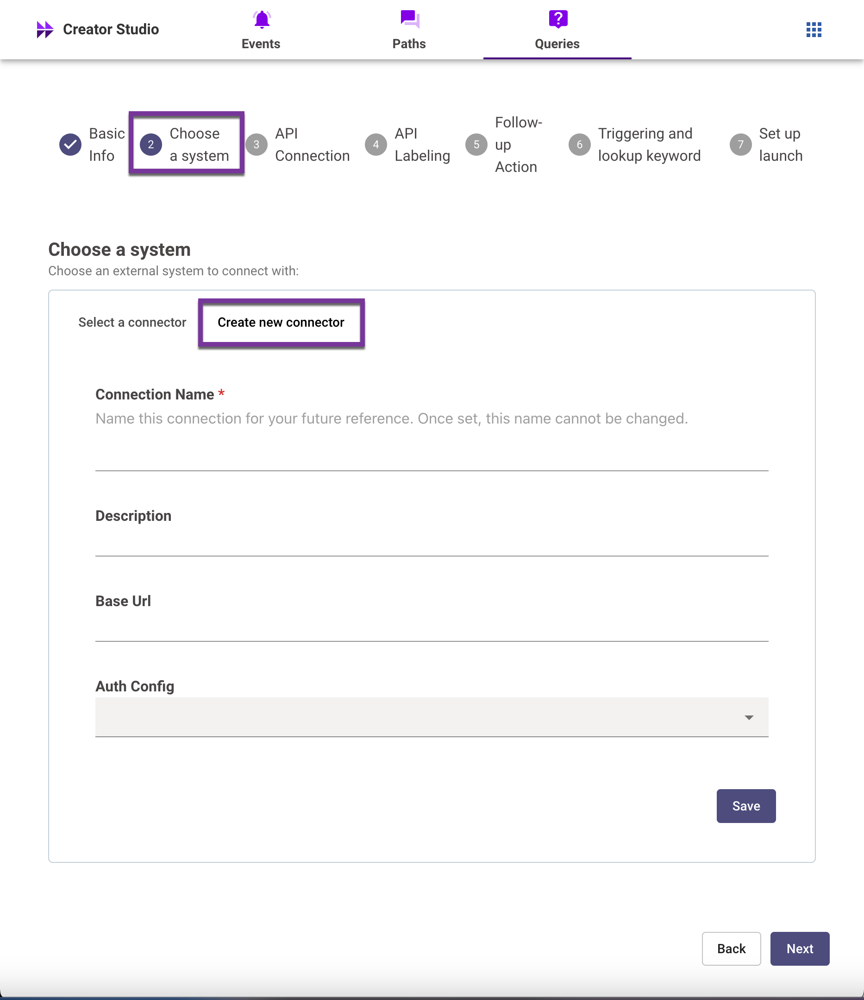
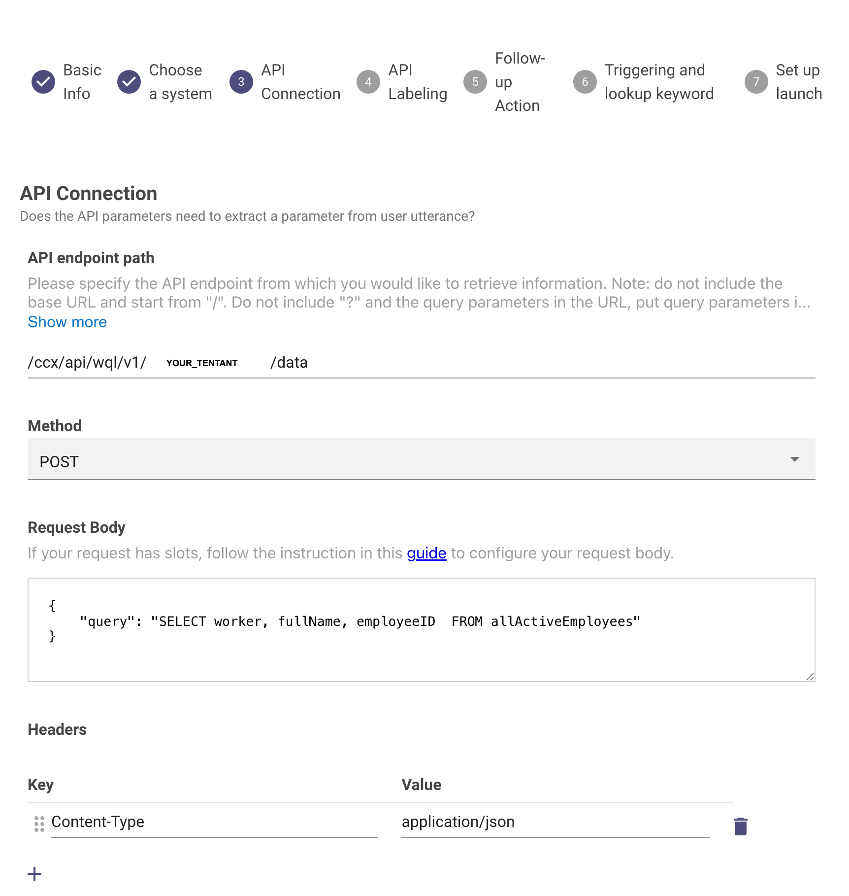
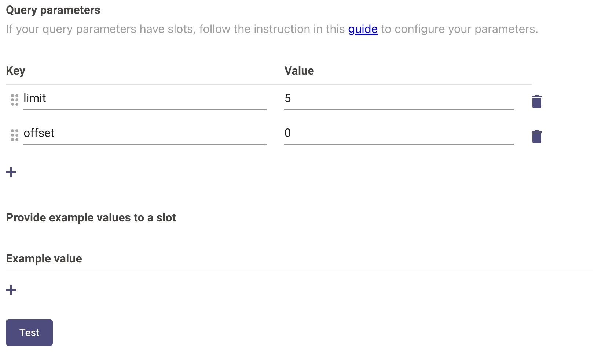

# Introduction

Workday is a cloud-based software vendor that specializes in human capital management (HCM), enterprise resource planning (ERP), and financial management applications.

This guide will walk you through creating a connector within Creator Studio to make API calls to Workday. We have separated this guide into three main sections:
- [Prerequisites](#prerequisites)
- [Set up Workday](#set-up-workday)
- [Create a Connector in Creator Studio](#create-a-connector-and-test-in-creator-studio)


# Prerequisites
- Workday account with admin privileges
- [curl](https://curl.se/download.html) for testing the Workday connection

# Set up Workday
To connect to Workday from within Creator Studio, we are going to be using [OAuth2 with the Refresh Token](https://oauth.net/2/grant-types/refresh-token/). This requires a client_id, a client_secret and a refresh_token. The following will walk you through how to set up a user and create the necessary ids so we can set up the connector within Creator Studio.


1. Create an Integration Systems User (ISU)
2. Create Security Group
3. Add ISU to Security Group
4. Add Domain Security Policies to the Integration Systems Security Group
5. Create API Client for Integrations
6. Provision a Refresh Token for the ISU

## Step 1: Create Integration System User (ISU)

The first step is to create an Integration System User, this user can be used for all integration requests to the back-end API.

Use the universal search to find the **`Create Integration System User`** (ISU) Workday Task


Use the **`Create Integration System User`** (ISU) Workday Task to create a user following these settings. Write down the username and password that you use.


Validate that the ISU has these default permissions after creation.


---

## Step 2: Create Security Group

Next we need to create a security group that we can put users into for integrations.

Access **`Create Security Group`** task (from Workday’s Universal Search) and create an **`Integration System Security Group (Unconstrained)`**.


Call the Integration Systems Security Group name **`Moveworks ISSG`**


## Step 3: Add Integration Systems User to Security Group

We need to add our new user to the new security group we created.

Use the **`All Workday Accounts`** report to find the account again.


Click on **`Security Profile`** > **`Assign Integration System Security Groups`**


Assign the ISU to the ISSG


## Step 4: Add Domain Security Policies to the Integration Systems Security Group

We need to give the apporpriate permissions to this security group so that we can call the api and any reports therein. By default, we just add everything but you may want to limit your api calls to only certain aspects of Workday.

Navigate to the ISSG using the **`View Security Group`** Report


Use the menu item to access **`Security Group`** > **`Maintain Domain Permissions for Security Group`**


Add any permissions that are needed for your Moveworks bot which will be dependent on what you plan on needing access to, the permissions we typically look for are shown [here](https://help.moveworks.com/docs/workday-access-requirements#permissions). 

Click Ok.


Run the **`Activate Pending Security Policy Changes`** task to activate permissions


## Step 5: Create API Client for Integrations

Universal search for **`Register API Client for Integrations`**


Set the name to **Moveworks** and add the scopes required.


Note your **`Client ID`** & **`Client Secret`**



Navigate to **`View API Clients`**. Note the **`Token Endpoint`** and **`Workday REST API Endpoint`**


## Step 6: Provision a Refresh Token for the ISU

From the **`View API Clients`** view, click on the **`API Clients for Integrations`** tab. Pick out the API Client you just created



From the related actions menu, select **`Manage Refresh Tokens for Integrations`**


Add the ISU Account you created earlier to the API Client


Select **`Generate Refresh Token`**


Note your  new refresh token.


## Test the Connection

To test the connection, we need to first use the client_id and client_secret against the token api to get a bearer token. We then use that bearer token to run a query against the api.

We will use curl to do this, if you are using a Linux or Apple computer, curl is included and can be accessed from the terminal. With Windows, you will need to [download](https://curl.se/windows/) it first.

### Get a Bearer Token

In the below snippet, replace YOUR_CLIENT_ID, YOUR_CLIENT_SECRET, YOUR_REFRESH_TOKEN and YOUR_TENANT_NAME with the values from the above steps
```

curl -X POST -H "Content-Type: application/x-www-form-urlencoded" -d "client_id=YOUR_CLIENT_ID&client_secret=YOUR_CLIENT_SECRET&grant_type=refresh_token&refresh_token=YOUR_REFRESH_TOKEN" https://wd2-impl-services1.workday.com/ccx/oauth2/YOUR_TENANT_NAME/token
```

You should get a response back that looks similar to 
```json
{ "access_token": "eyJ0eXAiOiJhdCtKV1QiLCJhbGciOiJSUzUxMiJ9.eyJzdWIiOiIzZWJlNjkyNzVmMmE0MTk3OWY0M2EwNGQ1YTYxY2FiMyIsImF1ZCI6Imh0dHBzOi8vd2QyLWltcGwtc2VydmljZXMxLndvcmtkYXkuY29tL2NjeC8iLCJzY29wZSI6Im9hdXRoIiwiaXNzIjoiaHR0cHM6Ly93ZDItaW1wbC1zZXJ2aWNlczEud29ya2RheS5jb20vY2N4L2FwaS92MS9iYWluY2FwaXRhbF9nbXM0IiwiZXhwIjoxNzA0NDc0NDM4LCJpYXQiOjE3MDQ0NjAwMzgsImp0aSI6ImFuRjNaMk51TURkdlpqWnFiM055Y0ROMllXUjFhRFZ6ZEhsNloybDBjekpoWkdGbFpEVm1PVzV2ZURsb2FESjRkRE0zZDJWMFpXcG5NV0ZyZUhWaGVEbG1hM1EzT0RSa1lucGhhM2x3ZG5ONVpqbHRkM1k1YW1VNU1uZHVPV00xT1c5MExqZzBNbUV5WlRrekxUa3hZekV0TkRnNFlpMWhaRGRrTFdObU5HVmtZMkUxWVdRM1pRPT0iLCJjbGllbnRfaWQiOiJZekkzWTJVME9ETXRPVEE0TVMwMFlXTXhMVGt4T0RndE0yRmxPRGcwTjJObU5tRmgifQ.UN7cYzDio6lL4-2XuVjpofp54gB9YmPrLi4ZQF7F98DBrgcUoo3RFzp7Z2mV5a3dCVUMItsiRARN0y35CfLpvrOLrm4XHKi2h69Q1vud2UayZAbk2GWQ5b-wE3IPRvYsPlZNDhH0zND8t8EZL4U5yS_Mf4-84GrAqZrVP0_SyLYAEHkkz33LHc5df96JLn_Xva8CdgYvlGU1NKTIYItGjyXvutKfLV_9qybA-sJ8BZGkK2krDqhg20HUVD8unHV4ZO9gfzN7BtRvRZJb7-Gol-eK346sg309831xvwLSE5FiGsWYMk1srZx0fJQBI85HzVV-PBmIz5MjraaQkb30ww", "token_type": "Bearer", "refresh_token": "ee8enxymxyuom832m8rb5aoh3790lw4f44hb6wabuojlzwdlfxq52mw0tutxtvl7b6c8dhztncj5ymeeggppr6q3wiznvgxvean" }
```

You will want to pull out the value for access_token to use it for the quick test.

### Test a Query
 This is a simple WQL query to get five employees (in no particular order) from Workday.

Replace YOUR_TENANT_NAME and YOUR_BEARER_TOKEN in the below with the values from previous steps.
:

```
curl --location 'https://wd2-impl-services1.workday.com/ccx/api/wql/v1/YOUR_TENANT_NAME/data?limit=5&offset=0' \
--header 'Content-Type: application/json' \
--header 'Authorization: Bearer YOUR_BEARER_TOKEN' \
--data '{
    "query": "SELECT worker, fullName, employeeID  FROM allActiveEmployees"
}'
```

The above command should return the top five employees in your Workday database. If successful, you are done with the hardest part of connecting Creator Studio to Workday! 

Next, let's take the above and create a connector within Creator Studio so we can query directly from within Moveworks.

# Create a Connector and Test in Creator Studio

Now that we have created everything within Workday and we have tested with our curl command, we can create duplicate our test in Creator Studio.

## Create a Connector

Since we are going to be running a query to test, we can start the connector creation from there. 

1. Let's start by going into the Queries workspace and creating a new query. You can follow the steps for creating a new query [here](https://developer.moveworks.com/creator-studio/quickstart/queries/) only instead of choosing an existing connector, choose to create a new one.



2. In your API editor, create a new connector. You can read more about the supported auth types on [our connector reference](https://developer.moveworks.com/creator-studio/connector-configuration/). 
Fill in the following for the connection information while replacing YOUR_CLIENT_ID, YOUR_CLIENT_SECRET, YOUR_REFRESH_TOKEN and YOUR_TENANT_NAME with the values from the above steps where you set up the Workday connection.

    - Base Url: `https://wd2-impl-services1.workday.com`
    - Auth Config: `Oauth2`
    - Oauth2 Grant Type: `Refresh Token Grant`
    - Client ID: `YOUR_CLIENT_ID`
    - Client Secret: `YOUR_CLIENT_SECRET`
    - Refresh Token Grant Refresh Token: `YOUR_REFRESH_TOKEN`
    - Oauth2 Token Url: `https://wd2-impl-services1.workday.com/ccx/oauth2/YOUR_TENANT/token`


Click Save

## Test the Connection

1. You can continue following the guide [here](https://developer.moveworks.com/creator-studio/quickstart/queries/) to create your query with the newly created connector. To test the same command from curl, you can enter the following on the `API Connection` screen.

API endpoint path: `/ccx/api/wql/v1/YOUR_TENANT/data`
Method: `POST`
Request body: `{
    "query": "SELECT worker, fullName, employeeID  FROM allActiveEmployees"
}`
Headers: `Content-Type` : `application/json`
Query parameters: `limit` : `5`






2. Click test, if you get the same output from your curl command, you have sucessfully created a connector into Workday and tested it! You can now call any WQL Query and Report that is available to the user you created from within Creator Studio.
 


