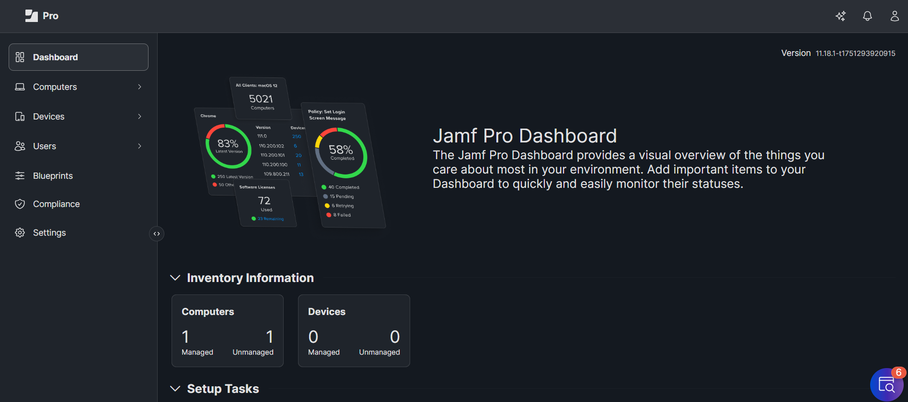
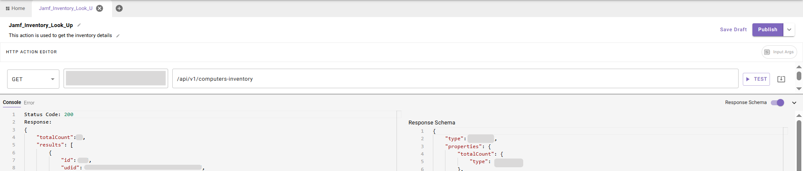

## **Introduction:**

**Jamf Pro** is a cloud-based Apple device management solution, enabling organizations to streamline deployment, security, and lifecycle management of Apple devices across their workforce.

This guide walks you through the process of creating a connector within Agent Studio to make API calls to **Jamf Pro**, using **OAuth Client Credentials Flow** for secure authentication. The guide is organized into two main sections:

1. **Set up OAuth Client Credentials Flow**
2. **Create a Connector in Agent Studio**

## **Prerequisites:**

- Ensure you have **admin privileges** in your **Jamf Pro instance** to create and configure **OAuth 2.0 Clients**.
- Detailed instructions on OAuth token generation and integration are available in the official Jamf Pro documentation [**here**](https://learn.jamf.com/en-US/bundle/jamf-pro-documentation-current/page/API_Roles_and_Clients.html).

## **Set up OAuth Client Credentials Flow**

To connect **Jamf Pro** with **Agent Studio**, we’ll use **OAuth 2.0 authentication**. This method allows backend systems like Agent Studio to securely authenticate using a **Client ID and Secret.**

This guide walks you through registering an OAuth 2.0 client in Jamf Pro, generating an access token using the **Client Credentials Flow**, and configuring the connector in Agent Studio for seamless access to Jamf Pro APIs.

## **Register OAuth 2.0 API Client in Jamf Pro**

### Step 1: Log in to Jamf  Instance with Username and Password

- Go to **https://{{your-instance}}.jamfcloud.com** (replace `{{your-instance}}` with your organization’s Jamf cloud tenant name, for example [https://abc.jamfcloud.com/](https://abc.jamfcloud.com/)).



- Look at the **bottom-left corner** of the sidebar menu.
- Click the **gear icon (Settings)**


- In the **Settings** screen, locate the **search bar** at the top.
- Type **`API Roles and Clients`** into the search bar.
- When **API Roles and Clients** appears in the search results, click it.

### Step 2: Create an API Role


- After searching for **"API Roles and Clients"**, the page will default to the **API Roles** tab.
- Click the **+ New** button in the top-right corner.

### Step 3: Configure and Save the API Role

- Once you click **+ New** on the API Roles page, you’ll be brought to the **New API Role** configuration screen.
- **Display Name**:
    Enter a name that clearly identifies the purpose of this role.
    
- **Privileges**:
Select the required API privileges based on what actions your integration needs to perform.
- After selecting all necessary privileges, click **Save** (bottom-right)


### Step 4: Create an OAuth API Client


- In the **API Roles and Clients** section, click on the **API Clients** tab.
- Click the **+ New** button in the top-right corner.
- **Display Name**:
    Enter a name that clearly identifies the purpose of this Client.
    
- **API Roles**:
 Choose the API Role you created earlier.
- Click the **Enable API Client** button
- Click **Save**
- After saving, you'll see the **Client ID** displayed.
- Click the **Generate Client Secret** button to obtain the **Client Secret** (copy and store it securely).


### Step 5: Secure Your Client Credentials

After the app is registered:

- Copy and securely store the:
    - **Client ID**
    - **Client Secret**
- These will be used in Agent Studio for authentication

### Step 6: Request an Access Token

After successfully creating an **API Client** in **Jamf Pro** and retrieving the required credentials (`client_id` and `client_secret`), you can request an **access token**. This token is used to authenticate API requests securely.

To request an access token, use the following `curl` command:

```bash
curl --location --request POST 'https://{{your-instance}}.jamfcloud.com/api/oauth/token' \
--header 'Content-Type: application/x-www-form-urlencoded' \
--data-urlencode 'grant_type=client_credentials' \
--data-urlencode 'client_id=YOUR_CLIENT_ID' \
--data-urlencode 'client_secret=YOUR_CLIENT_SECRET'
```

Replace the placeholders with your specific values:

- `{{your-instance}}` – Your Jamf Pro instance domain
- `YOUR_CLIENT_ID` – The Client ID generated from your API Client
- `YOUR_CLIENT_SECRET` – The Client Secret associated with the API Client

## **Integrate with Agent Studio**
Now that OAuth is set up in Jamf Pro, configure the connection in Agent Studio.

### Step 7: Configure the Jamf Connector

To complete the integration between Jamf and Agent Studio using OAuth 2.0, follow the steps below:

 - Go to the **HTTP Connector**.
  - You can see the Create option, and from there you can **Create** a connector
- The setup includes the following details:

1. **Connector Name :**
    - `jamf`
2. **Base Url:**
    - `https://{{your-instance}}.jamfcloud.com`
3. **Auth Config:**
    - `Oauth2`
4. **OAuth2 Grant Type(**this value **static** and cannot be changed**):**
    - `Client Credentials`
5. **Client ID:**
    - Enter the **`Client ID`** you received when registering your Jamf app.
6. **Client Secret**
    - Enter the **`Client Secret`** corresponding to your app’s Client ID.
7. **OAuth2 Token URL:**
    - `https://{{your-instance}}.jamfcloud.com/api/oauth/token`
8. Click on **Save** to submit the credentials, and your connector will be ready


### Step 8: Configure Jamf API Action in Agent Studio

Test your Jamf Pro connector by setting up an action in Agent Studio. You can read more about setting up API actions in the [API configuration reference](https://help.moveworks.com/docs/http-action-data-bank-legacy)
 
1. Go to **Agent Studio**.
2. Navigate to **Actions → Create New Action**.
3. Select **Inherit from Existing Connector** and choose **Jamf**.
4. In the API configuration, provide the following details:
    - API Endpoint Path:
    **https://{{your-instance}}.jamfcloud.com/api/v1/computers-inventory**
    
    - Method:
     **GET** 
    - Permissions Required for HTTP Action:
 
      - Read Computers
    
5. Save the action
6. Then, test the connector by running the action to confirm that the integration is working.



# **Congratulations!**

You've successfully integrated **Jamf Pro** with **Agent Studio** using **OAuth 2.0**. You can now securely access **Jamf Pro APIs** and power automated use cases within your workflows.