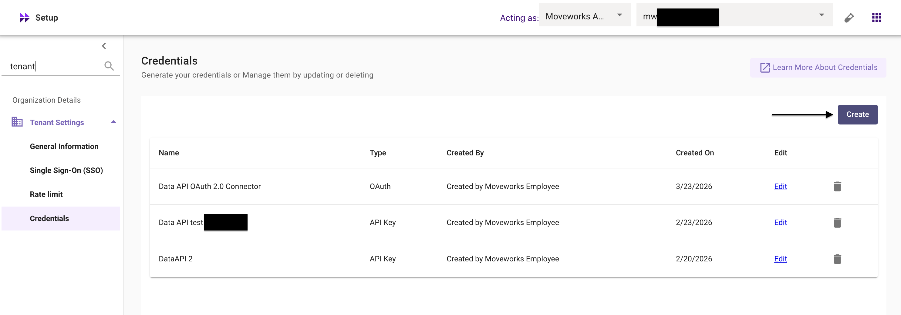

## Introduction

The **Moveworks Data API** provides programmatic access to your organization’s analytics data within the Moveworks AI Assistant — including conversations, interactions (user messages and AI Assistant responses), plugin execution logs, plugin resource metadata, and user details.

This connector guide walks through setting up Data API credentials in **Moveworks Setup** and configuring the corresponding **HTTP Connector in Agent Studio**. Once configured, you can build plugins that leverage your organization’s Moveworks analytics data to power dashboards, generate reports, surface conversation insights, and trigger workflows based on plugin execution patterns.

Two authentication methods are supported: **API Key** (recommended) and **OAuth 2.0 with Client Credentials**. API Keys do not expire and are simpler to manage, whereas OAuth 2.0 access tokens expire after 1 hour, requiring token refresh logic. Unless you have a specific requirement for OAuth 2.0, API Key is the preferred approach.

---

## Prerequisites

### Moveworks Requirements

- **Super Admin access** in Moveworks Setup — the Credentials page is only visible to Super Admins, as it allows generation of API credentials for analytics data. If you are not a Super Admin, contact your organization’s Super Admin to create credentials on your behalf.
- **Agent Studio admin access** in your Moveworks tenant for configuring the HTTP Connector ([grant access guide](https://help.moveworks.com/docs/manage-roles-and-permissions-for-moveworks-applications#add-an-application-admin)).

---

## Step 1: Generate Data API Credentials in Moveworks Setup

Navigate to **Moveworks Setup → Tenant Settings → Credentials** to create your Data API credentials.

### Create a New Credential

1. Click the **Create** button.



1. Enter a **Credential Name** to identify this credential (e.g., `DataAPI-AgentStudio-Credential`).
2. Select an **Authentication Type** (see options below).
3. Define **Access Scopes** — select the scopes required for your use case.


### Authentication Type Options

### Option A: API Key (Recommended)

- Simplest method of authentication.
- Recommended for server-to-server integrations where a static key can be securely stored.
- After creation, an API Key will be provided — store it in a secure location immediately.
- API Keys do not expire.

### Option B: OAuth 2.0 Client Credentials

- Secure, token-based authentication.
- Recommended for scenarios requiring delegated access or token refresh policies.
- After creation, you will receive a **Client ID** and **Client Secret**.

> ⚠️ **Access Token Expiry:** The Client ID and Client Secret themselves do not expire. However, the **access token** generated using OAuth 2.0 Client Credentials **expires after 3,600 seconds (1 hour)**. Your integration must handle token refresh by requesting a new access token before the current one expires. This adds operational complexity compared to the API Key approach.
> 

### Define Access Scopes

Scopes determine what data the credential can access. You must select at least one scope.

| Scope | Description |
| --- | --- |
| **All** | Grants access to all available endpoints |
| **Conversations** | Access to conversation-level data |
| **Interactions** | Access to interaction-level data (user messages, AI Assistant responses) |
| **Plugin Calls** | Access to plugin execution data |
| **Plugin Resources** | Access to plugin resource metadata |
| **Users** | Access to user details (IDs, emails, attributes) |

> **Best practice:** Enable only the scopes required for your use case to follow the principle of least privilege.
> 

### Save Your Credentials

After selecting scopes, click **Submit**. A pop-up will display your credentials:

- **For API Key auth:** Your API Key
    
    
    
- **For OAuth 2.0 auth:** Your Client ID and Client Secret
    
    
    

> ⚠️ **Important:** Credentials are shown **only once** in this pop-up. Store them securely before closing — they cannot be retrieved afterward. If you lose them, you will need to create new credentials.
> 

---

## Step 2: Configure the Agent Studio HTTP Connector

Once credentials are created in Moveworks Setup, configure an HTTP Connector in Agent Studio to use them.

**Base URLs**

| Environment | URL |
| --- | --- |
| US Production | `https://api.moveworks.ai/rest/v1` |
| EU Production | `https://api.eu.moveworks.ai/rest/v1` |

Use the Base URL that corresponds to your Moveworks tenant's region when configuring the HTTP Connector.

### Option A: HTTP Connector with API Key

1. In Agent Studio, go to **HTTP Connectors → Create**.
2. Fill in the connector fields:
    - **Connector Name:** `Moveworks_Data_API` (or your preferred name)
    - **Display Name (Optional):** `Moveworks Data API` (or your preferred name)
    - **Display Description (Optional):** `Connector for Moveworks Data API using API Key authentication` (or your preferred description)
    - **Base URL:** `https://api.moveworks.ai` (or) `https://api.eu.moveworks.ai`
    - **Auth Config:** Select `API Key`
    - **API Key:** Enter the API Key generated in Step 1
    - **API Key Header Name:** Set to `Authorization` (or the header name specified in the Data API documentation)
    
    
    
    
    
3. Click **Save**.

### Option B: HTTP Connector with OAuth 2.0 Client Credentials

1. In Agent Studio, go to **HTTP Connectors → Create**.
2. Fill in the connector fields:
    - **Connector Name:** `Moveworks_Data_API_OAuth` (or your preferred name)
    - **Display Name (Optional):** `Moveworks Data API (OAuth)`
    - **Display Description (Optional):** `Connector for Moveworks Data API using OAuth 2.0 Client Credentials`
    - **Base URL:** `https://api.moveworks.ai` (or) `https://api.eu.moveworks.ai`
    - **Auth Config:** Select `Oauth2`
    - **Oauth2 Grant Type:** `Client Credentials Grant`
    - **Client ID:** Enter the Client ID generated in Step 1
    - **Client Secret:** Enter the Client Secret generated in Step 1
    - **Client Credentials Grant Scope:** Set according to the scopes assigned to your credential
    - **Oauth2 Token URL:** The Moveworks OAuth token endpoint (refer to the [Data API Documentation](https://help.moveworks.com/api-reference/overview) for the exact URL)
    - **Oauth2 Custom Oauth Response Response Type:** Select `Json`
    
    
    
    
    
3. Click **Save**.

---

## Step 3: Test the Connection

After saving the connector, verify it is working by testing an HTTP Action in Agent Studio.

Use the following API call to retrieve recent conversations and confirm connectivity:

```bash
curl --request GET \
  --url 'https://api.moveworks.ai/export/v1/records/interactions?$skip={{skip}}&$orderby=created_time&$filter=created_time%20gt%20%27{{start_date}}T00:00:00Z%27%20and%20created_time%20lt%20%27{{end_date}}T00:00:00Z%27' \
  --header 'Authorization: Bearer {{access_token}}' \
  --header 'Content-Type: application/json'
```

**Query Parameters:**

| Key | Value | Description |
| --- | --- | --- |
| `$skip` | `{{skip}}` | Number of records to skip (for pagination) |
| `$orderby` | `created_time` | Field to sort results by |
| `$filter` | `created_time gt '{{start_date}}T00:00:00Z' and created_time lt '{{end_date}}T00:00:00Z'` | Filters interactions within the specified date range |

Replace `{{skip}}`, `{{start_date}}`, and `{{end_date}}` with actual values (e.g., `0`, `2026-01-01`, `2026-03-24`).

→ The API should return a **200 success code** along with raw interactions data for your org, confirming that the connector is properly configured and ready for use in your plugins.


---

## Managing Credentials

### Editing Credentials

You can update the following properties of an existing credential from the Credentials page in Moveworks Setup:

- Credential name
- Assigned scopes

### Deleting Credentials

- Deleted credentials **cannot be restored**.
- If a deleted credential is in use by an HTTP Connector or data pipeline, those requests will fail with a `401 Unauthorized` error.
- Before deleting, ensure no active connectors or plugins depend on the credential.

---

## Troubleshooting

- **Credentials page not visible** — Only Super Admins can see the Credentials page under Moveworks Setup → Tenant Settings. Contact your Super Admin.
- **`401 Unauthorized` on API calls** — Verify your API Key or Client ID/Secret are correct. For OAuth 2.0, ensure the access token hasn’t expired.
- **`403 Forbidden`** — Check that the credential has the required scopes for the endpoint you are calling.
- **Missing data in responses** — Verify the correct scopes are assigned. For example, calling the Interactions endpoint requires the `Interactions` scope (or `All`).
- **Lost API Key or Client Secret** — These are shown only once at creation time. If lost, create a new credential and update your HTTP Connector accordingly.

---

## Congratulations!

You’ve successfully connected the **Moveworks Data API** to Agent Studio. Your connector is now ready for use within plugins to access analytics data, conversation insights, plugin execution details, and user information.

For full API reference documentation including available endpoints, request/response formats, and pagination, refer to the [**Moveworks Data API Documentation**](https://help.moveworks.com/api-reference/overview).