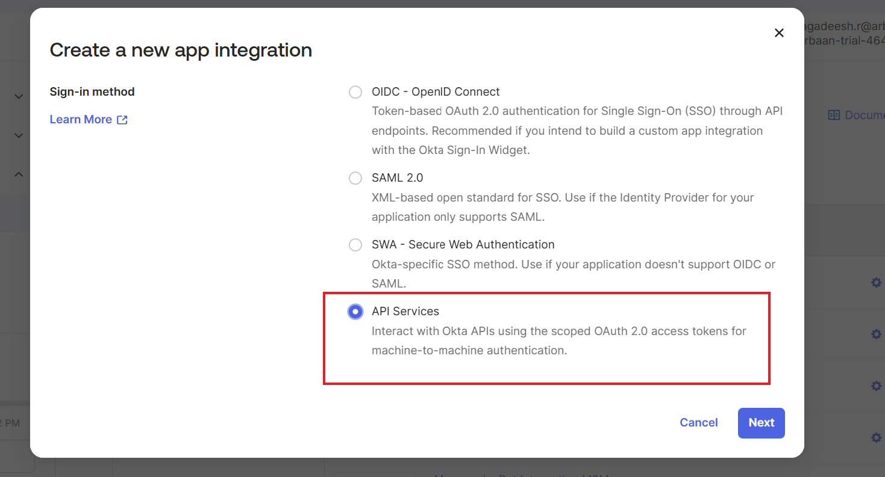

# Introduction:

Okta is an identity and access management platform that helps organizations securely manage user authentication, authorization, and lifecycle management across applications and services.

This guide will walk you through the process of creating a connector within Agent Studio to make API calls to Okta, using an API Token for secure authentication. The guide is organized into two main sections:

1. **Set up API key Flow**
2. **Create a Connector in Agent Studio**

# **Prerequisites:**

- Ensure you have administrator access to your **Okta** organization.
- Detailed instructions on generating an API token are available in the official **Okta** documentation [here](https://help.okta.com/en-us/content/topics/security/api.htm?cshid=ext-create-api-token#create-okta-api-token).

# **Set up Okta**

To connect Okta with Agent Studio, we’ll use API key authentication. 

The following steps will guide you through generating an API token in Okta and configuring it within Agent Studio. This token is essential for securely authenticating your API calls to Okta and establishing a trusted connection between Agent Studio and your Okta instance.

## **Step 1: Generate an API Token in Okta**

### 1. Access the Okta Admin Console

- Log in to your **Okta Admin Console** using an administrator account.
- In the left-hand navigation pane, go to **Security** > **API**.
- Click on the **Tokens** tab.


### 2. Create a New Token

- Click **Create Token**.
- Enter a name for your token (e.g., “Agent Studio Connector”).
- Click **Create Token**. A new token will be generated — **copy this token immediately**, as it will only be shown once.



## **Step 2: Integrate with Agent Studio**

In Agent Studio, create a new connector with the following configuration (please name it accordingly for easy identification while creating use cases):

1. **Auth Config:**
    - API
2. **Api Key Auth Type**
    - Choose Header Auth.
3. **API Key:**
    - Use the format: `SSWS {api_token}`
    Replace `{api_token}` with the actual token you generated in Step 1
4. Click on **Save** to submit the credentials, and your connector will be ready


## **Step 3: Integrate Okta API in Agent Studio**

- Add your API details below to integrate with the Okta API. You can read more about setting up API actions in the [API configuration reference](https://help.moveworks.com/docs/http-actions).

```bash
curl -i -X GET \
  https://subdomain.okta.com/api/v1/users \
  -H 'Authorization: YOUR_API_KEY_HERE'
```

- **API Endpoint Path:**
    
    `/api/v1/users`
    
- **Method:**
    
    `GET`
    


# **Congratulations!**

You've successfully integrated the **Okta API** with Agent Studio. You can now start using it for your specific use cases