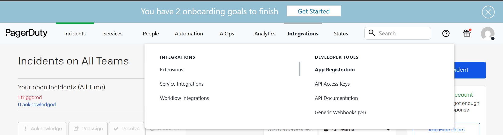
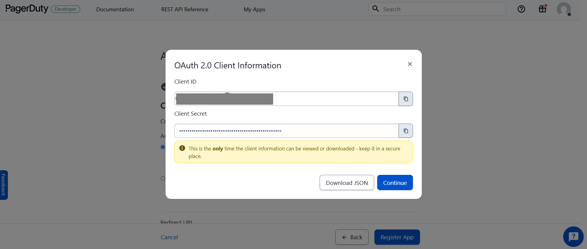
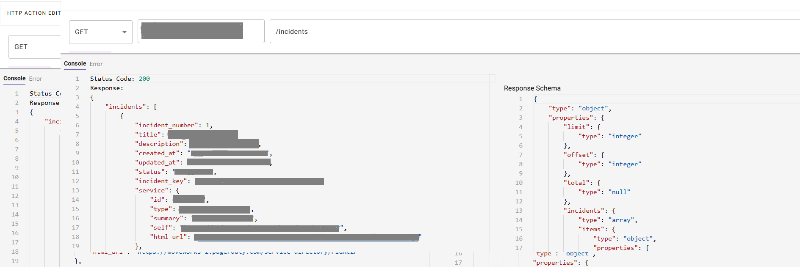

# Introduction:

**PagerDuty** is a leading incident management platform that empowers teams to detect, respond to, and resolve critical incidents in real-time. It enables organizations to reduce downtime, enhance reliability, and maintain seamless digital operations by integrating alerting, on-call scheduling, automation, and escalation policies.

This guide will walk you through the process of creating a connector within **Agent Studio** to make API calls to PagerDuty, using **OAuth 2.0 with the Client Credentials Grant** for secure authentication. The guide is organized into three main sections:

1. **Set Up OAuth2 and Generate Client Credentials in PagerDuty**
2. **Create a Connector in Agent Studio**
3. **Test API Calls with the Configured Connector**

# **Prerequisites:**

- Ensure you have **admin or account owner privileges** in PagerDuty to create and manage **OAuth2 applications**.
- You must have access to the **PagerDuty Developer Console** to register an OAuth 2.0 application. Follow [official instructions here](https://developer.pagerduty.com/docs/app-oauth-token).
- Make sure to note down your application's **Client ID** and **Client Secret**, which will be used to authenticate via the **Client Credentials Grant**.
- You must **configure scopes** appropriate to your use case (e.g., `incidents.read`, `services.read`, `users.read`, etc.).
- Familiarity with **HTTP headers** and **REST API calls** is helpful for testing and troubleshooting the connector.
- **Keep your Client Secret secure** – treat it like a password. Never expose it in client-side code or public repositories.

# Set up PagerDuty

To connect **PagerDuty** with **Agent Studio**, we’ll use **OAuth 2.0 authentication with the Client Credentials Grant**. This method allows backend systems like Agent Studio to securely authenticate without user interaction, ideal for server-to-server API integrations.

This guide walks you through registering an OAuth2 application in PagerDuty, generating an access token, and configuring the connector in Agent Studio for seamless access to PagerDuty APIs.

## Step 1: Register OAuth 2.0 API Client in PagerDuty

### 1. Log in to PagerDuty Admin Console

- Go to: [https://pagerduty.com](https://pagerduty.com/)
- Select **App Registration** under the **Integrations** menu.
- Click **App Registration.**



- Click New App.

### 2. Fill in Application Details

- **Name**: `MoveworksIntegrationApp`
- **Description**: `Integration between Moveworks and PagerDuty using OAuth 2.0 Client Credentials`
- **Functionality**: Select **OAuth 2.0**
- Click **Next.**


### 3. Configure Authorization

- Under the **Authorization** tab, select **Scoped OAuth**


- Scroll down and choose the **Permission Scopes** you need for your integration
    
    *(e.g., `users.read`, `incidents.read`, `services.read`, etc.)*
    
- After selecting, **copy the permission scope string** displayed
    
    (you'll need this when configuring the connector)
    
- Click **Register App**

### 4. Save the Credentials

After the app is registered:

- Copy and securely store the:
    - **Client ID**
    - **Client Secret**
- These will be used in Agent Studio for authentication



### **5.Request an Access Token**

Once your application is registered and you have your `client_id`, `client_secret`, and selected `scope`, you can request an **access token** using the **Client Credentials OAuth 2.0 flow**.

### Use the following `curl` command to request the token:

```bash
curl -i --request POST \
  https://"<TOKEN_ENDPOINT>" \
  --header "Content-Type: application/x-www-form-urlencoded" \
  --data-urlencode "grant_type=client_credentials" \
  --data-urlencode "client_id={CLIENT_ID}" \
  --data-urlencode "client_secret={CLIENT_SECRET}" \
  --data-urlencode "scope=as_account-us.companysubdomain incidents.read services.read"

```

### Replace the placeholders:

- `{CLIENT_ID}` → Your registered app's client ID
- `{CLIENT_SECRET}` → Your app's client secret
- `as_account-us.companysubdomain` → Your **account-level scope** (starts with `as_account-`)
- `incidents.read services.read` → Add the required scopes as needed

## Note:

For more details on the above cURL request and <TOKEN_ENDPOINT>, refer to the official documentation: [Click here](https://developer.pagerduty.com/docs/app-oauth-token)

### **6.Integrate with Agent Studio**

To complete the integration between PagerDuty and Agent Studio using OAuth 2.0, follow the steps below:

- **Connector Name**
    
    Provide a clear, descriptive name (e.g., `PagerDuty Connector`). Once saved, this name cannot be changed.
    
- **Description** *(Optional)*
    
    Add a short explanation such as: `Connector for accessing PagerDuty incidents API via OAuth2.`
    
- **Base URL**
    
    `https://api.pagerduty.com`
    
- **Auth Config**
    
    `OAuth2`
    
- **OAuth2 Grant Type**
    
    `Client Credentials Grant`
    
- **Client ID**
    
    Enter the **Client ID** you received when registering your PagerDuty app.
    
- **Client Secret**
    
    Enter the **Client Secret** corresponding to your app’s Client ID.
    
- **Client Credentials Grant Scope**
    
    Use the scopes selected during app registration.
    
    Example:
    
    `as_account-us.<your-subdomain> incidents.read incidents.write users.read users.write`
    
- **OAuth2 Token URL**
    
    `https://identity.pagerduty.com/oauth/token`
    
- **OAuth2 Client Authentication**
    
    `OAuth 2.0 with Request Body`
    

### **7. Integrate PagerDuty API in Agent Studio**

- Add your API details below to integrate with the PagerDuty API. You can read more about setting up API actions in the [API configuration reference](https://help.moveworks.com/docs/http-action-data-bank-legacy).

```bash
curl --location 'https://api.pagerduty.com/incidents' \
--header 'Authorization: Bearer <Generated Access Token>'
```

- **API Endpoint Path:**
    
    `https://api.pagerduty.com/incidents`
    
- **Method:**
    
    `GET`
    
    
    

# **Congratulations!**

You've successfully integrated **PagerDuty** with **Agent Studio** using **OAuth 2.0 with Client Credentials Grant**. You can now securely access PagerDuty APIs and power automated use cases within your workflows.