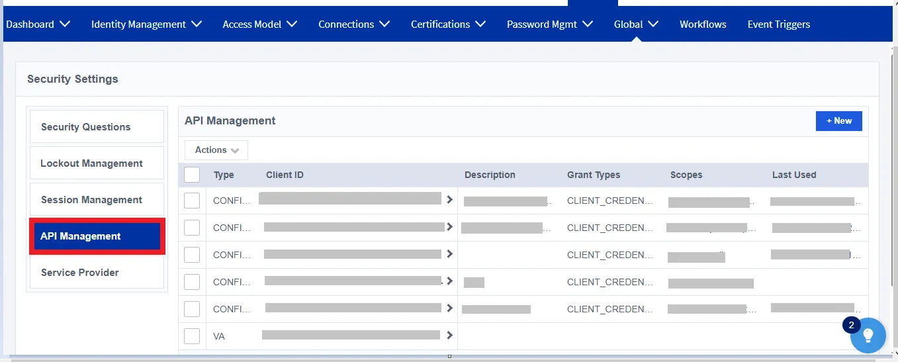
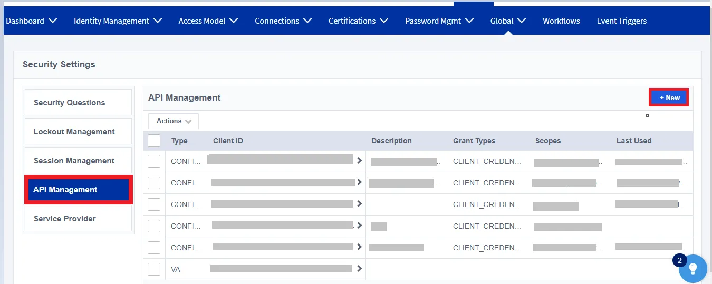
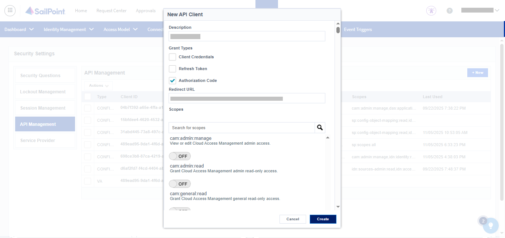
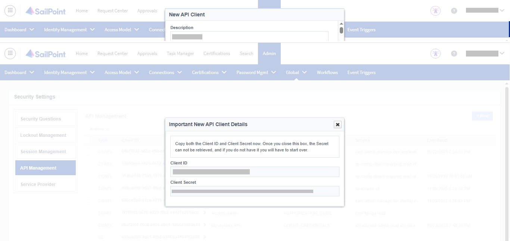
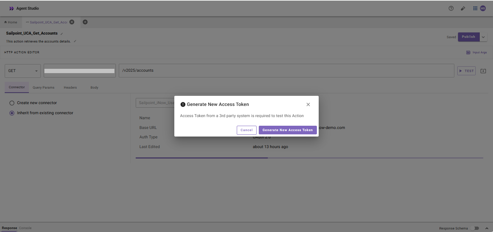
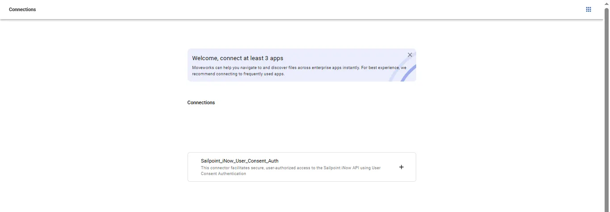
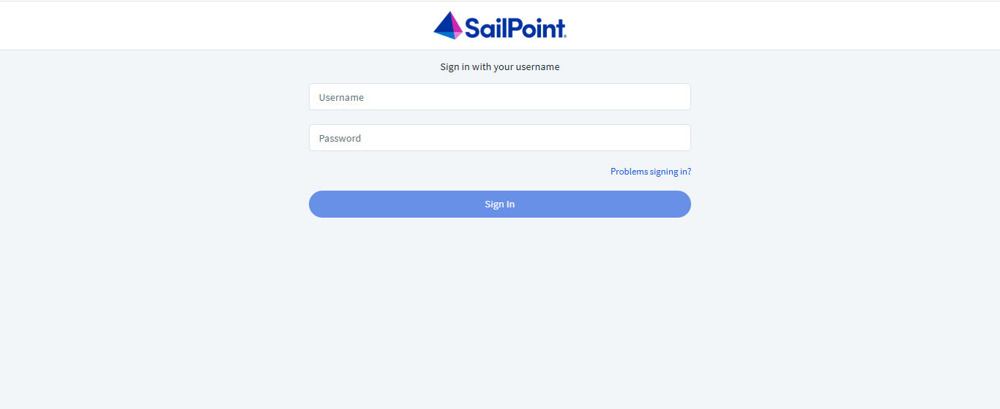
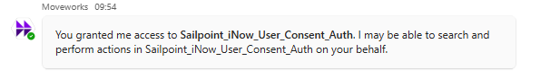
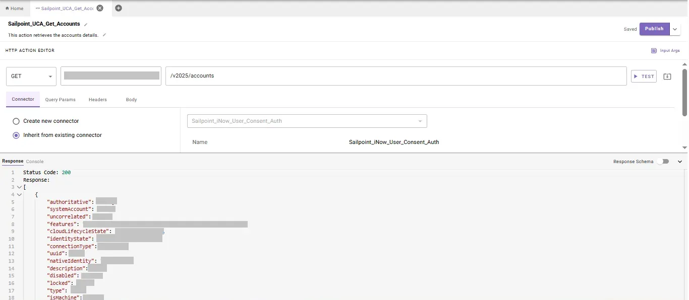

# **Introduction:**

**SailPoint IdentityNow** is a cloud-based identity governance and administration platform that helps organizations manage the full user lifecycle — from onboarding and access changes to offboarding — across applications and systems. It enables automated provisioning, enforces access policies, supports compliance through access reviews, and provides self-service access requests.

This guide walks you through the process of creating a connector within **Agent Studio** to make API calls to **SailPoint IdentityNow**, using the **OAuth 2.0 Client Credentials Flow** for secure authentication. The guide is organized into two main sections:

1. **Set up OAuth Client Credentials Flow**
2. **Create a Connector in Agent Studio**

# **Prerequisites:**

- Ensure you have **admin privileges** in your **SailPoint IdentityNow instance** to create and configure **OAuth 2.0 applications**.
- Detailed instructions on OAuth token generation and integration are available in the official SailPoint IdentityNow documentation [**here**](https://developer.sailpoint.com/docs/api/authentication/#find-your-tenants-oauth-details).

# **Set up OAuth Client Credentials Flow**

To connect **SailPoint IdentityNow** with **Agent Studio**, we’ll use **OAuth 2.0 authentication**. This method allows backend systems like Agent Studio to securely authenticate using a **Client ID and Secret**.

This guide walks you through registering an OAuth 2.0 application in SailPoint IdentityNow, generating an access token using the **Client Credentials Flow**, and configuring the connector in Agent Studio for seamless access to SailPoint IdentityNow APIs.

# **Register OAuth 2.0 Application in SailPoint IdentityNow**

### **Step 1: Log in to SailPoint IdentityNow with Admin Account**

- Go to **https://{{your-tenant}}.identitynow.com** (replace **`{{your-tenant}}`** with your organization’s SailPoint IdentityNow tenant name, for example **https://abc.identitynow.com/**).
- Click on the **Admin** section in the top navigation bar.


- Under **Global**, select **Security Settings**.


- Within **Security Settings**, click on **API Management** to proceed.

### **Step 2: Create a New OAuth Application**

- In the **API Management** page, click the **+ New**  button (usually at the top-right corner).


- **Description**
    
    Enter a name that clearly identifies the purpose of this application (e.g., *Moveworks Integration*).
    
- **Grant Type**:
    
    Select **Client Credentials**.
    
- **Scopes**:
    
    Choose the required scopes based on what actions your integration needs to perform (for example: `idn:identity:read`, `sp:workflow:manage`, `idn:identity:manage`, etc.).
    
    
    

### **Step 3: Create and Configure an OAuth Application**

- After filling in the details, click **Create**


- Once created, your **Client ID** and **Client Secret** will be displayed.


- These will be used in Agent Studio for authentication

### **Step 4: Request an Access Token**

After successfully creating an **OAuth Application** in **SailPoint IdentityNow** and retrieving the required credentials (**`client_id`** and **`client_secret`**), you can request an **access token**. This token is used to authenticate API requests securely.

To request an access token, use the following **`curl`** command:

```bash
curl --location --request POST 'https://{{your-tenant}}.api.identitynow-demo.com/oauth/token' \
--header 'Content-Type: application/x-www-form-urlencoded' \
--data-urlencode 'grant_type=client_credentials' \
--data-urlencode 'client_id=YOUR_CLIENT_ID' \
--data-urlencode 'client_secret=YOUR_CLIENT_SECRET'

```

Replace the placeholders with your specific values:

- **`{{your-tenant}}`** – Your SailPoint IdentityNow tenant domain (for example: `ta-partner17622`)
- **`YOUR_CLIENT_ID`** – The Client ID generated from your OAuth Application
- **`YOUR_CLIENT_SECRET`** – The Client Secret associated with the OAuth Application

# **Integrate with Agent Studio**

Now that OAuth is set up in SailPoint IdentityNow , configure the connection in Agent Studio.

### **Step 5: Configure the** SailPoint IdentityNow **Connector**

To complete the integration between SailPoint IdentityNow and Agent Studio using OAuth 2.0, follow the steps below:

- Go to the **HTTP Connector**.
- You can see the Create option, and from there you can **Create** a connector
- The setup includes the following details:
1. Connector Name **:**
    - `Sailpoint_iNow`
2. Base Url**:**
    - `https://{{your-tenant}}.api.identitynow-demo.com`
3. Auth Config**:**
    - **`Oauth2`**
4. OAuth2 Grant Type(this value static and cannot be changed):
    - **`Client Credentials`**
5. Client ID:
    - Enter the **`Client ID`** you received when registering your SailPoint IdentityNow app.
6. Client Secret:
    - Enter the **`Client Secret`** corresponding to your app’s Client ID.
7. OAuth2 Token URL:
    - `https://{{your-tenant}}.api.identitynow-demo.com/oauth/token`
8. Click on **Save** to submit the credentials, and your connector will be ready

[](https://marketplace.moveworks.com/api/marketplace/github-proxy?path=/moveworks/developer-docs/main/connectors/jamf/jamfConnector3.png)

[](https://marketplace.moveworks.com/api/marketplace/github-proxy?path=/moveworks/developer-docs/main/connectors/jamf/jamfConnector2.png)

### **Step 6: Configure SailPoint IdentityNow API Action in Agent Studio**

Test your SailPoint IdentityNow  connector by setting up an action in Agent Studio. You can read more about setting up API actions in the [**API configuration reference**](https://help.moveworks.com/docs/http-action-data-bank-legacy)

1. Go to **Agent Studio**.
2. Navigate to **Actions → HTTP Actions → Create New Action.**
3. Select **Inherit from Existing Connector** and choose Sailpoint_iNow.
4. In the API configuration, provide the following details:
    - API Endpoint Path:
        - `https://{{your-tenant}}.api.identitynow-demo.com/v3/public-identities`
    - Method:
        
        **GET**
        
5. Save the action
6. Then, test the connector by running the action to confirm that the integration is working.


# **Congratulations!**

You’ve successfully integrated **SailPoint IdentityNow**  with **Agent Studio** using **OAuth 2.0**. You can now securely access **SailPoint IdentityNow**  and power automated use cases within your workflows.

# **OAuth 2.0 with Authorization Code (User Consent Auth) Setup**

To connect to **SailPoint IdentityNow** from within **Agent Studio** using user-consent-based authentication, configure the **OAuth 2.0 with Authorization Code (User Consent)** flow.

This ensures that SailPoint IdentityNow users explicitly authorize Moveworks before API actions are performed on their behalf.

# **Walkthrough**

Follow these steps to set up and validate your connection:

1. Log in to SailPoint IdentityNow
2. Register a new API Client
3. Configure API Client Details
4. Generate Authorization Code
5. Integrate with Agent Studio
6. Test the Connector in Agent Studio

# **Step 1: Log in to SailPoint IdentityNow with Admin Account**

- Go to **https://{{your-tenant}}.identitynow.com** (replace **`{{your-tenant}}`** with your organization’s SailPoint IdentityNow tenant name, for example **https://abc.identitynow.com/**).
- Click on the **Admin** section in the top navigation bar.


- Under **Global**, select **Security Settings**.



- Within **Security Settings**, click on **API Management** to proceed.

# **Step 2: Configure API Client Details**

- In the **API Management** page, click the **+ New**  button (usually at the top-right corner).



- **Description:** Enter a unique name.
- **Grant Type:** Select **Authorization Code**.
- **Redirect URI:** Enter your Moveworks redirect URL, for example **`{{YOUR_REDIRECT_URI}}`**.
- **Scope:** Select the scopes based on your use case. For example, to fetch - Accounts, include the SailPoint IdentityNow scopes that allow the user to view identities.

Here are some example scopes:

- **Accounts** – allows viewing account-related information.
- **Sources** – allows viewing source related data.

Click **Create** after filling in all required details to save the configuration.



• SailPoint IdentityNow will generate your **Client ID** and **Client Secret** — make sure to save them safely for later use.



# **Step 3: Generate Authorization Code**

To obtain the **authorization code**, use the following URL structure:

```bash
https://{AUTH_DOMAIN}/oauth/authorize?
response_type=code&
client_id={{CLIENT_ID}}&
redirect_uri={{REDIRECT_URI}}&
scope=idn:sources:read
```

### **How to Retrieve the Authorization Code:**

1. Open the above URL in your browser.
2. Log in using your SailPoint IdentityNow credentials.
3. Approve the consent request for Moveworks Agent Studio.
4. You’ll be redirected to your configured **Redirect URI** with a **`code`** parameter, for example:


1. Copy the **authorization code** (for example, **`{{authorization_code}}`**) — you’ll use this in the connector setup within **Agent Studio**

After obtaining the **authorization code**, make sure to **save it securely** together with your **Client ID**, **Client Secret**, and **Redirect URI**, as these will be required when setting up the **SailPoint IdentityNow User Consent Authentication Connector** in **Agent Studio.**

# **Step 4: Integrate with Agent Studio**

In **Agent Studio**, create a new connector with the following configuration:

**Connector Name:** **`{{Connector_Name}}`**

**Display Name:** **`{{Display_Name}}`**

**Display Description:** This connector facilitates secure, user-authorized access to the Sailpoint iNow API using User Consent Authentication.

**Base URL:** **`https://{SailPoint_IdentityNow_BASE_URL}`**

**Auth Config:** OAuth2

**OAuth2 Grant Type:** Authorization Code Grant

**Authorization URL:**  `https://{IDENTITYNOW_AUTH_URL}/oauth/authorize`

**Client ID:** **`{{CLIENT_ID}}`**

**Client Secret:** **`{{CLIENT_SECRET}}`**

**Authorization Code Grant Scope:** `idn:sources:read`

**OAuth2 Token URL:** `https://{SailPoint_IdentityNow_Auth_URL}/oauth/token`

**OAuth2 Client Authentication:** OAuth 2.0 with Request Body

**OAuth2 Custom OAuth Response Type:** JSON

Once all fields are completed, click **Save** to create and store your connector configuration.

# **Step 5: Test the Connector in Agent Studio**

Set up your API. You can read more about setting up API actions from our **API Configuration Reference**.

Use this API call to make sure **User Consent Authorization (UCA)** is working and that data is returned based on the logged-in user’s SailPoint IdentityNow access.

Note : While testing the connector, make sure to log in as a regular SailPoint IdentityNow user instead of the admin to validate UCA behavior.

```bash
curl --location 'https://{API_SERVER_DOMAIN}/v2025/accounts' \
--header 'Accept: application/json' \
--header 'Authorization: Bearer {{generated_bearer_token}}'
```

**API Endpoint Path:**

**`/v2025/accounts`**

**Method:**

**`GET`**

**Headers:**

- **`Content-Type`**: **`application/json`**
- **`Accept`**: **`application/json`**

### **Test Your Setup:**

1. In **Agent Studio**, create and run a new **Action**.
2. Import the above **cURL command**.
3. Add the **SailPoint IdentityNow User Consent Auth Connector**.
4. Click **Test → Generate New Access Token**.
    - Ensure you are acting on behalf of the **intended user** before generating the token.
    - Only then will it return data specific to that user’s SailPoint IdentityNow permissions.
    
    
    

### **Establish a Connection Between Your UCA Connector and Agent Studio**

- Integrate Your UCA Connector with Agent Studio



• Next, you will be redirected to the **SailPoint IdentityNow** **login page**.



• If you log in as an **admin**, you’ll have access to all request data, while a **regular user** will only see data assigned to them.

• You will receive a notification from the **Moveworks bot** confirming that it has access to perform actions on your behalf



### **Verify UCA Functionality**

- Click **Test** to verify that **User Consent Authentication (UCA)** is working correctly.
- The action (e.g.,Sailpoint_UCA_Get_Accounts ) should use the logged-in user’s token to return only the records accessible to that user — confirming that **user-specific consent and permissions** are set up properly within SailPoint IdentityNow.



# **Congratulations!**

You’ve successfully integrated **SailPoint IdentityNow’s API** with **Agent Studio** using **OAuth 2.0 (User Consent Auth)**, enabling secure user-level authentication and access to SailPoint IdentityNow data based on user consent within your SailPoint IdentityNow instance.