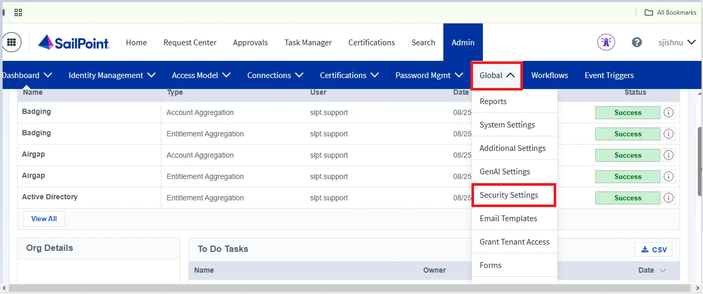
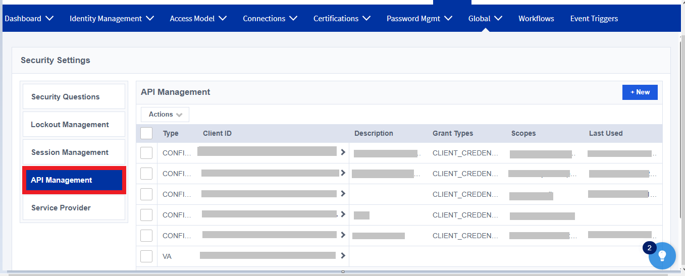
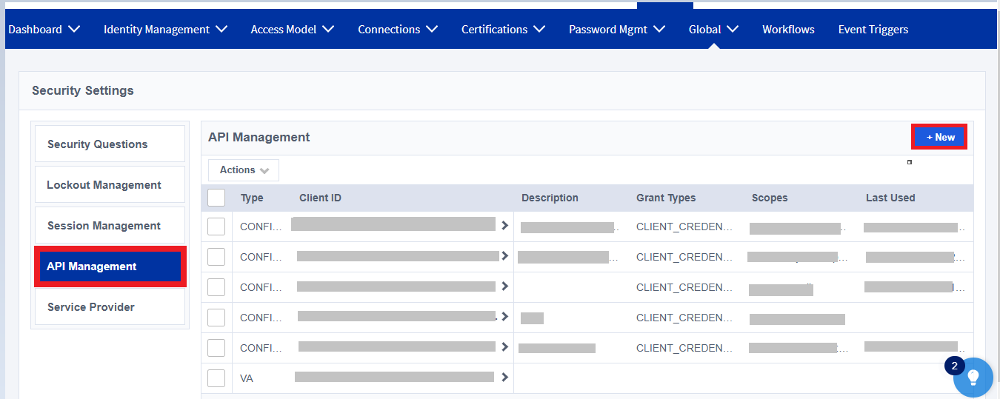
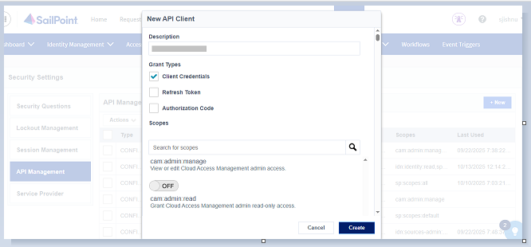
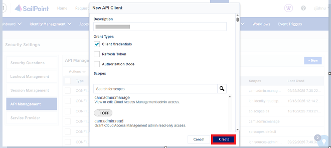
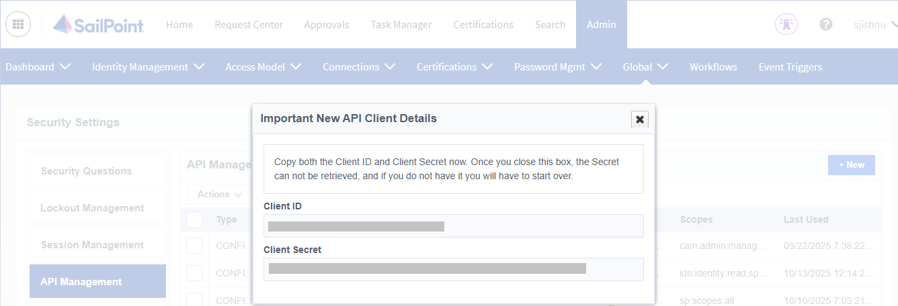
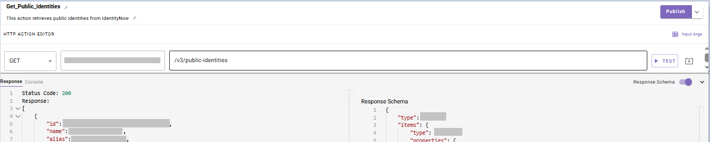

# **Introduction:**

**SailPoint IdentityNow** is a cloud-based identity governance and administration platform that helps organizations manage the full user lifecycle — from onboarding and access changes to offboarding — across applications and systems. It enables automated provisioning, enforces access policies, supports compliance through access reviews, and provides self-service access requests.

This guide walks you through the process of creating a connector within **Agent Studio** to make API calls to **SailPoint IdentityNow**, using the **OAuth 2.0 Client Credentials Flow** for secure authentication. The guide is organized into two main sections:

1. **Set up OAuth Client Credentials Flow**
2. **Create a Connector in Agent Studio**

# **Prerequisites:**

- Ensure you have **admin privileges** in your **SailPoint IdentityNow instance** to create and configure **OAuth 2.0 applications**.
- Detailed instructions on OAuth token generation and integration are available in the official SailPoint IdentityNow documentation [**here**](https://developer.sailpoint.com/docs/api/authentication/#find-your-tenants-oauth-details).

# **Set up OAuth Client Credentials Flow**

To connect **SailPoint IdentityNow** with **Agent Studio**, we’ll use **OAuth 2.0 authentication**. This method allows backend systems like Agent Studio to securely authenticate using a **Client ID and Secret**.

This guide walks you through registering an OAuth 2.0 application in SailPoint IdentityNow, generating an access token using the **Client Credentials Flow**, and configuring the connector in Agent Studio for seamless access to SailPoint IdentityNow APIs.

# **Register OAuth 2.0 Application in SailPoint IdentityNow**

### **Step 1: Log in to SailPoint IdentityNow with Admin Account**

- Go to **https://{{your-tenant}}.identitynow.com** (replace **`{{your-tenant}}`** with your organization’s SailPoint IdentityNow tenant name, for example **https://abc.identitynow.com/**).
- Click on the **Admin** section in the top navigation bar.



- Under **Global**, select **Security Settings**.



- Within **Security Settings**, click on **API Management** to proceed.

### **Step 2: Create a New OAuth Application**

- In the **API Management** page, click the **+ New**  button (usually at the top-right corner).



- **Description**
    
    Enter a name that clearly identifies the purpose of this application (e.g., *Moveworks Integration*).
    
- **Grant Type**:
    
    Select **Client Credentials**.
    
- **Scopes**:
    
    Choose the required scopes based on what actions your integration needs to perform (for example: `idn:identity:read`, `sp:workflow:manage`, `idn:identity:manage`, etc.).
    
    
    

### **Step 3: Create and Configure an OAuth Application**

- After filling in the details, click **Create**



- Once created, your **Client ID** and **Client Secret** will be displayed.



- These will be used in Agent Studio for authentication

### **Step 4: Request an Access Token**

After successfully creating an **OAuth Application** in **SailPoint IdentityNow** and retrieving the required credentials (**`client_id`** and **`client_secret`**), you can request an **access token**. This token is used to authenticate API requests securely.

To request an access token, use the following **`curl`** command:

```bash
curl --location --request POST 'https://{{your-tenant}}.api.identitynow-demo.com/oauth/token' \
--header 'Content-Type: application/x-www-form-urlencoded' \
--data-urlencode 'grant_type=client_credentials' \
--data-urlencode 'client_id=YOUR_CLIENT_ID' \
--data-urlencode 'client_secret=YOUR_CLIENT_SECRET'

```

Replace the placeholders with your specific values:

- **`{{your-tenant}}`** – Your SailPoint IdentityNow tenant domain (for example: `ta-partner17622`)
- **`YOUR_CLIENT_ID`** – The Client ID generated from your OAuth Application
- **`YOUR_CLIENT_SECRET`** – The Client Secret associated with the OAuth Application

# **Integrate with Agent Studio**

Now that OAuth is set up in SailPoint IdentityNow , configure the connection in Agent Studio.

### **Step 5: Configure the** SailPoint IdentityNow **Connector**

To complete the integration between SailPoint IdentityNow and Agent Studio using OAuth 2.0, follow the steps below:

- Go to the **HTTP Connector**.
- You can see the Create option, and from there you can **Create** a connector
- The setup includes the following details:
1. Connector Name **:**
    - `Sailpoint_iNow`
2. Base Url**:**
    - `https://{{your-tenant}}.api.identitynow-demo.com`
3. Auth Config**:**
    - **`Oauth2`**
4. OAuth2 Grant Type(this value static and cannot be changed):
    - **`Client Credentials`**
5. Client ID:
    - Enter the **`Client ID`** you received when registering your SailPoint IdentityNow app.
6. Client Secret:
    - Enter the **`Client Secret`** corresponding to your app’s Client ID.
7. OAuth2 Token URL:
    - `https://{{your-tenant}}.api.identitynow-demo.com/oauth/token`
8. Click on **Save** to submit the credentials, and your connector will be ready

[](https://marketplace.moveworks.com/api/marketplace/github-proxy?path=/moveworks/developer-docs/main/connectors/jamf/jamfConnector3.png)

[](https://marketplace.moveworks.com/api/marketplace/github-proxy?path=/moveworks/developer-docs/main/connectors/jamf/jamfConnector2.png)

### **Step 6: Configure SailPoint IdentityNow API Action in Agent Studio**

Test your SailPoint IdentityNow  connector by setting up an action in Agent Studio. You can read more about setting up API actions in the [**API configuration reference**](https://help.moveworks.com/docs/http-action-data-bank-legacy)

1. Go to **Agent Studio**.
2. Navigate to **Actions → HTTP Actions → Create New Action.**
3. Select **Inherit from Existing Connector** and choose Sailpoint_iNow.
4. In the API configuration, provide the following details:
    - API Endpoint Path:
        - `https://{{your-tenant}}.api.identitynow-demo.com/v3/public-identities`
    - Method:
        
        **GET**
        
5. Save the action
6. Then, test the connector by running the action to confirm that the integration is working.



# **Congratulations!**

You’ve successfully integrated **SailPoint IdentityNow**  with **Agent Studio** using **OAuth 2.0**. You can now securely access **SailPoint IdentityNow**  and power automated use cases within your workflows.
