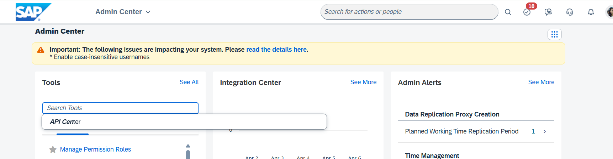
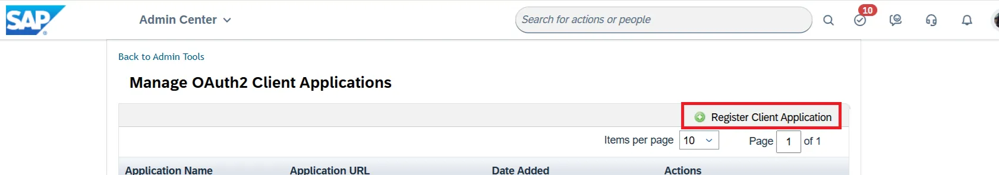
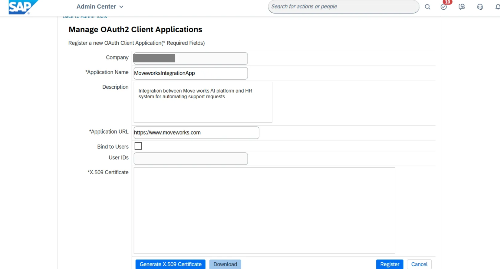
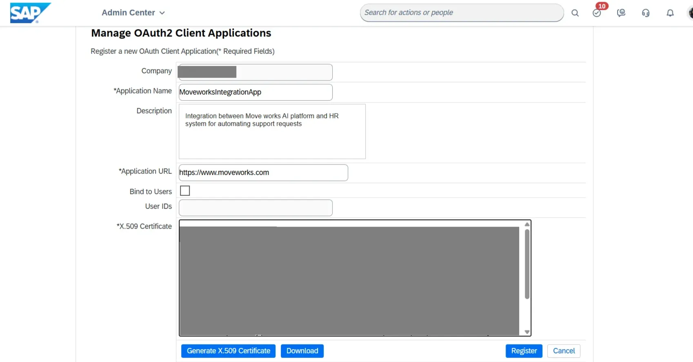
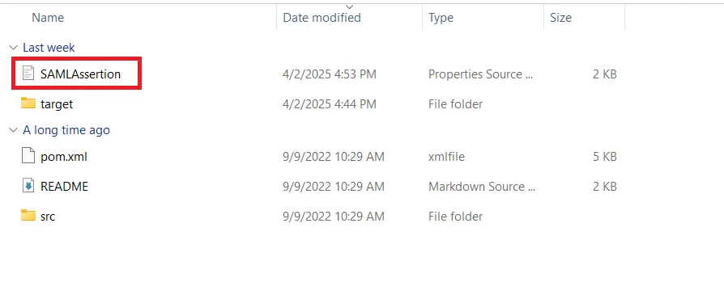
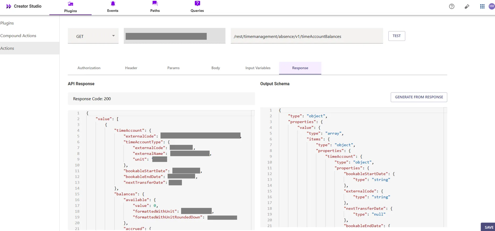
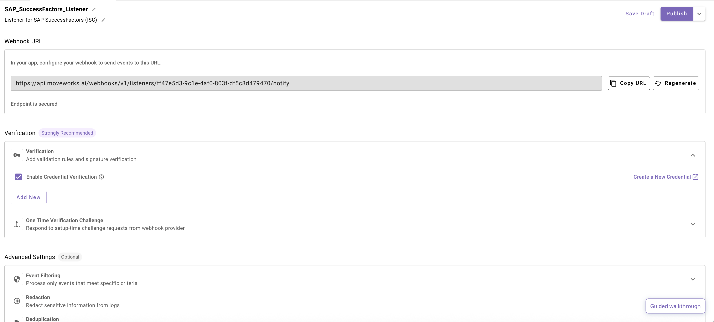
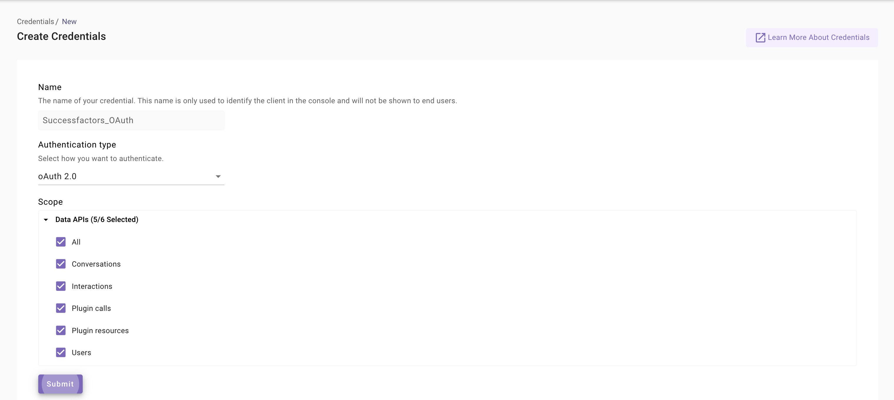

# Introduction:

SAP SuccessFactors is a cloud-based human resources (HR) management solution, empowering businesses with data-driven insights to optimize talent management, employee engagement, and overall workforce performance.

This guide will demonstrate how to connect SAP Success Factors to Agent Studio. In doing so, there are three ways you can proceed:
1. [Dynamic SAML Auth](https://marketplace.moveworks.com/connectors/sap-success-factors#Dynamic-SAML-Auth) - This is best when building plugins that execute API calls on behalf of individual users (e.g., PTO submission, approvals), using per-user SSO identity. **Recommended for most use cases.**
2. [Static SAML Auth (Admin User)](https://marketplace.moveworks.com/connectors/sap-success-factors#Static-SAML-Auth) - This is a fallback option for admin-level actions where per-user identity is not required. Tokens are generated offline using an admin account. Note: Dynamic SAML is recommended even for admin actions as it is easier to maintain and avoids manual offline token generation.
3. [Webhook Connection](https://marketplace.moveworks.com/connectors/sap-success-factors#Webhook-Connection) - This is best when building ambient agents that are triggered from a system event inside of SAP SuccessFactors.

# Dynamic SAML Auth (SAML 2.0 / Per-User Auth via SSO)

## Why do we need dynamic SAML Auth (SAML 2.0)?

Standard client credentials auth uses a single service account for all API calls. This works for read-only lookups, but falls short when the API action must run **as the logged-in user** — for example:

- **Submitting PTO** as an employee (routed to the correct manager for approval)
- **Approving/rejecting time-off requests** as a manager
- **Viewing personal compensation or benefits data** scoped to the authenticated user

SAP SuccessFactors enforces Role-Based Permissions (RBP) at the API level. Dynamic SAML ensures each API call carries the identity of the actual user through their SSO platform (ex: Okta, Azure, etc.), so SF applies the correct permissions, approval workflows, and audit trails automatically.

### Why are static SAML assertions not reliable?

SAP SuccessFactors does offer a way to generate static SAML assertions using the [SAP Offline SAML Assertion Generator](https://me.sap.com/notes/3031657). This tool produces a pre-built assertion tied to a single admin or service account, which can be used for client credentials-style API access.

While this works for basic testing or batch operations, static assertions have significant limitations in production:

- **Admin-scoped, not user-scoped.** A static assertion authenticates as a fixed admin user. Every API call runs with that admin's permissions, regardless of who initiated the request. SF cannot enforce per-user RBP, and all actions appear in the audit log under one account.
- **No approval workflow routing.** When an admin-scoped token submits a PTO request on behalf of an employee, SF may not correctly route it through the employee's manager approval chain — because the API caller is the admin, not the employee.
- **Short-lived and manual.** Static assertions expire (default 10 minutes), and regenerating them requires running a Java tool with Maven on the command line. There is no automated refresh mechanism.
- **Security and compliance risk.** Enterprises with SOX, GDPR, or internal audit requirements need individual user attribution on every HR transaction. A shared admin token cannot provide this.

Most enterprises on SAP SuccessFactors prefer **OAuth 2.0 with SAML 2.0 Bearer assertions** (defined in [RFC 7522](https://datatracker.ietf.org/doc/html/rfc7522)) as the standard for per-user API authentication. This approach is recommended by SAP in their [API authentication documentation](https://help.sap.com/docs/successfactors-platform/sap-successfactors-api-reference-guide-odata-v2/authentication-using-oauth-2-0) and is the pattern used by major middleware platforms (SAP BTP, Workato, MuleSoft) when integrating with SuccessFactors on behalf of individual users.

**Dynamic SAML gives you the best of both worlds**: automated, programmatic API access with the security and permission model of individual user authentication.

## How It Works

The authentication flow involves four parties: 

- **End user**
- **Identity Provider (IdP)** (e.g., Okta, Ping Identity, Azure AD)
- **Moveworks Agent Studio**
- **SAP SuccessFactors Instance**

1. A user triggers a plugin in Moveworks that requires SF access (e.g., "Submit PTO for next Friday").
2. If no cached token exists, Moveworks redirects the user to their corporate IdP for SSO authentication.
3. The IdP authenticates the user and sends a SAML Response back to Moveworks.
4. Moveworks generates a **new SAML assertion** — signed with its own private key — containing the correct Issuer, Recipient, and user identity that SF expects.
5. Moveworks exchanges this assertion at SF's OAuth token endpoint for an access token scoped to that user.
6. The API call executes as that user. The token is cached (up to 24 hours).

> **Note:** The end user only sees a brief SSO prompt (or none at all if already signed in). The assertion generation and token exchange happen transparently in the background.
> 

---

## Prerequisites

- **SAP SuccessFactors** admin access to register OAuth client applications (sandbox/prod)
- **Identity Provider** admin access (Okta, Ping Identity, Azure AD, or similar) to create SAML 2.0 app integrations
- **Moveworks Agent Studio** admin access to configure HTTP connectors
- **OpenSSL** installed on your local machine (pre-installed on macOS and most Linux distributions)
- A test user in SAP SuccessFactors that is also provisioned in your IdP

## **User Permissions**

With Dynamic SAML, Moveworks does not control the scope of API access through the connector configuration — unlike OAuth client credentials where you can define integration scopes. Instead, Dynamic SAML **mirrors the exact permissions of the authenticated end user** from SAP SuccessFactors. Whatever a user can see and do in SAP SF is what they can do through the Moveworks API call.

This means permissions must be configured on **SAP SuccessFactors** before users can interact with data through Agent Studio plugins:

- **OData API access:** Users need appropriate Role-Based Permissions (RBP) in SAP SF to access OData entities (e.g., `EmployeeTime`, `User`, `EmpJob`) via API. Without these permissions, API calls will return `403 Forbidden` even if SAML authentication succeeds.
- **Entity-level permissions:** Some use cases require access to specific SF entities or fields. For example, PTO submission requires write access to `EmployeeTime`, while viewing compensation data requires read access to `EmpCompensation`. These vary by use case and are documented in individual plugin guides.
- **Business process permissions:** Actions like PTO approval require the user to have the appropriate manager or approver role in SF's business process configuration.

**Important:** If a user authenticates successfully through Dynamic SAML but receives permission errors on API calls, the issue is on the SAP SF permissions side — not the Moveworks connector. Work with your SAP SF admin to verify the user's RBP assignments for the relevant OData entities.

---

## Step 1: Generate Moveworks Signing Key and Certificate

Moveworks generates and signs its own SAML assertion before exchanging it with SAP SuccessFactors. To do this, you need an RSA key pair: 

- A **private key** (used by Moveworks to sign assertions)
- A **certificate** (registered in SAP SF so it can verify the signature).

### 1.1 Generate the private key and certificate pair

Open a terminal and run:

```bash
openssl genpkey -algorithm RSA -out mw_private_key.key
openssl req -x509 -key mw_private_key.key -out mw_certificate.pem -days 3650 -subj "/O=Moveworks/CN=moveworks"
```

This generates `mw_private_key.key` — your RSA private key. **Keep this file secure.** It will be uploaded to the Moveworks HTTP connector later.

This generates `mw_certificate.pem` — a self-signed X.509 certificate valid for 10 years. This will be registered in SAP SuccessFactors and also uploaded to the Moveworks connector.


Then run the following command to ensure that the private key and certificate are available on your device

```bash
ls -la mw_private_key.key mw_certificate.pem
```

### 1.2 Extract the raw certificate for SAP SF

SAP SuccessFactors expects the certificate as a raw Base64 string (no headers, no line breaks). Run:

```bash
cat mw_certificate.pem | grep -v "^-----" | tr -d '\n'
```

Copy the entire output. You will paste this into the X.509 Certificate field in SAP SF in the next step.


> **Important:** Save both `mw_private_key.key` and `mw_certificate.pem` securely. You will need them when configuring the Moveworks HTTP connector (Step 4).
> 

---

## Step 2: Register an OAuth Client Application in SAP SuccessFactors

### 2.1 Access the Admin Center

Log into SAP SuccessFactors as an administrator. In the search bar, go to **Admin Center** → **Manage OAuth2 Client Applications.**


### 2.2 Register a new client application

Click on **"Register Client Application"** and fill out the details shown below:

| Field | Value |
| --- | --- |
| **Company** | Pre-filled based on your instance (e.g., `SFCPART001234`) |
| **Application Name** | `MW Dynamic SAML Auth` (or your preferred name) |
| **Description** | `Moveworks Dynamic SAML Auth for per-user API access` |
| **Application URL** | `https://<your-org>.moveworks.com` (your Moveworks login URL) |
| **Bind to Users** | Leave **unchecked** |
| **User IDs** | Leave **blank** |


### 2.3 Replace the X.509 Certificate

In the **X.509 Certificate** field, delete the auto-generated certificate and paste the raw certificate string you extracted in **Step 1.3**.

Click on **Register** once done.

### 2.4 Copy the API Key & Company ID

After saving, click **View** on your newly registered application. Copy the **API Key** — this serves as your `client_id` and will be needed for the Moveworks connector configuration. 

Also copy the **Company ID** (visible in the Company field). You will need both the API Key and Company ID for the HTTP connector setup on Moveworks.


---

## Step 3: Configure Your Identity Provider (Okta Example)

You need a SAML 2.0 app integration in your IdP that authenticates users and sends the SAML Response to Moveworks. 

This guide uses **Okta** as the example since it is the primary SSO provider used by Moveworks internally. However, the same flow works with any SAML 2.0-capable identity provider. The core configuration is almost identical — only the admin UI for creating the SAML app on the Identity Provider differs.

If your organization uses a different IdP, refer to the relevant documentation for creating a custom SAML 2.0 app integration:

| Identity Provider | SAML 2.0 App Configuration Guide |
| --- | --- |
| **Okta** | [Create a SAML app integration](https://help.okta.com/en-us/content/topics/apps/apps_app_integration_wizard_saml.htm) |
| **Microsoft Entra ID (Azure AD)** | [Configure SAML-based single sign-on](https://learn.microsoft.com/en-us/entra/identity/enterprise-apps/add-application-portal-setup-sso) |
| **Ping Identity (PingFederate)** | [Configuring a SAML application](https://docs.pingidentity.com/solution-guides/workforce_use_cases/htg_config_saml_app.html) |
| **OneLogin** | [Create a SAML custom connector](https://onelogin.service-now.com/support?id=kb_article&sys_id=93f95543db109700d5505eea4b96198f) |
| **Google Workspace** | [Set up a custom SAML application](https://support.google.com/a/answer/6087519) |

Regardless of which IdP you use, the key values you need to configure will consist of: 

1. **Single Sign-On URL** (Moveworks callback) - it should be in this format: [https://<moveworks-org-name>.moveworks.com/auth/samlCallback](https://89solutions-l2-partner.moveworks.com/auth/samlCallback)
2. **Recipient/Destination URL** (will always be SF OAuth token endpoint) - it should be in this format: [https://<TENANT_HOST_NAME>.successfactors.com/oauth/token](https://apisalesdemo8.successfactors.com/oauth/token)
3. **Audience URI** (SF API domain) - - it should be in this format: [https://<TENANT_HOST_NAME>.successfactors.com](https://apisalesdemo8.successfactors.com/oauth/token)
4. **Signing settings** — Both the SAML **Response** and the **Assertion** must be signed (not just one). Create a **new SAML signing certificate**, Use **RSA-SHA256** as the signature algorithm and **SHA256** as the digest algorithm. This is configured in your IdP's SAML app settings — look for options like "Response Signature" and "Assertion Signature" and set both to **Signed**. SAP SuccessFactors will reject assertions that are unsigned or only have a signed response without a signed assertion.

> **Important:** This SAML app is separate from any existing SAP SF SSO app you may already have. The existing app is for browser-based SSO login to SF. This new app is specifically for the Moveworks dynamic auth flow, where Moveworks (not SF) receives the SAML Response.
> 

### 3.1 Create a new SAML 2.0 application

In the Okta Admin Console, go to **Applications → Applications → Create App Integration**. Select **SAML 2.0** and click **Next**. If you don’t have access, please work with your IdP admin to create the SAML app for SAP SF.


### 3.2 Configure SAML settings

Go to your admin console and click on the SAML app. In the **General** section, enter the following:

| Field | Value |
| --- | --- |
| **Single sign-on URL** | `https://<your-org>.moveworks.com/auth/samlCallback` |
| **Recipient URL** | `https://<your-sf-api-server>.successfactors.com/oauth/token` |
| **Destination URL** | `https://<your-sf-api-server>.successfactors.com/oauth/token` |
| **Audience URI (SP Entity ID)** | `https://<your-sf-api-server>.successfactors.com` |
| **Name ID format** | `EmailAddress` |
| **Application username** | `Email` |
| **Response** | `Signed` |
| **Assertion Signature** | `Signed` |
| **Signature Algorithm** | `RSA_SHA256` |
| **Digest Algorithm** | `SHA256` |

> **Note**: Replace `<your-org>` with your Moveworks org name and `<your-sf-api-server>` with your SAP SF API server hostname (e.g., `apisalesdemo8`). For a list of SAP API servers by region, see the [SAP API Server Directory](https://help.sap.com/docs/successfactors-platform/sap-successfactors-api-reference-guide-odata-v2/list-of-sap-successfactors-api-servers).
> 


### 3.3 Note the SAML Issuer ID

Scroll down to the advanced settings. By default, Okta sets the Issuer ID to `http://www.okta.com/${org.externalKey}`. You will find the Issuer ID for this app in the **Sign On** settings. Once you set up a sign-on method, go to the metadata details to find the resolved external key. Save this value — it is needed when setting up the HTTP connector.

The final URL will look like: `http://www.okta.com/<externalKey>` (save this for the HTTP connector step)


### 3.4 Setup the App Embed Link

Under General Settings, scroll down and set an app embed link, this URL will later act as a sign in URL from Moveworks HTTP connector, save it.


### 3.5 Setup a new SAML Signing Certificate / use an existing certificate

Click on “Generate new certificate”, and ensure that the certificate is active. Download this and save it, we need this IdP certificate for configuring the HTTP connector.

If a certificate already exists, Go to the **Sign On** tab. Under **SAML Signing Certificates**, find the **Active** SHA-2 certificate and click **Actions → Download certificate**.

Save this file — you will upload it to the Moveworks connector as the **IdP Signing Certificate**.


### 3.4 Assign users / user groups to the application

Go to the **Assignments** tab and assign the users (or groups) who will use SAP SF through Moveworks.

- Click **Assign → Assign to People** (or **Assign to Groups** for bulk assignment)
- Select each user and click **Assign**

In a production deployment, assign a group (e.g., "Employees/Managers") so membership is managed in one place.

> **Tip:** You can check **"Do not display application icon to users"** in the General tab to hide this app from the Okta user dashboard. End users don't need to see or interact with it directly.
> 


---

## Step 4: Configure the Moveworks HTTP Connector

In Agent Studio, navigate to **HTTP Connectors → Create** to set up a new connector. 

This connector will enable Moveworks to communicate with SAP SF on behalf of individual users — it stores the SAML configuration, signing credentials, and token endpoint details needed to authenticate and execute API calls through dynamic SAML.

### Connector basics

| Field | Value | Notes |
| --- | --- | --- |
| **Connector Name** | `SAP_SF_Dynamic_SAML_Auth` | Cannot be changed after creation |
| **Display Name** | `SAP SF Dynamic SAML Auth` | Human-readable name |
| **Display Description** | `Dynamic SAML Auth Connector for SAP SF` | Optional description |
| **Base URL** | `https://<your-sf-api-server>.successfactors.com` | Your SAP SF API server URL |

### Certificate uploads

| Field | File to upload | Purpose |
| --- | --- | --- |
| **X.509 certificate (Optional)** | — | Leave empty for this flow |
| **X.509 private key (Optional)** | — | Leave empty for this flow |


### Auth configuration

| Field | Value | Notes |
| --- | --- | --- |
| **Auth Config** | `Oauth2` | Select from dropdown |
| **Oauth2 Grant Type** | `Saml Bearer Grant` | Enables the SAML bearer flow |
| **Saml Bearer Grant Flow Type** | `Online Flow` | Interactive user authentication via IdP |

### SAML and IdP settings

| Field | Value | Notes |
| --- | --- | --- |
| **SAML IdP URL** | `https://<your-okta-domain>/app/<app-path>/sso/saml` | The SSO URL for your Okta SAML app (found on the Sign On tab under Metadata details) |
| **IdP Signing Certificate** | Upload the Okta signing certificate downloaded in **Step 3.5** | Used by Moveworks to verify the SAML Response from the IdP |
| **Expected Audience (Moveworks Entity ID)** | `https://<your-sf-api-server>.successfactors.com` | Must match the Audience URI set in the Okta app |
| **Attribute Mappings** | Leave empty (unless NameID remapping is needed) | Maps IdP attributes to claims in the new assertion |


### SAML Issuer and Client credentials

| Field | Value | Notes |
| --- | --- | --- |
| **SAML Issuer** | `http://www.okta.com/<externalKey>` | The SAML Issuer ID from your Okta app ([Step 3.3](https://www.notion.so/SAP-SuccessFactors-Dynamic-SAML-Auth-Connector-Guide-349588d8909f80b49a4dc1d01f9d7cb7?pvs=21)) |
| **Client ID** | Your SAP SF API Key from **Step 2.4** | Used in the token exchange request to SF |
| **Client Secret** | Leave empty | Not required for SAML bearer flow |
| **Saml Bearer Grant Scope** | Leave empty | Not required for SAP SF |

### Signing certificate (for Moveworks-generated assertions)

| Field | File to upload | Purpose |
| --- | --- | --- |
| **Signing Certificate** | Leave empty | Not needed |
| **SAML Audience** | `https://<your-sf-api-server>.successfactors.com` | Audience in the Moveworks-generated assertion |
| **Target Audience** | `https://<your-sf-api-server>.successfactors.com` | Final system entity ID |
| **Target Recipient URL** | `https://<your-sf-api-server>.successfactors.com/oauth/token` | SF's OAuth token endpoint — Moveworks sets this as the Recipient in the new assertion |


### Moveworks signing key pair

| Field | File to upload | Purpose |
| --- | --- | --- |
| **Moveworks Signing Private Key** | Upload `mw_private_key.key` from **Step 1** | Moveworks uses this to sign the assertion sent to SF |
| **Moveworks Signing Certificate** | Upload `mw_certificate.pem` from **Step 1** | Included in the assertion for SF signature verification |

### Token endpoint and additional parameters

| Field | Value | Notes |
| --- | --- | --- |
| **Oauth2 Token URL** | `https://<your-sf-api-server>.successfactors.com/oauth/token` | Where Moveworks exchanges the assertion for an access token |


Under **Oauth2 Custom Oauth Request Options Additional Request Data**, add:

| Key | Value | Notes |
| --- | --- | --- |
| `client_id` | Your SAP SF API Key | Included in the token exchange POST body |
| `company_id` | Your SAP SF Company ID (e.g., `SFCPART001234`) | Required by SF's token endpoint (check the OAuth app created on SAP SF, **Step 2.4**) |


Click on **Save**.


---

## Step 5: Test the Connector

### 5.1 Verify with an HTTP Action

1. In Agent Studio, create or open an **HTTP Action** that uses the **SAP SF** **dynamic SAML** connector.
2. Click **Test** in the top-right corner.
3. You will be prompted to **Generate Token**. Click it.
4. A browser window opens and redirects to your IdP (Okta in this case). If you're already signed in, authentication is instant. If not, enter your SSO credentials.
5. After successful authentication, you should see **"Callback Request Successful"** message in the browser. 

> **Note:** There is a known limitation where you may successfully authenticate through SSO but still see a "**Callback Request Faile**d" error. This is a known issue and not a blocker — on the SAP SF side, the token is successfully exchanged for the user, but the success response is not handled correctly in the UI.
> 

Use the below API CURL for testing:

```bash
curl -X GET \
  "https://apisalesdemo8.successfactors.com/odata/v2/User('{{userId}}')?$select=userId,firstName,lastName,email&$format=json" \
  -H "Authorization: Bearer <access_token>" \
  -H "Accept: application/json"
```


Go back to the HTTP action, you should now see the connector status as “**Authorized**”. Click on **Test** again. A `200 OK` response with user data confirms the dynamic SAML auth is working end-to-end.


### 5.2 Test an update action (optional)

To validate that per-user permissions are enforced, test a PTO submission. Use the below API CURL for testing:

```bash
curl -X POST \
  "https://apisalesdemo8.successfactors.com/odata/v2/upsert?$format=json&workflowConfirmed=true" \
  -H "Authorization: Bearer <access_token>" \
  -H "Content-Type: application/json" \
  -H "Accept: application/json" \
  -d '[{
    "__metadata": {
      "uri": "EmployeeTime"
    },
    "externalCode": "PTO_TEST_001",
    "userId": "{{userId}}",
    "startDate": "/Date(1776384000000)/",
    "endDate": "/Date(1776384000000)/",
    "approvalStatus": "PENDING",
    "timeTypeNav": {
      "__metadata": {
        "uri": "TimeType('\''TT_VAC_REC'\'')",
        "type": "SFOData.TimeType"
      }
    }
  }]'
```

A `200 OK` response with `"status": "OK"` confirms the PTO was submitted as the authenticated user. You can verify in the SAP SF UI that the request appears under the correct employee with the correct approval workflow.

---

## Configuration Summary

| Component | Key Configuration | Value |
| --- | --- | --- |
| **SAP SF OAuth Client** | X.509 Certificate | Moveworks signing certificate (`mw_certificate.pem`) |
| **SAP SF OAuth Client** | API Key (Client ID) | Auto-generated by SF |
| **IdP SAML App** | Single Sign-On URL | `https://<org>.moveworks.com/auth/samlCallback` |
| **IdP SAML App** | Recipient/Destination URL | `https://<sf-api>.successfactors.com/oauth/token` |
| **IdP SAML App** | Audience URI | `https://<sf-api>.successfactors.com` |
| **MW Connector** | Moveworks Signing Private Key | `mw_private_key.key` |
| **MW Connector** | Moveworks Signing Certificate | `mw_certificate.pem` |
| **MW Connector** | IdP Signing Certificate | Downloaded from Okta |
| **MW Connector** | Target Recipient URL | `https://<sf-api>.successfactors.com/oauth/token` |

---

## Troubleshooting

You might come across errors during setup. To debug, open your browser's developer tools (Network tab) to capture the SAML Response during the SSO redirect, extract the assertion from it, and exchange it for a bearer token using a simple Python script or Postman. The error response from SAP SF's token endpoint will contain the exact reason for failure, making it easier to pinpoint the issue.

**API CURL to exchange SAML Assertion for a bearer token:**

```bash
curl -X POST \
  "https://<TENANT_HOST_NAME>.successfactors.com/oauth/token" \
  -H "Content-Type: application/x-www-form-urlencoded" \
  -d "grant_type=urn%3Aietf%3Aparams%3Aoauth%3Agrant-type%3Asaml2-bearer" \
  -d "client_id=<API_KEY>" \
  -d "company_id=<COMPANY_ID>" \
  -d "assertion=<BASE64_SAML_ASSERTION>"
```

**Common error scenarios:**

- **"Unable to verify the SAML assertion — api_key doesn't match client_id"** — The Issuer in the assertion doesn't match the Client ID (API Key). Verify the SAML Issuer field in the MW connector matches the SAML Issuer ID in your Okta app, and that the Client ID matches the SAP SF API Key. This also happens when the IdP certificate is missing/incorrect in the HTTP connector.
- **"Unable to verify the signature of the SAML assertion"** — The X.509 certificate in the SAP SF OAuth client app doesn't match the private key used to sign the assertion. Ensure the Moveworks signing certificate (not the Okta certificate) is registered in SAP SF.
- **"The recipient attribute value must be set as the URL of the API server"** — The Recipient in the assertion doesn't match the SF token endpoint. Check the Target Recipient URL in the MW connector is set to `https://<sf-api>.successfactors.com/oauth/token`.
- **"API key does not exist in company"** — The client_id in the token request doesn't match any registered OAuth client in SF. Verify the Client ID and company values in the MW connector's Additional Request Data section.
- **Token expires after 24 hours** — This is an SAP SF limitation. Access tokens have a maximum lifetime of 24 hours with no refresh token support in the SAML bearer flow. Users will need to re-authenticate via SSO when the token expires. If the user is already signed into their IdP, this is typically seamless (no login prompt).

---

## Congratulations!

You've successfully configured **Dynamic SAML 2.0 Bearer Authentication** for SAP SuccessFactors in Moveworks Agent Studio. Your connector is now ready to power per-user plugins like PTO submission, time-off approvals, and any other SAP SF action that requires user-level identity.

---

# Static SAML Auth (Admin User)
## **Prerequisites:**

- Ensure you have **admin privileges** in SAP SuccessFactors to create an OAuth application and manage permissions.
- Detailed instructions on generating an OAuth access token are available in the official SAP SuccessFactors documentation [here](https://help.sap.com/docs/successfactors-platform/sap-successfactors-api-reference-guide-odata-v2/restricting-access).
- Ensure you are using **Java 8 or later** for generating the SAML Assertion. If you encounter errors, update your JDK or install the Sap Machine JDK from [here](https://sap.github.io/SapMachine/#download).
- **Apache Maven** downloaded and extracted to your local drive (e.g., extracted to the C drive). You can download it from [here](https://maven.apache.org/download.cgi).

## **Set up SAP SuccessFactors**

To connect SAP SuccessFactors with Agent Studio, we’ll use OAuth2 with the Client Credentials Flow. You’ll need to register an application in SAP SuccessFactors and obtain the following credentials:

- **Company ID**
- **Client ID**
- **Assertion** (Base64-encoded SAML assertion, generated after registering the application)

The following steps will walk you through how to register an OAuth application in SAP SuccessFactors, generate the required assertion, and authenticate to get an access token. This token is essential to securely interact with the SAP SuccessFactors APIs and set up the connector within Agent Studio

## **Step 1: Register the Application in SAP SuccessFactors**

### 1. Access API Center

- Log into SAP SuccessFactors as an administrator, navigate to the Admin Center, and search for API Center



### 2. Register OAuth Client

- Select OAuth Configuration for OData and click on "Register Client Application.”



### **3. OAuth Client Application Setup:**

- **Company:** `moveworks-example-company` *(Prefilled based on the logged-in instance)*
- **Application Name:** `MoveworksIntegrationApp` *(Required - Unique name for your OAuth client)*
- **Description:** `Integration between Moveworks AI platform and HR system for automating support requests.` *(Optional - Brief description)*
- **Application URL:** `https://www.moveworks.com`
- **Bind to Users:** `Yes` *(Optionally restrict access to specific users)*
    - **User IDs:** `user1, user2, user3` *(Comma-separated user IDs if binding is enabled)*
    
    
    

### **4. X.509 Certificate Setup for OAuth Application:**

- **Navigate to:** Manage OAuth2 Client Applications in SAP SuccessFactors.
- **Click on:** Generate for a new X.509 Certificate.
- **Fill in Required Fields:**
    - **Common Name (CN):** Example: `moveworks-integration-cert` (Required field)
- **Optional Fields:**
    - **Enable validity check:** Check based on your preference.
- **Generate and Download:** Generate the certificate and use the Base64-encoded string for OAuth registration.



- **Click the Register button** to complete the OAuth client application registration

### 5. After registering the OAuth client application:

- **Click on the View button**: This will display the API Key associated with your newly registered application.
- **Use the API Key as Client ID**: Copy the generated API Key, as it will serve as the Client ID for authenticating the client application during integration


## **Step 2: Generating a SAML Assertion for SAP SuccessFactors API:**

**IMPORTANT NOTES:**

- **Java Version:** Ensure Java 8 or higher. If you face errors, update your Java JDK or install Sap Machine JDK.
    - [Download Sap Machine JDK](https://sap.github.io/SapMachine/#download)
- **Security:** This KBA is for demonstration purposes only. SAP is not responsible for security when using the sample code in production environments.
- **SAML Expiry:** By default, the SAML assertion expires in 10 minutes. You can adjust the expiry as needed (in minutes).
- **User ID/Username:** You can use either `userId` or `userName`, but not both simultaneously.

### **Steps to Generate a SAML Assertion:**

1. **Download and Set Up Maven:**
    - Download Apache Maven from [here](https://maven.apache.org/download.cgi), extract it locally.
    - Set up environment variables for Java and Maven on your system.
2. **Validate Java and Maven Installation:**
    - Open **Command Prompt** and check Java with:
        
        `echo %JAVA_HOME%`
        
        
        
    - Check Maven with:
        
        `mvn -v`
        
        
        
3. **Download the SAML Assertion Tool:**
- Go to the **attachment section** of this KBA or use the following link to download the zip file containing the SAML Assertion tool:  [Download SAML Assertion Tool](https://me.sap.com/notes/3031657).
1. **Edit SAMLAssertion.properties:**
- Open the `SAMLAssertion.properties` file.



- Fill in the required fields:
    - `tokenUrl`:  The full URL to the token endpoint of your SAP SuccessFactors API server. This is constructed by appending `/oauth/token` to your instance-specific API server URL.
    
    **Example:**
    
    ```bash
    https://<your-api-server-url>/oauth/token
    ```
    
    - For a complete list of SAP SuccessFactors API servers by region and environment, refer to the [SAP API Server Directory](https://help.sap.com/docs/successfactors-platform/sap-successfactors-api-reference-guide-odata-v2/list-of-sap-successfactors-api-servers).
    
    ### Additional Guidance on API Servers
    
    - Use the correct server URL for your instance to avoid authentication and connectivity issues.
    - SAP does **not** support IP addresses in endpoint URLs as part of its reference architecture. Always use domain names.
    
    ### Common Endpoint Patterns
    
    
    
    - **Tip:** To find your instance-specific information (such as API server region and version), log into your SAP SuccessFactors account, click your profile in the top header, and select **Show version information**.
    - `clientId`: The API Key from your SF OAuth registration.
    - `userId` or `userName`: Choose one based on your setup.
    - `privateKey`: X.509 private key.
    - `expireInMinutes`: Set the expiry time (default is 10 minutes).
    
    
    
1. **Generate the SAML Assertion:**
    - Open **Command Prompt** in the folder containing the files.
    - Run the command:
        
        `mvn compile exec:java -Dexec.args="SAMLAssertion.properties"`
        
    
    
    
2. **Save the Generated SAML Assertion:**
    - After running the command, the SAML assertion is generated. Copy and securely store it for OAuth integration
    
    
    

## **Step 3:** Requesting an Access Token

- Use a **POST** request to the URI: `https://<API-Server>/oauth/token`
- **Authentication**: No authentication required
- **Headers**:
    - `Content-Type: application/x-www-form-urlencoded`

**Request Body**:

- `company_id`: Your company ID (Required)
- `client_id`: API key from OAuth registration (Required)
- `grant_type`: Set to `urn:ietf:params:oauth:grant-type:saml2-bearer` (Required)
- `assertion`: Base64-encoded SAML assertion (Required)
- When authentication is successful, the API response will return an **access token**, **token type**, and **expiration time**. Use the access token for authorized API requests


```bash
curl --location 'https://<API_SERVER_DOMAIN>/oauth/token' \
--header 'Content-Type: application/x-www-form-urlencoded' \
--data-urlencode 'company_id=<COMPANY_ID>' \
--data-urlencode 'client_id=<CLIENT_ID>' \
--data-urlencode 'grant_type=urn:ietf:params:oauth:grant-type:saml2-bearer' \
--data-urlencode 'assertion=<SAML_ASSERTION>'
```
- By importing the cURL request into Agent Studio during action creation, you can directly retrieve the access token as part of your workflow, making it easier to integrate and automate the process

## **Step 4: Integrate with Agent Studio**

In Agent Studio, create a new connector with the following configuration (please name it accordingly for easy identification while creating use cases):

1. **Auth Config:**
    - OAuth2
2. **OAuth2 Grant Type:**
    - Client Credentials Grant
3. **Client ID:**
    - Use the API key generated when you register the application in SAP SuccessFactors.
4. **OAuth2 Token URL:**
    - [https://<API_SERVER_DOMAIN>/oauth/token](https://apisalesdemo8.successfactors.com/oauth/token)
5. **OAuth2 Client Authentication:**
    - OAuth 2.0 with Request Body
6. **Custom Grant Type (optional):**
    - urn:ietf:params:oauth:grant-type:saml2-bearer
7. **OAuth2 Custom OAuth Request Options - Additional Request Data:**
    - company_id: {{your_company_id}}
    - assertion: {{generated_saml_assertion}}
8. Click on **Save** to submit the credentials, and your connector will be ready

```bash
curl --location 'https://<API_SERVER_DOMAIN>/rest/timemanagement/absence/v1/timeAccountBalances?%24at=2020-03-17' \
--header 'Authorization: Bearer <ACCESS_TOKEN>' \
--header 'Accept: application/json'

```

## **Step 5: Integrate SAP SuccessFactors API in Agent Studio**

- Add your API details below to integrate with the SAP SuccessFactors API. You can read more about setting up API actions in the [API configuration reference](https://help.moveworks.com/docs/http-action-data-bank-legacy).

```bash
curl --location 'https://<API_SERVER_DOMAIN>/rest/timemanagement/absence/v1/timeAccountBalances?%24at=2020-03-17' \
--header 'Authorization: Bearer {{generated_access_token}}' \
--header 'Accept: application/json'
```

- **API Endpoint Path:**
    
    `/rest/timemanagement/absence/v1/timeAccountBalances`
    
- **Method:**
    
    `GET`
    
- **Query Parameters:**
    
    `?%24at=2020-03-17`
    



## **Congratulations!**

You've successfully integrated the **SAP SuccessFactors API** with Agent Studio. You can now start using it for your specific use cases

---

# Webhook Connection
## What you’re connecting

- **SAP SuccessFactors Intelligent Services (ISC)** can publish external event notifications to an **endpoint URL** you provide, using an **Event Connector** (inside the event’s flow) or **Event Subscription Management**. Payloads are sent as **SOAP over HTTP(S)**; you can choose **Auth will choose OAuth2 Client Credentials** on the SAP side.
    - In ISC: Event → Flows → **Event Connector** → set **Endpoint URL** and **Authentication**, save. Only **name + endpoint URL** are mandatory; data is sent to your URL as **SOAP**.
    - Alternatively, you can manage subscriptions globally in **Event Subscription Management** (same endpoint/auth choices), with audit/monitoring and auto-deactivation after prolonged failures.
    - If your tenant blocks unknown HTTPS targets, set trust in **Outbound Trust Manager**.
- **Moveworks Listener** is your HTTPS webhook endpoint. You’ll create a listener URL and secure it with OAuth 2.0 credentials.

[SuccessFactors (ISC) Webhook Documentation](https://help.sap.com/docs/successfactors-platform/implementing-and-managing-intelligent-services/configuring-connection-to-third-party-subscriber)

---

## Step 1: Create a Moveworks Listener (UI steps)

In **Agent Studio → Listeners**:

1. **Create Listener** → copy the **Webhook URL** (you’ll paste this into SAP’s **Endpoint URL**). 
2. **Verification (secure your listener)**
    - **Credential Verification** → Check **Enable Credential Verification** (purple checkbox in the screenshot).
        
        
        
3. **Create the credential (OAuth 2.0)**
    - Click **Create a New Credential** (link on the right of the Verification section) or go to **Moveworks setup** → credentials
    - In the credential dialog:
        - **Type:** OAuth 2.0.
        - **Name:** something explicit, e.g. `SAP_SuccessFactors_Token`.
        - Submit
    
    
    
    - **Copy the client id and secret now.** It is only shown once. Store it in your secret manager if you need a backup.

---

## Step 2: Configure SuccessFactors (ISC) to call Moveworks

**Option A — Event Connector on a specific event (recommended for quick start)**
Admin Center → **Intelligent Services Center** → open your event → **Flows** tab → **Event Connector** → **Create / Select**:

- **Name/Description**: (anything)
- **Endpoint URL**: paste your Moveworks Listener URL
- **Authentication settings**: choose one
    - **OAuth2 Client Credentials** → set
        - **Token URL:** https://api.moveworks.ai/oauth/v1/token
        - **Client ID:** The client id you generated in step 2.
        - **Client Secret:** The secret you generated in step 2.
        - **Scope**: leave it blank
        - (SAP will fetch and include `Authorization: Bearer <token>` on every POST)
- Save. This connector now fires for all flows on that event.

**Option B — Event Subscription Management (global)**
Admin Center → **Event Subscription Management** → **Add** subscription → pick **Event**, set **Endpoint URL** + **Authentication** (same choices as above) → Save. Max six subscriptions per event; mirrored with ISC UI.

**If HTTPS trust blocks delivery**: Admin Center → **Outbound Trust Manager** → allow outbound request servers (all or the specific target).

---

## Step 3: What Moveworks will receive (and how to handle it)

- **HTTP POST** with **SOAP/XML** body to your listener URL (content-type usually `text/xml` or `application/soap+xml`). SAP may include only **business keys**; if you need full data, your plugin can call back to SAP via OData using those keys.
- In Moveworks, your plugin can inspect **`raw_body`** (XML) and headers, then parse accordingly with script actions or data mapper;

> Want JSON instead of SOAP? Use Integration Center with ISC to produce REST output from an event and send JSON to the listener. [Integration Center Documentation](https://help.sap.com/docs/integration-suite/sap-integration-suite/create-webhook-subscription)
>
## **Congratulations!**

You've successfully created a webhook connection between **SAP SuccessFactors API** and Agent Studio.