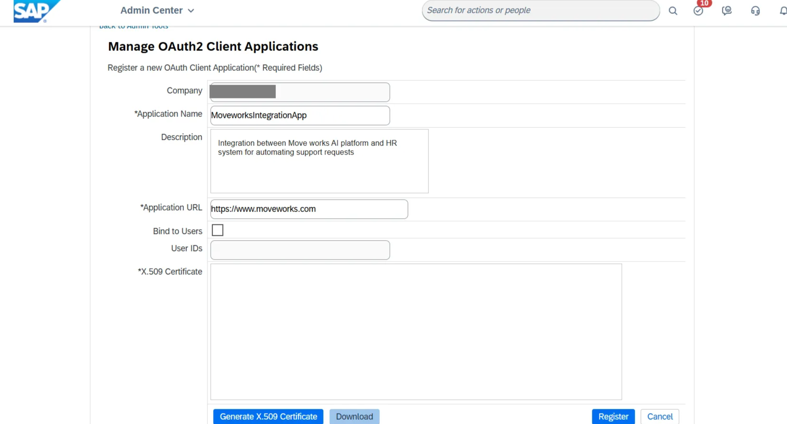

# Introduction:

SAP SuccessFactors is a cloud-based human resources (HR) management solution, empowering businesses with data-driven insights to optimize talent management, employee engagement, and overall workforce performance.

This guide will demonstrate how to connect SAP Success Factors to Agent Studio. In doing so, there are two ways you can proceed:
1. [Webhook Connection](https://marketplace.moveworks.com/connectors/sap-success-factors#Webhook-Connection) - This is best when building ambient agents that are trigged from a system event inside of SAP Success Factors. 
2. [OAuth 2.0 Client Credentials](https://marketplace.moveworks.com/connectors/sap-success-factors#Client-Credentials) - This is best when you want to build user trigged agents that connect to SAP Success Factors.


# Webhook Connection

# Client Credentials
# **Prerequisites:**

- Ensure you have **admin privileges** in SAP SuccessFactors to create an OAuth application and manage permissions.
- Detailed instructions on generating an OAuth access token are available in the official SAP SuccessFactors documentation [here](https://help.sap.com/docs/successfactors-platform/sap-successfactors-api-reference-guide-odata-v2/restricting-access).
- Ensure you are using **Java 8 or later** for generating the SAML Assertion. If you encounter errors, update your JDK or install the Sap Machine JDK from [here](https://sap.github.io/SapMachine/#download).
- **Apache Maven** downloaded and extracted to your local drive (e.g., extracted to the C drive). You can download it from [here](https://maven.apache.org/download.cgi).

# **Set up SAP SuccessFactors**

To connect SAP SuccessFactors with Agent Studio, we’ll use OAuth2 with the Client Credentials Flow. You’ll need to register an application in SAP SuccessFactors and obtain the following credentials:

- **Company ID**
- **Client ID**
- **Assertion** (Base64-encoded SAML assertion, generated after registering the application)

The following steps will walk you through how to register an OAuth application in SAP SuccessFactors, generate the required assertion, and authenticate to get an access token. This token is essential to securely interact with the SAP SuccessFactors APIs and set up the connector within Agent Studio

## **Step 1: Register the Application in SAP SuccessFactors**

### 1. Access API Center

- Log into SAP SuccessFactors as an administrator, navigate to the Admin Center, and search for API Center


### 2. Register OAuth Client

- Select OAuth Configuration for OData and click on "Register Client Application.”


### **3. OAuth Client Application Setup:**

- **Company:** `moveworks-example-company` *(Prefilled based on the logged-in instance)*
- **Application Name:** `MoveworksIntegrationApp` *(Required - Unique name for your OAuth client)*
- **Description:** `Integration between Moveworks AI platform and HR system for automating support requests.` *(Optional - Brief description)*
- **Application URL:** `https://www.moveworks.com`
- **Bind to Users:** `Yes` *(Optionally restrict access to specific users)*
    - **User IDs:** `user1, user2, user3` *(Comma-separated user IDs if binding is enabled)*
    
    
    

### **4. X.509 Certificate Setup for OAuth Application:**

- **Navigate to:** Manage OAuth2 Client Applications in SAP SuccessFactors.
- **Click on:** Generate for a new X.509 Certificate.
- **Fill in Required Fields:**
    - **Common Name (CN):** Example: `moveworks-integration-cert` (Required field)
- **Optional Fields:**
    - **Enable validity check:** Check based on your preference.
- **Generate and Download:** Generate the certificate and use the Base64-encoded string for OAuth registration.


- **Click the Register button** to complete the OAuth client application registration

### 5. After registering the OAuth client application:

- **Click on the View button**: This will display the API Key associated with your newly registered application.
- **Use the API Key as Client ID**: Copy the generated API Key, as it will serve as the Client ID for authenticating the client application during integration


## **Step 2: Generating a SAML Assertion for SAP SuccessFactors API:**

**IMPORTANT NOTES:**

- **Java Version:** Ensure Java 8 or higher. If you face errors, update your Java JDK or install Sap Machine JDK.
    - [Download Sap Machine JDK](https://sap.github.io/SapMachine/#download)
- **Security:** This KBA is for demonstration purposes only. SAP is not responsible for security when using the sample code in production environments.
- **SAML Expiry:** By default, the SAML assertion expires in 10 minutes. You can adjust the expiry as needed (in minutes).
- **User ID/Username:** You can use either `userId` or `userName`, but not both simultaneously.

### **Steps to Generate a SAML Assertion:**

1. **Download and Set Up Maven:**
    - Download Apache Maven from [here](https://maven.apache.org/download.cgi), extract it locally.
    - Set up environment variables for Java and Maven on your system.
2. **Validate Java and Maven Installation:**
    - Open **Command Prompt** and check Java with:
        
        `echo %JAVA_HOME%`
        
        
        
    - Check Maven with:
        
        `mvn -v`
        
        
        
3. **Download the SAML Assertion Tool:**
- Go to the **attachment section** of this KBA or use the following link to download the zip file containing the SAML Assertion tool:  [Download SAML Assertion Tool](https://me.sap.com/notes/3031657).
1. **Edit SAMLAssertion.properties:**
- Open the `SAMLAssertion.properties` file.


- Fill in the required fields:
    - `tokenUrl`:  The full URL to the token endpoint of your SAP SuccessFactors API server. This is constructed by appending `/oauth/token` to your instance-specific API server URL.
    
    **Example:**
    
    ```bash
    https://<your-api-server-url>/oauth/token
    ```
    
    - For a complete list of SAP SuccessFactors API servers by region and environment, refer to the [SAP API Server Directory](https://help.sap.com/docs/successfactors-platform/sap-successfactors-api-reference-guide-odata-v2/list-of-sap-successfactors-api-servers).
    
    ### Additional Guidance on API Servers
    
    - Use the correct server URL for your instance to avoid authentication and connectivity issues.
    - SAP does **not** support IP addresses in endpoint URLs as part of its reference architecture. Always use domain names.
    
    ### Common Endpoint Patterns
    
    
    
    - **Tip:** To find your instance-specific information (such as API server region and version), log into your SAP SuccessFactors account, click your profile in the top header, and select **Show version information**.
    - `clientId`: The API Key from your SF OAuth registration.
    - `userId` or `userName`: Choose one based on your setup.
    - `privateKey`: X.509 private key.
    - `expireInMinutes`: Set the expiry time (default is 10 minutes).
    
    
    
1. **Generate the SAML Assertion:**
    - Open **Command Prompt** in the folder containing the files.
    - Run the command:
        
        `mvn compile exec:java -Dexec.args="SAMLAssertion.properties"`
        
    
    
    
2. **Save the Generated SAML Assertion:**
    - After running the command, the SAML assertion is generated. Copy and securely store it for OAuth integration
    
    
    

## **Step 3:** Requesting an Access Token

- Use a **POST** request to the URI: `https://<API-Server>/oauth/token`
- **Authentication**: No authentication required
- **Headers**:
    - `Content-Type: application/x-www-form-urlencoded`

**Request Body**:

- `company_id`: Your company ID (Required)
- `client_id`: API key from OAuth registration (Required)
- `grant_type`: Set to `urn:ietf:params:oauth:grant-type:saml2-bearer` (Required)
- `assertion`: Base64-encoded SAML assertion (Required)
- When authentication is successful, the API response will return an **access token**, **token type**, and **expiration time**. Use the access token for authorized API requests


```bash
curl --location 'https://<API_SERVER_DOMAIN>/oauth/token' \
--header 'Content-Type: application/x-www-form-urlencoded' \
--data-urlencode 'company_id=<COMPANY_ID>' \
--data-urlencode 'client_id=<CLIENT_ID>' \
--data-urlencode 'grant_type=urn:ietf:params:oauth:grant-type:saml2-bearer' \
--data-urlencode 'assertion=<SAML_ASSERTION>'
```
- By importing the cURL request into Agent Studio during action creation, you can directly retrieve the access token as part of your workflow, making it easier to integrate and automate the process

## **Step 4: Integrate with Agent Studio**

In Agent Studio, create a new connector with the following configuration (please name it accordingly for easy identification while creating use cases):

1. **Auth Config:**
    - OAuth2
2. **OAuth2 Grant Type:**
    - Client Credentials Grant
3. **Client ID:**
    - Use the API key generated when you register the application in SAP SuccessFactors.
4. **OAuth2 Token URL:**
    - [https://<API_SERVER_DOMAIN>/oauth/token](https://apisalesdemo8.successfactors.com/oauth/token)
5. **OAuth2 Client Authentication:**
    - OAuth 2.0 with Request Body
6. **Custom Grant Type (optional):**
    - urn:ietf:params:oauth:grant-type:saml2-bearer
7. **OAuth2 Custom OAuth Request Options - Additional Request Data:**
    - company_id: {{your_company_id}}
    - assertion: {{generated_saml_assertion}}
8. Click on **Save** to submit the credentials, and your connector will be ready

```bash
curl --location 'https://<API_SERVER_DOMAIN>/rest/timemanagement/absence/v1/timeAccountBalances?%24at=2020-03-17' \
--header 'Authorization: Bearer <ACCESS_TOKEN>' \
--header 'Accept: application/json'

```

## **Step 5: Integrate SAP SuccessFactors API in Agent Studio**

- Add your API details below to integrate with the SAP SuccessFactors API. You can read more about setting up API actions in the [API configuration reference](https://help.moveworks.com/docs/http-action-data-bank-legacy).

```bash
curl --location 'https://<API_SERVER_DOMAIN>/rest/timemanagement/absence/v1/timeAccountBalances?%24at=2020-03-17' \
--header 'Authorization: Bearer {{generated_access_token}}' \
--header 'Accept: application/json'
```

- **API Endpoint Path:**
    
    `/rest/timemanagement/absence/v1/timeAccountBalances`
    
- **Method:**
    
    `GET`
    
- **Query Parameters:**
    
    `?%24at=2020-03-17`
    


# **Congratulations!**

You've successfully integrated the **SAP SuccessFactors API** with Agent Studio. You can now start using it for your specific use cases
