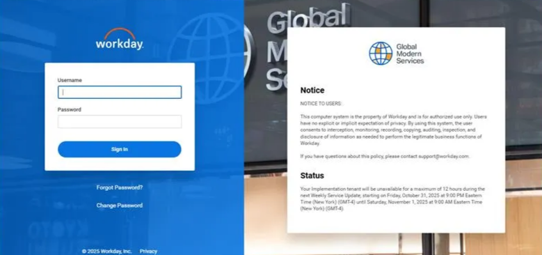

# **Introduction**

Workday is a cloud-based software vendor that specializes in human capital management (HCM), enterprise resource planning (ERP), and financial management applications.

Workday supports various kinds of web service technologies including the ReST API, SOAP API and the RaaS API.

- **SOAP Web Services API**: Workday Web Services (WWS) provide a programmatic public API for Workday's business management services. The SOAP-based interface is targeted for import and export of large volumes of data needed for integration with enterprise business systems external to Workday. Learn more about it [here](https://community-content.workday.com/en-us/reference/products/platform-and-product-extensions/integrations/soap-web-services-api.html).
- **REST API**: The Workday REST API is an addition to the SOAP APIs supported by Workday. It is targeted for applications that do small, typically self-service, transactions initiated by users and provides a subset of Workday functionality crafted for that specific enterprise audience. Learn more about it [here](https://community-content.workday.com/en-us/reference/products/platform-and-product-extensions/integrations/rest-api.html).
- **Reports as a Service (RaaS) API**: The RaaS API enables us to access advanced and search reports as web services. These reports can be built in the Workday Portal and further consumed via the RaaS API for fetching data. Learn more about it [here](https://doc.workday.com/admin-guide/en-us/reporting-and-analytics/custom-reports-and-analytics/reports-as-a-service-raas-/dan1370796320263.html).
- **Workday Query Language (WQL)**: WQL enables you to use SQL-like syntax to access Workday data using data sources and fields instead of reports. It allows you to query Workday for data and explore data sources, filters, and fields. Learn more about it [here](https://doc.workday.com/admin-guide/en-us/reporting-and-analytics/custom-reports-and-analytics/workday-query-language-wql-/aht1611188422513.html?toc=1.20.0).

This guide will walk you through creating a connector within Agent Studio to make API calls to Workday where you can leverage any of the above types of web service and connect it to Moveworks. The guide has two main sections:

- [**OAuth 2.0 with Client Credentials Grant Setup**](https://marketplace.moveworks.com/connectors/workday#OAuth-2.0-with-Client-Credentials-Grant-Setup)
- [**OAuth 2.0 with Authorization Code (User Consent Auth) Setup**](https://marketplace.moveworks.com/connectors/workday#OAuth-2.0-with-Authorization-Code-(User-Consent-Auth)-Setup)

# **Prerequisites**

- Workday account with admin privileges so we can create an API account
- [Install Postman](https://www.postman.com/downloads/) for testing the API connection

# OAuth 2.0 with Client Credentials Grant Setup

To connect to Workday from within Agent Studio, we are going to be using [OAuth2 with the Refresh Token](https://oauth.net/2/grant-types/refresh-token/). This requires a client_id, a client_secret and a refresh_token. 

### Walkthrough

The following steps will guide you through setting up a user and generating the necessary credentials to configure the connector in Agent Studio:

1. Create an Integration Systems User (ISU)
2. Create Security Group
3. Add ISU to Security Group
4. Add Domain Security Policies to the Integration Systems Security Group
5. Create API Client for Integrations
6. Provision a Refresh Token for the ISU

## Step 1: Create Integration System User (ISU)

The first step is to create an Integration System User, this user can be used for all integration requests to the back-end API.

Use the universal search to find the **`Create Integration System User`** (ISU) Workday Task


Use the **`Create Integration System User`** (ISU) Workday Task to create a user following these settings. Write down the username and password that you use.


Validate that the ISU has these default permissions after creation.


---

## Step 2: Create Security Group

Next we need to create a security group that we can put users into for integrations.

Access **`Create Security Group`** task (from Workday’s Universal Search) and create an **`Integration System Security Group (Unconstrained)`**.


Call the Integration Systems Security Group name **`Moveworks ISSG`**


## Step 3: Add Integration Systems User to Security Group

We need to add our new user to the new security group we created.

Use the **`All Workday Accounts`** report to find the account again.


Click on **`Security Profile`** > **`Assign Integration System Security Groups`**


Assign the ISU to the ISSG


## Step 4: Add Domain Security Policies to the Integration Systems Security Group

We need to give the appropriate permissions to this security group so that we can call the api and any reports therein. By default, we just add everything but you may want to limit your api calls to only certain aspects of Workday.

Navigate to the ISSG using the **`View Security Group`** Report


Use the menu item to access **`Security Group`** > **`Maintain Domain Permissions for Security Group`**


Add the permissions that are needed for your Workday integration / use case. Permissions will vary per plugin guide. For example, permissions for time off and leave of absence are specified [here](https://help.moveworks.com/docs/workday-access-requirements#permissions). 

Click Ok.


> Note: These Domain Permissions are dependent on the Workday Use Case that you are interested in building and can heavily differ based on that. For example, if the Workday Use Case you are working on requires the use of Workday Query Language for fetching/updating any data, then you would need to assign both the **View** and **Get** permissions or **Modify** and **Put** for the `Workday Query Language` Domain security policy. Similarly, if the Use Case requires access to certain objects like Accounts or Worker Time-Off details, then you would also have to assign those security policies accordingly.

Run the **`Activate Pending Security Policy Changes`** task to activate permissions


## Step 5: Create API Client for Integrations

Universal search for **`Register API Client for Integrations`**


Set the name to **Moveworks** and add the scopes required.


Note your **`Client ID`** & **`Client Secret`**


Navigate to **`View API Clients`**. Note the **`Token Endpoint`** and **`Workday REST API Endpoint`**


## Step 6: Provision a Refresh Token for the ISU

From the **`View API Clients`** view, click on the **`API Clients for Integrations`** tab. Pick out the API Client you just created


From the related actions menu, select **`Manage Refresh Tokens for Integrations`**


Add the ISU Account you created earlier to the API Client


Select **`Generate Refresh Token`**


Note your  new refresh token.


## Test the Connection

To test the connection, we need to first use the client_id and client_secret against the token api to get a bearer token. We then use that bearer token to run a query against the api.

We will use Postman to run these queries.

### Get a Bearer Token in Postman

1. Set up your request to import into Postman with your `CLIENT_ID`, `CLIENT_SECRET` and `REFRESH_TOKEN`.Feel free to replace the base URL with your instance's base URL.
    
    ```bash
    curl -X POST -H "Content-Type: application/x-www-form-urlencoded" -d "client_id=YOUR_CLIENT_ID&client_secret=YOUR_CLIENT_SECRET&grant_type=refresh_token&refresh_token=YOUR_REFRESH_TOKEN" https://wd2-impl-services1.workday.com/ccx/oauth2/YOUR_TENANT_NAME/token
    ```
    
2. Import this request into Postman by clicking `file` -> `import`.

    

3. Notice that the url and properties are filled in automatically. Execute by clicking `send`

    
    
4. If the execution is successful, you should see an access_token in the response.


    
Copy the access_token string for the next step, note that some of the access_token is blurred out in the screenshot for security purposes!


### Test a Query
 This is a simple WQL query to get five employees (in no particular order) from Workday.

---
****NOTE:****

This query works because you gave our user access to Workday Query Language and Worker Data in [step 4](#step-4:-add-domain-security-policies-to-the-integration-systems-security-group)

---

1. Set up your request to import into Postman with your `TENANT_NAME` and `BEARER_TOKEN` in the below with the values from previous steps. Feel free to replace the base URL with your instance's base URL:

```bash
curl --location 'https://wd2-impl-services1.workday.com/ccx/api/wql/v1/YOUR_TENANT_NAME/data?limit=5&offset=0' \
--header 'Content-Type: application/json' \
--header 'Authorization: Bearer YOUR_BEARER_TOKEN' \
--data '{
    "query": "SELECT worker, fullName, employeeID  FROM allActiveEmployees"
}'
```

2. Import into Postman as you did in the previous section by going to `file` -> `import` and pasting your curl command

3. Confirm the values have been filled in properly by the import, if they have, you can run the command by hitting `send`

The above command should return the top five employees in your Workday database. If successful, you are done with the hardest part of connecting Agent Studio to Workday! 


Next, let's take the above and create a connector within Agent Studio so we can query directly from within Moveworks.

# Create a Connector and Test in Agent Studio

Now that we have created everything within Workday and Postman, we can configure the connector on Agent Studio.

## Create a Connector (Oauth 2.0)

1. Go to HTTP Connectors and click on Create.

2. Create a new connector 'Workday' with the following configurations:

    - Base Url: `YOUR_BASE_URL` (Example: https://wd2-impl-services1.workday.com`)
    - Auth Config: `Oauth2`
    - Oauth2 Grant Type: `Refresh Token Grant`
    - Client ID: `YOUR_CLIENT_ID`
    - Client Secret: `YOUR_CLIENT_SECRET`
    - Refresh Token Grant Refresh Token: `YOUR_REFRESH_TOKEN`
    - Oauth2 Token Url: `YOUR_TOKEN_URL` (Example : https://wd2-impl-services1.workday.com/ccx/oauth2/YOUR_TENANT/token)

    
    
    Fill in the above for the connection information while replacing YOUR_BASE_URL, YOUR_CLIENT_ID, YOUR_CLIENT_SECRET, YOUR_REFRESH_TOKEN, YOUR_TOKEN_URL and YOUR_TENANT_NAME with the values from the above steps where you set up the Workday connection.

3. Click Save

## Test the Connection

1. To test the connector, let's create a HTTP Action in Agent Studio. Navigate to HTTP Actions and click on Create. You can find more details on HTTP Actions [here](https://help.moveworks.com/docs/http-actions).

2. To test the same command from the eariler section, you can import the curl command in the HTTP Action. Replace <YOUR_TENANT_NAME> with your tenant in the action.

    ```bash
    curl --location 'https://wd2-impl-services1.workday.com/ccx/api/wql/v1/YOUR_TENANT_NAME/data?limit=5&offset=0' \
    --header 'Content-Type: application/json' \
    --header 'Authorization: Bearer YOUR_BEARER_TOKEN' \
    --data '{
        "query": "SELECT worker, fullName, employeeID  FROM allActiveEmployees"
    }'
    ```

    
    
3. Under connector, click on 'Inherit from Existing Connector' and choose the newly created Workday connector.

    

4. Click test. If you get the same output from your curl command, you have successfully created a connector into Workday and tested it! 

# **Congratulations!**

You've successfully integrated Workday's API with Agent Studio. This opens up a variety of automation and integration possibilities to Workday.


# **OAuth 2.0 with Authorization Code (User Consent Auth) Setup**

To connect to Workday from within **Agent Studio** using user-consent-based authentication, configure the **OAuth 2.0 with Authorization Code (User Consent)** flow.

This ensures that Workday users explicitly authorize Moveworks before API actions are performed on their behalf.

## **Walkthrough**

Follow these steps to set up and validate your connection:

1. Log in to Workday
2. Register a new API Client
3. Configure API Client Details
4. Generate Authorization Code
5. Integrate with Agent Studio
6. Test the Connector in Agent Studio

## **Step 1: Log in to Workday**

- Go to the Workday login page and sign in with your credentials.
- Ensure you log in with an Admin account — only admins can register OAuth clients.

Note: OAuth client registration must be performed by a Workday admin.


## **Step 2: Register API Client**

- In the Workday search bar, search for **`Register API Client`** and click on the task to open the registration form


## **Step 3: Configure API Client Details**

In the **Register API Client** form, fill in the following details:

- **Client Name:** Enter a unique name, for example `{{YOUR_CLIENT_NAME}}`.
- **Client Grant Type:** Select **Authorization Code Grant**.
- **Access Token Type:** Choose **Bearer**.
- **Redirect URI:** Enter your Moveworks redirect URL, for example `{{YOUR_REDIRECT_URI}}`.
- **Refresh Token Timeout (Days):** Set this to **100**.
- **Scope:** Select the scopes based on your use case. For example, to fetch - Supplier Invoice Requests (supplierInvoiceRequests), include the Workday scopes that allow the user to view supplier invoices and related procurement data.

Here are some example scopes:

- **Supplier Accounts** – allows viewing supplier account-related information.
- **Suppliers** – allows viewing supplier profiles and related data.
- **Procurement** – allows viewing procurement objects such as supplier-related transactions.

Click **OK** after filling in all required details to save the configuration.


- Workday will generate your **Client ID** and **Client Secret** — make sure to save them safely for later use.


## **Step 4: Generate Authorization Code**

To obtain the **authorization code**, use the following URL structure:

```bash
https://{AUTH_DOMAIN}/{TENANT}/authorize?
response_type=code&
client_id={{CLIENT_ID}}&
redirect_uri={{REDIRECT_URI}}&
scope=openid%20workday:read
```

### How to Retrieve the Authorization Code:

1. Open the above URL in your browser.
2. Log in using your Workday credentials.
3. Approve the consent request for Moveworks Agent Studio.
4. You’ll be redirected to your configured **Redirect URI** with a `code` parameter, for example:


5. Copy the **authorization code** (for example, `{{authorization_code}}`) — you’ll use this in the connector setup within **Agent Studio**

After obtaining the **authorization code**, make sure to **save it securely** together with your **Client ID**, **Client Secret**, and **Redirect URI**, as these will be required when setting up the **Workday User Consent Authentication Connector** in **Agent Studio**

## **Step 5: Integrate with Agent Studio**

In **Agent Studio**, create a new connector with the following configuration:

**Connector Name:** `{{Connector_Name}}`

**Display Name:** `{{Display_Name}}`

**Display Description:** This connector facilitates secure, user-authorized access to the Workday API using User Consent Authentication.

**Base URL:** `https://{WORKDAY_BASE_URL}`

**Auth Config:** OAuth2

**OAuth2 Grant Type:** Authorization Code Grant

**Authorization URL:** `https://{WORKDAY_AUTH_URL}/{{CLIENT_NAME}}/authorize`

**Client ID:** `{{CLIENT_ID}}`

**Client Secret:** `{{CLIENT_SECRET}}`

**Authorization Code Grant Scope:** `openid workday:read`

**OAuth2 Token URL:** `https://{WORKDAY_AUTH_URL}/ccx/oauth2/{{CLIENT_NAME}}/token`

**OAuth2 Client Authentication:** OAuth 2.0 with Request Body

**OAuth2 Custom OAuth Response Type:** JSON

**Additional Headers:** `Content-Type: application/x-www-form-urlencoded`

**Additional Request Data:**

- `client_id`: `{{CLIENT_ID}}`
- `client_secret`: `{{CLIENT_SECRET}}`
- `redirect_uri`: `{{REDIRECT_URI}}`
- `grant_type`: `authorization_code`
- `response_code`: `code`
- `scope`: `openid workday:read`

Once all fields are completed, click **Save** to create and store your connector configuration.

## **Step 6: Test the Connector in Agent Studio**

Set up your API. You can read more about setting up API actions from our **API Configuration Reference**.

Use this API call to make sure **User Consent Authorization (UCA)** is working and that data is returned based on the logged-in user’s Workday access.

Note : While testing the connector, make sure to log in as a regular Workday user instead of the admin to validate UCA behavior.

```bash
curl --location 'https://{API_SERVER_DOMAIN}/ccx/api/accountsPayable/v1/{{TENANT}}/supplierInvoiceRequests' \
--header 'Accept: application/json' \
--header 'Authorization: Bearer {{generated_bearer_token}}'

```

**API Endpoint Path:**

`/ccx/api/accountsPayable/v1/{{TENANT}}/supplierInvoiceRequests`

**Method:**

`GET`

**Headers:**

- `Content-Type`: `application/json`
- `Accept`: `application/json`

**Tenant Configuration:**

All Workday API endpoints in this plugin use **`TENANT`** as a placeholder. After installation, replace **`TENANT`** in the action definitions with your actual Workday tenant name.

To find your tenant name:

- Log into Workday.
- Check the URL in your browser — the tenant name appears after `workday.com/`, e.g.:
    
    `https://impl.workday.com/**your_tenant**/...`
    

### **Test Your Setup:**

1. In **Agent Studio**, create and run a new **Action**.
2. Import the above **cURL command**.
3. Add the **Workday User Consent Auth Connector**.
4. Click **Test → Generate New Access Token**.
    - Ensure you are acting on behalf of the **intended user** before generating the token.
    - Only then will it return data specific to that user’s Workday permissions.
    
    
    

### **Establish a Connection Between Your UCA Connector and Agent Studio**

- Integrate Your UCA Connector with Agent Studio


- Next, you will be redirected to the **Workday login page**.



- If you log in as an **admin**, you’ll have access to all request data, while a **regular user** will only see data assigned to them
- After logging in successfully, click **Allow** to generate the **authorization code**.


- Once you click **Allow**, you will receive a notification from the **Moveworks bot** confirming that it has access to perform actions on your behalf


### **Verify UCA Functionality**

- Click **Test** to verify that **User Consent Authentication (UCA)** is working correctly.
- The action (e.g., Get Supplier Invoice Requests) should use the logged-in user’s token to return only the records accessible to that user — confirming that **user-specific consent and permissions** are set up properly within Workday.


# **Congratulations!**

You’ve successfully integrated **Workday’s API** with **Agent Studio** using **OAuth 2.0 (User Consent Auth)**, enabling secure user-level authentication and access to Workday data based on user consent within your Workday instance