# Introduction

Salesforce is a CRM platform, and the "**Look Up Call Notes using Opportunity in Salesforce**" plugin helps you efficiently retrieve Opportunity details from your Salesforce account. By integrating this feature with your bot, users can quickly access and manage Opportunity information, enhancing productivity and organization.

This guide will show you how to add the "**Look Up Call Notes using Opportunity in Salesforce**" feature to your bot using Creator Studio. Let's get started!

# Prerequisites

- [Postman](https://www.postman.com/) or and API testing tool.
- Salesforce Connector built in Creator Studio (follow the [Salesforce Authentication](https://developer.moveworks.com/creator-studio/resources/connector/?id=salesforce) guide to create your connector)

# What are we building?

### **Conversation Design**

This [purple chat](https://developer.moveworks.com/creator-studio/developer-tools/purple-chat-builder/?workspace=%7B%22title%22%3A%22My+Workspace%22%2C%22botSettings%22%3A%7B%22name%22%3A%22%22%2C%22imageUrl%22%3A%22%22%7D%2C%22mocks%22%3A%5B%7B%22id%22%3A2769%2C%22title%22%3A%22New+Mock%22%2C%22transcript%22%3A%7B%22messages%22%3A%5B%7B%22from%22%3A%22USER%22%2C%22text%22%3A%22%3Cp%3EI+want+to+look+up+the+call+notes+for+the+opportunity+with+XYZ+Inc.%3C%2Fp%3E%22%7D%2C%7B%22from%22%3A%22ANNOTATION%22%2C%22text%22%3A%22%3Cp%3E%E2%9C%85+Working+on+%3Cb%3ESalesforce+-+Call+Notes%3C%2Fb%3E%3Cbr%3E%E2%8F%B3+Calling+Plugin+%3Cb%3ESalesforce+-+Opportunity+Call+Notes%3C%2Fb%3E%3C%2Fp%3E%22%7D%2C%7B%22from%22%3A%22BOT%22%2C%22text%22%3A%22Here+are+the+call+notes+for+the+opportunity+with+XYZ+Inc.%3A%3Cbr%3E%3Cb%3EOpportunity+Name%3A%3C%2Fb%3E+XYZ+Inc+Expansion%3Cbr%3E%3Cb%3ELast+Call+Date%3A%3C%2Fb%3E+2023-10-01%3Cbr%3E%3Cb%3ENotes%3A%3C%2Fb%3E+Discussed+project+scope%2C+budget%2C+and+timeline.+Client+interested+in+moving+forward+pending+final+review.%3Cbr%3EWould+you+like+to+take+any+action+on+these+call+notes+in+Salesforce%3F%22%7D%2C%7B%22from%22%3A%22BOT%22%2C%22text%22%3A%22%3Cp%3EChoose+an+action+for+these+call+notes%3A%3Cbr%3E%3C%2Fp%3E%22%2C%22cards%22%3A%5B%7B%22title%22%3A%22%3Cp%3ECall+Notes+Actions+in+Salesforce%3Cbr%3E%3C%2Fp%3E%22%2C%22text%22%3A%22%3Cp%3EManage+these+call+notes+directly+in+Salesforce.%3Cbr%3E%3C%2Fp%3E%22%2C%22buttons%22%3A%5B%7B%22style%22%3A%22PRIMARY%22%2C%22text%22%3A%22Open+in+Salesforce%22%7D%2C%7B%22text%22%3A%22Add+New+Note%22%7D%2C%7B%22text%22%3A%22Nothing+for+now%22%7D%5D%7D%5D%7D%5D%2C%22settings%22%3A%7B%22colorStyle%22%3A%22LIGHT%22%2C%22startTime%22%3A%2211%3A43%2BAM%22%2C%22defaultPerson%22%3A%22GWEN%22%2C%22editable%22%3Atrue%2C%22botName%22%3A%22%22%2C%22botImageUrl%22%3A%22%22%7D%7D%7D%5D%7D) shows the experience we are going to build.

# **Creator Studio Components**

- **Triggers**:
    1. Natural Language
- **Slots**:
    1. Fetch Salesforce Opportunity ID using the Account name.
    2. Retrieve Call Notes related to the Opportunity Id.
- **Actions:**
    1. **Retrieve Opportunity ID using Account Name:**
        - Query the **Opportunity ID** for the specified **Account Name**, ensuring the most recent opportunity is fetched.
    2. **Retrieve Call Notes using Opportunity ID:**
        - Use the **retrieved Opportunity ID** to fetch the **latest Call Notes** (stored as tasks) associated with that opportunity.
- **Guidelines**:
    1. None.

# API Research

To retrieve **Call Notes** related to an **Opportunity**, we will use two APIs:

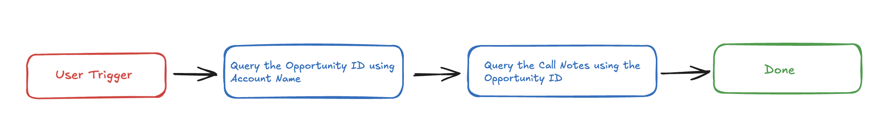

## API #1: Query Opportunity ID using Account Name

The **Retrieve [Opportunity ID by Account Name](https://developer.salesforce.com/docs/atlas.en-us.object_reference.meta/object_reference/sforce_api_objects_opportunity.htm)** API fetches the **Opportunity ID** for a given **Account Name**. This allows us to look up opportunities associated with a specific Salesforce account.

- **Purpose**:
    - Retrieves the **Opportunity ID** based on the provided **Account Name**.
    - Ensures the most recent opportunity is fetched by sorting **CloseDate DESC**.
- **Features**:
    - Filters opportunities using **Account Name**.
    - Returns the **most recent** opportunity by default.
    - Can be customized to retrieve multiple opportunities if needed.
- **Example**: Queries Salesforce to retrieve Call Notes from Opportunity for the specified **Account Name.**

```yaml
curl --request GET
--location 'https://<YOUR_DOMAIN>/services/data/v62.0/query?q=SELECT%20Id%20FROM%20Opportunity%20WHERE%20Account.Name%20like%20%3C<ACCOUNT_NAME>%3E%20ORDER%20BY%20CloseDate%20DESC%20LIMIT%201' \
--header 'Content-Type: application/json'
```

- **<YOUR_DOMAIN>**: Your Salesforce instance domain (e.g., yourcompany.my.salesforce.com).
- **<ACCOUNT_NAME>**: The name of the account used to look up Opportunity information in Salesforce.

## API #2: Query Call Notes using Opportunity ID

The **Retrieve [Call Notes by Opportunity ID](https://developer.salesforce.com/docs/atlas.en-us.object_reference.meta/object_reference/sforce_api_objects_task.htm)** API fetches **Call Notes** (stored as **Tasks**) associated with a given **Opportunity** in Salesforce. This API helps retrieve call summaries linked to specific opportunities.

- **Purpose:**
    - Fetches **Call Notes** linked to a specific **Opportunity ID**.
    - Returns the **most recent call note** by default.
- **Features**:
    - Filters tasks by **Opportunity ID (0064W00001LFvOLQA2)**.
- **Example**: Queries Salesforce to retrieve Call Notes from the given Opportunity ID

```yaml
curl --request GET
--location 'https://<YOUR_DOMAIN>./services/data/v62.0/query?q=SELECT%20Id%2C%20Subject%2C%20Description%2C%20ActivityDate%20FROM%20Task%20WHERE%20WhatId%20%3D%20%<OPPORTUNITY_ID>%27%20' \
--header 'Content-Type: application/json'
```

- **<YOUR_DOMAIN>**: Your Salesforce instance domain(e.g., yourcompany.my.salesforce.com).
- **<OPPORTUNITY_ID>**: The ID of the opportunity used to look up Call Note in Salesforce.

# Steps

## **Step 1: Build HTTP Action**

Define your HTTP Actions for fetching the **Account ID** from Salesforce based on the provided **Account Name**.

### 1. Get the Opportunity ID using the Account Name

- Navigate to **Plugins** section > **Actions** tab.
- Click on **CREATE** to define a new action.
    
    
    

- Click on the IMPORT CURL option and paste the following cURL command:

```yaml
curl --request GET
--location 'https://<YOUR_DOMAIN>/services/data/v62.0/query?q=SELECT%20Id%20FROM%20Opportunity%20WHERE%20Account.Name%20like%20%3C<ACCOUNT_NAME>%3E%20ORDER%20BY%20CloseDate%20DESC%20LIMIT%201' \
--header 'Content-Type: application/json'
```

- Click on Use Existing Connector > select the [Salesforce Connector](https://developer.moveworks.com/creator-studio/resources/connector/?id=salesforce) that you just created > Click on Apply. This will populate the Base URL and the Authorization section of the API Editor.
- **Query Parameters for Salesforce Opportunity Query**
- **Key ( q )**: Value (SELECT Id FROM Opportunity WHERE Account.Name like <ACCOUNT_NAME> ORDER BY CloseDate DESC LIMIT 1)
- This query used to get the Opportunity ID of the given Account Name.
    
    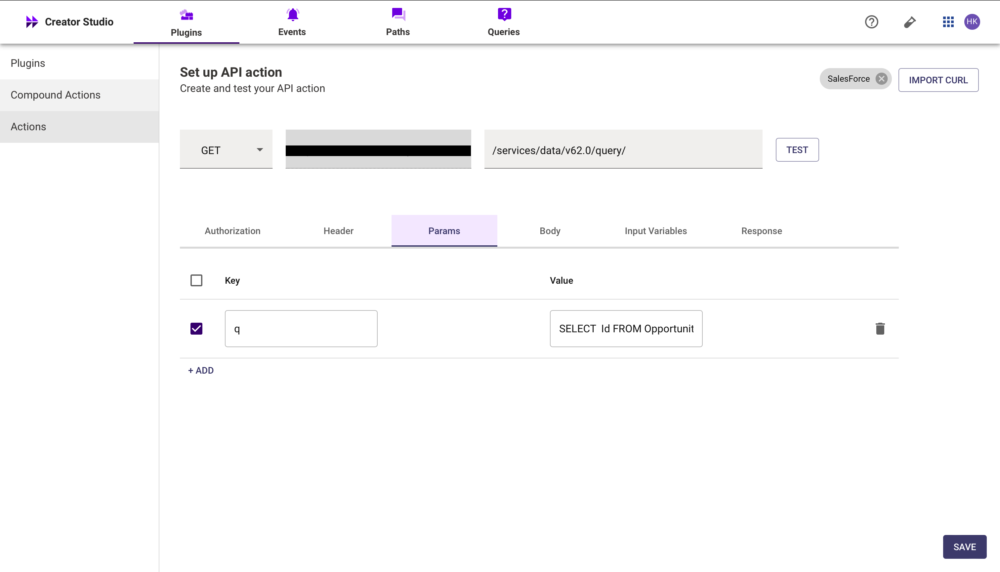
    
- **Input Variables** :
    
         Name : Example Value (Acme Corp).
    
    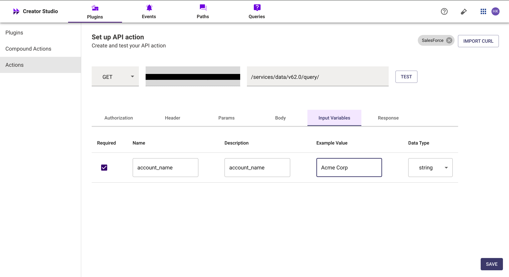
    
- Click on Test to check if the Connector setup was successful and expect a successful response as shown below. You will see the request response on the left side and the generated output schema on the right.
- If the output schema does not match the API response or fails to populate automatically, kindly click the GENERATE FROM RESPONSE button to refresh and align the schema with the API response.
    
    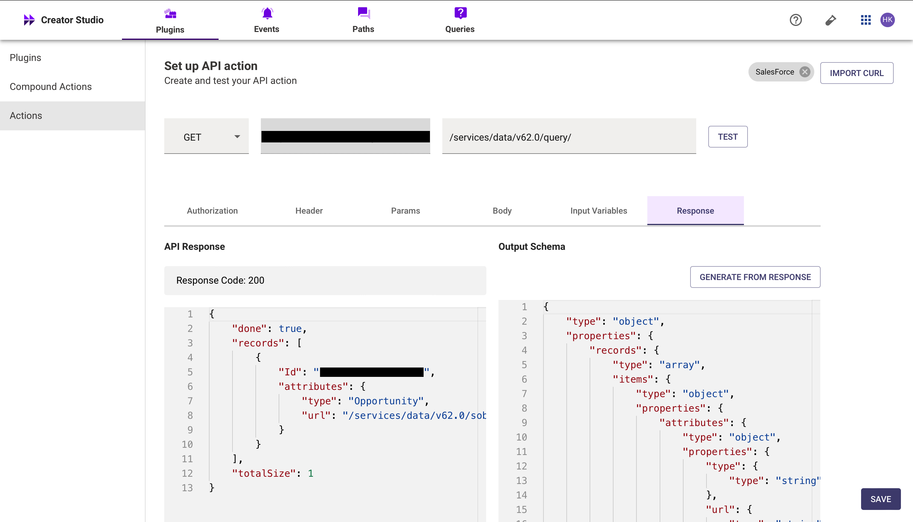
    
- Add the **API Name** and **API Description** as shown below, then click the Save button
    
    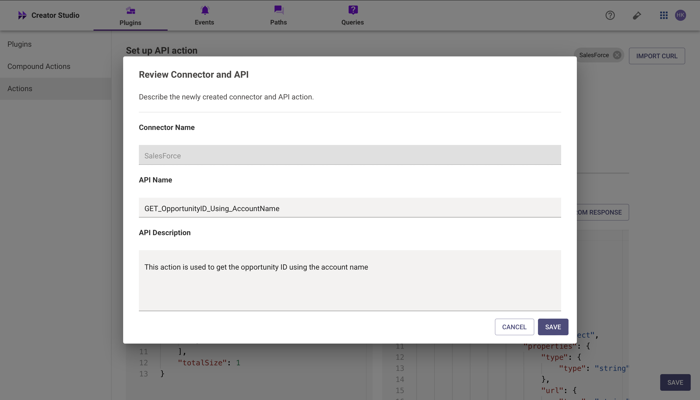
    

### **2.Get Call Notes from the Account Name**.

- Repeat the steps above to create another action.
- Click on the IMPORT CURL option and paste the following cURL command:
    
    ```yaml
    curl --location '<YOUR_DOMAIN>./services/data/v62.0/query?q=SELECT%20Id%2C%20Subject%2C%20Description%2C%20ActivityDate%20FROM%20Task%20WHERE%20WhatId%20%3D%20%<OPPORTUNITY_ID>%27%20' \
    --header 'Authorization: Bearer\
    --header 'Content-Type: application/json'
    ```
    
- **Input variables:**
    - Opportuniy_Id: Example value (006IU00100kYJwFYAZ)
    
    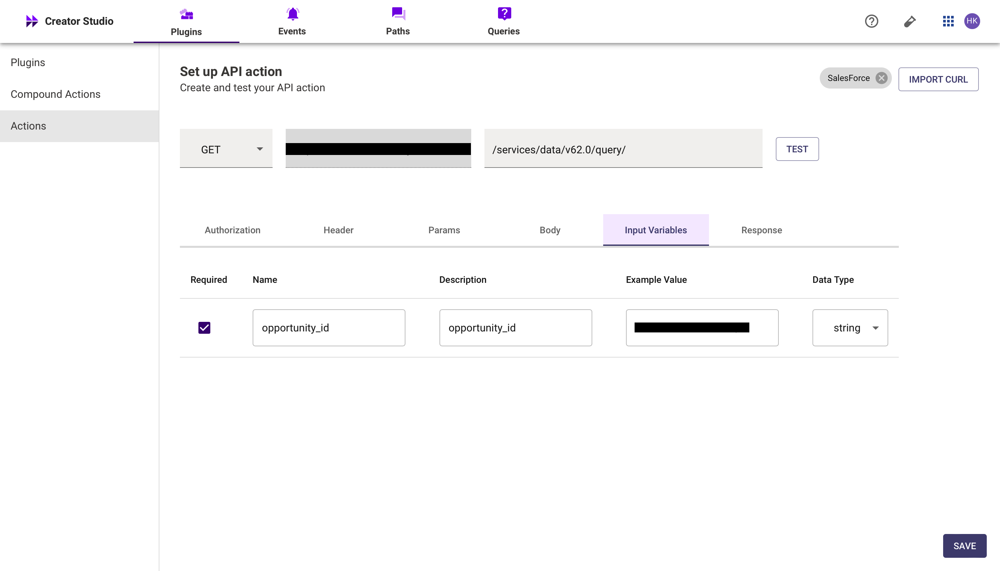
    
- Test the Connector setup as described earlier to verify the response. If the output schema is incorrect or missing, click GENERATE FROM RESPONSE to update it.
    
    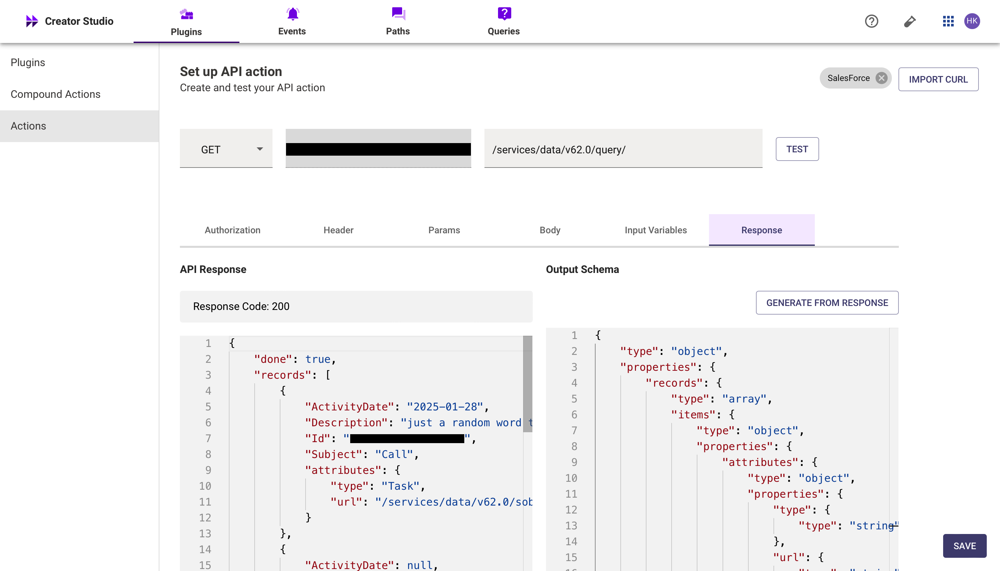
    
- Add the **API Name** and **API Description** as shown below, then click the Save button
    
    
    

## **Step 2: Build Compound Action**

- Head over to the **Compound Actions** tab and click **CREATE**
    
    
    
- Give your Compound Action a **Name** and **Description** , then click Next Note: Name only letters, numbers, and underscores. We suggest using snake case or camel case formatting (e.g. Workflow_name or workflowName )
    
    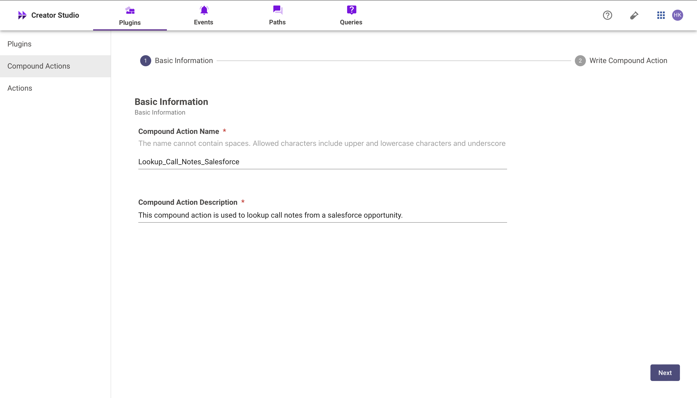
    
- Click on the Script editor tab. Here you will be able to build your compound action using the YAML syntax.
- At a high-level, this syntax provides actions (HTTP Request, APIthon Scripts) and workflow logic (switch statements, for each loops, return statements, parallel, try/catch). See the [Compound Action Syntax](https://developer.moveworks.com/creator-studio/reference/compound_actions_syntax/) Reference for more info.
    
    ```yaml
    steps:
      - action:
          output_key: opportunityid
          action_name: GET_OpportunityID_Using_AccountName
          progress_updates:
            on_complete: ON_COMPLETE_MESSAGE
            on_pending: ON_PENDING_MESSAGE
          input_args:
            account_name: data.account_name
      - action:
          output_key: callnote_result
          action_name: Lookup_Callnotes_From_Opportunity
          progress_updates:
            on_complete: ON_COMPLETE_MESSAGE
            on_pending: ON_PENDING_MESSAGE
          input_args:
            opportunity_id: data.opportunityid.records[0].Id
      - return:
          output_mapper:
            Description: data.callnote_result.records[0].Description
            ActivityDate: data.callnote_result.records[0].ActivityDate
            Subject: data.callnote_result.records[0].Subject
    
    ```
    

- Click on Input fields tab and click the +Add button. Here you will define the slots that you want to collect from users through the conversation and trigger your Workflow with. After defining the input fields, click the Submit button to save your changes.
    
    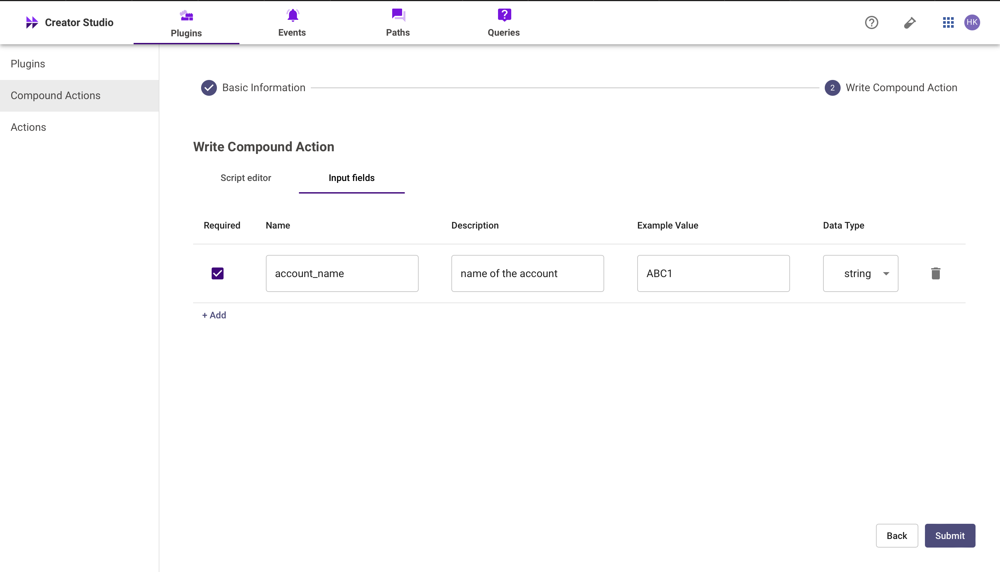
    

## **Step 3: Publish Workflow to Plugin**

- Head over to the Compound Actions tab and click on the kebab menu ( ︙ )
- Next, click on Publish Workflow to Plugin
- First, verify your Plugin **Name** & **Short description** . This is autofilled from the name & description of your compound action.
    
    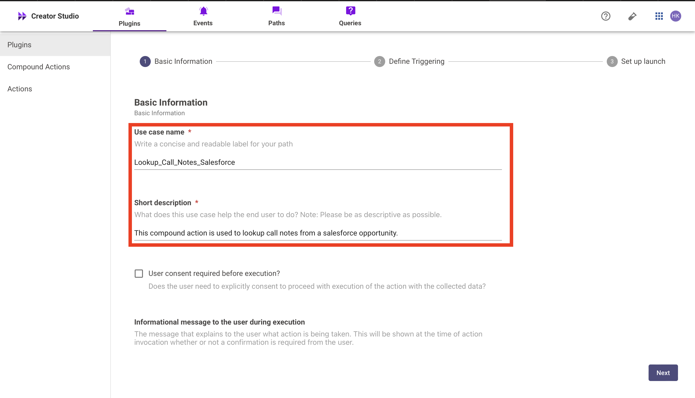
    
- Next, consider whether to select the User consent required before execution? checkbox. Enabling this option prompts the user to confirm all slot values before executing the plugin, which is widely regarded as a best practice.
    
    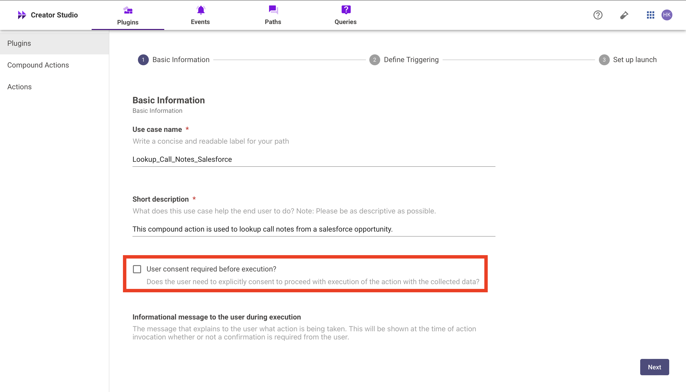
    
- Click Next and set up your positive and negative triggering examples. This ensures that the bot triggers your plugin given a relevant utterance.
    - See our [guide](https://developer.moveworks.com/creator-studio/conversation-design/triggers/natural-language-triggers/#how-to-write-good-triggering-examples) on Triggering
- Lastly, click Next and set the **Launch Rules** you want your plugin to abide by.
    - See our [guide](https://developer.moveworks.com/creator-studio/administration/launch-options/) on Launch Rules

## **Step 4: See it in action!**

- After clicking the final Submit button, your plugin will be published to the bot and triggerable based on your **Launch Rules.**
- You should wait up to **5 minutes** after making changes before trying to test in your bot!
- If you run into an issue:
    1. Check our [troubleshooting guides](https://developer.moveworks.com/creator-studio/troubleshooting/support/)
    2. Understand your issue using Logs
    3. Reach out to Support

# **Congratulations!**

You've just added the "Look Up Call Notes using Opportunity in Salesforce" feature inside your Salesforce account to your Copilot! Explore our other guides for more inspiration on what to build next.