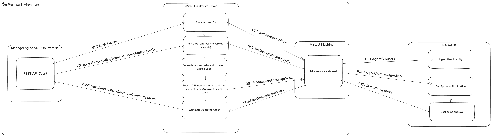

---
agent_capabilities:
- Polling Required
- Ambient Agent
availability: VALIDATED
description: A plugin that automatically notifies employees about new ticket approvals.
name: Notify on Ticket Approvals
purple_chat_link: https://developer.moveworks.com/creator-studio/developer-tools/purple-chat?conversation=%7B%22startTimestamp%22%3A%2211%3A43+AM%22%2C%22messages%22%3A%5B%7B%22role%22%3A%22assistant%22%2C%22parts%22%3A%5B%7B%22reasoningSteps%22%3A%5B%7B%22status%22%3A%22success%22%2C%22richText%22%3A%22%3Cp%3E%3Cb%3ETriggers%3C%2Fb%3E%3Cbr%3E1.+New+approval+queue+detected+while+polling+ManageEngine+approval+APIs%3Cbr%3E2.+Middleware+initiated+trigger%3Cbr%3E%3Cbr%3E%3Cb%3ESlots%3C%2Fb%3E%3Cbr%3E1.+%3Ci%3EApproval+ID%3C%2Fi%3E%3A+reqired+for+approval+actions+to+work%3Cbr%3E%3Cbr%3E%3Cb%3EActions%3C%2Fb%3E%3Cbr%3E%3Cbr%3E1.+%3Ci%3EApprove+ticket%3C%2Fi%3E%3A+Approve+and+move+ticket+to+next+approver+level+%28up+to+5+levels%29%3Cbr%3E2.+%3Ci%3EReject+ticket%3C%2Fi%3E%3A+Reject+ticket+and+move+record+back+to+previous+approver+or+level%3C%2Fp%3E%22%7D%5D%7D%2C%7B%22richText%22%3A%22+You+have+one+open+approval%3A+%3C%2Fp%3E%22%7D%2C%7B%22richText%22%3A%22%3Cb%3E%3Cp%3E%3Cb%3E%F0%9F%8E%AB+New+Ticket+Pending+Your+Approval%3C%2Fb%3E%3C%2Fp%3E%3C%2Fb%3E%3Cbr%3E%3Cp%3E%3Ci%3ETicket+Type%3C%2Fi%3E%3A+Request%3Cbr%3E%3Ci%3ETicket+%23%3C%2Fi%3E%3A+874%3Cbr%3E%3Ci%3ERequester%3C%2Fi%3E%3A+Sam+Stinson%3Cbr%3E%3Ci%3EPriority%3C%2Fi%3E%3A+High%3Cbr%3E%3Ci%3EDescription%3C%2Fi%3E%3A+The+A%2FV+Equipment+in+Conference+Room+B+has+stopped+working.+The+internals+are+fried.+Requesting+approval+for+replacement.%3C%2Fp%3E%22%7D%2C%7B%22buttons%22%3A%5B%7B%22style%22%3A%22filled%22%2C%22buttonText%22%3A%22Approve%22%7D%2C%7B%22style%22%3A%22outlined%22%2C%22buttonText%22%3A%22Reject%22%7D%5D%7D%5D%7D%5D%7D
solution_tags:
- Approvals
- IT
systems:
- manage-engine
video: https://youtu.be/dixMBJSonkc?si=nsHTaUL5IPDNAoDn
---

# Notify Employees for New Ticket Approvals with Your Copilot 🎫

Keep your IT processes running smoothly by enabling employees to approve or reject tickets directly through your Copilot. This guide will help you build a conversational experience for easy ticket approvals in ManageEngine ServiceDesk Plus (SDP) on-premise. Let's dive in!

# Prerequisites

1. Use [Moveworks Setup](https://help.moveworks.com/docs/ingest-users) to synchronize your employees' work email from your IDAM to Moveworks.
2. Ensure that your ManageEngine SDP instance uses the same work email as your IDAM.
3. Review [how to implement a Creator Studio guide with your team](https://developer.moveworks.com/creator-studio/program-management/planning/#how-to-implement-a-creator-studio-guide).
4. Ensure that your ManageEngine SDP administrator has the necessary permissions to configure API access.
5. Connect your middleware and APIM tools with Creator Studio using a [connector](https://developer.moveworks.com/creator-studio/integrations/outbound/connector-configuration/).

# Conversation Design

[This purple chat mock](https://developer.moveworks.com/creator-studio/developer-tools/purple-chat-builder/?workspace=%7B%22title%22%3A%22My+Workspace%22%2C%22botSettings%22%3A%7B%7D%2C%22mocks%22%3A%5B%7B%22id%22%3A3423%2C%22title%22%3A%22Mock+1%22%2C%22transcript%22%3A%7B%22settings%22%3A%7B%22colorStyle%22%3A%22LIGHT%22%2C%22startTime%22%3A%2211%3A43+AM%22%2C%22defaultPerson%22%3A%22GWEN%22%2C%22editable%22%3Atrue%7D%2C%22messages%22%3A%5B%7B%22from%22%3A%22ANNOTATION%22%2C%22text%22%3A%22%3Cp%3E%3Cb%3ETriggers%3C%2Fb%3E%3Cbr%3E1.+New+approval+queue+detected+while+polling+ManageEngine+approval+APIs%3Cbr%3E2.+Middleware+initiated+trigger%3Cbr%3E%3Cbr%3E%3Cb%3ESlots%3C%2Fb%3E%3Cbr%3E1.+%3Ci%3EApproval+ID%3C%2Fi%3E%3A+reqired+for+approval+actions+to+work%3Cbr%3E%3Cbr%3E%3Cb%3EActions%3C%2Fb%3E%3Cbr%3E%3Cbr%3E1.+%3Ci%3EApprove+ticket%3C%2Fi%3E%3A+Approve+and+move+ticket+to+next+approver+level+%28up+to+5+levels%29%3Cbr%3E2.+%3Ci%3EReject+ticket%3C%2Fi%3E%3A+Reject+ticket+and+move+record+back+to+previous+approver+or+level%3C%2Fp%3E%22%7D%2C%7B%22from%22%3A%22BOT%22%2C%22text%22%3A%22+You+have+one+open+approval%3A+%3C%2Fp%3E%22%2C%22cards%22%3A%5B%7B%22title%22%3A%22%3Cp%3E%3Cb%3E%F0%9F%8E%AB+New+Ticket+Pending+Your+Approval%3C%2Fb%3E%3C%2Fp%3E%22%2C%22text%22%3A%22%3Cp%3E%3Ci%3ETicket+Type%3C%2Fi%3E%3A+Request%3Cbr%3E%3Ci%3ETicket+%23%3C%2Fi%3E%3A+874%3Cbr%3E%3Ci%3ERequester%3C%2Fi%3E%3A+Sam+Stinson%3Cbr%3E%3Ci%3EPriority%3C%2Fi%3E%3A+High%3Cbr%3E%3Ci%3EDescription%3C%2Fi%3E%3A+The+A%2FV+Equipment+in+Conference+Room+B+has+stopped+working.+The+internals+are+fried.+Requesting+approval+for+replacement.%3C%2Fp%3E%22%7D%2C%7B%22buttons%22%3A%5B%7B%22style%22%3A%22PRIMARY%22%2C%22text%22%3A%22Approve%22%7D%2C%7B%22text%22%3A%22Reject%22%7D%5D%7D%5D%7D%5D%7D%7D%5D%7D) shows the experience we are going to build.

## Discovery Questions to Personalize Your Conversation Design

1. What fields would you like to show inside the approval request notification?
2. Which actions would you like the approver to be able to take on the notification?
3. Do you want approvers to be re-notified if they have not acted on the request within a certain timeframe?

# ManageEngine SDP Configuration

1. Log in to your ManageEngine ServiceDesk Plus on-premise instance as an administrator.
2. Navigate to Admin > API > API Settings.
3. Enable API access and generate an API key for authentication.
4. Ensure that the API user has the necessary permissions to view and action approvals.

# For Creator Studio Developers

## Step 1: Check you have built a Creator Studio Connector for your middleware / APIM tool

Ensure you have completed the Prerequisites section above and have a connector configured for your middleware tool.

## Step 2: Test required APIs with Postman

Copy the cURL commands below into your API client like Postman for testing. Substitute any `{{placeholder text}}` with relevant ManageEngine SDP API credentials or inputs.

**API 1: Authorization**

```bash
curl --location 'https://accounts.zoho.in/oauth/v2/token' \
--header 'Content-Type: application/x-www-form-urlencoded' \
--data-urlencode 'code={{code}}' \
--data-urlencode 'grant_type=authorization_code' \
--data-urlencode 'client_id={{client_id}}' \
--data-urlencode 'client_secret={{client_secret}}' \
--data-urlencode 'redirect_uri=https://www.zoho.com'
```
**API 2: List All Tickets**

Requests:

```bash
curl --location 'https://sdpondemand.manageengine.in/api/v3/requests' \
--header 'Authorization: Bearer {{token}}' \
```

Change Tickets:
```bash
curl --location 'https://sdpondemand.manageengine.in/api/v3/changes' \
--header 'Authorization: Bearer {{token}}' \
```

Releases:
```bash
curl --location 'https://sdpondemand.manageengine.in/api/v3/releases' \
--header 'Authorization: Bearer {{token}}' \
```

**API 3: List Approval Levels**
List all request approval levels:
```bash
curl --location 'https://sdpondemand.manageengine.in/api/v3/requests/{{request_id}}/approval_levels' \
--header 'Authorization: Bearer {{token}}' \
```

List all change approval levels:
```bash
curl --location 'https://sdpondemand.manageengine.in/api/v3/changes/{{change_id}}/approval_levels' \
--header 'Authorization: Bearer {{token}}' \
```

List all release approval levels:
```bash
curl --location 'https://sdpondemand.manageengine.in/api/v3/releases/{{release_id}}/approval_levels' \
--header 'Authorization: Bearer {{token}}' \
```

**API 4: List Approvals within an Approval Level**
List all request approvals in an approval level:
```bash
curl --location 'https://sdpondemand.manageengine.in/api/v3/requests/{{request_id}}/approval_levels' \
--header 'Authorization: Bearer {{token}}' \
```

List all change approvals in an approval level:
```bash
curl --location 'https://{{SDP_BASE_URL}}/api/v3/requests/{{request_id}}/approval_levels/{{level_id}}/approvals' \
--header 'Authorization: Bearer {{token}}'
```

List all release approvals in an approval level:
```bash
curl --location 'https://sdpondemand.manageengine.in/api/v3/releases/{{release_id}}/approval_levels' \
--header 'Authorization: Bearer {{token}}' \
```

**API 5: Approve or Reject an Approval**
```bash
curl --location --request PUT 'https://{{SDP_BASE_URL}}/api/v3/{{ticket}}/{{ticket_id}}/approval_levels/{{level_id}}/approvals/{{approval_id}}/_{{action}}' \
--header 'Content-Type: application/json' \
--header 'Authorization: Bearer {{token}}' \
--data '{
  "approval": {
    "comments": "The comments to action the approval"
  }
}'
```


## Step 3: Write your Orchestration Code in your iPaaS

 

This diagram describes the flow we will build in this guide.

Here's an example of the code structure you can use to orchestrate the API calls for ticket approvals in ManageEngine SDP:

```python
import os
import time
import json
from typing import Dict, List, Optional
from datetime import datetime, timedelta
import sqlite3
from contextlib import asynccontextmanager
import asyncio
import httpx
from fastapi import FastAPI, HTTPException, BackgroundTasks
from pydantic import BaseModel, Field
from dotenv import load_dotenv

# Load environment variables
load_dotenv()

# Configuration
MANAGEENGINE_BASE_URL = os.getenv("MANAGEENGINE_BASE_URL")
MANAGEENGINE_CLIENT_ID = os.getenv("MANAGEENGINE_CLIENT_ID")
MANAGEENGINE_CLIENT_SECRET = os.getenv("MANAGEENGINE_CLIENT_SECRET")
MANAGEENGINE_REFRESH_TOKEN = os.getenv("MANAGEENGINE_REFRESH_TOKEN")
MOVEWORKS_BASE_URL = "https://api.moveworks.ai"
DATABASE_NAME = "manageengine_approvals.db"
EVENT_ID = os.getenv("MOVEWORKS_EVENT_ID")
EVENT_API_KEY = os.getenv("MOVEWORKS_EVENT_API_KEY")
POLLING_INTERVAL = 60  # number of seconds to wait between polling

# Global variable to store the token and its expiration time
oauth_token = None
token_expiration_time = None

# Database setup
def init_db():
    conn = sqlite3.connect(DATABASE_NAME)
    cursor = conn.cursor()
    cursor.execute("""
        CREATE TABLE IF NOT EXISTS pending_approvals (
            approval_id TEXT PRIMARY KEY,
            request_id TEXT,
            level_id TEXT,
            submit_date TEXT
        )
    """)
    conn.commit()
    conn.close()

init_db()

# Pydantic models for request validation
class NotificationContext(BaseModel):
    approval_id: str
    request_id: str
    level_id: str

class NotificationRequest(BaseModel):
    message: str = Field(..., min_length=1)
    recipients: List[str] = Field(..., min_items=1)
    context: Optional[NotificationContext] = None

# Helper functions
async def get_manageengine_oauth_token() -> str:
    global oauth_token, token_expiration_time
    
    if oauth_token and token_expiration_time and time.time() < token_expiration_time:
        return oauth_token

    url = f"{MANAGEENGINE_BASE_URL}/oauth/v2/token"
    data = {
        "grant_type": "refresh_token",
        "client_id": MANAGEENGINE_CLIENT_ID,
        "client_secret": MANAGEENGINE_CLIENT_SECRET,
        "refresh_token": MANAGEENGINE_REFRESH_TOKEN
    }
    
    async with httpx.AsyncClient() as client:
        response = await client.post(url, data=data)
        if response.status_code != 200:
            raise HTTPException(status_code=response.status_code, detail="Failed to obtain OAuth token from ManageEngine")
        
        response_data = response.json()
        oauth_token = response_data["access_token"]
        expires_in = response_data.get("expires_in", 3600)  # Default to 1 hour if not specified
        token_expiration_time = time.time() + expires_in
        
        return oauth_token

def read_pending_approvals():
    conn = sqlite3.connect(DATABASE_NAME)
    cursor = conn.cursor()
    cursor.execute("SELECT approval_id, request_id, level_id, submit_date FROM pending_approvals")
    results = cursor.fetchall()
    conn.close()
    return {row[0]: {"request_id": row[1], "level_id": row[2], "submit_date": row[3]} for row in results}

def write_pending_approval(approval_id, request_id, level_id, submit_date):
    conn = sqlite3.connect(DATABASE_NAME)
    cursor = conn.cursor()
    cursor.execute(
        "INSERT OR REPLACE INTO pending_approvals (approval_id, request_id, level_id, submit_date) VALUES (?, ?, ?, ?)",
        (approval_id, request_id, level_id, submit_date)
    )
    conn.commit()
    conn.close()

def remove_pending_approval(approval_id):
    conn = sqlite3.connect(DATABASE_NAME)
    cursor = conn.cursor()
    cursor.execute("DELETE FROM pending_approvals WHERE approval_id = ?", (approval_id,))
    conn.commit()
    conn.close()
    print(f"Approval {approval_id} removed from pending approvals")

def is_approval_pending(approval_id, submit_date):
    conn = sqlite3.connect(DATABASE_NAME)
    cursor = conn.cursor()
    cursor.execute("SELECT submit_date FROM pending_approvals WHERE approval_id = ?", (approval_id,))
    result = cursor.fetchone()
    conn.close()
    is_pending = result is not None and result[0] == submit_date
    print(f"Approval {approval_id} in pending approvals: {is_pending}")
    return is_pending

async def make_request(method: str, url: str, headers: Dict = None, data: Optional[Dict] = None, auth_type: str = "Bearer") -> Dict:
    if headers is None:
        headers = {}
    
    headers.setdefault("Accept", "application/json")
    
    if auth_type == "Bearer":
        token = await get_manageengine_oauth_token()
        headers["Authorization"] = f"Bearer {token}"
    elif auth_type == "api_key":
        headers["Authorization"] = EVENT_API_KEY

    async with httpx.AsyncClient() as client:
        if method == "GET":
            response = await client.get(url, headers=headers)
        elif method == "POST":
            response = await client.post(url, headers=headers, json=data)
        elif method == "PUT":
            response = await client.put(url, headers=headers, json=data)
        else:
            raise ValueError(f"Unsupported HTTP method: {method}")

        if response.status_code not in [200, 204]:
            raise HTTPException(status_code=response.status_code, detail=f"API request failed: {response.text}")

        return response.json() if response.status_code == 200 else {"status": "success"}

async def get_pending_approvals() -> Dict:
    url = f"{MANAGEENGINE_BASE_URL}/api/v3/requests"
    return await make_request("GET", url)

async def get_approval_levels(request_id: str) -> Dict:
    url = f"{MANAGEENGINE_BASE_URL}/api/v3/requests/{request_id}/approval_levels"
    return await make_request("GET", url)

async def get_approvals_in_level(request_id: str, level_id: str) -> Dict:
    url = f"{MANAGEENGINE_BASE_URL}/api/v3/requests/{request_id}/approval_levels/{level_id}/approvals"
    return await make_request("GET", url)

async def approve_manageengine_approval(request_id: str, approval_id: str) -> Dict:
    url = f"{MANAGEENGINE_BASE_URL}/api/v3/requests/{request_id}/approvals/{approval_id}/approve"
    return await make_request("PUT", url)

async def reject_manageengine_approval(request_id: str, approval_id: str, reason: Optional[str] = None) -> Dict:
    url = f"{MANAGEENGINE_BASE_URL}/api/v3/requests/{request_id}/approvals/{approval_id}/reject"
    data = {"comments": reason} if reason else {}
    return await make_request("PUT", url, data=data)

async def send_moveworks_message(message: str, recipients: List[str], context: Optional[NotificationContext] = None) -> Dict:
    url = f"{MOVEWORKS_BASE_URL}/rest/v1/events/{EVENT_ID}/messages/send"
    headers = {"Content-Type": "application/json"}
    payload = {
        "message": message,
        "recipients": recipients,
    }
    if context and context.approval_id and context.request_id and context.level_id:
        payload["context"] = {
            "slots": {
                "approval_id": context.approval_id,
                "request_id": context.request_id,
                "level_id": context.level_id
            }
        }
    return await make_request("POST", url, headers, payload, auth_type="api_key")

def format_notification_message(approval):
    return (
        f"📝 ManageEngine Approval Pending:\n"
        f"- Request ID: {approval['request']['id']}\n"
        f"- Subject: {approval['request']['subject']}\n"
        f"- Requester: {approval['request']['requester']['name']}\n"
        f"- Approval Level: {approval['approval_level']['level']}\n"
        f"- Status: {approval['status']['name']}\n"
    )

@asynccontextmanager
async def lifespan(app: FastAPI):
    # Startup logic
    print("Starting up...")
    try:
        # Create the polling task
        polling_task = asyncio.create_task(continuous_polling())
        print("Continuous polling task started successfully")
        yield
    finally:
        # Shutdown logic
        print("Shutting down...")
        # Cancel the polling task if it's still running
        polling_task.cancel()
        try:
            await polling_task
        except asyncio.CancelledError:
            print("Polling task cancelled")

app = FastAPI(lifespan=lifespan)

async def continuous_polling():
    while True:
        try:
            await poll_approvals()
        except Exception as e:
            print(f"Error in continuous polling: {str(e)}")
        await asyncio.sleep(POLLING_INTERVAL)

async def poll_approvals():
    print("Polling for new approvals...")
    try:
        requests = await get_pending_approvals()
        for request in requests.get("requests", []):
            request_id = request["id"]
            approval_levels = await get_approval_levels(request_id)
            
            for level in approval_levels.get("approval_levels", []):
                level_id = level["id"]
                approvals = await get_approvals_in_level(request_id, level_id)
                
                for approval in approvals.get("approvals", []):
                    approval_id = approval["id"]
                    submit_date = approval["created_time"]["value"]
                    
                    print(f"Checking approval ID: {approval_id}, Request ID: {request_id}, Level ID: {level_id}, Submit Date: {submit_date}")
                    
                    if not is_approval_pending(approval_id, submit_date):
                        print(f"New approval detected with ID: {approval_id}. Sending notification...")
                        
                        # Send notification
                        await send_moveworks_message(
                            format_notification_message(approval),
                            [approval["approver"]["email_id"]],
                            NotificationContext(
                                approval_id=str(approval_id),
                                request_id=str(request_id),
                                level_id=str(level_id)
                            )
                        )
                        
                        # Add approval to pending list
                        write_pending_approval(approval_id, request_id, level_id, submit_date)
                    else:
                        print(f"Approval ID: {approval_id} is already pending, no action taken.")
    except Exception as e:
        print(f"Error in polling approvals: {str(e)}")

@app.get("/")
async def health_check():
    return {"status": "ok"}

@app.get("/approvals")
async def get_approvals():
    try:
        pending_approvals = await get_pending_approvals()
        return {"data": pending_approvals}
    except Exception as e:
        return JSONResponse(status_code=400, content={"error": str(e)})

@app.post("/notifications")
async def send_notification(request: NotificationRequest, background_tasks: BackgroundTasks):
    try:
        await send_moveworks_message(request.message, request.recipients, request.context)
        return {"status": "notification_sent"}
    except Exception as e:
        return JSONResponse(status_code=400, content={"error": str(e)})

@app.post("/approvals/{request_id}/{approval_id}/approve")
async def approve_approval(request_id: str, approval_id: str):
    try:
        await approve_manageengine_approval(request_id, approval_id)
        remove_pending_approval(approval_id)
        return {"status": "approved"}
    except Exception as e:
        return JSONResponse(status_code=400, content={"error": str(e)})

@app.post("/approvals/{request_id}/{approval_id}/reject")
async def reject_approval(request_id: str, approval_id: str, reason: Optional[str] = None):
    try:
        await reject_manageengine_approval(request_id, approval_id, reason)
        remove_pending_approval(approval_id)
        return {"status": "rejected"}
    except Exception as e:
        return JSONResponse(status_code=400, content={"error": str(e)})

if __name__ == "__main__":
    import uvicorn
    uvicorn.run(app, host="0.0.0.0", port=8000)
```
## Step 4: Build in Creator Studio
1. Create a new Event in Creator Studio named "🎫 Manage Ticket Approvals in ManageEngine SDP".
    * Choose to add a followup action so that you can approve or reject the ticket.
2. Configure the API Connection:
    * Import the cURL command for the "List Tickets" API.
    * Add necessary authorization headers.
6. Design the conversation flow:
    * Ask if the user wants to view pending approvals.
    * Display ticket details for approval.
    * Provide options to approve, reject, or view more details.
7. Follow our [Quickstart Guide](https://developer.moveworks.com/creator-studio/quickstart/event-triggered-paths/) to build an event with followup actions in Creator Studio, which can be called from your middleware.

# Congratulations!
You've just enabled your employees to manage ticket approvals through your Copilot. This streamlines your IT processes and improves response times. Consider expanding this functionality to other ManageEngine SDP modules like Changes and Releases for a comprehensive approval management solution.