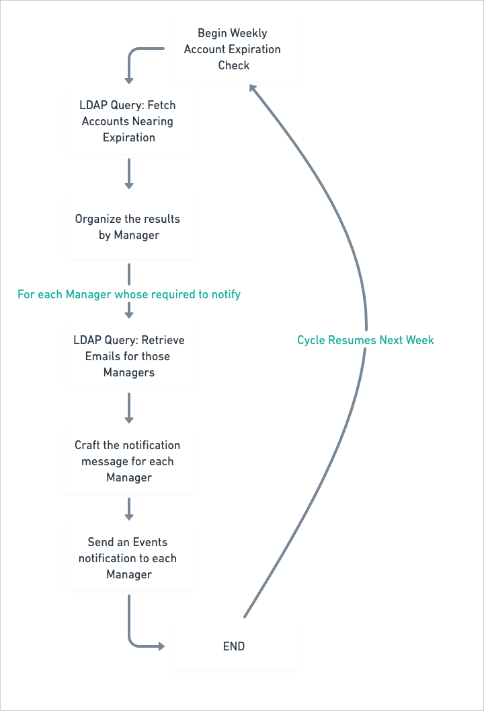

---
agent_capabilities:
- Ambient Agent
- Ambient Agent
availability: VALIDATED
description: Remind managers when employee contracts are expiring so they can terminate
  or renew them.
name: Remind about Expiring Contractors
purple_chat_link: https://marketplace.moveworks.com/purple-chat?conversation=%7B%22startTimestamp%22%3A%2211%3A43%2BAM%22%2C%22messages%22%3A%5B%7B%22role%22%3A%22assistant%22%2C%22parts%22%3A%5B%7B%22richText%22%3A%22%3Cp%3EHi+Andrew%2C%3Cbr%3E%3Cbr%3EThe+following+4+employees%27+contracts+are+expiring+soon.+Please+extend+or+terminate+each+of+the+following%3A%3Cbr%3E%3Cbr%3E1.+Anna+Harris+-+Expires+%3Cb%3EApril+30%2C+2023%3C%2Fb%3E%3Ca+href%3D%5C%22https%3A%2F%2Fcompany.contracts%2Fanna_harris%5C%22%3E+%28View+Contract%29%3C%2Fa%3E%3Cbr%3E2.+John+Doe+-+Expires+%3Cb%3EMay+15%2C+2023%3C%2Fb%3E%3Ca+href%3D%5C%22https%3A%2F%2Fcompany.contracts%2Fjohn_doe%5C%22%3E+%28View+Contract%29%3C%2Fa%3E%3Cbr%3E3.+Lisa+Ray+-+Expires+%3Cb%3EJune+1%2C+2023%3C%2Fb%3E%3Ca+href%3D%5C%22https%3A%2F%2Fcompany.contracts%2Flisa_ray%5C%22%3E+%28View+Contract%29%3C%2Fa%3E%3Cbr%3E4.+Mark+Smith+-+Expires+%3Cb%3EJuly+20%2C+2023%3C%2Fb%3E%3Ca+href%3D%5C%22https%3A%2F%2Fcompany.contracts%2Fmark_smith%5C%22%3E+%28View+Contract%29%3C%2Fa%3E%3Cbr%3E%3C%2Fp%3E%22%7D%5D%7D%5D%7D
redirects:
- entra-contractor-expiry-reminders
solution_tags:
- IT
systems:
- microsoft-entra
---

# Remind Managers about their expiring Contractors **with your Copilot**

Remind managers when their employees' contracts are expiring so that they can terminate or renew them at the right time.

Let's dive in!

# **Prerequisites**

1. Ensure that your Active Directory instance contains the attributes which denotes the Account Expiry date of the user and their Manager info
2. Ensure that your Active Directory administrator has the necessary permissions to set up API access to your tenant.
3. Review [how to implement a Creator Studio guide with your team](https://developer.moveworks.com/creator-studio/program-management/planning/#how-to-implement-a-creator-studio-guide), and allocate bandwidth for your team or [Moveworks Professional Services](https://developer.moveworks.com/creator-studio/troubleshooting/support/#4-sign-up-for-professional-services) to build the plugin.
4. Connect your middleware and APIM tools with Creator Studio using a [connector](https://developer.moveworks.com/creator-studio/integrations/outbound/connector-configuration/). Follow authentication guides to connect your middleware such as [Azure Function Apps](https://developer.moveworks.com/creator-studio/resources/authentication-guide?id=azure-function-app), [Workato](https://developer.moveworks.com/creator-studio/resources/authentication-guide?id=workato), or [Power Automate](https://powerusers.microsoft.com/t5/Building-Power-Apps/Formatting-a-JSON-response-from-Power-Automate-flow-on-PowerApps/td-p/907563), with Creator Studio. Otherwise, you can learn more about these middleware / APIM tools in our [Program Management docs](https://developer.moveworks.com/creator-studio/program-management/automation-tools/).


# **Conversation Design**

[This purple chat mock](https://developer.moveworks.com/creator-studio/developer-tools/purple-chat-builder/?workspace=%7B%22title%22%3A%22My+Workspace%22%2C%22botSettings%22%3A%7B%22name%22%3A%22%22%2C%22imageUrl%22%3A%22%22%7D%2C%22mocks%22%3A%5B%7B%22id%22%3A8851%2C%22title%22%3A%22New+Mock%22%2C%22transcript%22%3A%7B%22messages%22%3A%5B%7B%22from%22%3A%22BOT%22%2C%22text%22%3A%22%3Cp%3EHi+Andrew%2C%3Cbr%3E%3Cbr%3EThe+following+4+employees%27+contracts+are+expiring+soon.+Please+extend+or+terminate+each+of+the+following%3A%3Cbr%3E%3Cbr%3E1.+Anna+Harris+-+Expires+%3Cb%3EApril+30%2C+2023%3C%2Fb%3E%3Ca+href%3D%5C%22https%3A%2F%2Fcompany.contracts%2Fanna_harris%5C%22%3E+%28View+Contract%29%3C%2Fa%3E%3Cbr%3E2.+John+Doe+-+Expires+%3Cb%3EMay+15%2C+2023%3C%2Fb%3E%3Ca+href%3D%5C%22https%3A%2F%2Fcompany.contracts%2Fjohn_doe%5C%22%3E+%28View+Contract%29%3C%2Fa%3E%3Cbr%3E3.+Lisa+Ray+-+Expires+%3Cb%3EJune+1%2C+2023%3C%2Fb%3E%3Ca+href%3D%5C%22https%3A%2F%2Fcompany.contracts%2Flisa_ray%5C%22%3E+%28View+Contract%29%3C%2Fa%3E%3Cbr%3E4.+Mark+Smith+-+Expires+%3Cb%3EJuly+20%2C+2023%3C%2Fb%3E%3Ca+href%3D%5C%22https%3A%2F%2Fcompany.contracts%2Fmark_smith%5C%22%3E+%28View+Contract%29%3C%2Fa%3E%3Cbr%3E%3C%2Fp%3E%22%7D%5D%2C%22settings%22%3A%7B%22colorStyle%22%3A%22LIGHT%22%2C%22startTime%22%3A%2211%3A43%2BAM%22%2C%22defaultPerson%22%3A%22GWEN%22%2C%22editable%22%3Atrue%2C%22botName%22%3A%22%22%2C%22botImageUrl%22%3A%22%22%7D%7D%7D%5D%7D) shows the experience that can be achieved.

# **Design Questions to Consider**

1. What is the frequency of notification that you would like to send to the Managers for reminder?
2. How would you like to send the reminder when multiple contractors under the same manager are expiring at once?

# High-level overview of the Workflow

The overall workflow would be a simple **Weekly** job that performs the following steps:

1. Query Active Directory for user accounts nearing their expiration dates.
2. Filter and Organize the results by the employee's manager.
3. Craft and Send Notifications to managers detailing expiring contracts.

## Step-by-Step Implementation

**Step 1: Schedule the Job**
Set up a scheduled task or job in your middleware to run on a periodic basis. You could choose to run it every day, every week, every month, etc. What you decide here will play into Step 2.

**Step 2: Define Date Ranges for Notification**
You want to pick the right date range to ensure that your managers get notified about contractors that are about to expire. This could be notifying them when the contract expires in 30, 60, or 90 days. It could be weekly notifications for managers for any contracts expiring in 60 days. This part is up to you, but it should match your scheduling from Step 1.

Either way, you'll need some date ranges to filter based on. You'll pass those date ranges into an Active Directory query to identify expiring contracts.

**Step 3: Active Directory Query**
Execute an LDAP query to fetch user accounts with expiration dates within your calculated ranges. Your query might look similar to this:

```sh
(&(objectClass=user)(|(accountExpires>={90_days_start})(accountExpires<={90_days_end})(accountExpires>={60_days_start})(accountExpires<={60_days_end})(accountExpires>={30_days_start})(accountExpires<={30_days_end})))
```

Ensure to select attributes including `distinguishedName`, `name`, `mail`, `manager`, and `accountExpires`.

**Step 4: Organize Results by Manager**
Using the results from Step 3, group the expiring contracts by the manager. This helps in sending a consolidated notification for managers overseeing multiple contracts.

You would also have to fetch the email ID for each manager who will be required to notify using another LDAP Query

**Step 5: Craft and Send Notifications**
For each manager, create a personalized message listing their employees with expiring contracts. Here’s a template for constructing the message:

```text
Hi [Manager Name],
The following [Number of Employees] employees' contracts are expiring soon. Please take the necessary action to extend or terminate each of the following:
[List of Employees with Expiration Dates]
```

Fill in the placeholders with the appropriate details, including a direct link to view each contract if available.

**Step 6: Execute Notification Sending**
Utilize the Events API to send out the crafted notifications to each manager via your Moveworks Bot. Ensure the notification is clear, concise, and contains all necessary information for the manager to act upon.

Note: You can follow our [Quickstart Guide](https://developer.moveworks.com/creator-studio/quickstart/events/) to build an Event, which can be called from your middleware executing this workflow


