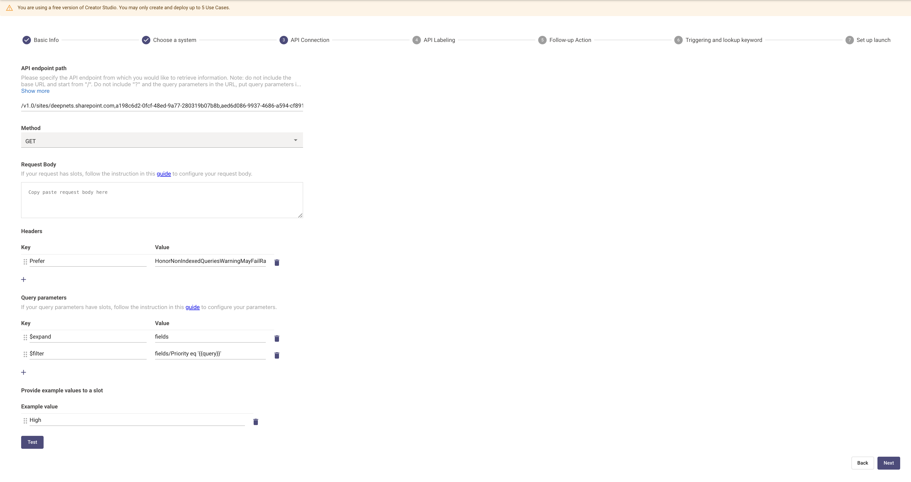
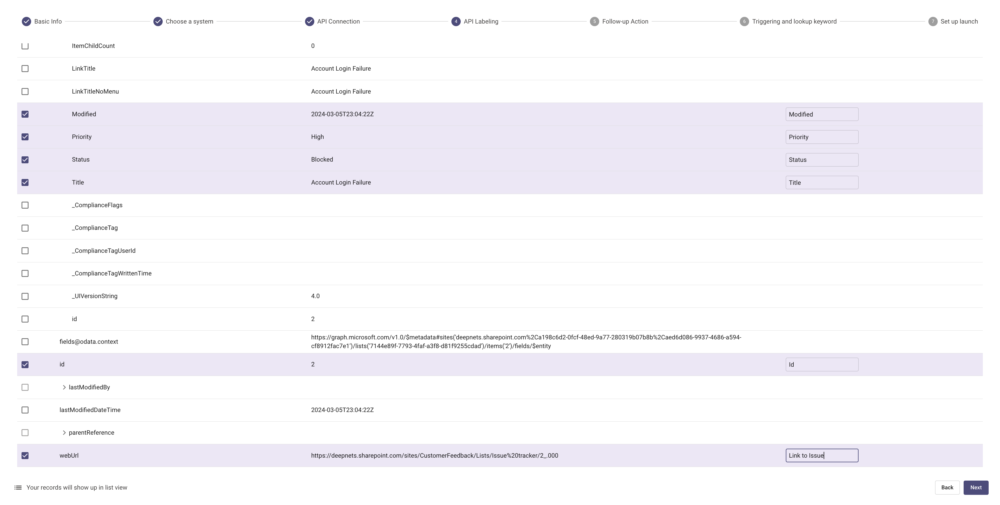

# Introduction

[Sharepoint Lists](https://support.microsoft.com/en-us/office/introduction-to-lists-0a1c3ace-def0-44af-b225-cfa8d92c52d7) let you create collections of data that you can share with team members in your Sharepoint instance

In this tutorial, we will demonstrate how to filter a Sharepoint List on a single attribute through Creator Studio.

Let's get started!

# What are we building?

## Conversation Design

[This purple chat](https://developer.moveworks.com/creator-studio/developer-tools/purple-chat-builder/?workspace=%7B%22title%22%3A%22My+Workspace%22%2C%22mocks%22%3A%5B%7B%22id%22%3A750%2C%22title%22%3A%22Mock+1%22%2C%22transcript%22%3A%7B%22settings%22%3A%7B%22colorStyle%22%3A%22LIGHT%22%2C%22startTime%22%3A%2211%3A43+AM%22%2C%22defaultPerson%22%3A%22GWEN%22%2C%22editable%22%3Atrue%2C%22botName%22%3A%22%22%2C%22botImageUrl%22%3A%22%22%7D%2C%22messages%22%3A%5B%7B%22from%22%3A%22USER%22%2C%22text%22%3A%22%3Cp%3ECan+you+show+me+Critical+priority+customer+feedback%3Cbr%3E%3C%2Fp%3E%22%7D%2C%7B%22from%22%3A%22ANNOTATION%22%2C%22text%22%3A%22%3Cp%3EMoveworks+extracts+%5C%22Critical%5C%22+from+natural+language%3A%3Cbr%3E%3Cbr%3EInbound+Request+to+Middleware%3A%3Cbr%3E%3Cbr%3E%7B%3Cbr%3E%5C%22%24filter%5C%22%3A+%5C%22fields%2FPriority+eq+%27Critical%27%5C%22%3Cbr%3E%7D%3Cbr%3E%3Cbr%3EProcess%3A%3Cbr%3E1.+Establish+a+connection+to+Sharepoint+List+over+Graph+API%3Cbr%3E2.+Retrieve+items+matching+the+filter+in+the+Sharepoint+List%3Cbr%3E%3Cbr%3EOutbound+Response%3A%3Cbr%3E%7B%3Cbr%3E%5C%22value%5C%22%3A+%5B%3Cbr%3E++%7B+Item1+%7D%2C%3Cbr%3E++%7B+Item2+%7D%2C%3Cbr%3E++...%3Cbr%3E%5D%3Cbr%3E%7D%3C%2Fp%3E%22%7D%2C%7B%22from%22%3A%22BOT%22%2C%22text%22%3A%22%3Ci%3EOne+moment%2C+fetching+your+results.+This+may+take+%7E10+seconds%3C%2Fi%3E%5Cn%22%2C%22cards%22%3A%5B%7B%22title%22%3A%22%3Cp%3E%3Cb%3EAccount+Login+Failure%3C%2Fb%3E%3A+New%3Cbr%3E%3C%2Fp%3E%22%7D%2C%7B%22title%22%3A%22%3Cp%3E%3Cb%3EWeb+Loading+Issue%3C%2Fb%3E%3A+In+Progress%3Cbr%3E%3C%2Fp%3E%22%7D%5D%7D%5D%7D%7D%5D%2C%22botSettings%22%3A%7B%22name%22%3A%22%22%2C%22imageUrl%22%3A%22%22%7D%7D) shows the experience we are going to build.


## Creator Studio Components

- Triggers:
    1. Natural language
- Slots:
    1. A priority level to filter on (exact match)
- Actions
    1. Retrieve Sharepoint List Results
- Guidelines
    1. None

Based on the needs of this use case, we should build a **Filter by ID Query**.

## API Research

There's only 1 API needed to build this use case. We can use the [Enumerate Items in List](https://learn.microsoft.com/en-us/graph/api/listitem-list?view=graph-rest-1.0&tabs=http) endpoint on the Graph API to return Sharepoint items matching a filter.

# Prerequisites

- A Microsoft Graph Connection (follow [our guide](../../connectors/microsoft-graph/README.md)). Make sure you request the `Sites.Read.All` permission for this use case.

# Steps

## Step 1: Get your IDs

To build this use case, there are a few IDs you need handy:

### Your Site ID

The list I'm trying to analzye can be found at `https://deepnets.sharepoint.com/sites/CustomerFeedback/Lists/Issue%20tracker/AllItems.aspx`. Based on that link, I know that my...

1. `domain_url` is `deepnets.sharepoint.com`
2. `site_name` is `CustomerFeedback`

I can head to the [Graph API Explorer](https://developer.microsoft.com/en-us/graph/graph-explorer?request=sites%2F%7B%7Bdomain_url%7D%7D%3A%2Fsites%2F%7B%7Bsite_name%7D%7D&method=GET&version=v1.0&GraphUrl=https://graph.microsoft.com), replace the values, and `Run Query`.


In the API response, there is a `site_id` that I can use going forward

### Your List ID

Go to your list in Sharepoint and click the gear in the top right. Then select `List Settings`


You'll be redirected to a URL like

`https://deepnets.sharepoint.com/sites/CustomerFeedback/_layouts/15/listedit.aspx?List=%7B7144e89f-7793-4faf-a3f8-d81f9255cdad%7D`

From this link, our `list_id` is `7144e89f-7793-4faf-a3f8-d81f9255cdad`. You can also get this list ID from the [Graph Explorer](https://developer.microsoft.com/en-us/graph/graph-explorer?request=sites%2F%7B%7Bsite_id%7D%7D%2Flists&method=GET&version=v1.0&GraphUrl=https://graph.microsoft.com)

## Step 2: Build in Creator Studio

### Setup use case

1. Start in the Queries Workspace and create a new query that describes the list you're filtering as well as how you're filtering it.

    

### Setup the API

1. Select the [Microsoft Graph integration](../../connectors/microsoft-graph/README.md) you set up earlier

    

2. Define your API action for filtering from the list

    

    ```bash
    curl --location 'https://graph.microsoft.com/v1.0/sites/{{site_id}}/lists/{{list_id}}/items?%24expand=fields&%24filter=fields%2F{{FieldName}}%20eq%20%27{{query}}%27' \
    --header 'Prefer: HonorNonIndexedQueriesWarningMayFailRandomly'
    ```

    - Path: `/v1.0/sites/{{site_id}}/lists/{{list_id}}/items`
    - Method: `GET`
    - Headers: 

        | Key | Value |
        | --- | --- |
        | Prefer | HonorNonIndexedQueriesWarningMayFailRandomly |

You need the `Prefer` header if you're filtering on a non-indexed column, or [add the column to an index](https://support.microsoft.com/en-us/office/add-an-index-to-a-list-or-library-column-f3f00554-b7dc-44d1-a2ed-d477eac463b0).

    - Query parameters:

        | Key | Value |
        | --- | --- |
        | $expand | fields |
        | $filter | fields/{{FieldName}} eq '{{query}}' |

You can customize the filtering, sorting, and selection further using the [OData Standard](https://learn.microsoft.com/en-us/sharepoint/dev/sp-add-ins/use-odata-query-operations-in-sharepoint-rest-requests) for Sharepoint Lists.

3. Test your setup and look for a successful execution.

### Label the API Response

You can select whichever fields you want in your citation card.



### Setup your Generative Intent

Provide a few examples that extract a variety of valid filter values. Here, I'm extracting "High," "Critical," and "Low" to make sure the API call succeeds.


### Launch the use case

Use our [Launch Rules](https://developer.moveworks.com/creator-studio/launch-options/) to launch your use case to your copilot.

## Step 3: See it in action!

Head over to your copilot and ask some questions about your list. Here’s [a quick demo](https://www.loom.com/share/9cf574ec0953455d8b2eb07ba5639814).

# Congratulations

You just added a Sharepoint List to your Copilot! Your organization likely has dozens of these, so go ahead and set another one up!
