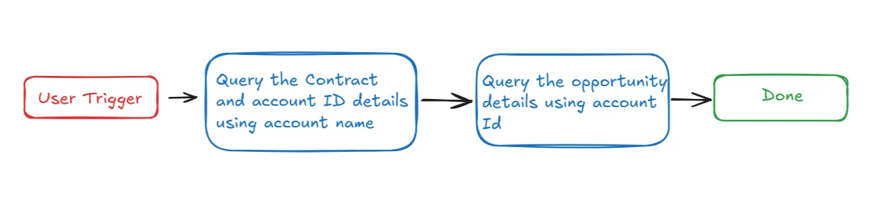
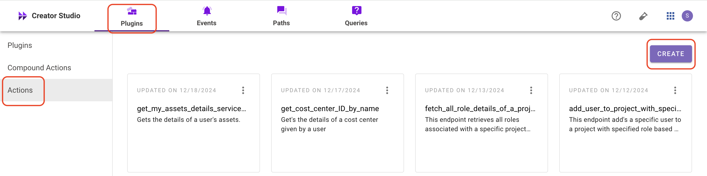
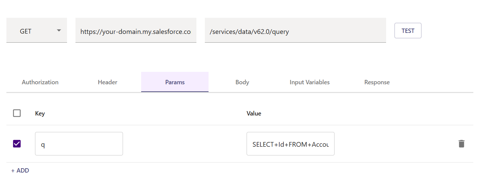
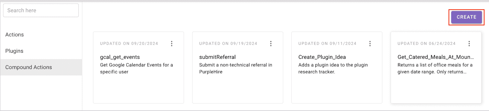

# **Introduction :**

Salesforce is a  CRM platform, and the **“Lookup Account Renewal Information”** is a plugin designed to simplify retrieving account renewal details using the account name. By integrating this feature into your bot, users can quickly access renewal information, improving efficiency and organization.

This guide provides step-by-step instructions on incorporating the **“Lookup Account Renewal Information”** plugin into your bot using Creator Studio.

Let’s get started!

# Prerequisites :

- [Postman](https://www.postman.com/) or an API Testing Tool
- Salesforce Connector built in Creator Studio (follow the [Salesforce Authentication](https://developer.moveworks.com/creator-studio/resources/connector/?id=salesforce) guide to create your connector)

# What are we building?

## **Conversation Design**

This [purple chat](https://developer.moveworks.com/creator-studio/developer-tools/purple-chat?conversation=%7B%22startTimestamp%22%3A%2211%3A43%2BAM%22%2C%22messages%22%3A%5B%7B%22parts%22%3A%5B%7B%22richText%22%3A%22Show+renewal+details+for+Vertex+Solutions.%22%7D%5D%2C%22role%22%3A%22user%22%7D%2C%7B%22parts%22%3A%5B%7B%22reasoningSteps%22%3A%5B%7B%22richText%22%3A%22Searches+for+upcoming+renewal+information+for+the+account+%27Vertex+Solutions%27.%22%2C%22status%22%3A%22success%22%7D%5D%7D%2C%7B%22richText%22%3A%22Here+are+the+renewal+details+for+Vertex+Solutions%3A%22%7D%2C%7B%22richText%22%3A%22%3Cb%3EAccount+Renewal+Information%3C%2Fb%3E%3Cbr%3E%3Cp%3E%3Cb%3ERenewal+Date%3A%3C%2Fb%3E+June+30%2C+2023%3Cbr%3E%3Cb%3EContract+Terms%3A%3C%2Fb%3E+12+months%2C+auto-renew%3Cbr%3E%3Cb%3EPricing%3A%3C%2Fb%3E+%2420%2C000+annually%3Cbr%3E%3C%2Fp%3E%22%7D%2C%7B%22citations%22%3A%5B%7B%22citationTitle%22%3A%22Vertex+Solutions%22%2C%22connectorName%22%3A%22salesforce%22%7D%5D%7D%5D%2C%22role%22%3A%22assistant%22%7D%5D%7D) shows the experience we are going to build.

# **Creator Studio Components**

- **Triggers**:
    1. Natural Language
- **Slots**:
    1. Fetch Account ID and contract details from Account Name
    2. Fetch opportunity details using Account ID
- **Actions**:
    1. **Retrieve Account ID and Contract details by account name:**
        - Query the Contract information by using the account name to obtain its unique Account ID and contract information.
    2. **Retrieve Opportunity details by account ID:**
        - Query the Opportunity information by using the Account ID to obtain its opportunity details.
- **Guidelines:**
    1. None

# **API Research**

To build this use case, we will utilize two APIs. Since our goal is to fetch the Account Id and account renewal information associated with the specified account, we'll focus on Salesforce's Opportunity and contract-related APIs. Only two API calls are required to achieve this.



## API #1: **Retrieve Account ID and Contract details by account name**

The [**Retrieve Account ID and Contract details by account name**](https://developer.salesforce.com/docs/industries/cme/guide/comms-get-contracts-for-account.html) API facilitates the retrieval of an **Account ID** contract details from Salesforce using a given **Account Name**. By leveraging a SOQL query, this API ensures efficient and precise data retrieval, even in environments with numerous opportunities.

- **Purpose**: Retrieves the **Account ID and contract** associated with a specified **Account Name**.
- **Features**: Filters data by **Account Name** and provides accurate results, even in large datasets.
- **Example**: Executes a query in Salesforce to identify the **Account ID** and **contract details** linked to a given **Account Name**.
    
    ```bash
    curl --request GET \
    --location 'https://<YOUR_DOMAIN>/services/data/v62.0/query?q=SELECT%20Id%2CAccount.Name%2CAccount.Id%2CStartDate%2C%20EndDate%2C%20Status%2CContractTerm%20FROM%20Contract%20WHERE%20Account.Name%20LIKE%20%27{Account_Name}1%25%27' \
    --header 'Content-Type: application/json' \
    
    ```
    

## **API #2: Retrieve Opportunity details by account ID**

The [**Retrieve Opportunity details by account ID**](https://developer.salesforce.com/docs/atlas.en-us.object_reference.meta/object_reference/sforce_api_objects_opportunity.htm) API allows you to retrieve **Opportunity** record in Salesforce using the provided **Account ID**. 

- **Purpose**: Retrieve **Opportunity** in Salesforce linked to a specified account ID.
- **Features**: Supports the inclusion of required field like **Account** **ID**.
- **Example**: Retrieve an opportunity in Salesforce associated with the specified account ID.
    
    ```bash
    curl --request GET \
    --location 'https://<YOUR_DOMAIN>/services/data/v62.0/query?q=SELECT%20Id%2CName%2CAmount%2CAccount.Name%20FROM%20Opportunity%20WHERE%20Account.Id%20LIKE%20%27%25{ACCOUNT_ID}%25%27' \
    --header 'Content-Type: application/json' \
    
    ```
    
- **<YOUR_DOMAIN>**: Your Salesforce instance domain (e.g., yourcompany.my.salesforce.com).
- **<ACCOUNT_ID>**: Retrieved Account ID from account name.

# **Steps**

## **Step 1: Build HTTP Action**

Define your HTTP Actions for fetching all the backlog ideas of a specific project :

### **1. Retrieve Account ID and Contract details by account name**

- In Creator Studio, create a new Action.
    - Navigate to plugin section > Actions tab
    - Click on CREATE to define a new action
        
        
        
- Click on the  IMPORT CURL option and paste the following cURL command:
    
    ```bash
    curl --request GET \
    --location 'https://<YOUR_DOMAIN>/services/data/v62.0/query?q=SELECT%20Id%2CAccount.Name%2CAccount.Id%2CStartDate%2C%20EndDate%2C%20Status%2CContractTerm%20FROM%20Contract%20WHERE%20Account.Name%20LIKE%20%27{Account_Name}%25%27' \
    --header 'Content-Type: application/json' \
    ```
    
- Click on Use Existing Connector > select the Salesforce [](https://developer.moveworks.com/creator-studio/resources/connector/?id=jira)connector that you just created > Click on Apply. This will populate the Base URL and the Authorization section of the API Editor.
- **Query Parameters for Salesforce Account Query**
    
    Key ( q ) : ****Value (  **SELECT Id, Account.Name, Account.Id, StartDate, EndDate, Status, ContractTerm FROM Contract WHERE Account.Name LIKE '%{{Account_Name}}%'**)
    
- This **SOQL query** filters out the accounts by searching for the one with a specific **Account** **Name**. The {{Account_name}} is a dynamic placeholder that will be replaced with the actual account name when the query is executed. This query will return the **Id** of the account that matches the provided name.
    
    
    
- **Input Variables** :
    - Account_Name : Example Value ( **Acme Corp**).
    
    
    
- Click on Test to check if the Connector setup was successful and expect a successful response as shown below. You will see the request response on the left side and the generated output schema on the right.
- If the output schema does not match the API response or fails to populate automatically, kindly click the GENERATE FROM RESPONSE button to refresh and align the schema with the API response.
    
    
    
- Add the **API Name** and **API Description** as shown below, then click the Save button
    
    
    

### 2. **Retrieve Opportunity details by account ID**

- Repeat the steps above to create another action.
- Click on the IMPORT CURL option and paste the following cURL command:
    
    ```bash
    curl --request GET \
    --location 'https://<YOUR_DOMAIN>/services/data/v62.0/query?q=SELECT%20Id%2CName%2CAmount%2CAccount.Name%20FROM%20Opportunity%20WHERE%20Account.Id%20LIKE%20%27%25{ACCOUNT_ID}%25%27' \
    --header 'Content-Type: application/json' \
    
    ```
    
- Use the existing connector by following the steps outlined in the previous point to populate the Base URL and Authorization section.
- **Input Variables** :
    - **AccountId :** Example Value ( 0014W00003SSquvQAD ****)
    
    
    
- We have provided sample input variables for **AccountId**. Using this input variable, we tested the plugin by making a **GET** request to get **Opportunity details** in Salesforce.
- Test the Connector setup as described earlier to verify the response. If the output schema is incorrect or missing, click GENERATE FROM RESPONSE to update it.
    
    
    
- Add the **API Name** and **API Description** as shown below, then click the `Save` button  ****
    
     ****
    
    
    

## **Step 2: Build Compound Action**

- Head over to the **Compound Actions** tab and click **CREATE**
    
    
    
- Give your Compound Action a **Name** and **Description** , then click Next Note: Name only letters, numbers, and underscores. We suggest using snake case or camel case formatting (e.g. Workflow_name or workflowName )
    
    
    
- Click on the Script editor tab. Here you will be able to build your compound action using the YAML syntax. At a high-level, this syntax provides actions (HTTP Request, APIthon Scripts) and workflow logic (switch statements, for each loops, return statements, parallel, try/catch). See the [Compound Action Syntax](https://developer.moveworks.com/creator-studio/reference/compound_actions_syntax/) Reference for more info.
    
    ```yaml
    steps:
      - action:
          output_key: Lookup_Account_Renewal_by_Account_Name_result
          action_name: Lookup_Account_Renewal_by_Account_Name
          progress_updates:
            on_complete: Contract retrieval completed
            on_pending: Retrieving Contract
          input_args:
            Account_Name: data.Account_Name
      - action:
          output_key: Lookup_Account_Renewal_by_Account_Id_result
          action_name: Lookup_Account_Renewal_by_Account_Id
          progress_updates:
            on_complete: Opportunity retrieval completed
            on_pending: Retrieving Opportunity
          input_args:
            Account_Id: data.Lookup_Account_Renewal_by_Account_Name_result.records[0].Account.Id
      - return:
          output_mapper:
            RenewalDate: data.Lookup_Account_Renewal_by_Account_Name_result.records[0].EndDate
            ContractTerms: data.Lookup_Account_Renewal_by_Account_Name_result.records[0].ContractTerm
            Pricing: data.Lookup_Account_Renewal_by_Account_Id_result.records[0].Amount
    
    ```
    
- Click on Input fields tab and click the +Add button. Here you will define the slots that you want to collect from users through the conversation and trigger your Workflow with. After defining the input fields, click the Submit button to save your changes.
    
    
    

## **Step 3: Publish Workflow to Plugin**

- Head over to the Compound Actions tab and click on the kebab menu ( ︙ )
- Next, click on Publish Workflow to Plugin
- First, verify your Plugin **Name** & **Short description** . This is autofilled from the name & description of your compound action.
    
    
    
- Next, consider whether to select the User consent required before execution? checkbox. Enabling this option prompts the user to confirm all slot values before executing the plugin, which is widely regarded as a best practice.
    
    
    
- Click Next and set up your positive and negative triggering examples. This ensures that the bot triggers your plugin given a relevant utterance.
    - See our [guide](https://developer.moveworks.com/creator-studio/conversation-design/triggers/natural-language-triggers/#how-to-write-good-triggering-examples) on Triggering
- Lastly, click Next and set the **Launch Rules** you want your plugin to abide by.
    - See our [guide](https://developer.moveworks.com/creator-studio/administration/launch-options/) on Launch Rules

## **Step 4: See it in action!**

- After clicking the final Submit button, your plugin will be published to the bot and triggerable based on your **Launch Rules.**
- You should wait up to **5 minutes** after making changes before trying to test in your bot!
- If you run into an issue:
    1. Check our [troubleshooting guides](https://developer.moveworks.com/creator-studio/troubleshooting/support/)
    2. Understand your issue using Logs
    3. Reach out to Support

# **Congratulations!**

You've just added the **"Lookup Account Renewal Information"** feature inside your Salesforce account to your Copilot! Explore our other guides for more inspiration on what to build next.
