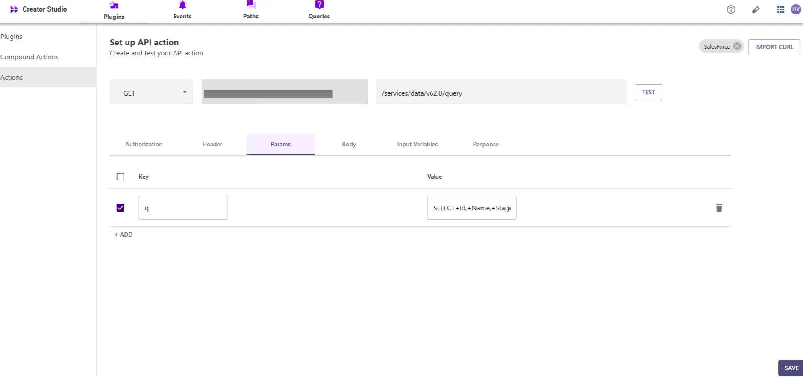
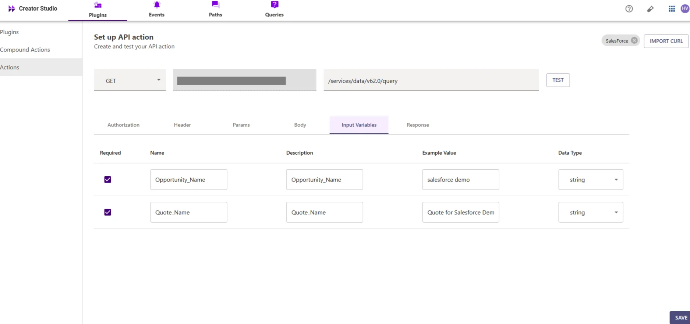
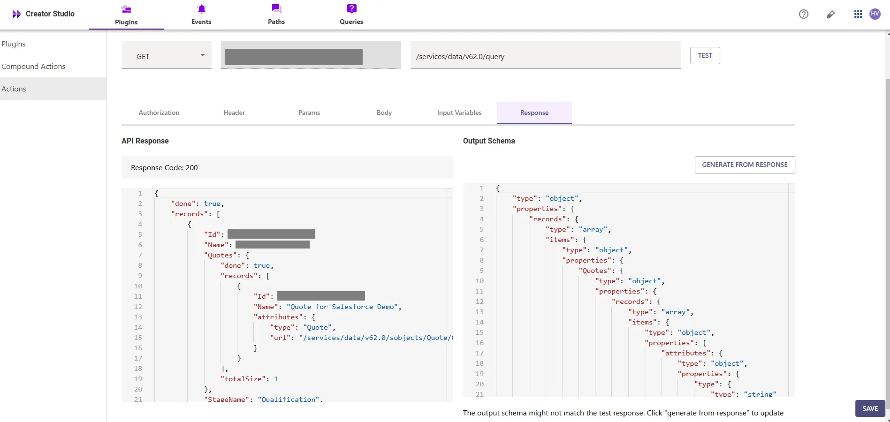
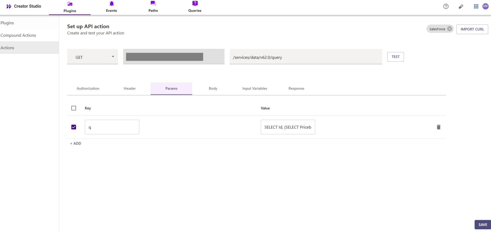
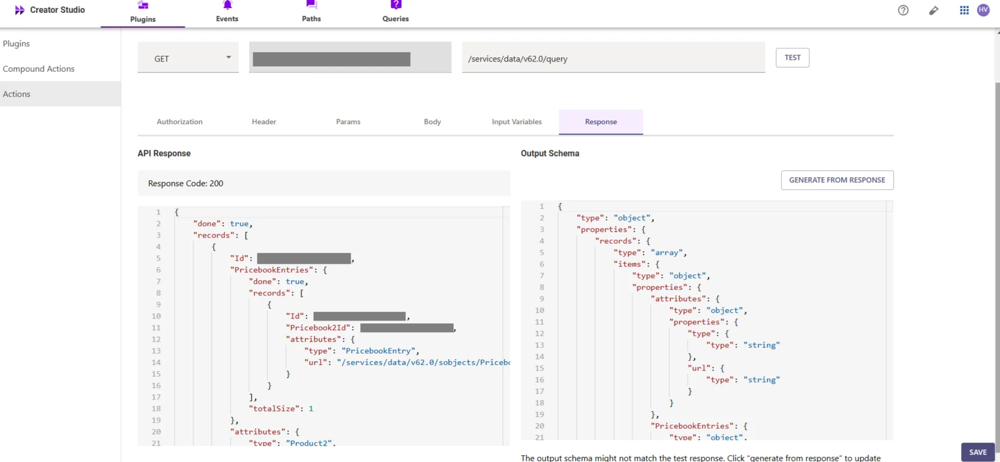
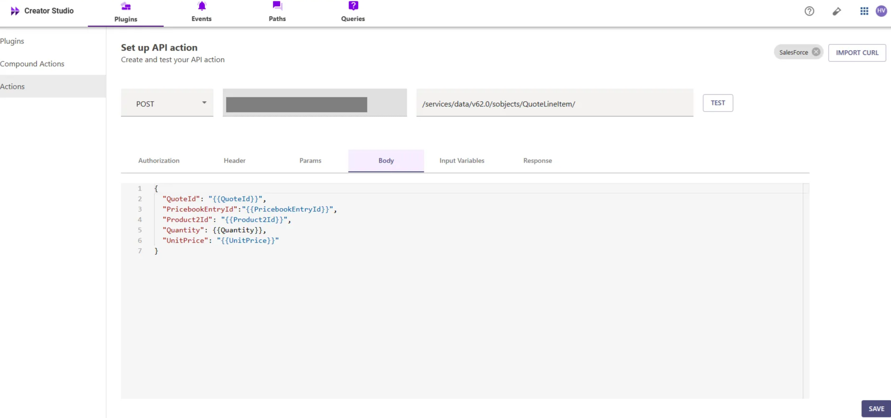
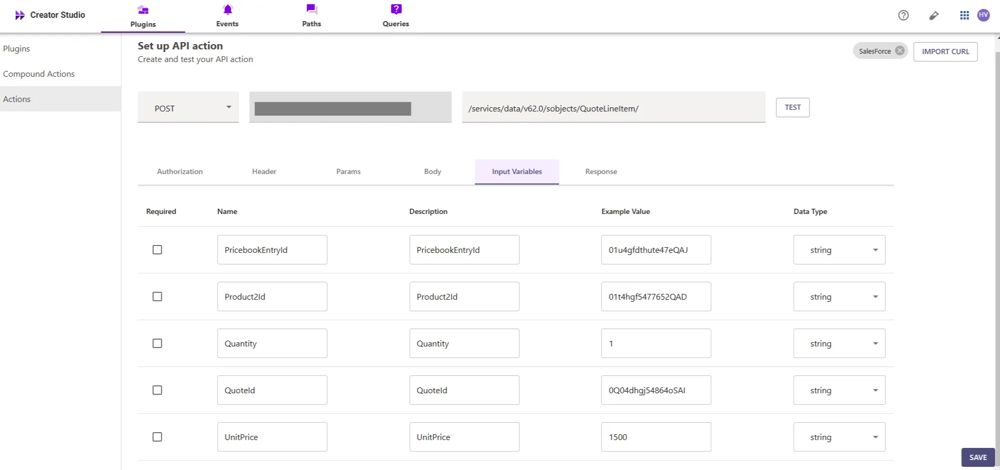
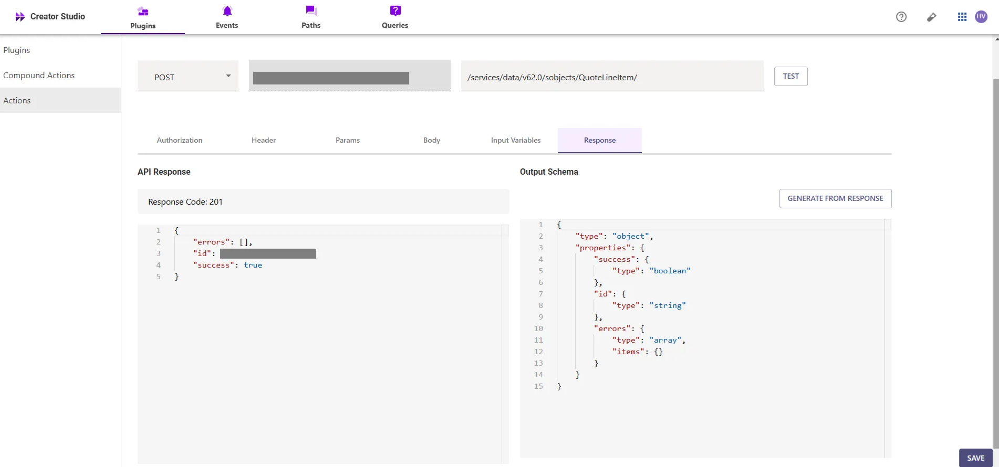
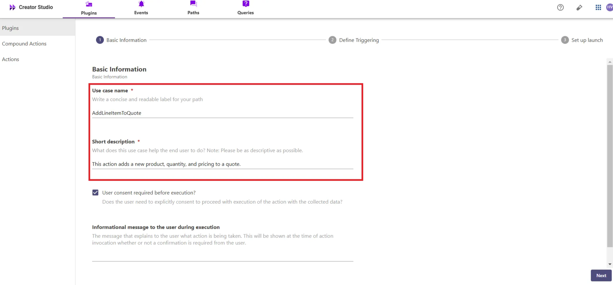
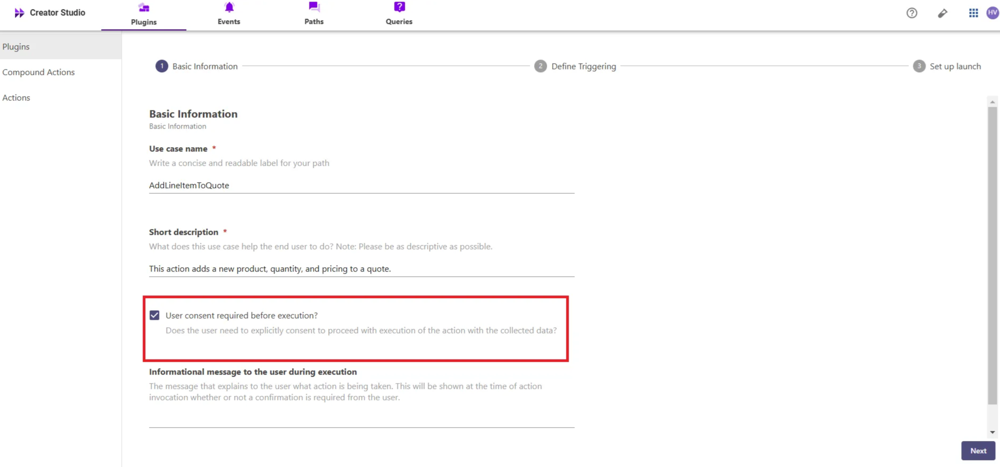

# Introduction:

Salesforce is a CRM platform, and the "Add Line Item to Quote" plugin simplifies the process of adding line items to a quote in your Salesforce account. By integrating this feature with your bot, users can quickly and efficiently add and manage line items within their quotes, improving workflow and organization.

This guide will show you how to add the "Add Line Item to Quote" feature to your bot using Creator Studio. Let's get started!

# **Prerequisites:**

- API Testing Tool
- Salesforce Connector built in Creator Studio (follow the [Salesforce Authentication](https://developer.moveworks.com/creator-studio/resources/connector/?id=salesforce) guide to create your connector)

# **What are we building?**

### **Conversation Design**

This [purple chat](https://developer.moveworks.com/creator-studio/resources/plugin?id=salesforce-add-line-item-to-quote) shows the experience we are going to build.

# **Creator Studio Components**

- **Triggers:**
    1.   Natural Language
- **Slots:**
    1. **Opportunity Name:** Query the related Opportunity using the Opportunity Name..
    2. **Quote Name:** Query the specific Quote using the Quote Name
    3. **Product Name:** Query relevant product details using the Product Name
    4. **Create Quote Line Item:** Capture the details to create a quote line item
- **Actions:**
    1. **Get Qualified Opportunity:** Fetch the qualified opportunity using the Opportunity Name and Quote Name via Salesforce API.
    2. **Retrieve Product Details:** Retrieve product information based on the provided Product Name, PricebookEntry, and Product2 details
    3. **Create Quote Line Item:** This action adds a line item to a quote with the specified product details for the quote
- **Guidelines:**
    1. None

# **API Research**

To build this use case, we will use **three APIs** to achieve the goal of adding a line item to a quote in a Salesforce account


## API #1: Retrieve Opportunity and Quote Information

The [Retrieve Opportunity and Quote Information](https://developer.salesforce.com/docs/atlas.en-us.object_reference.meta/object_reference/sforce_api_objects_opportunity.htm) API retrieves **Opportunity** and **Quote** details based on the given **Opportunity Name** and **Quote Name** from Salesforce using a SOQL query. This API helps in associating the correct quote with its related opportunity.

- **Purpose**: Fetches **Opportunity** and **Quote** information based on **Opportunity Name** and **Quote Name**.
- **Features**: Filters by **Opportunity Name** and **Quote Name** and returns the relevant Opportunity and Quote data.
- **Example**: Queries Salesforce to get the **Opportunity** and **Quote** information

```bash
curl --location 'https://<YOUR_DOMAIN>/services/data/v62.0/query/?q=SELECT+Id,+Name,+StageName,+%28SELECT+Id,+Name+FROM+Quotes+WHERE+Name=%27{{Quote_Name}}%27%29+FROM+Opportunity+WHERE+Name+LIKE+%27%25{{Opportunity_Name}}%25%27+AND+%28StageName=%27Qualification%27+OR+StageName=%27Qualified%27%29' \
--header 'Authorization: Bearer <ACCESS_TOKEN>'

```

## API #2: Retrieve Product and Pricebook Entry Information

The [Retrieve Product and Pricebook Entry Information](https://developer.salesforce.com/docs/atlas.en-us.sfFieldRef.meta/sfFieldRef/salesforce_field_reference_Product2.htm) API retrieves **Product** and **PricebookEntry** details based on the given **Product Name** from Salesforce using a SOQL query. This API helps in associating products with their active pricebook entries, which are essential for adding line items to quotes.

- **Purpose**: Fetches **Product** details based on **Product Name** and its associated **PricebookEntry** information.
- **Features**: Filters by **Product Name** and returns the **PricebookEntry** details with active pricebook information.
- **Example**: Queries Salesforce to get the **Product** and **PricebookEntry** details

```bash
curl --location 'https://<YOUR_DOMAIN>/services/data/v62.0/query/?q=SELECT+Id,+%28SELECT+Pricebook2Id,+Id+FROM+PricebookEntries+WHERE+Pricebook2.IsActive+=+TRUE%29+FROM+Product2+WHERE+Name+LIKE+%27%25{{Product_Name}}%25%27' \
--header 'Authorization: Bearer <ACCESS_TOKEN>'

```

## **API #3: Create Quote Line Item in Salesforce**

The [**Create Quote Line Item in Salesforce**](https://developer.salesforce.com/docs/atlas.en-us.object_reference.meta/object_reference/sforce_api_objects_quote.htm) API allows you to add a new **Quote Line Item** to a quote in Salesforce. Using the provided **Quote ID**, **Pricebook Entry ID**, **Product ID**, **Quantity**, and **Unit Price**, this API adds a line item to the specified quote. This is crucial for creating detailed quotes with specific products and prices.

- **Purpose**: Creates a new **Quote Line Item** in Salesforce.
- **Features**: Supports adding **Quote ID**, **Pricebook Entry ID**, **Product ID**, **Quantity**, and **Unit Price**.
- **Example**: Adds a new line item to a quote in Salesforce with the provided details

```bash
curl --location 'https://<YOUR_DOMAIN>/services/data/v62.0/sobjects/QuoteLineItem' \
--header 'Content-Type: application/json' \
--header 'Authorization: Bearer <YOUR_AUTH_TOKEN>' \
--data '{
  "QuoteId": "<QUOTE_ID>",
  "PricebookEntryId": "<PRICEBOOK_ENTRY_ID>",
  "Product2Id": "<PRODUCT2_ID>",
  "Quantity": <QUANTITY>,
  "UnitPrice": "<UNIT_PRICE>"
}'
```

- **<YOUR_DOMAIN>**: Your Salesforce instance domain (e.g., `yourcompany.my.salesforce.com`).
- **<QUOTE_ID>**, **<PRICEBOOK_ENTRY_ID>**, **<PRODUCT2_ID>**, **<QUANTITY>**, **<UNIT_PRICE>**: The details for the **Quote Line Item**, including the associated **Quote ID**, **Pricebook Entry ID**, **Product ID**, quantity, and unit price.

# **Steps**

## **Step 1: Build HTTP Action**

Define your HTTP Actions for fetching the **Opportunity** and **Quote** details from Salesforce based on the provided **Opportunity Name** and **Quote Name**

### 1. **In Creator Studio, Create a New Action**:

- Navigate to **Plugins** section > **Actions** tab.
- Click on **CREATE** to define a new action.


- Click on the `IMPORT CURL` option and paste the following cURL command:

```bash
curl --location 'https://<YOUR_DOMAIN>/services/data/v62.0/query/?q=SELECT+Id,+Name,+StageName,+%28SELECT+Id,+Name+FROM+Quotes+WHERE+Name=%27{{Quote_Name}}%27%29+FROM+Opportunity+WHERE+Name+LIKE+%27%25{{Opportunity_Name}}%25%27+AND+%28StageName=%27Qualification%27+OR+StageName=%27Qualified%27%29' \
--header 'Authorization: Bearer <ACCESS_TOKEN>'

```

- Click on `Use Existing Connector` > select the [**Salesforce Connector**](https://developer.moveworks.com/creator-studio/resources/connector/?id=salesforce) that you just created > Click on `Apply`. This will populate the Base URL and the Authorization section of the API Editor.
- **Query Parameters for Salesforce Opportunity and Quote Query**
    - **Key (q)**: `Value` (`SELECT Id, Name, StageName, (SELECT Id, Name FROM Quotes WHERE Name = '{{Quote_Name}}') FROM Opportunity WHERE Name LIKE '%{{Opportunity_Name}}%' AND (StageName = 'Qualification' OR StageName = 'Qualified')`)
    - This query filters opportunities by **Opportunity Name** and retrieves related quotes if the opportunity is in the **Qualification** or **Qualified** stage, ensuring only relevant data is returned



- **Input Variables**:
    - **Opportunity_Name**: Example Value (Salesforce Demo)
    - **Quote_Name**: Example Value (Quote for Salesforce Demo)
    



- Click on `Test` to check if the Connector setup was successful and expect a successful response as shown below. You will see the request response on the left side and the generated output schema on the right.
- If the output schema does not match the API response or fails to populate automatically, kindly click the `GENERATE FROM RESPONSE` button to refresh and align the schema with the API response.



- Add the **API Name** and **API Description** as shown below, then click the `Save` button


### 2. Fetch Product Details

- Repeat the steps above to create another action.
- Click on the `IMPORT CURL` option and paste the following cURL command:

```bash
curl --location 'https://<YOUR_DOMAIN>/services/data/v62.0/query/?q=SELECT+Id,+%28SELECT+Pricebook2Id,+Id+FROM+PricebookEntries+WHERE+Pricebook2.IsActive+=+TRUE%29+FROM+Product2+WHERE+Name+LIKE+%27%25{{Product_Name}}%25%27' \
--header 'Authorization: Bearer <ACCESS_TOKEN>'

```

- Click on `Use Existing Connector` > select the [Salesforce **connector**](https://developer.moveworks.com/creator-studio/resources/connector/?id=salesforce) that you just created > Click on `Apply`. This will populate the Base URL and the Authorization section of the API Editor.
- **Query Parameters for Salesforce Product Query**:
    - **Key (q)**: Value (`SELECT Id, (SELECT Pricebook2Id, Id FROM PricebookEntries WHERE Pricebook2.IsActive = TRUE) FROM Product2 WHERE Name LIKE '%{{Product_Name}}%'`)
    - This query filters **Product2** records based on the **Product Name** using the **LIKE** operator, allowing for partial matching. It retrieves the related **PricebookEntry** information where the **Pricebook2** is active and returns the **Id** for both **Product2** and the related **PricebookEntry** details.



- **Input Variables** :

             Product_Name : Example Value (GenWatt Diesel 200kW).


- Test the Connector setup as described earlier to verify the response. If the output schema is incorrect or missing, click `GENERATE FROM RESPONSE` to update it.



- Add the **API Name** and **API Description** as shown below, then click the `Save` button


### 3. Create Quote Line Item

- Repeat the steps above to create another action.
- Click on the `IMPORT CURL` option and paste the following CURL command:

```bash
curl --location 'https://<YOUR_DOMAIN>.my.salesforce.com/services/data/v62.0/sobjects/QuoteLineItem' \
--header 'Content-Type: application/json' \
--header 'Authorization: Bearer <YOUR_AUTH_TOKEN>' \
--data '{
  "QuoteId": "<QUOTE_ID>",
  "PricebookEntryId": "<PRICEBOOK_ENTRY_ID>",
  "Product2Id": "<PRODUCT2_ID>",
  "Quantity": <QUANTITY>,
  "UnitPrice": "<UNIT_PRICE>"
}'
```

- To create a Quote Line Item in Salesforce, we send a POST request with the following body:



- **QuoteId**: The ID of the quote to which the line item is being added.
- **PricebookEntryId**: The ID of the pricebook entry associated with the product.
- **Product2Id**: The ID of the product being added to the quote.
- **Quantity**: The quantity of the product in the quote.
- **UnitPrice**: The unit price of the product in the quote



- We have provided sample input variables for **QuoteId**, **PricebookEntryId**, **Product2Id**, **Quantity**, and **UnitPrice**.
- Using these input variables, we tested the plugin by making a **POST** request to create a **Quote Line Item** in Salesforce



- After that, you can test the plugin by checking the response, which will include the **Quote Line Item ID**. If the Quote Line Item has been successfully created, the response will return a **201** status code, indicating successful creation.
- If the output schema is incorrect or missing, click **`GENERATE FROM RESPONSE`** to update it.


- Add the **API Name** and **API Description** as shown below, then click the `Save` button

## **Step 2: Build Compound Action**

- Head over to the **Compound Actions** tab and click **CREATE**


- Give your Compound Action a **Name** and **Description** , then click `Next` Note: Name only letters, numbers, and underscores. We suggest using snake case or camel case formatting (e.g. Workflow_name or workflowName )


- Click on the `Script editor` tab. Here you will be able to build your compound action using the YAML syntax.
- At a high-level, this syntax provides actions (HTTP Request, APIthon Scripts) and workflow logic (switch statements, for each loops, return statements, parallel, try/catch). See the [Compound Action Syntax](https://developer.moveworks.com/creator-studio/reference/compound_actions_syntax/) Reference for more info.

```yaml
steps:
  - action:
      output_key: Get_Qualified_Opportunity_With_StageName_result
      action_name: Get_Qualified_Opportunity_With_StageName
      progress_updates:
        on_complete: ON_COMPLETE_MESSAGE
        on_pending: ON_PENDING_MESSAGE
      input_args:
        Opportunity_Name: data.Opportunity_Name
        Quote_Name: data.Quote_Name
  - action:
      output_key: Get_Product_Info_result
      action_name: Get_Product_Info
      progress_updates:
        on_complete: ON_COMPLETE_MESSAGE
        on_pending: ON_PENDING_MESSAGE
      input_args:
        Product_Name: data.Product_Name
  - action:
      output_key: AddLineItemtoQuote_result
      action_name: AddLineItemtoQuote
      progress_updates:
        on_complete: ON_COMPLETE_MESSAGE
        on_pending: ON_PENDING_MESSAGE
      input_args:
        UnitPrice: data.UnitPrice
        PricebookEntryId: data.Get_Product_Info_result.records[0].PricebookEntries.records[0].Id
        Quantity: data.Quantity
        QuoteId: data.Get_Qualified_Opportunity_With_StageName_result.records[0].Quotes.records[0].Id
        Product2Id: data.Get_Product_Info_result.records[0].Id

```

- Click on `Input fields` tab and click the `+Add` button. Here you will define the slots that you want to collect from users through the conversation and trigger your Workflow with. After defining the input fields, click the `Submit` button to save your changes.


## **Step 3: Publish Workflow to Plugin**

- Head over to the `Compound Actions` tab and click on the kebab menu ( `︙` )
- Next, click on `Publish Workflow to Plugin`
- First, verify your Plugin **Name** & **Short description** . This is autofilled from the name & description of your compound action.



- Next, consider whether to select the `User consent required before execution?` checkbox. Enabling this option prompts the user to confirm all slot values before executing the plugin, which is widely regarded as a best practice.



- Click `Next` and set up your positive and negative triggering examples. This ensures that the bot triggers your plugin given a relevant utterance.
- See our [guide](https://developer.moveworks.com/creator-studio/conversation-design/triggers/natural-language-triggers/#how-to-write-good-triggering-examples) on Triggering
- Lastly, click `Next` and set the **Launch Rules** you want your plugin to abide by.
    - See our [guide](https://developer.moveworks.com/creator-studio/administration/launch-options/) on Launch Rules

## **Step 4: See it in action!**

- After clicking the final `Submit` button, your plugin will be published to the bot and triggerable based on your **Launch Rules.**
- You should wait up to **5 minutes** after making changes before trying to test in your bot!
    - If you run into an issue:
        1. Check our [troubleshooting guides](https://developer.moveworks.com/creator-studio/troubleshooting/support/)
        2. Understand your issue using Logs
        3. Reach out to Support

# **Congratulations!**

You’ve successfully added the "Add Line Item to Quote" feature to your Salesforce account in your Copilot! Explore our other guides for more ideas on what to build next.