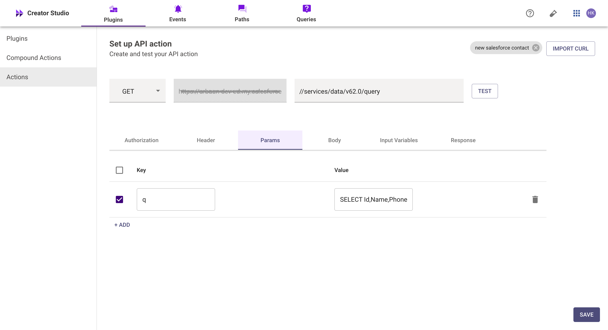
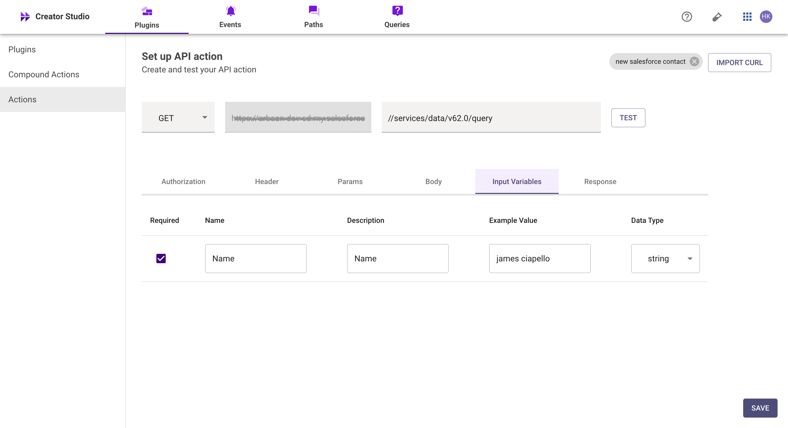
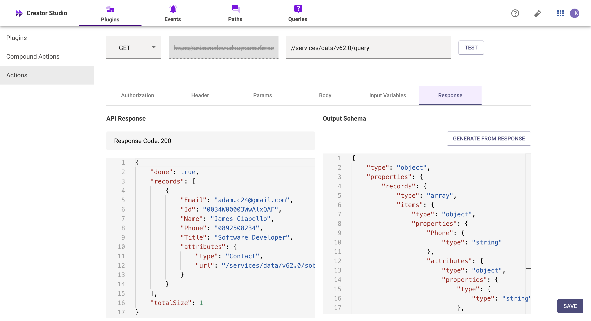
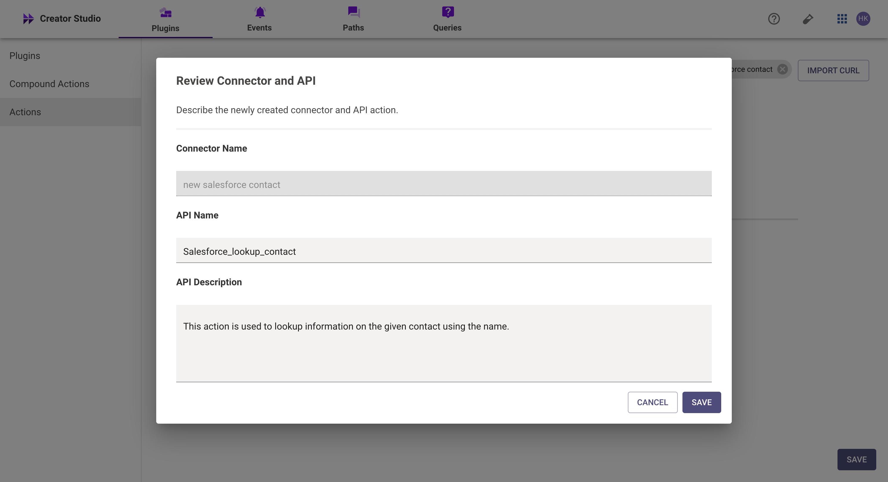
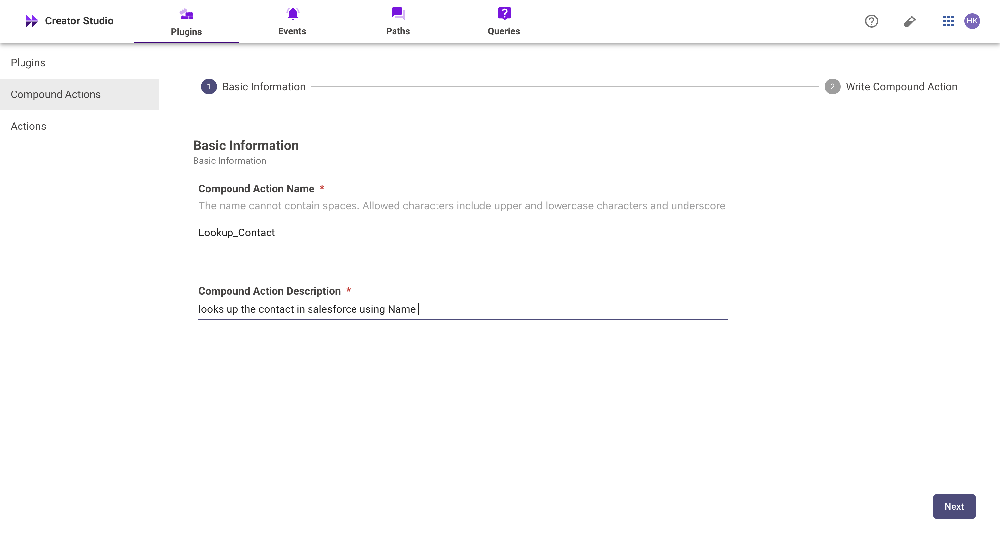
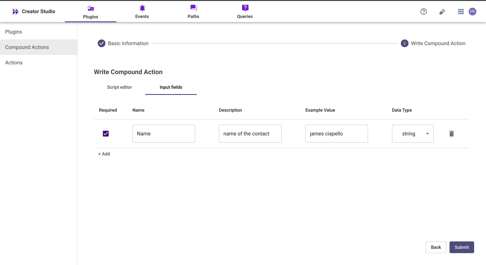
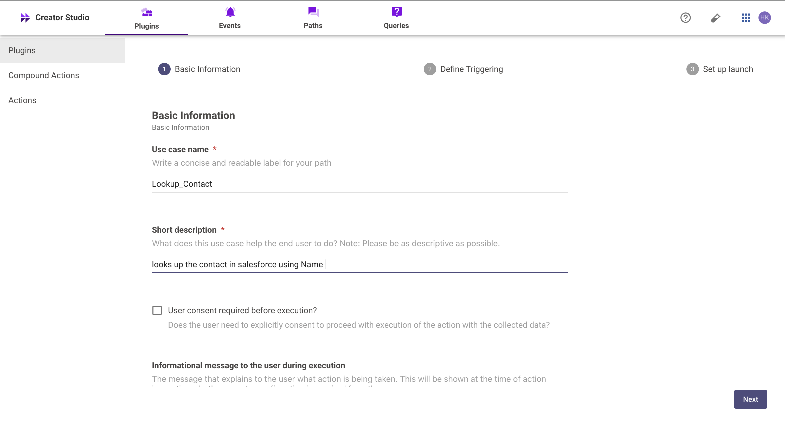

# Plugin to lookup contact in salesforce

# Introduction

Salesforce is a CRM platform, and the "Look Up Contact Information in Salesforce" plugin helps you efficiently retrieve contact details from your Salesforce account. By integrating this feature with your bot, users can quickly access and manage contact information, enhancing productivity and organization.

This guide will show you how to add the "Look Up Contact Information in Salesforce" feature to your bot using Creator Studio. Let's get started!

# Prerequisites

- [Postman](https://www.postman.com/) or an API Testing Tool
- Salesforce Connector built in Creator Studio (follow the [Salesforce Authentication](https://developer.moveworks.com/creator-studio/resources/connector/?id=salesforce) guide to create your connector)

# What are we building?

### **Conversation Design**

This [purple chat](https://developer.moveworks.com/creator-studio/developer-tools/purple-chat-builder/?workspace=%7B%22title%22%3A%22My+Workspace%22%2C%22botSettings%22%3A%7B%7D%2C%22mocks%22%3A%5B%7B%22id%22%3A2630%2C%22title%22%3A%22Mock+2%22%2C%22transcript%22%3A%7B%22settings%22%3A%7B%22colorStyle%22%3A%22LIGHT%22%2C%22startTime%22%3A%2211%3A43+AM%22%2C%22defaultPerson%22%3A%22GWEN%22%2C%22editable%22%3Atrue%7D%2C%22messages%22%3A%5B%7B%22from%22%3A%22USER%22%2C%22text%22%3A%22%3Cp%3EI+need+to+create+a+new+contact+in+Salesforce.%3C%2Fp%3E%22%7D%2C%7B%22from%22%3A%22BOT%22%2C%22text%22%3A%22%3Cp%3E+Sure%21+I+can+help+with+that.+Please+provide+the+contact%27s+name%2C+email%2C+phone+number%2C+and+the+associated+account.+%3C%2Fp%3E%22%7D%2C%7B%22from%22%3A%22USER%22%2C%22text%22%3A%22%3Cp%3EName%3A+John+Doe%3Cbr%3EEmail%3A+john.doe%40abcinc.com%3Cbr%3EPhone%3A+%2B9876543210%3Cbr%3EAccount%3A+ABC+Inc.+%3C%2Fp%3E%22%7D%2C%7B%22from%22%3A%22ANNOTATION%22%2C%22text%22%3A%22%3Cp%3E+Creates+a+new+contact+in+Salesforce+with+the+provided+details.+%3C%2Fp%3E%22%7D%2C%7B%22from%22%3A%22BOT%22%2C%22text%22%3A%22%3Cp%3E+The+new+contact+for+John+Doe+at+ABC+Inc.+has+been+successfully+created.+%3C%2Fp%3E%22%7D%2C%7B%22from%22%3A%22BOT%22%2C%22text%22%3A%22%3Cp%3E+%3Cb%3ENew+Contact+Created%3C%2Fb%3E%3Cbr%3E%3Cbr%3E%3Cb%3EName%3A%3C%2Fb%3E+John+Doe%3Cbr%3E%3Cb%3EEmail%3A%3C%2Fb%3E+john.doe%40abcinc.com%3Cbr%3E%3Cb%3EPhone%3A%3C%2Fb%3E+%2B9876543210%3Cbr%3E%3Cb%3EAccount%3A%3C%2Fb%3E+ABC+Inc.%3Cbr%3E%3C%2Fp%3E%22%7D%5D%7D%7D%5D%7D) shows the experience we are going to build.

# Creator Studio Components

- **Triggers:**
    1. **Natural Language**
    2. Identify user queries or commands related to lookup contact information in Salesforce.
- **Slots:**
    1. **Account Name:** Query Account Name to look up contact details.
- **Actions:**
    1. **Retrieve Contact Information:** Look up contact details using the Account Name via Salesforce API.
- **Guidelines:**
    1. **Lookup Contact:**
        
        none.
        

# API Research

To build this use case, we will use one **API** to achieve the goal of creating a Salesforce account:


## API #1:Query the contact with Name:

The Retrieve [contact information by account name](https://developer.salesforce.com/docs/atlas.en-us.object_reference.meta/object_reference/sforce_api_objects_opportunity.htm) API retrieves contact details for a given **Account Name** from Salesforce using a SOQL query. This API helps in accessing contact information associated with specific Salesforce accounts.

- **Purpose**: Fetches contact details based on **Account Name**.
- **Features**: Supports filtering by **Account Name** and returns relevant contact information.
- **Example**: Queries Salesforce to retrieve contact information for the specified **Account Name**

```jsx
curl --location 'https://<YOUR_DOMAIN>//services/data/v62.0/query?q=SELECT%20Id%2CName%2CPhone%2CEmail%20FROM%20Contact%20WHERE%20Name%3D%27james%20ciapello%27' \
--header 'Authorization: Bearer\
--header 'Content-Type: application/json'
```

- **<YOUR_DOMAIN>**: Your Salesforce instance domain (e.g., `yourcompany.my.salesforce.com`).
- **<ACCOUNT_NAME>**: The name of the account used to look up contact information in Salesforce.

# Steps

## **Step 1: Build HTTP Action**

Define your HTTP Actions for fetching the **Account ID** from Salesforce based on the provided **Account Name**.

1. **In Creator Studio, Create a New Action**:

- Navigate to **Plugins** section > **Actions** tab.
- Click on **CREATE** to define a new action.


Click on the `IMPORT CURL` option and paste the following cURL command:

```jsx
curl --location 'https://<YOUR_DOMAIN>//services/data/v62.0/query?q=SELECT%20Id%2CName%2CPhone%2CEmail%20FROM%20Contact%20WHERE%20Name%3D%27james%20ciapello%27' \
--header 'Authorization: Bearer\
--header 'Content-Type: application/json'
```

- Click on `Use Existing Connector` > select the [Salesforce](https://developer.moveworks.com/creator-studio/resources/connector/?id=salesforce) [**connector**](https://developer.moveworks.com/creator-studio/resources/connector/?id=jira) that you just created > Click on `Apply`. This will populate the Base URL and the Authorization section of the API Editor.
- **Query Parameters for Salesforce contact Query**
- **Key ( q )**: Value  (SELECT Id, Name, Phone, Email, Title FROM Contact WHERE Name='{{Name}}’)
- This query filters contact records associated with an account based on the **Account Name** and retrieves relevant contact information (such as Phone, Email, Title etc.), ensuring that only the essential contact details are returned for the specified account



- **Input Variables** :
    
         Name : Example Value (ABC1).
    



- Click on `Test` to check if the Connector setup was successful and expect a successful response as shown below. You will see the request response on the left side and the generated output schema on the right.
- If the output schema does not match the API response or fails to populate automatically, kindly click the `GENERATE FROM RESPONSE` button to refresh and align the schema with the API response.



Add the **API Name** and **API Description** as shown below, then click the Save button



## **Step 2: Build Compound Action**

- Head over to the **Compound Actions** tab and click **CREATE**


Give your Compound Action a **Name** and **Description** , then click `Next` Note: Name only letters, numbers, and underscores. We suggest using snake case or camel case formatting (e.g. Workflow_name or workflowName )



- Click on the `Script editor` tab. Here you will be able to build your compound action using the YAML syntax.
- At a high-level, this syntax provides actions (HTTP Request, APIthon Scripts) and workflow logic (switch statements, for each loops, return statements, parallel, try/catch). See the [Compound Action Syntax](https://developer.moveworks.com/creator-studio/reference/compound_actions_syntax/) Reference for more info.

```yaml
steps:
  - action:
      output_key: result
      action_name: Salesforce_lookup_contact
      progress_updates:
        on_complete: ON_COMPLETE_MESSAGE
        on_pending: ON_PENDING_MESSAGE
      input_args:
        Name: data.Name
  - return:
      output_mapper:
        Title: data.result.records[0].Title
        Phone: data.result.records[0].Phone
        Id: data.Id.result.records[0].Id
        Email: data.result.records[0].Email
```

Click on `Input fields` tab and click the `+Add` button. Here you will define the slots that you want to collect from users through the conversation and trigger your Workflow with. After defining the input fields, click the `Submit` button to save your changes.



## **Step 3: Publish Workflow to Plugin**

- Head over to the `Compound Actions` tab and click on the kebab menu ( `︙` )
- Next, click on `Publish Workflow to Plugin`
- First, verify your Plugin **Name** & **Short description** . This is autofilled from the name & description of your compound action.



Next, consider whether to select the `User consent required before execution?` checkbox. Enabling this option prompts the user to confirm all slot values before executing the plugin, which is widely regarded as a best practice.

- Click `Next` and set up your positive and negative triggering examples. This ensures that the bot triggers your plugin given a relevant utterance.
    - See our [guide](https://developer.moveworks.com/creator-studio/conversation-design/triggers/natural-language-triggers/#how-to-write-good-triggering-examples) on Triggering
- Lastly, click `Next` and set the **Launch Rules** you want your plugin to abide by.
    - See our [guide](https://developer.moveworks.com/creator-studio/administration/launch-options/) on Launch Rules

## **Step 4: See it in action!**

- After clicking the final `Submit` button, your plugin will be published to the bot and triggerable based on your **Launch Rules.**
- You should wait up to **5 minutes** after making changes before trying to test in your bot!
- If you run into an issue:
    1. Check our [troubleshooting guides](https://developer.moveworks.com/creator-studio/troubleshooting/support/)
    2. Understand your issue using Logs
    3. Reach out to Support

# **Congratulations!**

You've just added the "Lookup Contact Information" feature inside your Salesforce account to your Copilot! Explore our other guides for more inspiration on what to build next.