# Introduction:

Salesforce is a CRM platform, and the "Create Quote in Salesforce" plugin simplifies generating new quotes directly in your Salesforce account. By integrating this feature with your bot, users can easily create and manage quotes, improving efficiency and organization

This guide will show you how to add the "Create Quote in Salesforce" feature to your bot using Creator Studio

# **Prerequisites:**

- Salesforce Connector built in Creator Studio (follow the [Salesforce Authentication](https://developer.moveworks.com/creator-studio/resources/connector/?id=salesforce) guide to create your connector)

# **What are we building?**

### **Conversation Design**

This [purple chat](https://developer.moveworks.com/creator-studio/developer-tools/purple-chat?conversation=%7B%22startTimestamp%22%3A%2211%3A43%2BAM%22%2C%22messages%22%3A%5B%7B%22role%22%3A%22user%22%2C%22parts%22%3A%5B%7B%22richText%22%3A%22I+need+to+build+a+quote+for+Acme+Inc.+for+the+new+X500+SKU+they+are+interested+in+purchasing.%22%7D%5D%7D%2C%7B%22role%22%3A%22assistant%22%2C%22parts%22%3A%5B%7B%22reasoningSteps%22%3A%5B%7B%22status%22%3A%22success%22%2C%22richText%22%3A%22Searches+Salesforce+for+Acme+Inc.+and+SKU+details%22%7D%5D%7D%2C%7B%22richText%22%3A%22%3Cp%3EI+found+Acme+Inc.+in+Salesforce.+Please+provide+more+details+to+build+the+quote.%3Cbr%3E%3C%2Fp%3E%22%7D%2C%7B%22richText%22%3A%22%3Cb%3E%3Cp%3EQuote+Details+Needed%3Cbr%3E%3C%2Fp%3E%3C%2Fb%3E%3Cbr%3E%3Cp%3E%3Cb%3ECustomer%3A%3C%2Fb%3E+Acme+Inc.%3Cbr%3E%3Cb%3ESKU%3A%3C%2Fb%3E+X500%3Cbr%3E%3C%2Fp%3E%22%7D%2C%7B%22buttons%22%3A%5B%7B%22style%22%3A%22outlined%22%2C%22buttonText%22%3A%22Enter+Quantity%22%7D%2C%7B%22style%22%3A%22outlined%22%2C%22buttonText%22%3A%22Enter+Pricing%22%7D%2C%7B%22style%22%3A%22outlined%22%2C%22buttonText%22%3A%22Specify+Quote+Validity%22%7D%5D%7D%5D%7D%2C%7B%22role%22%3A%22user%22%2C%22parts%22%3A%5B%7B%22richText%22%3A%22%3Cp%3EQuantity+is+100+units+at+a+price+of+%24150+each.+Quote+is+valid+for+30+days.%3Cbr%3E%3C%2Fp%3E%22%7D%5D%7D%2C%7B%22role%22%3A%22assistant%22%2C%22parts%22%3A%5B%7B%22richText%22%3A%22%3Cp%3EPlease+confirm+the+quote+details+for+Acme+Inc.%3Cbr%3E%3C%2Fp%3E%22%7D%2C%7B%22richText%22%3A%22%3Cb%3E%3Cp%3EQuote+Confirmation%3Cbr%3E%3C%2Fp%3E%3C%2Fb%3E%3Cbr%3E%3Cp%3E%3Cb%3ECustomer%3A%3C%2Fb%3E+Acme+Inc.%3Cbr%3E%3Cb%3ESKU%3A%3C%2Fb%3E+X500%3Cbr%3E%3Cb%3EQuantity%3A%3C%2Fb%3E+100+units%3Cbr%3E%3Cb%3EPrice%3A%3C%2Fb%3E+%24150+each%3Cbr%3E%3Cb%3EValidity%3A%3C%2Fb%3E+30+days%3C%2Fp%3E%22%7D%2C%7B%22buttons%22%3A%5B%7B%22style%22%3A%22filled%22%2C%22buttonText%22%3A%22Confirm+and+Build+Quote+in+Salesforce%22%7D%2C%7B%22style%22%3A%22outlined%22%2C%22buttonText%22%3A%22Edit+Details%22%7D%2C%7B%22style%22%3A%22outlined%22%2C%22buttonText%22%3A%22Cancel%22%7D%5D%7D%5D%7D%5D%7D) shows the experience we are going to build

# **Creator Studio Components**

- **Triggers:**
    1. Natural Language
- **Slots:**
    1.  **Account Name:** Query Account Name by Account ID.
    2.  **Product Name:** Capture and store product details for creating the quote.
    3.  **Create Quote:** Capture and store details to create a quote and quote line item.
- **Actions:**
    1. **Get Latest Opportunity:** Retrieve the latest opportunity by account name using Salesforce API
    2. **Fetch Product Details:** Fetch product details, including Pricebook2 and Pricebook Entry details, based on the product name.
    3. **Create Quote:** Create a new quote in Salesforce with Opportunity ID, quote name, Pricebook2Id, and status.
    4. **Get Quote:** Retrieve the created quote based on account name and product name
    5. **Create Quote Line Item:** Create a new quote line item with Unit Price, Quantity, Pricebook Entry Id, and Quote Id.
- **Guidelines:**
    1. None

# **API Research**

To build this use case, we will use **multiple APIs** to achieve the goal of creating a quote in a Salesforce account:

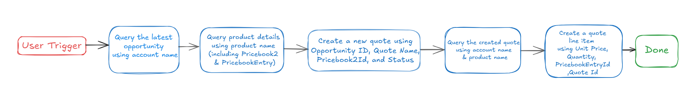

## API #1: Retrieve Opportunity by Account Name

The [Retrieve Opportunity by Account Name](https://developer.salesforce.com/docs/atlas.en-us.sfFieldRef.meta/sfFieldRef/salesforce_field_reference_Opportunity.htm) API retrieves the **latest Opportunity** associated with a given **Account Name** in Salesforce using a SOQL query. This API helps in associating quotes with the correct opportunity for a specific account.

- **Purpose**: Fetches the **latest Opportunity** based on **Account Name**.
- **Features**: Filters by **Account Name** and returns the **latest Opportunity** based on Close Date
- **Example**: Queries Salesforce to get the latest Opportunity

```bash
curl --location 'https://<YOUR_DOMAIN>/services/data/v62.0/query/?q=SELECT+Id,+Name,+Account.Name,+CloseDate+FROM+Opportunity+WHERE+Account.Name+LIKE+%27%25{{Account_Name}}%25%27+ORDER+BY+CloseDate+DESC+LIMIT+1' \
--header 'Authorization: Bearer <ACCESS_TOKEN>'

```

## API #2: Retrieve Product and Pricing Details by Product Name

The [Retrieve Product and Pricing Details by Product Name](https://developer.salesforce.com/docs/atlas.en-us.cpq_dev_api.meta/cpq_dev_api/cpq_api_read_product.htm) API retrieves product and pricing details from Salesforce using a SOQL query. This API helps in fetching the relevant **Pricebook** and **Product** information needed to create a quote.

- **Purpose**: Fetches **Product** and **Pricebook** details based on **Product Name**.
- **Features**: Filters by **Product Name** and returns active **PricebookEntry** records.
- **Example**: Queries Salesforce to get product and pricing details:

```bash
curl --location 'https://<YOUR_DOMAIN>/services/data/v62.0/query/?q=SELECT+Id,+Pricebook2.Id,+Pricebook2.Name,+Product2.Id,+Product2.Name,+Product2.ProductCode,+UnitPrice+FROM+PricebookEntry+WHERE+Product2.Name+LIKE+%27%25{{Product_Name}}%25%27+AND+Pricebook2.IsActive+=+true' \
--header 'Authorization: Bearer <ACCESS_TOKEN>'

```

## API #3: Create Quote in Salesforce

The [Create Quote in Salesforce](https://developer.salesforce.com/docs/atlas.en-us.cpq_dev_api.meta/cpq_dev_api/cpq_api_pricing_parent.htm) API allows you to create a new **Quote** record in Salesforce. This API requires details such as **OpportunityId**, **Quote Name**, **Status**, and **Pricebook2Id** to generate a new quote, which can then be used for generating quote line items.

- **Purpose**: Creates a new **Quote** in Salesforce.
- **Features**: Supports adding **OpportunityId**, **Quote Name**, **Status**, and **Pricebook2Id**.
- **Example**: Creates a quote in Salesforce with the provided information:

```bash
curl --location 'https://<YOUR_DOMAIN>/services/data/v62.0/sobjects/Quote' \
--header 'Content-Type: application/json' \
--header 'Authorization: Bearer <YOUR_AUTH_TOKEN>' \
--data '{
  "OpportunityId": "<OPPORTUNITY_ID>",
  "Name": "<QUOTE_NAME>",
  "Status": "<QUOTE_STATUS>",
  "Pricebook2Id": "<PRICEBOOK2_ID>"
}'
```

- **<YOUR_DOMAIN>**: Your Salesforce instance domain (e.g., `yourcompany.my.salesforce.com`).
- **<OPPORTUNITY_ID>**, **<QUOTE_NAME>**, **<QUOTE_STATUS>**, **<PRICEBOOK2_ID>**: The quote details (opportunity ID, quote name, status, and pricebook2 ID).

## API #4: Retrieve Quote by Quote Name

The [Retrieve Quote by Quote Name](https://developer.salesforce.com/docs/atlas.en-us.cpq_dev_api.meta/cpq_dev_api/cpq_api_pricing_parent.htm) API retrieves a specific **Quote** from Salesforce based on the **Quote Name** using a SOQL query. This API helps in fetching the relevant quote, ensuring that it can be accessed for review, updates, or processing.

- **Purpose**: Fetches a **Quote** based on the **Quote Name**.
- **Features**: Supports filtering by **Quote Name** and returns the matching quote details.
- **Example**: Queries Salesforce to get the **Quote**

```bash
curl --location 'https://<YOUR_DOMAIN>/services/data/v62.0/query/?q=SELECT+Id,+Name+FROM+Quote+WHERE+Name+LIKE+%27%25{{Quote_Name}}%25%27' \
--header 'Authorization: Bearer <ACCESS_TOKEN>'

```

## API #5: Create Quote Line Item

The [Create Quote Line Item](https://developer.salesforce.com/docs/atlas.en-us.cpq_dev_api.meta/cpq_dev_api/cpq_api_pricing_parent.htm) API allows you to create a new **Quote Line Item** in Salesforce. This API requires details such as **QuoteId**, **PricebookEntryId**, **Quantity**, and **UnitPrice** to generate a new line item associated with a specific quote.

- **Purpose**: Creates a new **Quote Line Item** in Salesforce based on the provided **QuoteId**, **PricebookEntryId**, **Quantity**, and **UnitPrice**.
- **Features**: Uses a POST request to create a new Quote Line Item record.
- **Example: Creates a quote line item in Salesforce with the provided information:**

```bash
curl --location 'https://<YOUR_DOMAIN>/services/data/v62.0/sobjects/QuoteLineItem' \
--header 'Content-Type: application/json' \
--header 'Authorization: Bearer <YOUR_AUTH_TOKEN>' \
--data '{
  "QuoteId": "<QUOTE_ID>",  
  "PricebookEntryId": "<PRICEBOOKENTRY_ID>",  
  "Quantity": "<QUANTITY>",
  "UnitPrice": "<UNIT_PRICE>"
}'
```

- **<YOUR_DOMAIN>**: Your Salesforce instance domain (e.g., `yourcompany.my.salesforce.com`).
- **<QUOTE_ID>**, **<PRICEBOOKENTRY_ID>**, **<QUANTITY>**, **<UNIT_PRICE>**: The quote line item details (quote ID, pricebook entry ID, quantity, and unit price).

# **Steps**

## **Step 1: Build HTTP Action**

Define your HTTP Actions for creating a quote in Salesforce based on the provided details.

 **1. Retrieve Opportunity by Account Name**
- In Creator Studio, Create a New Action
- Navigate to the **Plugins** section > **Actions** tab.
- Click on **CREATE** to define a new action.


- Click on the `IMPORT CURL` option and paste the following cURL command:

```bash
curl --location 'https://<YOUR_DOMAIN>/services/data/v62.0/query/?q=SELECT+Id,+Name,+Account.Name,+CloseDate+FROM+Opportunity+WHERE+Account.Name+LIKE+%27%25{{Account_Name}}%25%27+ORDER+BY+CloseDate+DESC+LIMIT+1' \
--header 'Authorization: Bearer <ACCESS_TOKEN>'

```

- Click on `Use Existing Connector` > select the  [**Salesforce Connector**](https://developer.moveworks.com/creator-studio/resources/connector/?id=salesforce) that you just created > Click on `Apply`. This will populate the Base URL and the Authorization section of the API Editor.
- **Query Parameters for Salesforce Opportunity Query**
- **Key ( q ):** Value (`SELECT Id, Name, Account.Name, CloseDate FROM Opportunity WHERE Account.Name LIKE '%{{Account_Name}}%' ORDER BY CloseDate DESC LIMIT 1`)
- This query retrieves the **Id**, **Name**, **Account Name**, and **CloseDate** of the most recent opportunity associated with a specific account, ordered by **CloseDate**

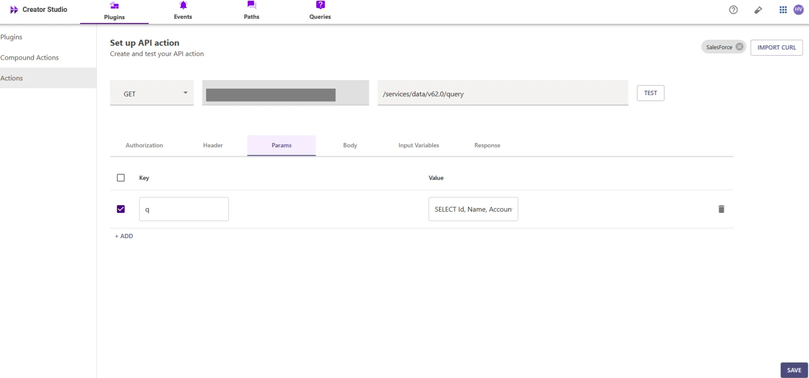

- **Input Variables** :

             Account_name : Example Value (ABC1).

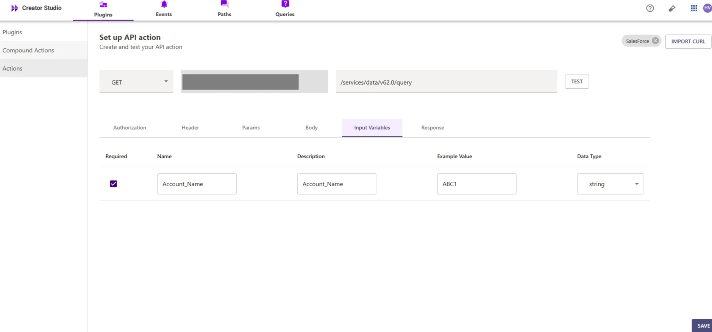

- Click on `Test` to check if the Connector setup was successful and expect a successful response as shown below. You will see the request response on the left side and the generated output schema on the right.
- If the output schema does not match the API response or fails to populate automatically, kindly click the `GENERATE FROM RESPONSE` button to refresh and align the schema with the API response.

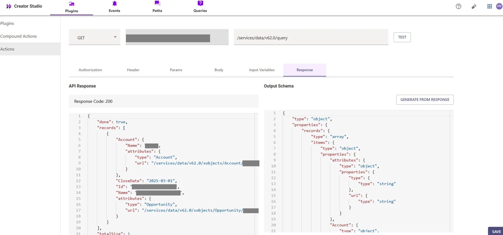

- Add the **API Name** and **API Description** as shown below, then click the `Save` button


**2. Retrieve Product and Pricing Details by Product Name**
- Repeat the steps above to create another action.
- Click on the `IMPORT CURL` option and paste the following cURL command:

```bash
curl --location 'https://<YOUR_DOMAIN>/services/data/v62.0/query/?q=SELECT+Id,+Pricebook2.Id,+Pricebook2.Name,+Product2.Id,+Product2.Name,+Product2.ProductCode,+UnitPrice+FROM+PricebookEntry+WHERE+Product2.Name+LIKE+%27%25{{Product_Name}}%25%27+AND+Pricebook2.IsActive+=+true' \
--header 'Authorization: Bearer <ACCESS_TOKEN>'

```

- Click on `Use Existing Connector` > select the [**Salesforce Connector**](https://developer.moveworks.com/creator-studio/resources/connector/?id=salesforce) that you just created > Click on `Apply`. This will populate the Base URL and the Authorization section of the API Editor.
- **Query Parameters for Salesforce Product Query**
- **Key ( q )**: Value (`SELECT Id, Pricebook2.Id, Pricebook2.Name, Product2.Id, Product2.Name, Product2.ProductCode, UnitPrice FROM PricebookEntry WHERE Product2.Name LIKE '%{{Product_Name}}%' AND Pricebook2.IsActive = true`)
- This query filters **PricebookEntry** records based on the **Product Name** and ensures only active **Pricebook2** entries are returned. It retrieves the **Id**, **Pricebook2** details, **Product2** details, and **UnitPrice** for relevant products

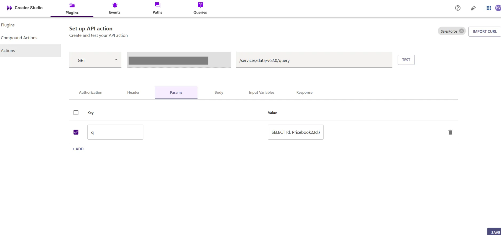

- **Input Variables** :

             Product_Name : Example Value (GenWatt Diesel 200kW).

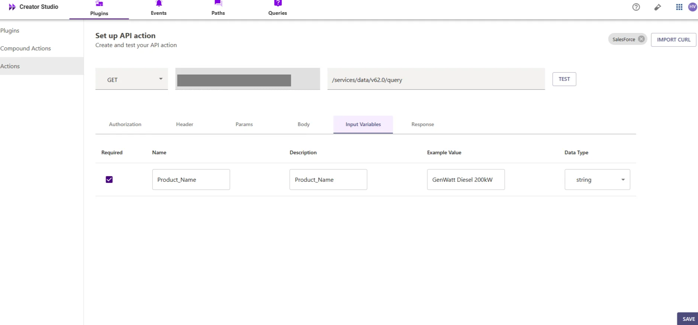

- Test the Connector setup as described earlier to verify the response. If the output schema is incorrect or missing, click `GENERATE FROM RESPONSE` to update it.

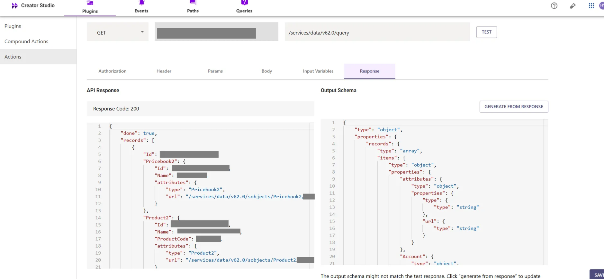

- Add the **API Name** and **API Description** as shown below, then click the `Save` button


**3. Create Quote inside Salesforce Account**
- Repeat the steps above to create another action.
- Click on the `IMPORT CURL` option and paste the following cURL command:

```bash
curl --location 'https://<YOUR_DOMAIN>/services/data/v62.0/sobjects/Quote' \
--header 'Content-Type: application/json' \
--header 'Authorization: Bearer <YOUR_AUTH_TOKEN>' \
--data '{
  "OpportunityId": "<OPPORTUNITY_ID>",
  "Name": "<QUOTE_NAME>",
  "Status": "<QUOTE_STATUS>",
  "Pricebook2Id": "<PRICEBOOK2_ID>"
}'
```

- To create a Quote in Salesforce, we send a **POST** request with the following body:

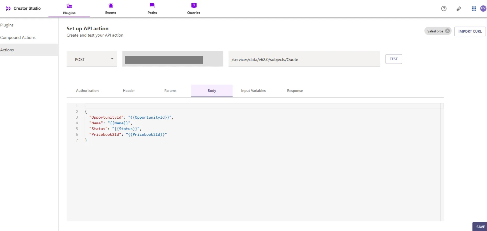

- **OpportunityId**: The ID of the opportunity associated with the quote.
- **Name**: The name of the quote.
- **Status**: The status of the quote (e.g., Draft, Approved, etc.).
- **Pricebook2Id**: The ID of the pricebook associated with the quote.

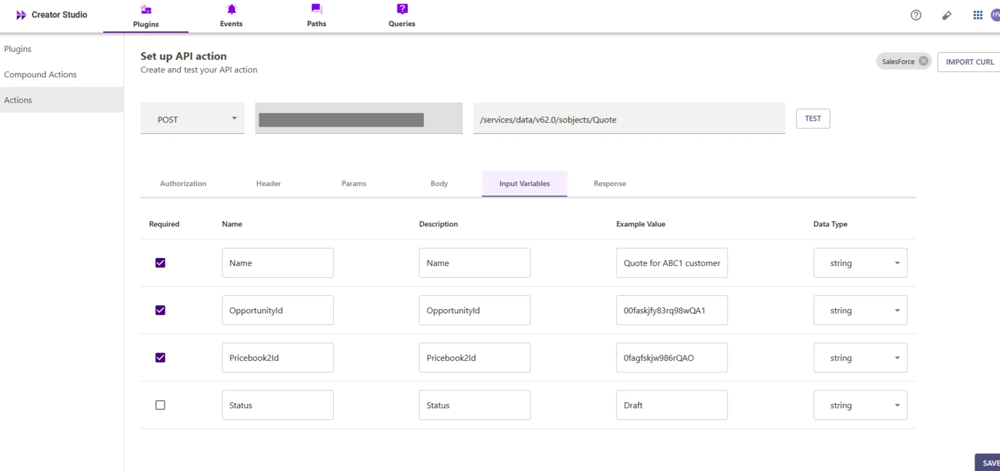

- We have provided sample input variables for **OpportunityId**, **Name**, **Status**, and **Pricebook2Id**.
- Using these input variables, we tested the plugin by making a **POST** request to create a **Quote** in Salesforce.

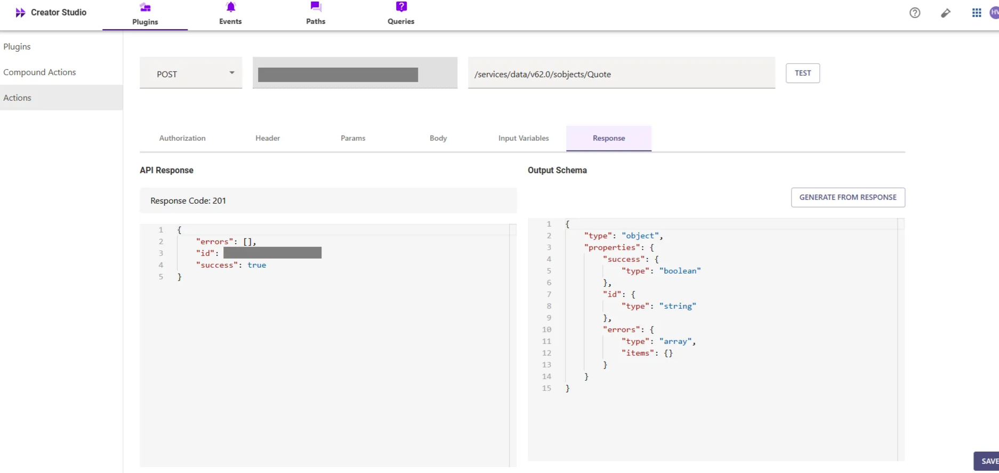

- After that, you can test the plugin by checking the response, which will include the **Quote ID**. If the quote has been successfully created
- The response will return a **201** status code, indicating successful creation of the quote. If the output schema is incorrect or missing, click **`GENERATE FROM RESPONSE`** to update it.


- Add the **API Name** and **API Description** as shown below, then click the `Save` button

**4. Retrieve Quote by Quote Name**

- Repeat the steps above to create another action.
- Click on the `IMPORT CURL` option and paste the following cURL command:

```bash
curl --location 'https://<YOUR_DOMAIN>/services/data/v62.0/query/?q=SELECT+Id,+Name+FROM+Quote+WHERE+Name+LIKE+%27%25{{Quote_Name}}%25%27' \
--header 'Authorization: Bearer <ACCESS_TOKEN>'

```

- Click on `Use Existing Connector` > select the [**Salesforce Connector**](https://developer.moveworks.com/creator-studio/resources/connector/?id=salesforce) that you just created > Click on `Apply`. This will populate the Base URL and the Authorization section of the API Editor.
- **Query Parameters for Salesforce Quote Query**
- **Key ( q )**: Value (`SELECT Id, Name FROM Quote WHERE Name LIKE '%{{Quote_Name}}%'`)
- This query filters **Quote** records based on the **Quote Name** and retrieves the **Id** and **Name** of the relevant quotes, ensuring that only the quotes matching the provided name are returned.

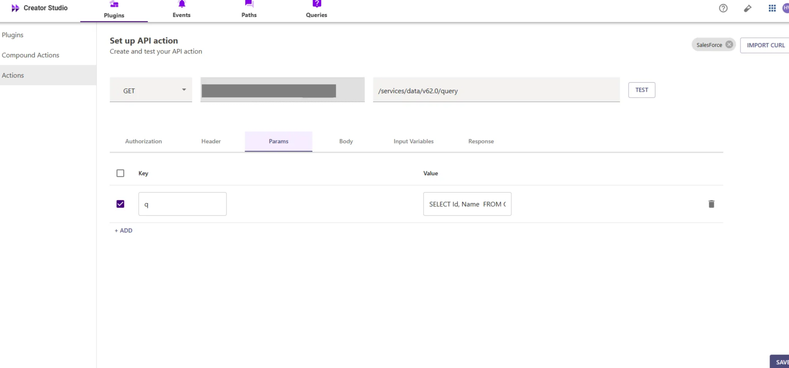

- **Input Variables**:

                **Quote_Name**: Example Value (Quote for ABC1 - GenWatt Diesel 200kW).

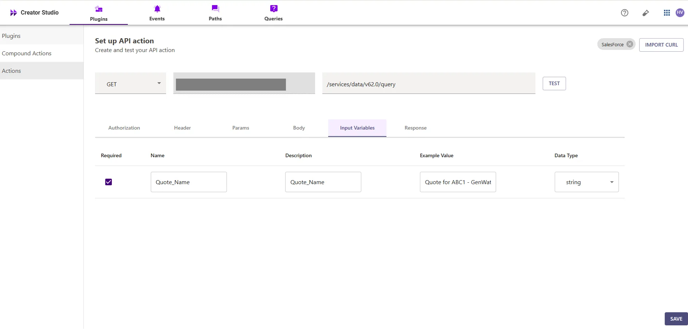

- Test the Connector setup as described earlier to verify the response. If the output schema is incorrect or missing, click `GENERATE FROM RESPONSE` to update it.

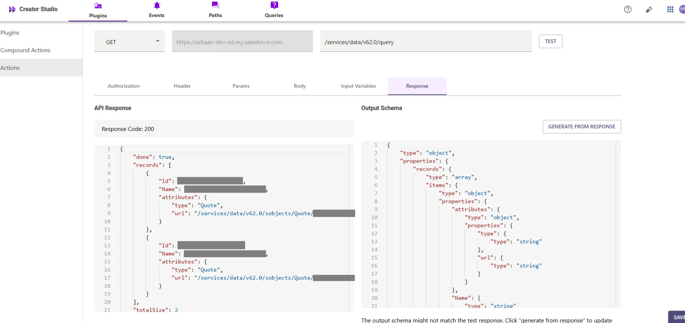

- Add the **API Name** and **API Description** as shown below, then click the `Save` button


**5. Create Quote Quote Line Item inside Salesforce Account**
- Repeat the steps above to create another action.
- Click on the `IMPORT CURL` option and paste the following cURL command:

```bash
curl --location 'https://<YOUR_DOMAIN>/services/data/v62.0/sobjects/QuoteLineItem' \
--header 'Content-Type: application/json' \
--header 'Authorization: Bearer <YOUR_AUTH_TOKEN>' \
--data '{
  "QuoteId": "<QUOTE_ID>",  
  "PricebookEntryId": "<PRICEBOOKENTRY_ID>",  
  "Quantity": "<QUANTITY>",
  "UnitPrice": "<UNIT_PRICE>"
}'
```

- To create a **Quote Line Item** in Salesforce, we send a **POST** request with the following body:

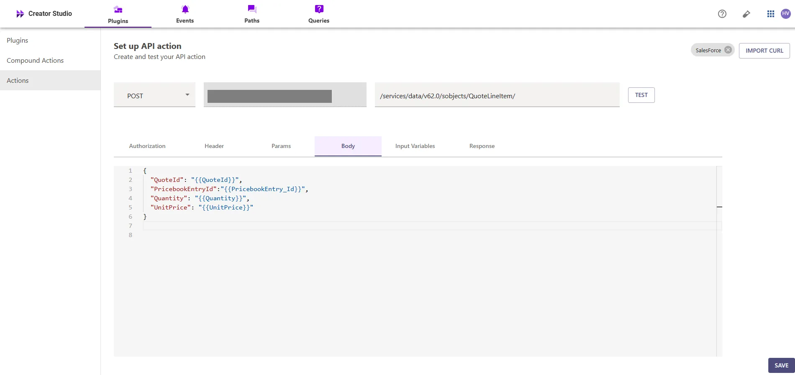

- **QuoteId**: The ID of the **Quote** to which the line item will be associated.
- **PricebookEntryId**: The ID of the **Pricebook Entry** that references the product.
- **Quantity**: The number of units of the product being quoted.
- **UnitPrice**: The price per unit of the product


- We have provided sample input variables for **QuoteId**, **PricebookEntryId**, **Quantity**, and **UnitPrice**.
- Using these input variables, we tested the plugin by making a **POST** request to create a **Quote Line Item** in Salesforce

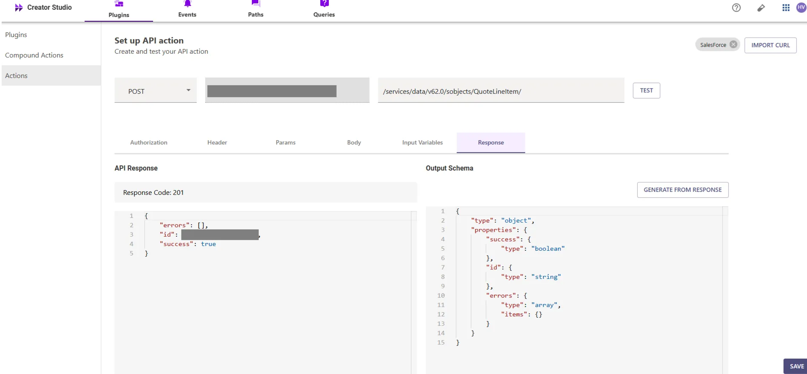

- After that, you can test the plugin by checking the response, which will include the **Quote Line Item ID**. If the **Quote Line Item** has been successfully created
- The response will return a **201** status code, indicating successful creation of the quote line item. If the output schema is incorrect or missing, click `GENERATE FROM RESPONSE` to update it.


- Add the **API Name** and **API Description** as shown below, then click the `Save` button

## **Step 2: Build Compound Action**

- Head over to the **Compound Actions** tab and click **CREATE**


- Give your Compound Action a **Name** and **Description** , then click `Next` Note: Name only letters, numbers, and underscores. We suggest using snake case or camel case formatting (e.g. Workflow_name or workflowName )


- Click on the `Script editor` tab. Here you will be able to build your compound action using the YAML syntax.
- At a high-level, this syntax provides actions (HTTP Request, APIthon Scripts) and workflow logic (switch statements, for each loops, return statements, parallel, try/catch). See the [Compound Action Syntax](https://developer.moveworks.com/creator-studio/reference/compound_actions_syntax/) Reference for more info.

```yaml
steps:
  - action:
      output_key: Get_LatestOpportunity_By_Account_result
      action_name: Get_LatestOpportunity_By_Account
      progress_updates:
        on_complete: ON_COMPLETE_MESSAGE
        on_pending: ON_PENDING_MESSAGE
      input_args:
        Account_Name: data.Account_Name
  - action:
      output_key: Fetch_Product_Price_Details_result
      action_name: Fetch_Product_Price_Details
      progress_updates:
        on_complete: ON_COMPLETE_MESSAGE
        on_pending: ON_PENDING_MESSAGE
      input_args:
        Product_Name: data.Product_Name
  - action:
      output_key: Quote_Creation_API_result
      action_name: Quote_Creation_API
      progress_updates:
        on_complete: ON_COMPLETE_MESSAGE
        on_pending: ON_PENDING_MESSAGE
      input_args:
        OpportunityId: data.Get_LatestOpportunity_By_Account_result.records[0].Id
        Pricebook2Id: data.Fetch_Product_Price_Details_result.records[0].Pricebook2.Id
        Status: data.Status
        Name: data.Name
  - action:
      output_key: Get_Quote_By_Account_Product_result
      action_name: Get_Quote_By_Account_Product
      progress_updates:
        on_complete: ON_COMPLETE_MESSAGE
        on_pending: ON_PENDING_MESSAGE
      input_args:
        Quote_Name: data.Quote_Name
  - action:
      output_key: Create_a_QuoteLineItem_result
      action_name: Create_a_QuoteLineItem
      progress_updates:
        on_complete: ON_COMPLETE_MESSAGE
        on_pending: ON_PENDING_MESSAGE
      input_args:
        UnitPrice: data.UnitPrice
        PricebookEntry_Id: data.Fetch_Product_Price_Details_result.records[0].Id
        Quantity: data.Quantity
        QuoteId: data.Get_Quote_By_Account_Product_result.records[0].Id

```

- Click on `Input fields` tab and click the `+Add` button. Here you will define the slots that you want to collect from users through the conversation and trigger your Workflow with. After defining the input fields, click the `Submit` button to save your changes.


## **Step 3: Publish Workflow to Plugin**

- Head over to the `Compound Actions` tab and click on the kebab menu ( `︙` )
- Next, click on `Publish Workflow to Plugin`
- First, verify your Plugin **Name** & **Short description** . This is autofilled from the name & description of your compound action.

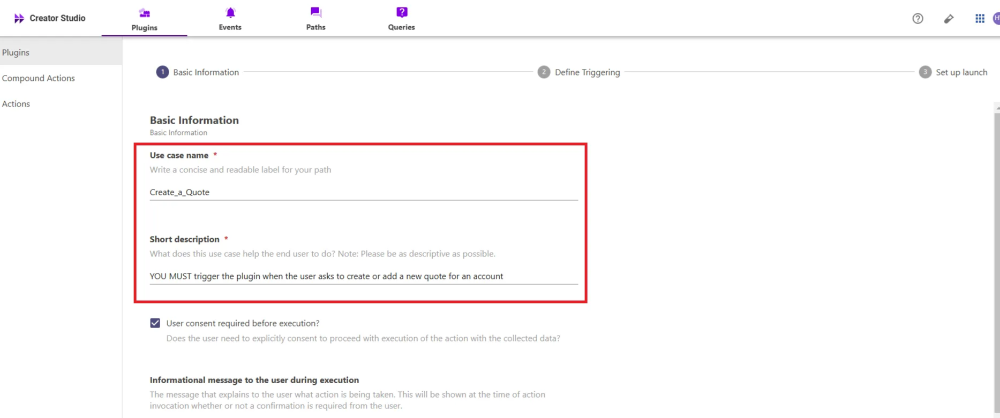

- Next, consider whether to select the `User consent required before execution?` checkbox. Enabling this option prompts the user to confirm all slot values before executing the plugin, which is widely regarded as a best practice.

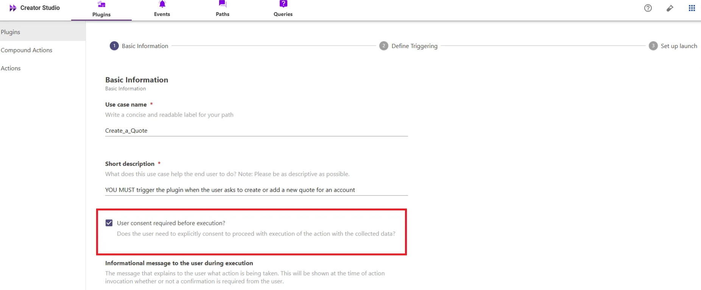

- Click `Next` and set up your positive and negative triggering examples. This ensures that the bot triggers your plugin given a relevant utterance.
- See our [guide](https://developer.moveworks.com/creator-studio/conversation-design/triggers/natural-language-triggers/#how-to-write-good-triggering-examples) on Triggering
- Lastly, click `Next` and set the **Launch Rules** you want your plugin to abide by.
    - See our [guide](https://developer.moveworks.com/creator-studio/administration/launch-options/) on Launch Rules

## **Step 4: See it in action!**

- After clicking the final `Submit` button, your plugin will be published to the bot and triggerable based on your **Launch Rules.**
- You should wait up to **5 minutes** after making changes before trying to test in your bot!
    - If you run into an issue:
        1. Check our [troubleshooting guides](https://developer.moveworks.com/creator-studio/troubleshooting/support/)
        2. Understand your issue using Logs
        3. Reach out to Support

# **Congratulations!**

You’ve just added the "Create a Quote" feature inside your Salesforce account to your Copilot! Explore our other guides for more inspiration on what to build next.