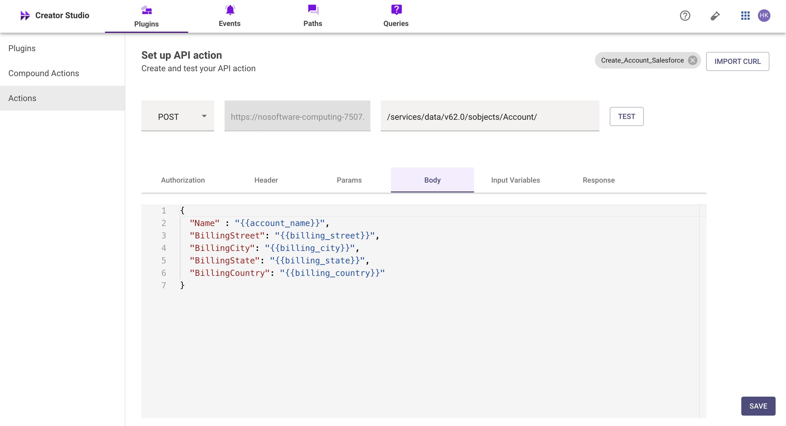
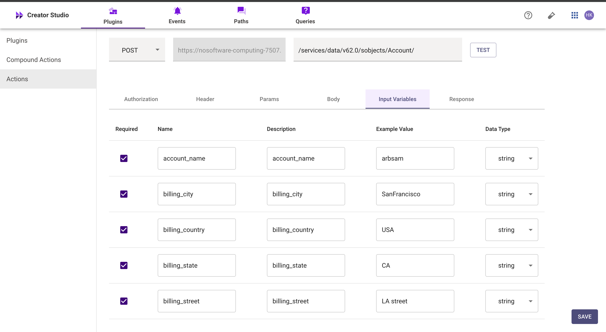
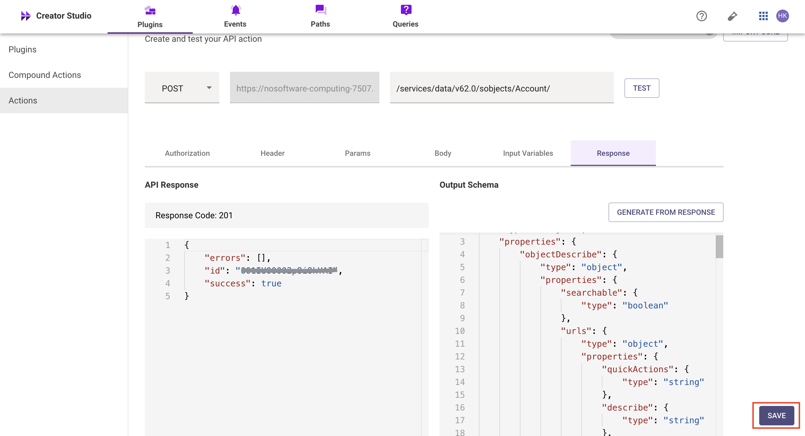
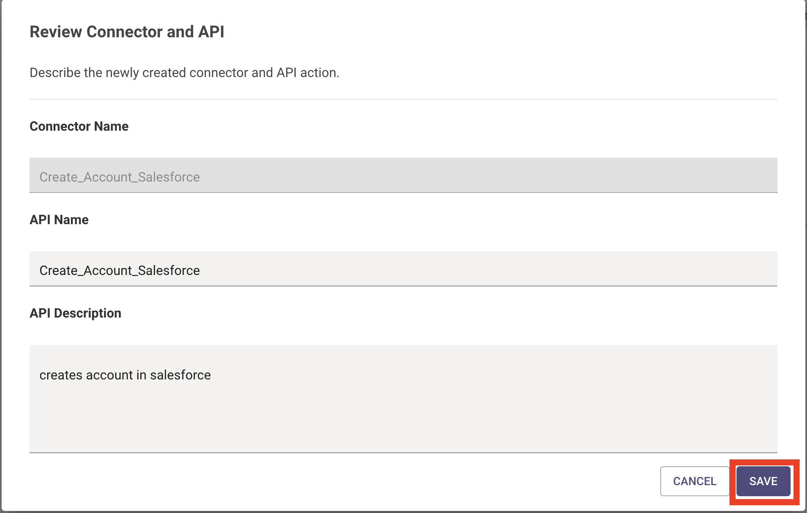
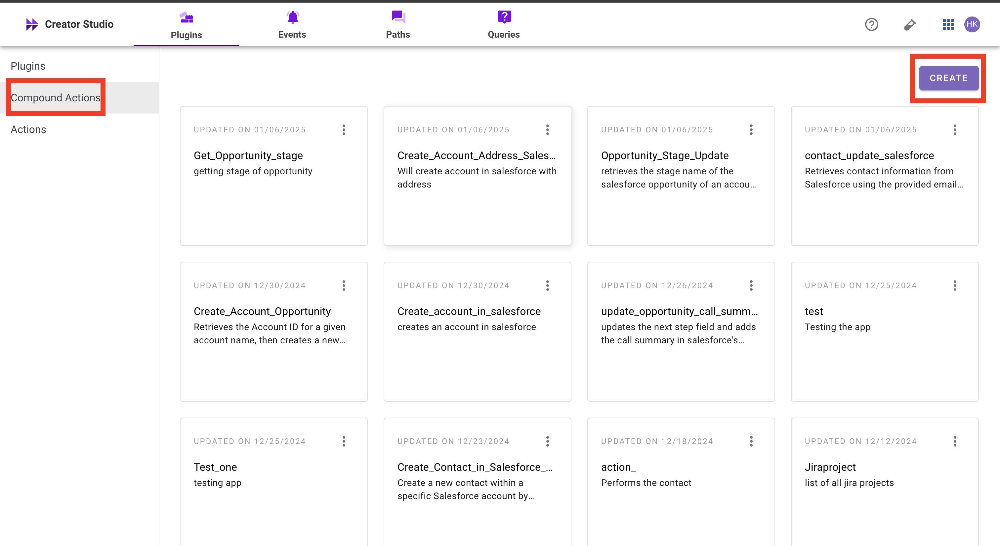
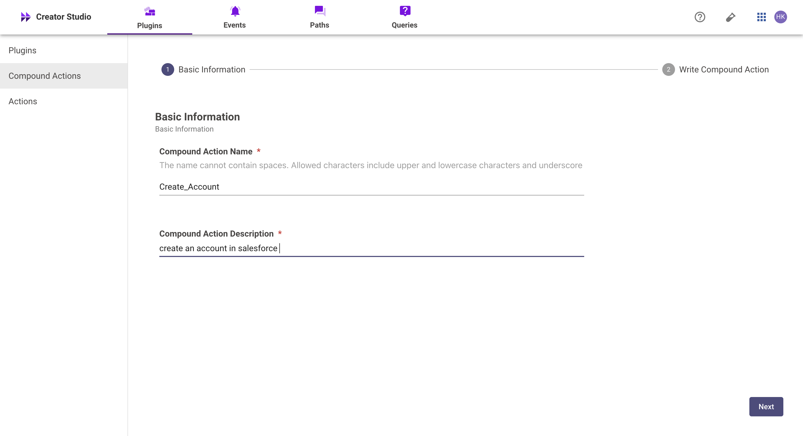
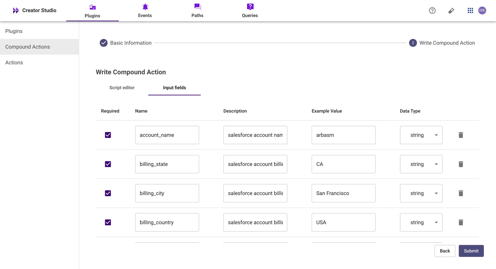
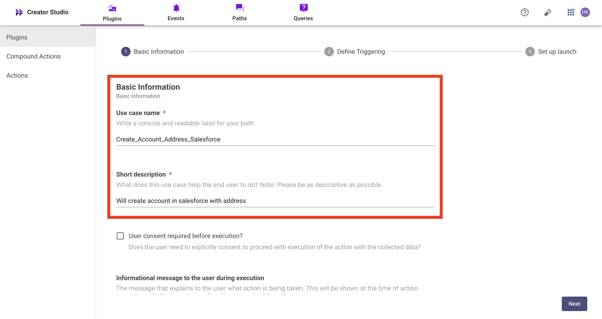
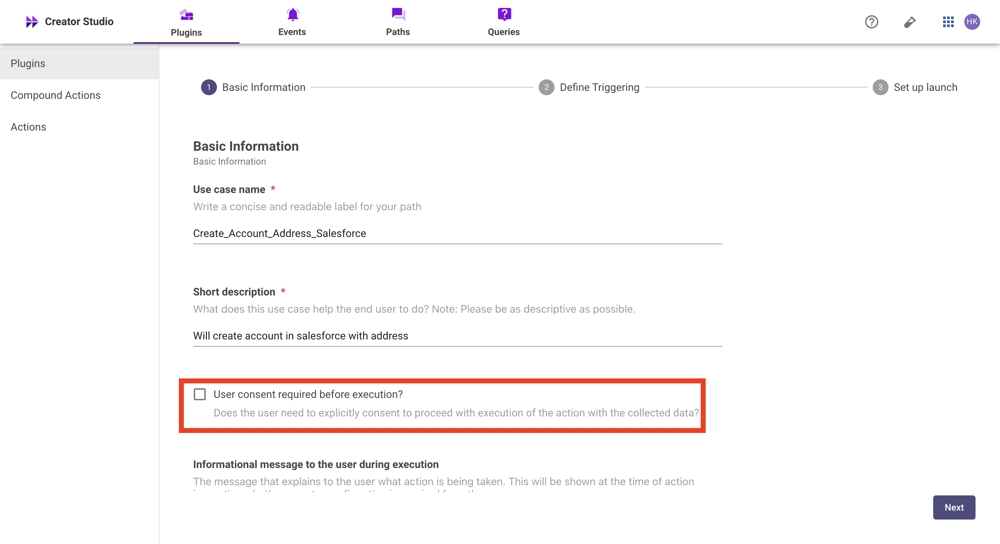

# Plugin to create account in salesforce

# Introduction

Salesforce is a CRM platform, and the "Create account in Salesforce" plugin streamlines adding new contacts to your Salesforce account. By integrating this feature with your bot, users can easily create and manage contacts, improving efficiency and organization.

This guide will show you how to add the "Create account in Salesforce" feature to your bot using Creator Studio. Let's get started!

# Prerequisites

- [Postman](https://www.postman.com/) or an API Testing Tool
- Salesforce Connector built in Creator Studio (follow the [Salesforce Authentication](https://developer.moveworks.com/creator-studio/resources/connector/?id=salesforce) guide to create your connector)

# What are we building?

### **Conversation Design**

This [purple chat](https://developer.moveworks.com/creator-studio/developer-tools/purple-chat-builder/?workspace=%7B%22title%22%3A%22My+Workspace%22%2C%22botSettings%22%3A%7B%7D%2C%22mocks%22%3A%5B%7B%22id%22%3A2630%2C%22title%22%3A%22Mock+2%22%2C%22transcript%22%3A%7B%22settings%22%3A%7B%22colorStyle%22%3A%22LIGHT%22%2C%22startTime%22%3A%2211%3A43+AM%22%2C%22defaultPerson%22%3A%22GWEN%22%2C%22editable%22%3Atrue%7D%2C%22messages%22%3A%5B%7B%22from%22%3A%22USER%22%2C%22text%22%3A%22%3Cp%3EI+need+to+create+a+new+contact+in+Salesforce.%3C%2Fp%3E%22%7D%2C%7B%22from%22%3A%22BOT%22%2C%22text%22%3A%22%3Cp%3E+Sure%21+I+can+help+with+that.+Please+provide+the+contact%27s+name%2C+email%2C+phone+number%2C+and+the+associated+account.+%3C%2Fp%3E%22%7D%2C%7B%22from%22%3A%22USER%22%2C%22text%22%3A%22%3Cp%3EName%3A+John+Doe%3Cbr%3EEmail%3A+john.doe%40abcinc.com%3Cbr%3EPhone%3A+%2B9876543210%3Cbr%3EAccount%3A+ABC+Inc.+%3C%2Fp%3E%22%7D%2C%7B%22from%22%3A%22ANNOTATION%22%2C%22text%22%3A%22%3Cp%3E+Creates+a+new+contact+in+Salesforce+with+the+provided+details.+%3C%2Fp%3E%22%7D%2C%7B%22from%22%3A%22BOT%22%2C%22text%22%3A%22%3Cp%3E+The+new+contact+for+John+Doe+at+ABC+Inc.+has+been+successfully+created.+%3C%2Fp%3E%22%7D%2C%7B%22from%22%3A%22BOT%22%2C%22text%22%3A%22%3Cp%3E+%3Cb%3ENew+Contact+Created%3C%2Fb%3E%3Cbr%3E%3Cbr%3E%3Cb%3EName%3A%3C%2Fb%3E+John+Doe%3Cbr%3E%3Cb%3EEmail%3A%3C%2Fb%3E+john.doe%40abcinc.com%3Cbr%3E%3Cb%3EPhone%3A%3C%2Fb%3E+%2B9876543210%3Cbr%3E%3Cb%3EAccount%3A%3C%2Fb%3E+ABC+Inc.%3Cbr%3E%3C%2Fp%3E%22%7D%5D%7D%7D%5D%7D) shows the experience we are going to build.


# Creator Studio Components

- **Triggers:**
    1. **Natural Language**
    2. Identify user queries or commands related to creating a account in Salesforce.
- **Slots:**
    1. **User Information:** Extract and store key details such as the account's name, email address, phone number, and associated account name**.**
- **Actions:**
    1. **Create Account:** Fetch all the details required to create an account including account name. billing city, billing country etc. 
- **Guidelines:**
    1. **Create  Salesforce Account:**
        
        Create a new record within a specific Salesforce account by capturing details such as name,  and address, and link the contact to the selected Salesforce account for streamlined customer management
        

# API Research

To build this use case, we will use one **API** to achieve the goal of creating a Salesforce account:


## API #1:Creating a Salesforce Account.

The API is used to [create a salesforce account](https://developer.salesforce.com/docs/atlas.en-us.api_rest.meta/api_rest/dome_sobject_create.htm)  you supply the required field values in the request data, and send the request using the POST HTTP method.

```bash
curl --location 'https://<YOUR_DOMAIN>/services/data/v62.0/sobjects/Account/' \
--header 'Authorization: Bearer' \
--header 'Content-Type: application/json' \
--data '{
  "Name" : ":<Account_Name>",
  "BillingStreet": "<Billing_Streeet>",
  "BillingCity": "<Billing_City>",
  "BillingState": "<Billing_state>",
  "BillingCountry": "<BillingCountry"
}'
```

# Steps

## **Step 1: Build HTTP Action**

Define your HTTP Actions for fetching the **Account ID** from Salesforce based on the provided **Account Name**.

1. **In Creator Studio, Create a New Action**:

- Navigate to **Plugins** section > **Actions** tab.
- Click on **CREATE** to define a new action.


Click on the `IMPORT CURL` option and paste the following cURL command:

```bash
curl --location 'https://<YOUR_DOMAIN>/services/data/v62.0/sobjects/Account/' \
--header 'Authorization: Bearer' \
--header 'Content-Type: application/json' \
--data '{
  "Name" : ":<Account_Name>",
  "BillingStreet": "<Billing_Streeet>",
  "BillingCity": "<Billing_City>",
  "BillingState": "<Billing_state>",
  "BillingCountry": "<BillingCountry"
}'
```

- Click on `Use Existing Connector` > select the [Salesforce](https://developer.moveworks.com/creator-studio/resources/connector/?id=salesforce) [**connector**](https://developer.moveworks.com/creator-studio/resources/connector/?id=jira) that you just created > Click on `Apply`. This will populate the Base URL and the Authorization section of the API Editor.

- To create a **Account** in Salesforce, we send a **POST** request with the following body:
    - Name: Name of the account you want to create
    - BillingStreet: The name of the street where the company is located.
    - BillingCity: The name of the street where the company is located.
    - BillingState: The name of the state where the company is located.
    - BillingCountry: The name of the country where the company is located.





We have provided sample input variables for **Account Name,Billing city,Billing country,Billing state, Billing street** Using these input variables, we tested the plugin by making a **POST** request to create a A**ccount** in Salesforce.



After that, you can test the plugin by checking the response. If the contact has been successfully created, the response will return a **201** status code, indicating successful creation of the contact, If the output schema is incorrect or missing, click `GENERATE FROM RESPONSE` to update it.



Add the **API Name** and **API Description** as shown below, then click the `Save` button.

## **Step 2: Build Compound Action**

- Head over to the **Compound Actions** tab and click **CREATE**





Give your Compound Action a **Name** and **Description** , then click `Next` Note: Name only letters, numbers, and underscores. We suggest using snake case or camel case formatting (e.g. Workflow_name or workflowName )

```yaml
steps:
  - action:
      output_key: Create_Account_Salesforce_result
      action_name: Create_Account_Salesforce
      progress_updates:
        on_complete: ON_COMPLETE_MESSAGE
        on_pending: ON_PENDING_MESSAGE
      input_args:
        billing_country: data.billing_country
        billing_city: data.billing_city
        billing_state: data.billing_state
        billing_street: data.billing_street
        account_name: data.account_name
```

Click on the `Script editor` tab. Here you will be able to build your compound action using the YAML syntax. At a high-level, this syntax provides actions (HTTP Request, APIthon Scripts) and workflow logic (switch statements, for each loops, return statements, parallel, try/catch). See the [Compound Action Syntax](https://developer.moveworks.com/creator-studio/reference/compound_actions_syntax/) Reference for more info.



Click on `Input fields` tab and click the `+Add` button. Here you will define the slots that you want to collect from users through the conversation and trigger your Workflow with. After defining the input fields, click the `Submit` button to save your changes.

## **Step 3: Publish Workflow to Plugin**

- Head over to the `Compound Actions` tab and click on the kebab menu ( `︙` )
- Next, click on `Publish Workflow to Plugin`
- First, verify your Plugin **Name** & **Short description** . This is autofilled from the name & description of your compound action.



Next, consider whether to select the `User consent required before execution?` checkbox. Enabling this option prompts the user to confirm all slot values before executing the plugin, which is widely regarded as a best practice.



- Click `Next` and set up your positive and negative triggering examples. This ensures that the bot triggers your plugin given a relevant utterance.
    - See our [guide](https://developer.moveworks.com/creator-studio/conversation-design/triggers/natural-language-triggers/#how-to-write-good-triggering-examples) on Triggering
- Lastly, click `Next` and set the **Launch Rules** you want your plugin to abide by.
    - See our [guide](https://developer.moveworks.com/creator-studio/administration/launch-options/) on Launch Rules

## **Step 4: See it in action!**

- After clicking the final `Submit` button, your plugin will be published to the bot and triggerable based on your **Launch Rules.**
- You should wait up to **5 minutes** after making changes before trying to test in your bot!
- If you run into an issue:
    1. Check our [troubleshooting guides](https://developer.moveworks.com/creator-studio/troubleshooting/support/)
    2. Understand your issue using Logs
    3. Reach out to Support

# **Congratulations!**

You've just added the "Create Account" feature inside your Salesforce account to your Copilot! Explore our other guides for more ideas on what to build next.