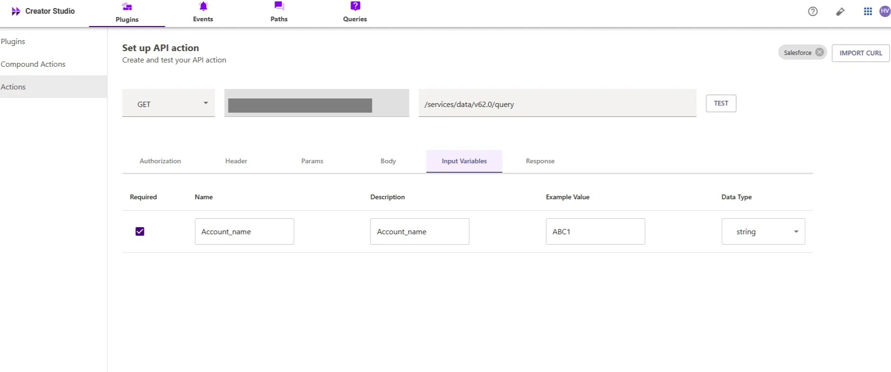
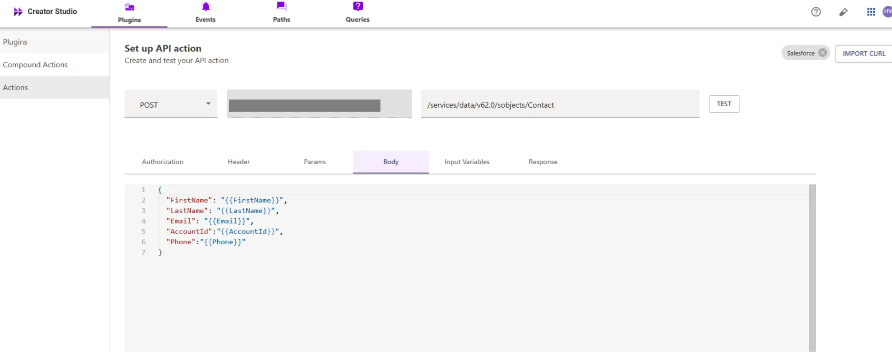
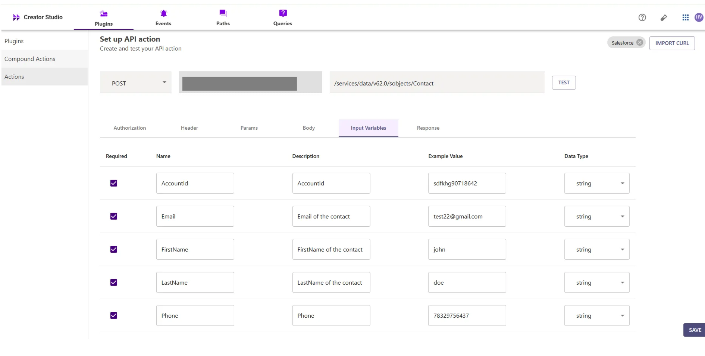
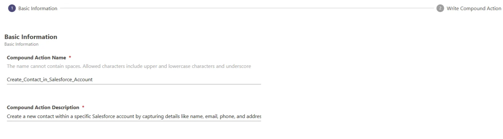

# Introduction:

Salesforce is a CRM platform, and the "Create Contact in Salesforce" plugin streamlines adding new contacts to your Salesforce account. By integrating this feature with your bot, users can easily create and manage contacts, improving efficiency and organization.

This guide will show you how to add the "Create Contact in Salesforce" feature to your bot using Creator Studio. Let's get started!

# **Prerequisites:**

- [Postman](https://www.postman.com/) or an API Testing Tool
- Salesforce Connector built in Creator Studio (follow the [Salesforce Authentication](https://developer.moveworks.com/creator-studio/resources/connector/?id=salesforce) guide to create your connector)

# **What are we building?**

### **Conversation Design**

This [purple chat](https://developer.moveworks.com/creator-studio/developer-tools/purple-chat-builder/?workspace=%7B%22title%22%3A%22My+Workspace%22%2C%22botSettings%22%3A%7B%7D%2C%22mocks%22%3A%5B%7B%22id%22%3A2630%2C%22title%22%3A%22Mock+2%22%2C%22transcript%22%3A%7B%22settings%22%3A%7B%22colorStyle%22%3A%22LIGHT%22%2C%22startTime%22%3A%2211%3A43+AM%22%2C%22defaultPerson%22%3A%22GWEN%22%2C%22editable%22%3Atrue%7D%2C%22messages%22%3A%5B%7B%22from%22%3A%22USER%22%2C%22text%22%3A%22%3Cp%3EI+need+to+create+a+new+contact+in+Salesforce.%3C%2Fp%3E%22%7D%2C%7B%22from%22%3A%22BOT%22%2C%22text%22%3A%22%3Cp%3E+Sure%21+I+can+help+with+that.+Please+provide+the+contact%27s+name%2C+email%2C+phone+number%2C+and+the+associated+account.+%3C%2Fp%3E%22%7D%2C%7B%22from%22%3A%22USER%22%2C%22text%22%3A%22%3Cp%3EName%3A+John+Doe%3Cbr%3EEmail%3A+john.doe%40abcinc.com%3Cbr%3EPhone%3A+%2B9876543210%3Cbr%3EAccount%3A+ABC+Inc.+%3C%2Fp%3E%22%7D%2C%7B%22from%22%3A%22ANNOTATION%22%2C%22text%22%3A%22%3Cp%3E+Creates+a+new+contact+in+Salesforce+with+the+provided+details.+%3C%2Fp%3E%22%7D%2C%7B%22from%22%3A%22BOT%22%2C%22text%22%3A%22%3Cp%3E+The+new+contact+for+John+Doe+at+ABC+Inc.+has+been+successfully+created.+%3C%2Fp%3E%22%7D%2C%7B%22from%22%3A%22BOT%22%2C%22text%22%3A%22%3Cp%3E+%3Cb%3ENew+Contact+Created%3C%2Fb%3E%3Cbr%3E%3Cbr%3E%3Cb%3EName%3A%3C%2Fb%3E+John+Doe%3Cbr%3E%3Cb%3EEmail%3A%3C%2Fb%3E+john.doe%40abcinc.com%3Cbr%3E%3Cb%3EPhone%3A%3C%2Fb%3E+%2B9876543210%3Cbr%3E%3Cb%3EAccount%3A%3C%2Fb%3E+ABC+Inc.%3Cbr%3E%3C%2Fp%3E%22%7D%5D%7D%7D%5D%7D) shows the experience we are going to build.

# **Creator Studio Components**

- **Triggers:**
    1.   Natural Language
- **Slots:**
    1.  **Account Name:** Query Account Name by Account ID.
    2.  **Create Contact:** Capture and store contact details to create a contact
- **Actions:**
    1. **Retrieve Account Name:** Fetch account name using Account ID via Salesforce API.
    2. **Create Contact:** Create a new contact in Salesforce with captured details.
- **Guidelines:**
    1. None

# **API Research**

To build this use case, we will use **two APIs** to achieve the goal of creating a contact inside a Salesforce account:


## API #1: Retrieve Account ID from Account Name

The [Retrieve Account ID from Account Name](https://developer.salesforce.com/docs/industries/cme/guide/comms-get-account-details.html) API retrieves the **Account ID** for a given **Account Name** from Salesforce using a SOQL query. This API helps in associating records like contacts to specific Salesforce accounts.

- **Purpose**: Fetches **Account ID** based on **Account Name**.
- **Features**: Supports filtering by **Account Name** and returns a paginated list.
- **Example**: Queries Salesforce to get the **Account ID**.

```bash
curl --location 'https://<YOUR_DOMAIN>/services/data/v62.0/query/?q=SELECT+Id+FROM+Account+WHERE+Name+LIKE+%27%25<ACCOUNT_NAME>%25%27' \
--header 'Authorization: Bearer <ACCESS_TOKEN>'
```

## **API #2: Create Contact in Salesforce**

The [**Create Contact in Salesforce**](https://developer.salesforce.com/docs/marketing/marketing-cloud/references/mc_rest_contacts/createContacts.html) API allows you to create a new **Contact** record in Salesforce. Using the provided **First Name**, **Last Name**, **Email**, and **Account ID**, this API adds a new contact to the specified account in Salesforce. If an **Account ID** is not provided, the contact can still be created without being linked to an account.

- **Purpose**: Creates a new **Contact** in Salesforce.
- **Features**: Supports adding **First Name**, **Last Name**, **Email**, and optionally, an **Account ID**.
- **Example**: Creates a contact in Salesforce with the provided information.

```bash
curl --location 'https://<YOUR_DOMAIN>.my.salesforce.com/services/data/v62.0/sobjects/Contact' \
--header 'Content-Type: application/json' \
--header 'Authorization: <YOUR_AUTH_TOKEN>' \
--data '{
"FirstName": "<FIRST_NAME>",
"LastName": "<LAST_NAME>",
"Email": "<EMAIL>",
"Phone": "<Phone>",
"AccountId": "<ACCOUNT_ID>"
}'
```

- **<YOUR_DOMAIN>**: Your Salesforce instance domain (e.g., `yourcompany.my.salesforce.com`).
- **<FIRST_NAME>**, **<LAST_NAME>**, **<EMAIL>**, <PHONE>,**<ACCOUNT_ID>**: The contact's information and the associated account ID.

---

# **Steps**

## **Step 1: Build HTTP Action**

Define your HTTP Actions for fetching the **Account ID** from Salesforce based on the provided **Account Name**.

### 1. **In Creator Studio, Create a New Action**:

- Navigate to **Plugins** section > **Actions** tab.
- Click on **CREATE** to define a new action.


- Click on the `IMPORT CURL` option and paste the following cURL command:

```bash
curl --location 'https://<YOUR_DOMAIN>/services/data/v62.0/query/?q=SELECT+Id+FROM+Account+WHERE+Name+LIKE+%27%25<ACCOUNT_NAME>%25%27'
```

- Click on `Use Existing Connector` > select the [Salesforce](https://developer.moveworks.com/creator-studio/resources/connector/?id=salesforce) [](https://developer.moveworks.com/creator-studio/resources/connector/?id=jira)[**connector**](https://developer.moveworks.com/creator-studio/resources/connector/?id=salesforce) that you just created > Click on `Apply`. This will populate the Base URL and the Authorization section of the API Editor.
- **Query Parameters for Salesforce Account Query**
- **Key ( q ):  Value** (`SELECT Id FROM Account WHERE Name = '{{Account_name}}'` )
- This query filters out the account associated with a contact based on the account name and retrieves only the Id field for the account, ensuring that the response contains only the essential information and limits unnecessary data retrieval.


- **Input Variables** :

             Account_name : Example Value (arbaan GT).



- Click on `Test` to check if the Connector setup was successful and expect a successful response as shown below. You will see the request response on the left side and the generated output schema on the right.
- If the output schema does not match the API response or fails to populate automatically, kindly click the `GENERATE FROM RESPONSE` button to refresh and align the schema with the API response.


- Add the **API Name** and **API Description** as shown below, then click the `Save` button


### **2. Create contact inside Salesforce Account**

- Repeat the steps above to create another action.
- Click on the `IMPORT CURL` option and paste the following cURL command:

```bash
curl --location 'https://<YOUR_DOMAIN>/services/data/v62.0/sobjects/Contact' \
--header 'Content-Type: application/json' \
--data-raw '{
"FirstName": "<FIRST_NAME>",
"LastName": "<LAST_NAME>",
"Email": "<EMAIL>",
"Phone":"<Phone>",
"AccountId": "<ACCOUNT_ID>"
}'
```

- To create a **Contact** in Salesforce, we send a **POST** request with the following body:



- **FirstName**: The contact's first name.
- **LastName**: The contact's last name.
- **Email**: The contact's email address.
- **Phone**: The contact’s phone number.
- **AccountId**: The ID of the account associated with the contact.



- We have provided sample input variables for **FirstName**, **LastName**, **Email**, and **AccountId**.
- Using these input variables, we tested the plugin by making a **POST** request to create a **Contact** in Salesforce.


- After that, you can test the plugin by checking the response, which will include the **Contact ID**. If the contact has been successfully created,
- the response will return a **201** status code, indicating successful creation of the contact, If the output schema is incorrect or missing, click `GENERATE FROM RESPONSE` to update it.


- Add the **API Name** and **API Description** as shown below, then click the `Save` button

## **Step 2: Build Compound Action**

- Head over to the **Compound Actions** tab and click **CREATE**


- Give your Compound Action a **Name** and **Description** , then click `Next` Note: Name only letters, numbers, and underscores. We suggest using snake case or camel case formatting (e.g. Workflow_name or workflowName )



- Click on the `Script editor` tab. Here you will be able to build your compound action using the YAML syntax.
- At a high-level, this syntax provides actions (HTTP Request, APIthon Scripts) and workflow logic (switch statements, for each loops, return statements, parallel, try/catch). See the [Compound Action Syntax](https://developer.moveworks.com/creator-studio/reference/compound_actions_syntax/) Reference for more info.

```yaml
steps:
  - action:
      output_key: result
      action_name: Create_contact_Query_API
      progress_updates:
        on_complete: ON_COMPLETE_MESSAGE
        on_pending: ON_PENDING_MESSAGE
      input_args:
        Account_name: data.Account_name
  - action:
      output_key: result
      action_name: create_salesforce_contact1
      progress_updates:
        on_complete: Contact creation completed
        on_pending: Contact creation in progress
      input_args:
        Phone: data.Phone
        LastName: data.LastName
        FirstName: data.FirstName
        AccountId: data.result.records[0].Id
        Email: data.Email       

```

- Click on `Input fields` tab and click the `+Add` button. Here you will define the slots that you want to collect from users through the conversation and trigger your Workflow with. After defining the input fields, click the `Submit` button to save your changes.


## **Step 3: Publish Workflow to Plugin**

- Head over to the `Compound Actions` tab and click on the kebab menu ( `︙` )
- Next, click on `Publish Workflow to Plugin`
- First, verify your Plugin **Name** & **Short description** . This is autofilled from the name & description of your compound action.
    
    


- Next, consider whether to select the `User consent required before execution?` checkbox. Enabling this option prompts the user to confirm all slot values before executing the plugin, which is widely regarded as a best practice.


- Click `Next` and set up your positive and negative triggering examples. This ensures that the bot triggers your plugin given a relevant utterance.
- See our [guide](https://developer.moveworks.com/creator-studio/conversation-design/triggers/natural-language-triggers/#how-to-write-good-triggering-examples) on Triggering
- Lastly, click `Next` and set the **Launch Rules** you want your plugin to abide by.
    - See our [guide](https://developer.moveworks.com/creator-studio/administration/launch-options/) on Launch Rules

## **Step 4: See it in action!**

- After clicking the final `Submit` button, your plugin will be published to the bot and triggerable based on your **Launch Rules.**
- You should wait up to **5 minutes** after making changes before trying to test in your bot!
    - If you run into an issue:
        1. Check our [troubleshooting guides](https://developer.moveworks.com/creator-studio/troubleshooting/support/)
        2. Understand your issue using Logs
        3. Reach out to Support

# **Congratulations!**

You've just added the "Create Contact" feature inside your Salesforce account to your Copilot! Explore our other guides for more inspiration on what to build next
