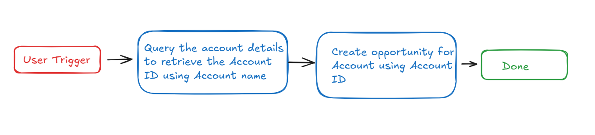
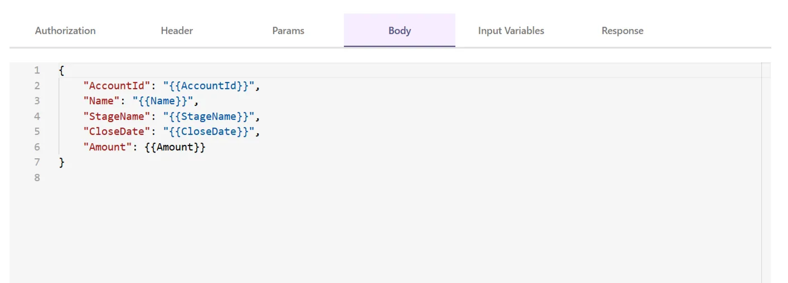

# **Introduction :**

Salesforce is a  CRM platform, and the **Salesforce Account Opportunity Creation** plugin streamlines the process of creating opportunities for specific accounts by leveraging the Account ID. By integrating this functionality into your bot, users can efficiently and seamlessly create opportunities for accounts, thereby improving productivity and organization.

This guide provides detailed, step-by-step instructions on incorporating the **Salesforce Account Opportunity Creation** feature into your bot using Creator Studio.

Let us get started!

# Prerequisites :

- Salesforce Connector built in Creator Studio (follow the [Salesforce Authentication](https://developer.moveworks.com/creator-studio/resources/connector/?id=salesforce) guide to create your connector)

# What are we building?

## **Conversation Design**

This [purple chat](https://developer.moveworks.com/creator-studio/developer-tools/purple-chat?conversation=%7B%22startTimestamp%22%3A%2211%3A43+AM%22%2C%22messages%22%3A%5B%7B%22role%22%3A%22user%22%2C%22parts%22%3A%5B%7B%22richText%22%3A%22I+need+to+create+a+new+sales+opportunity+for+an+account.%22%7D%5D%7D%2C%7B%22role%22%3A%22assistant%22%2C%22parts%22%3A%5B%7B%22richText%22%3A%22Sure%2C+I+can+help+with+that.+What+is+the+account+name%3F%22%7D%5D%7D%2C%7B%22role%22%3A%22user%22%2C%22parts%22%3A%5B%7B%22richText%22%3A%22Acme+Corp%22%7D%5D%7D%2C%7B%22role%22%3A%22assistant%22%2C%22parts%22%3A%5B%7B%22richText%22%3A%22Got+it.+What%27s+the+name+of+the+opportunity%3F%22%7D%5D%7D%2C%7B%22role%22%3A%22user%22%2C%22parts%22%3A%5B%7B%22richText%22%3A%22Q1+Enterprise+Deal%22%7D%5D%7D%2C%7B%22role%22%3A%22assistant%22%2C%22parts%22%3A%5B%7B%22richText%22%3A%22%3Cp%3EUnderstood.+What+stage+should+I+set+the+opportunity+to%3F%3C%2Fp%3E%22%7D%5D%7D%2C%7B%22role%22%3A%22user%22%2C%22parts%22%3A%5B%7B%22richText%22%3A%22%3Cp%3EThe+stage+should+be+set+as+Introduction.%3C%2Fp%3E%22%7D%5D%7D%2C%7B%22role%22%3A%22assistant%22%2C%22parts%22%3A%5B%7B%22richText%22%3A%22Okay%2C+I%27ll+create+a+new+opportunity+with+the+given+details.%22%7D%2C%7B%22richText%22%3A%22%3Cp%3E%3Cstrong%3EPlease+confirm+the+opportunity+details%3C%2Fstrong%3E%3Cbr%3E%5Cn%3Cstrong%3EAccount+Name%3A+%3C%2Fstrong%3EAcme+Corp%3Cbr%3E%5Cn%3Cstrong%3EOpportunity+Name%3A+%3C%2Fstrong%3EQ1+Enterprise+Deal%3C%2Fp%3E%5Cn%3Cp%3E%3Cstrong%3EOpportunity+Stage%3A+%3C%2Fstrong%3EIntroduction%3Cbr%3E%5Cn%3C%2Fp%3E%22%7D%2C%7B%22buttons%22%3A%5B%7B%22style%22%3A%22filled%22%2C%22buttonText%22%3A%22Create+Opportunity+in+Salesforce%22%7D%2C%7B%22style%22%3A%22outlined%22%2C%22buttonText%22%3A%22Edit+Details%22%7D%2C%7B%22style%22%3A%22outlined%22%2C%22buttonText%22%3A%22Cancel%22%7D%5D%7D%5D%7D%5D%7D) shows the experience we are going to build.

# **Creator Studio Components**

- **Triggers**:
    1. Natural Language
- **Slots**:
    1. Fetch Account ID
    2. Create Opportunity from retrieved Account ID with Opportunity Name, Stage Name, Close Date, and Amount.
- **Actions**:
    1. **Retrieve Account details by account name:**
        - Query the account information by using the account name to obtain its unique Account ID.
    2. **Create the opportunity of the account:**
        - Use the content provided by the user to create an opportunity associated with the specified account.
- **Guidelines:**
    1. None

# **API Research**

To build this use case, we will utilize two APIs. Since our goal is to fetch the Account Id and create opportunity for  associated with the specified account, we'll focus on Salesforce's Opportunity-related APIs. Only two API calls are required to achieve this.



## API #1: Fetch Account ID from Account Name

The [**Retrieve Account ID by Account Name**](https://developer.salesforce.com/docs/industries/cme/guide/comms-get-account-details.html) API facilitates the retrieval of an **Account ID** from Salesforce using a given **Account Name**. By leveraging a SOQL query, this API ensures efficient and precise data retrieval, even in environments with numerous opportunities.

- **Purpose**: Retrieves the **Account ID** associated with a specified **Account Name**.
- **Features**: Filters data by **Account Name** and provides accurate results, even in large datasets.
- **Example**: Executes a query in Salesforce to identify the **Account ID** linked to a given **Account Name**.
    
    ```bash
    curl --request GET \
    --location 'https://<YOUR_DOMAIN>.my.salesforce.com/services/data/v58.0/query?q=SELECT+Id+FROM+Account+WHERE+Name+LIKE+%27%25<ACCOUNT_NAME>%25%27' \--data ''
    
    ```
    

## **API #2: Create Opportunity for Account in salesforce**

The [**Create Opportunity for Account in Salesforce**](https://developer.salesforce.com/docs/atlas.en-us.object_reference.meta/object_reference/sforce_api_objects_opportunity.htm) API allows you to create a new **Opportunity** record in Salesforce and link it to a specific account using the provided **Account name**. By including required fields such as  retrieved **Account** **Id**, **Opportunity name**, **Stage name**, **Close date** and **Amount** in the payload.

- **Purpose**: Creates a new **Opportunity** in Salesforce linked to a specified account.
- **Features**: Supports the inclusion of required fields like **Account** **Id**, **Opportunity name**, **Stage name, Close date** and **Amount.**
- **Example**: Creates an opportunity in Salesforce associated with the specified account using the provided details.
    
    ```bash
    curl --location --request PATCH 'https://<YOUR_DOMAIN>.my.salesforce.com/services/data/v58.0/sobjects/Opportunity' \
    --header 'Content-Type: application/json' \
    --data '{
        "AccountId": "<ACCOUNT_ID>",
        "Name": "<NAME>",
        "StageName": "<STAGE_NAME>",
        "CloseDate": "<CLOSE_DATE>",
        "Amount": "<AMOUNT>"
    }'
    ```
    
- **<YOUR_DOMAIN>**: Your Salesforce instance domain (e.g., yourcompany.my.salesforce.com).
- **<ACCOUNT_ID>,<NAME>, <STAGE_NAME>, <CLOSE_DATE>,<AMOUNT>**: The Opportunity details and the associated account ID.s

# **Steps**

## **Step 1: Build HTTP Action**

Define your HTTP Actions for fetching all the backlog ideas of a specific project :

### **1.** Fetch Account ID from Account Name

- In Creator Studio, create a new Action.
    - Navigate to plugin section > Actions tab
    - Click on CREATE to define a new action
        
        
        
- Click on the  IMPORT CURL option and paste the following cURL command:
    
    ```bash
    curl --request GET \
    --location 'https://<YOUR_DOMAIN>.my.salesforce.com/services/data/v58.0/query?q=SELECT+Id+FROM+Account+WHERE+Name+LIKE+%27%25<ACCOUNT_NAME>%25%27' \
    --data ''
    ```
    
- Click on Use Existing Connector > select the Salesforce [](https://developer.moveworks.com/creator-studio/resources/connector/?id=jira)connector that you just created > Click on Apply. This will populate the Base URL and the Authorization section of the API Editor.
- **Query Parameters for Salesforce Account Query**
    
    Key ( q ) : ****Value (  **SELECT+Id+FROM+Account+WHERE+Name= '{{Account_Name}}’** )
    
- This **SOQL query** filters out the accounts by searching for the one with a specific **Name** value. The {{Account_name}} is a dynamic placeholder that will be replaced with the actual account name when the query is executed. This query will return the **Id** of the account that matches the provided name.
    
    
    
- **Input Variables** :
    - Account_Name : Example Value ( **Acme Corp**).
    
    
    
- Click on Test to check if the Connector setup was successful and expect a successful response as shown below. You will see the request response on the left side and the generated output schema on the right. If the output schema does not match the API response or fails to populate automatically, kindly click the GENERATE FROM RESPONSE button to refresh and align the schema with the API response.
    
    
    
- Add the **API Name** and **API Description** as shown below, then click the Save button
    
    
    

### 2. Create Opportunity for Account

- Repeat the steps above to create another action.
- Click on the IMPORT CURL option and paste the following cURL command:
    
    ```bash
    curl --location --request PATCH 'https://<YOUR_DOMAIN>.my.salesforce.com/services/data/v58.0/sobjects/Opportunity' \
    --header 'Content-Type: application/json' \
    --data '{
        "AccountId": "<ACCOUNT_ID>",
        "Name": "<NAME>",
        "StageName": "<STAGE_NAME>",
        "CloseDate": "<CLOSE_DATE>",
        "Amount": "<AMOUNT>"
    }'
    ```
    
- To create a **opportunity** in Salesforce, we send a **POST** request with the following body:
- Use the existing connector by following the steps outlined in the previous point to populate the Base URL and Authorization section.
- **Header :**
    - Key ( **Content-Type** ) : Value ( **application/json** )
    
    
    
- **Body :**
    - **AccountId:** Retrieved account id from account name.
    - **Name**: The name of an opportunity.
    - **StageName:** The stage name of an opportunity.
    - **CloseDate:** The closing date of an opportunity.
    - **Amount :** The amount of an opportunity.
    
     
    
    
    
- **Input Variables** :
    - **AccountId :** Example Value ( 0014W00003SSquvQAD ****)
    - **CloseDate** : Example Value (2024-01-31)
    - **Name :** Example Value (new bike deal)
    - **StageName :** Example Value ( Closed Lost ****)
    - **Amount :**  Example Value ( 1233.00 ****)
    
    
    
- We have provided sample input variables for **AccountId**, **CloseDate**, **Name**, **StageName** and **Account**. Using these input variables, we tested the plugin by making a **POST** request to create a **Opportunity** in Salesforce.
- Test the Connector setup as described earlier to verify the response. If the output schema is incorrect or missing, click GENERATE FROM RESPONSE to update it.
    
    
    
- Add the **API Name** and **API Description** as shown below, then click the `Save` button   ****
    
    
    

## **Step 2: Build Compound Action**

- Head over to the **Compound Actions** tab and click **CREATE**
    
    
    
- Give your Compound Action a **Name** and **Description** , then click Next Note: Name only letters, numbers, and underscores. We suggest using snake case or camel case formatting (e.g. Workflow_name or workflowName )

    

- Click on the Script editor tab. Here you will be able to build your compound action using the YAML syntax. At a high-level, this syntax provides actions (HTTP Request, APIthon Scripts) and workflow logic (switch statements, for each loops, return statements, parallel, try/catch). See the [Compound Action Syntax](https://developer.moveworks.com/creator-studio/reference/compound_actions_syntax/) Reference for more info.
    
    ```yaml
    steps:
      - action:
          output_key: account_id
          action_name: Get_Account_Id_By_Name
          progress_updates:
            on_complete: Account ID retrieval completed
            on_pending: Retrieving Account ID
          input_args:
            Account_Name: data.Account_Name
      - action:
          output_key: result
          action_name: Create_Opportunity_for_Account
          progress_updates:
            on_complete: Opportunity creation completed
          input_args:
            StageName: data.StageName
            CloseDate: data.CloseDate
            Name: data.Name
            AccountId: data.account_id.records[0].Id
            Amount: data.Amount
    
    ```
    
- Click on Input fields tab and click the +Add button. Here you will define the slots that you want to collect from users through the conversation and trigger your Workflow with. After defining the input fields, click the Submit button to save your changes.
    
    
    

## **Step 3: Publish Workflow to Plugin**

- Head over to the Compound Actions tab and click on the kebab menu ( ︙ )
- Next, click on Publish Workflow to Plugin
- First, verify your Plugin **Name** & **Short description** . This is autofilled from the name & description of your compound action.
    
    
    
- Next, consider whether to select the User consent required before execution? checkbox. Enabling this option prompts the user to confirm all slot values before executing the plugin, which is widely regarded as a best practice.
    
    
    
- Click Next and set up your positive and negative triggering examples. This ensures that the bot triggers your plugin given a relevant utterance.
    - See our [guide](https://developer.moveworks.com/creator-studio/conversation-design/triggers/natural-language-triggers/#how-to-write-good-triggering-examples) on Triggering
- Lastly, click Next and set the **Launch Rules** you want your plugin to abide by.
    - See our [guide](https://developer.moveworks.com/creator-studio/administration/launch-options/) on Launch Rules

## **Step 4: See it in action!**

- After clicking the final Submit button, your plugin will be published to the bot and triggerable based on your **Launch Rules.**
- You should wait up to **5 minutes** after making changes before trying to test in your bot!
- If you run into an issue:
    1. Check our [troubleshooting guides](https://developer.moveworks.com/creator-studio/troubleshooting/support/)
    2. Understand your issue using Logs
    3. Reach out to Support

# **Congratulations!**

You've just added the **"Create Opportunity for Account"** feature inside your Salesforce account to your Copilot! Explore our other guides for more inspiration on what to build next.
