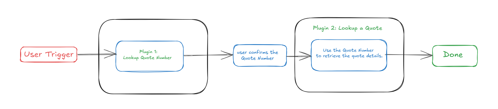
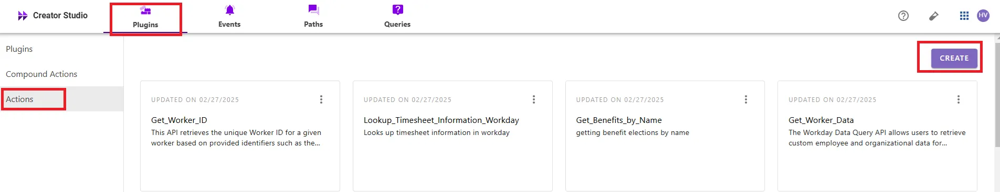
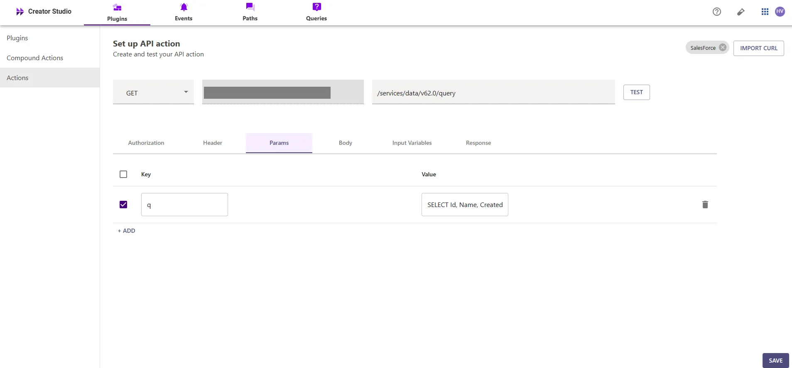
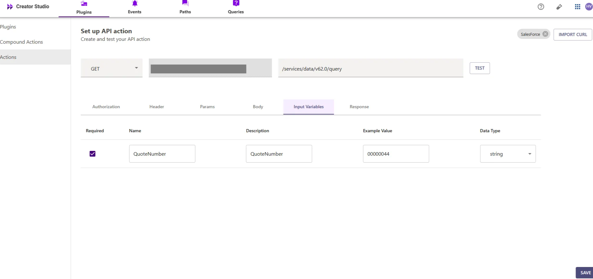
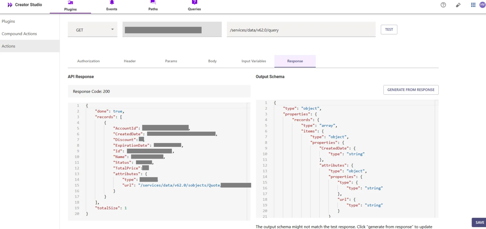
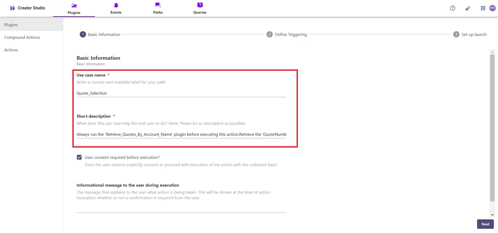
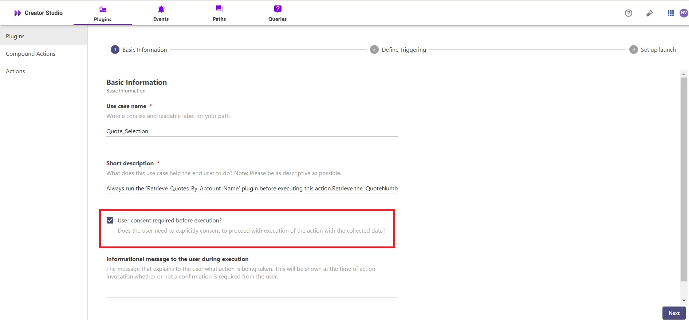

# Introduction:

Salesforce is a CRM platform, and the "**Look up a Quote by its Quote Number in Salesforce**" plugin allows you to search and retrieve existing quotes directly from your Salesforce account. By integrating this feature with your bot, users can quickly find and manage quotes, improving efficiency and organization. 

This guide will show you how to add the "**Look up a Quote by its Quote Number in Salesforce**" feature to your bot using Creator Studio

# **Prerequisites:**

- Salesforce Connector built in Creator Studio (follow the [Salesforce Authentication](https://developer.moveworks.com/creator-studio/resources/connector/?id=salesforce) guide to create your connector)
- The [Look up all Quotes for an Account  in Salesforce](https://developer.moveworks.com/creator-studio/resources/plugin/?id=salesforce-lookup-all-quotes-for-account&commit_id=868affde4f80bacf715f9763144a6df82369ae69) plugin is built in Creator Studio. This plugin allows users to retrieve specific Quote Numbers based on the Account Name. For setup instructions, refer to the [Look up all Quotes for an Account  in Salesforce](https://developer.moveworks.com/creator-studio/resources/plugin/?id=salesforce-lookup-all-quotes-for-account&commit_id=868affde4f80bacf715f9763144a6df82369ae69) in Salesforce guide

# **What are we building?**

### **Conversation Design**

This [purple chat](https://developer.moveworks.com/creator-studio/developer-tools/purple-chat/?mock_id=vCk3HyHuEs49VvmV) shows the experience we are going to build

# **Creator Studio Components**

- **Triggers:**
    1. **Natural Language**
- **Slots:**
    1. **Quote Number:** Capture and store the **Quote Number** provided by the user to search for the corresponding quote
- **Actions:**
    1. **Retrieve Quote Using Quote Number:** Use the **Quote Number** provided by the user to fetch the specific quote.
- **Guidelines:**
    1. None

# **API Research**

To build this use case, we will use **API** to achieve the goal of looking up an existing quote inside a Salesforce account



## API #1: Retrieve Quote Based on Quote Number

The [Retrieve Quote Based on Quote Number](https://developer.salesforce.com/docs/atlas.en-us.cpq_dev_api.meta/cpq_dev_api/cpq_api_pricing_parent.htm) API allows you to retrieve the details of a quote from Salesforce by querying the **Quote Number**. This API is designed to fetch a specific quote's information using the unique **Quote Number**.

- **Purpose**: Fetches the details of a specific quote based on its **Quote Number**.
- **Features**: Supports querying and retrieving the quote associated with the provided **Quote Number**.
- **Example**: Queries Salesforce to retrieve quote details using the following SOQL query

```bash
curl --location 'https://<YOUR_DOMAIN>/services/data/v62.0/query/?q=SELECT+Id,+Name,+CreatedDate,+Status,+ExpirationDate,+TotalPrice,+AccountId,+Discount+FROM+Quote+WHERE+QuoteNumber+LIKE+%27%25<QUOTE_NUMBER>%25%27' \
--header 'Authorization: Bearer <ACCESS_TOKEN>'

```

# **Steps**

## **Step 1: Build HTTP Action**

Define your HTTP Actions for looking up a **Quote** from Salesforce based on the provided **Quote Number**.

### 1. **In Creator Studio, Create a New Action**:

- Navigate to the **Plugins** section > **Actions** tab.
- Click on **CREATE**



- Click on the `IMPORT CURL` option and paste the following cURL command:

```bash
curl --location 'https://<YOUR_DOMAIN>/services/data/v62.0/query/?q=SELECT+Id,+Name,+CreatedDate,+Status,+ExpirationDate,+TotalPrice,+AccountId,+Discount+FROM+Quote+WHERE+QuoteNumber+LIKE+%27%25<QUOTE_NUMBER>%25%27' \
--header 'Authorization: Bearer <ACCESS_TOKEN>'

```

- Click on `Use Existing Connector` > select the [**Salesforce Connector**](https://developer.moveworks.com/creator-studio/resources/connector/?id=salesforce) that you just created > Click on `Apply`. This will populate the Base URL and the Authorization section of the API Editor.
- **Query Parameters for Salesforce Quote Query**
- **Key ( q ): Value** ( `SELECT Id, Name, CreatedDate, Status, ExpirationDate, TotalPrice, AccountId, Discount FROM Quote WHERE QuoteNumber LIKE '{{QuoteNumber}}'`)
- This query filters quotes based on the provided **Quote Number** and retrieves the necessary quote details, ensuring that the response contains the relevant quote information for the specific **Quote Number** entered by the user.



- **Input Variables** :

             Quote_Number: Example Value (0000444).



- Click on `Test` to check if the Connector setup was successful and expect a successful response as shown below. You will see the request response on the left side and the generated output schema on the right.
- If the output schema does not match the API response or fails to populate automatically, kindly click the `GENERATE FROM RESPONSE` button to refresh and align the schema with the API response.



- Add the **API Name** and **API Description** as shown below, then click the `Save` button


## **Step 2: Build Compound Action**

- Head over to the **Compound Actions** tab and click **CREATE**


- Give your Compound Action a **Name** and **Description** , then click `Next` Note: Name only letters, numbers, and underscores. We suggest using snake case or camel case formatting (e.g. Workflow_name or workflowName )


- Click on the `Script editor` tab. Here you will be able to build your compound action using the YAML syntax.
- At a high-level, this syntax provides actions (HTTP Request, APIthon Scripts) and workflow logic (switch statements, for each loops, return statements, parallel, try/catch). See the [Compound Action Syntax](https://developer.moveworks.com/creator-studio/reference/compound_actions_syntax/) Reference for more info.

```yaml
steps:
  - action:
      output_key: fetchQuoteDetails_result
      action_name: fetchQuoteDetails
      progress_updates:
        on_complete: ON_COMPLETE_MESSAGE
        on_pending: ON_PENDING_MESSAGE
      input_args:
        QuoteNumber: data.QuoteNumber
  - return:
      output_mapper:
        items: data.fetchQuoteDetails_result.records

```

- Click on `Input fields` tab and click the `+Add` button. Here you will define the slots that you want to collect from users through the conversation and trigger your Workflow with. After defining the input fields, click the `Submit` button to save your changes.


## **Step 3: Publish Workflow to Plugin**

- Head over to the `Compound Actions` tab and click on the kebab menu ( `︙` )
- Next, click on `Publish Workflow to Plugin`
- First, verify your Plugin **Name** & **Short description** . This is autofilled from the name & description of your compound action.



- Next, consider whether to select the `User consent required before execution?` checkbox. Enabling this option prompts the user to confirm all slot values before executing the plugin, which is widely regarded as a best practice.



- Click `Next` and set up your positive and negative triggering examples. This ensures that the bot triggers your plugin given a relevant utterance.
- See our [guide](https://developer.moveworks.com/creator-studio/conversation-design/triggers/natural-language-triggers/#how-to-write-good-triggering-examples) on Triggering
- Lastly, click `Next` and set the **Launch Rules** you want your plugin to abide by.
    - See our [guide](https://developer.moveworks.com/creator-studio/administration/launch-options/) on Launch Rules

## **Step 4: See it in action!**

- After clicking the final `Submit` button, your plugin will be published to the bot and triggerable based on your **Launch Rules.**
- You should wait up to **5 minutes** after making changes before trying to test in your bot!
    - If you run into an issue:
        1. Check our [troubleshooting guides](https://developer.moveworks.com/creator-studio/troubleshooting/support/)
        2. Understand your issue using Logs
        3. Reach out to Support

# **Congratulations!**

You've just added the "**Look up a Quote by its Quote Number in Salesforce**" feature inside your Salesforce platform to your Copilot! Explore our other guides for more inspiration on what to build next.