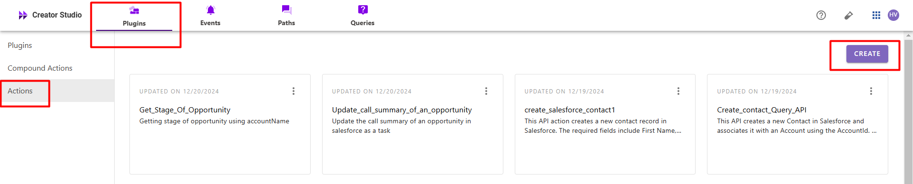
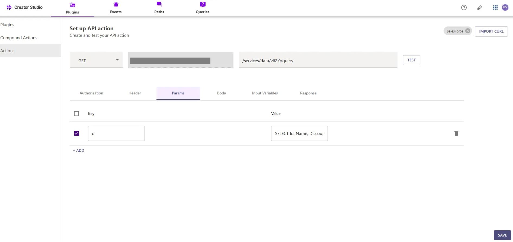
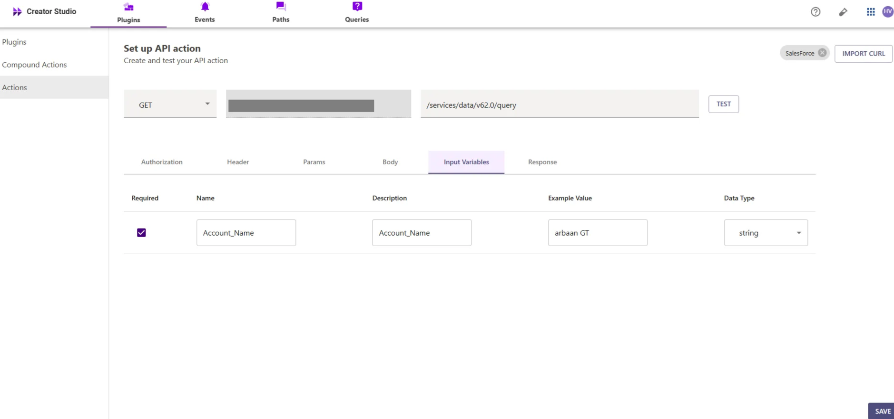
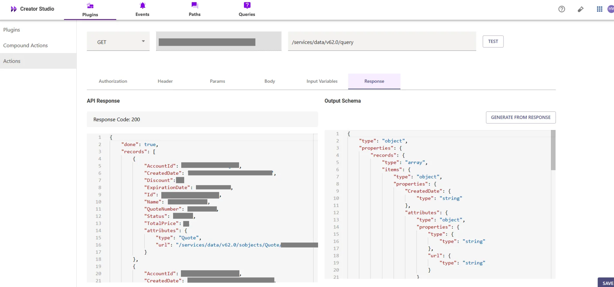
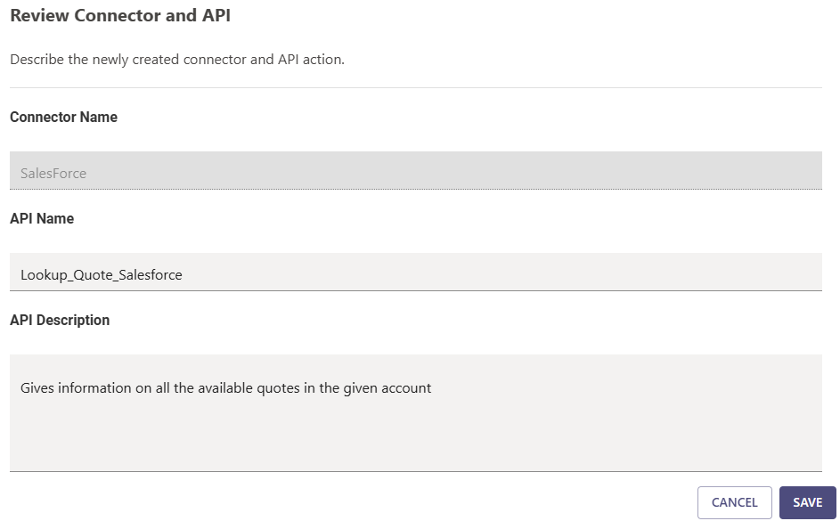
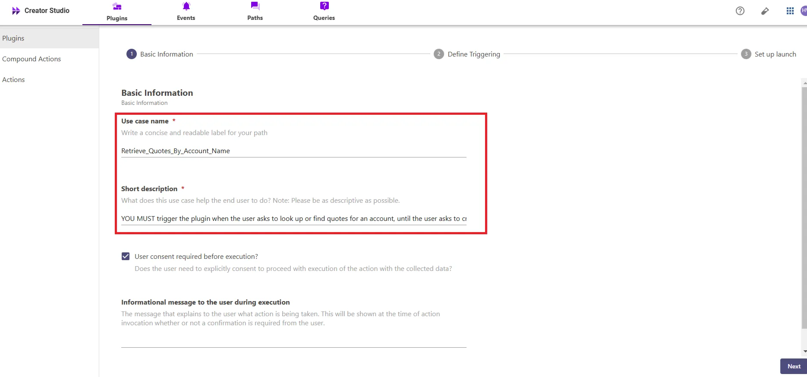
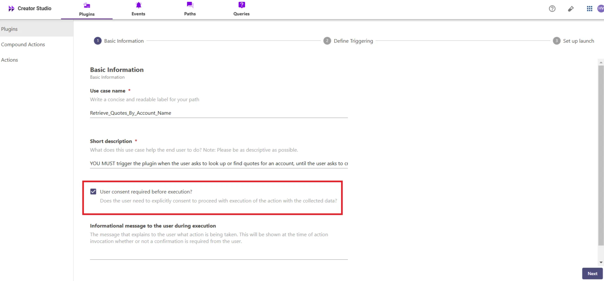

# Introduction:

Salesforce is a CRM platform, and the "**Look up all Quotes for an Account in Salesforce**" plugin allows you to search and retrieve existing quotes directly from your Salesforce account. By integrating this feature with your bot, users can quickly find and manage quotes, improving efficiency and organization. 

This guide will show you how to add the "**Look up all Quotes for an Account**" feature to your bot using Creator Studio

# **Prerequisites:**

- Salesforce Connector built in Creator Studio (follow the [Salesforce Authentication](https://developer.moveworks.com/creator-studio/resources/connector/?id=salesforce) guide to create your connector)

# **What are we building?**

### **Conversation Design**

This [purple chat](https://developer.moveworks.com/creator-studio/developer-tools/purple-chat?conversation=%7B%22startTimestamp%22%3A%2211%3A43%2BAM%22%2C%22messages%22%3A%5B%7B%22parts%22%3A%5B%7B%22richText%22%3A%22I+need+to+look+up+a+quote+for+a+customer+in+Salesforce.%22%7D%5D%2C%22role%22%3A%22user%22%7D%2C%7B%22parts%22%3A%5B%7B%22richText%22%3A%22Okay%2C+which+customer+are+you+looking+for%3F%22%7D%5D%2C%22role%22%3A%22assistant%22%7D%2C%7B%22parts%22%3A%5B%7B%22richText%22%3A%22Acme+Inc.%22%7D%5D%2C%22role%22%3A%22user%22%7D%2C%7B%22parts%22%3A%5B%7B%22reasoningSteps%22%3A%5B%7B%22richText%22%3A%22Searching+Salesforce+for+quotes+related+to+%27Acme+Inc.%27...%22%2C%22status%22%3A%22pending%22%7D%5D%7D%2C%7B%22reasoningSteps%22%3A%5B%7B%22richText%22%3A%22Found+3+quotes+for+Acme+Inc.%22%2C%22status%22%3A%22success%22%7D%5D%7D%2C%7B%22richText%22%3A%22I+found+three+quotes+for+Acme+Inc.++Can+you+confirm+which+quote+you%27re+looking+for%3F%22%7D%2C%7B%22richText%22%3A%22%3Cul%3E%3Cli%3EQuote+Q-1234%3C%2Fli%3E%3Cli%3EQuote+Q-5678%3C%2Fli%3E%3Cli%3EQuote+Q-9012%3C%2Fli%3E%3C%2Ful%3E%22%7D%5D%2C%22role%22%3A%22assistant%22%7D%5D%7D) shows the experience we are going to build

# **Creator Studio Components**

- **Triggers:**
    1. **Natural Language**
- **Slots:**
    1. **Account Name:** Capture and store the **Account Name** to search for the associated Quote Numbers.
    2. **Lookup Quote Number:** Capture and store the **Quote Number** if the user wants to further refine or specify a particular quote.
- **Actions:**
    1. **Retrieve Quote Number using Account Name:** Fetch the **Quote Number** associated with the provided **Account Name** via Salesforce API.
- **Guidelines:**
    1. None

# **API Research**

To build this use case, we will use **API** to achieve the goal of looking up an existing quote number inside a Salesforce account


## API #1: Retrieve Quote Number Based on Account Name

The [Retrieve Quote Number Based on Account Name](https://developer.salesforce.com/docs/atlas.en-us.cpq_dev_api.meta/cpq_dev_api/cpq_api_pricing_parent.htm) API retrieves the **Quote Numbers** associated with a given **Account Name** from Salesforce using a SOQL query. This API helps in identifying and retrieving the quote numbers linked to specific Salesforce accounts.

- **Purpose**: Fetches **Quote Numbers** related to a specific **Account Name**.
- **Features**: Supports filtering by **Account Name** and returns a list of **Quote Numbers** associated with the specified account.
- **Example**: Queries Salesforce to get **Quote Numbers** using the following query

```bash
curl --location 'https://<YOUR_DOMAIN>/services/data/v62.0/query/?q=SELECT+Id,+Name,+Discount,+QuoteNumber,+CreatedDate,+Status,+ExpirationDate,+TotalPrice,+AccountId+FROM+Quote+WHERE+Account.Name+LIKE+%27%25<ACCOUNT_NAME>%25%27' \
--header 'Authorization: Bearer <ACCESS_TOKEN>'
```

# **Steps**

## **Step 1: Build HTTP Action**

Define your HTTP Actions for looking up a **Quote** Number from Salesforce based on the provided **Account Name**.

### 1. **In Creator Studio, Create a New Action**:

- Navigate to the **Plugins** section > **Actions** tab.
- Click on **CREATE** to define a new action



- Click on the `IMPORT CURL` option and paste the following cURL command:

```bash
curl --location 'https://<YOUR_DOMAIN>/services/data/v62.0/query/?q=SELECT+Id,+Name,+Discount,+QuoteNumber,+CreatedDate,+Status,+ExpirationDate,+TotalPrice,+AccountId+FROM+Quote+WHERE+Account.Name+LIKE+%27%25<ACCOUNT_NAME>%25%27' \
--header 'Authorization: Bearer <ACCESS_TOKEN>'
```

- Click on `Use Existing Connector` > select the [Salesforce](https://developer.moveworks.com/creator-studio/resources/connector/?id=salesforce) **connector** that you just created > Click on `Apply`. This will populate the Base URL and the Authorization section of the API Editor.
- **Query Parameters for Salesforce Quote Number Query**
- **Key ( q ): Value** (`SELECT Id, Name, Discount, QuoteNumber, CreatedDate, Status, ExpirationDate, TotalPrice, AccountId FROM Quote WHERE Account.Name LIKE '{{Account_Name}}'` )
- This query filters out the quotes associated with an account based on the **Account Name** and retrieves the necessary quote details, ensuring the response contains the relevant quote information for the specified account.



- **Input Variables** :

             Account_name : Example Value (arbaan GT).



- Click on `Test` to check if the Connector setup was successful and expect a successful response as shown below. You will see the request response on the left side and the generated output schema on the right.
- If the output schema does not match the API response or fails to populate automatically, kindly click the `GENERATE FROM RESPONSE` button to refresh and align the schema with the API response.



- Add the **API Name** and **API Description** as shown below, then click the `Save` button



## **Step 2: Build Compound Action**

- Head over to the **Compound Actions** tab and click **CREATE**


- Give your Compound Action a **Name** and **Description** , then click `Next` Note: Name only letters, numbers, and underscores. We suggest using snake case or camel case formatting (e.g. Workflow_name or workflowName )


- Click on the `Script editor` tab. Here you will be able to build your compound action using the YAML syntax.
- At a high-level, this syntax provides actions (HTTP Request, APIthon Scripts) and workflow logic (switch statements, for each loops, return statements, parallel, try/catch). See the [Compound Action Syntax](https://developer.moveworks.com/creator-studio/reference/compound_actions_syntax/) Reference for more info.

```yaml
steps:
  - action:
      output_key: Lookup_quote_Information_result
      action_name: Lookup_Quote_Salesforce
      progress_updates:
        on_complete: ON_COMPLETE_MESSAGE
        on_pending: ON_PENDING_MESSAGE
      input_args:
        Account_Name: data.Account_Name
  - return:
      output_mapper:
        list:
          MAP():
            converter:
              QuoteNumber: item.QuoteNumber
            items: data.Lookup_quote_Information_result.records
```

- Click on `Input fields` tab and click the `+Add` button. Here you will define the slots that you want to collect from users through the conversation and trigger your Workflow with. After defining the input fields, click the `Submit` button to save your changes.


## **Step 3: Publish Workflow to Plugin**

- Head over to the `Compound Actions` tab and click on the kebab menu ( `︙` )
- Next, click on `Publish Workflow to Plugin`
- First, verify your Plugin **Name** & **Short description** . This is autofilled from the name & description of your compound action.



- Next, consider whether to select the `User consent required before execution?` checkbox. Enabling this option prompts the user to confirm all slot values before executing the plugin, which is widely regarded as a best practice.



- Click `Next` and set up your positive and negative triggering examples. This ensures that the bot triggers your plugin given a relevant utterance.
- See our [guide](https://developer.moveworks.com/creator-studio/conversation-design/triggers/natural-language-triggers/#how-to-write-good-triggering-examples) on Triggering
- Lastly, click `Next` and set the **Launch Rules** you want your plugin to abide by.
    - See our [guide](https://developer.moveworks.com/creator-studio/administration/launch-options/) on Launch Rules

## **Step 4: See it in action!**

- After clicking the final `Submit` button, your plugin will be published to the bot and triggerable based on your **Launch Rules.**
- You should wait up to **5 minutes** after making changes before trying to test in your bot!
    - If you run into an issue:
        1. Check our [troubleshooting guides](https://developer.moveworks.com/creator-studio/troubleshooting/support/)
        2. Understand your issue using Logs
        3. Reach out to Support

# **Congratulations!**

You've just added the "**Look up all Quotes for an Account**" feature inside your Salesforce platform to your Copilot! Explore our other guides for more inspiration on what to build next.
