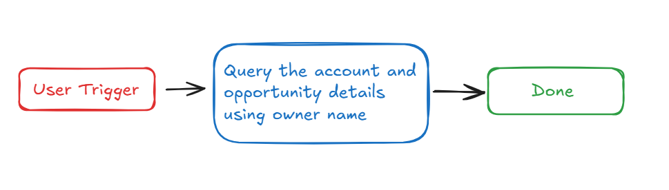

# **Introduction :**

Salesforce is a CRM platform, and the **Lookup Account and Opportunity by Their Owner** plugin allows users to specify the name of a sales representative and retrieve related accounts and opportunities that they own. By integrating this functionality into your bot, users can efficiently and seamlessly look up accounts and opportunities (contract values), thus improving productivity and organization.

This guide provides detailed, step-by-step instructions on how to incorporate the **Lookup Account and Opportunity by Their Owner** feature into your bot using Creator Studio.

Let's get started!

# Prerequisites :

- [Postman](https://www.postman.com/) or an API Testing Tool
- Salesforce Connector built in Creator Studio (follow the [Salesforce Authentication](https://developer.moveworks.com/creator-studio/resources/connector/?id=salesforce) guide to create your connector)

# What are we building?

## **Conversation Design**

This [purple chat](https://developer.moveworks.com/creator-studio/developer-tools/purple-chat?conversation=%7B%22startTimestamp%22%3A%2211%3A43+AM%22%2C%22messages%22%3A%5B%7B%22role%22%3A%22user%22%2C%22parts%22%3A%5B%7B%22richText%22%3A%22Can+you+provide+me+with+a+list+of+accounts+that+Zara+Perez+owns+and+their+contract+size%3F%22%7D%5D%7D%2C%7B%22role%22%3A%22assistant%22%2C%22parts%22%3A%5B%7B%22reasoningSteps%22%3A%5B%7B%22status%22%3A%22success%22%2C%22richText%22%3A%22%3Cp%3E%E2%9C%85+Working+on+%3Cb%3EAccounts+Owned+By+Zara+Perez%3C%2Fb%3E%3Cbr%3E%E2%8F%B3+Calling+Plugin+%3Cb%3ELookup+Opportunities+By+Owner%3C%2Fb%3E%3C%2Fp%3E%22%7D%5D%7D%2C%7B%22richText%22%3A%22Certainly%21+Here+are+the+accounts+owned+by+Zara+Perez+along+with+the+contract+value%3A%3Cbr%3E-+%3Cb%3EAccount%3A%3C%2Fb%3E+NextGen+Innovations%2C+%3Cb%3EContract+Value%3A%3C%2Fb%3E+%24300K%3Cbr%3E-+%3Cb%3EAccount%3A%3C%2Fb%3E+TechSphere%2C+%3Cb%3EContract+Value%3A%3C%2Fb%3E+%24250K%3Cbr%3E-+%3Cb%3EAccount%3A%3C%2Fb%3E+Global+Dynamics%2C+%3Cb%3EContract+Value%3A%3C%2Fb%3E+%24200K%3Cbr%3E-+%3Cb%3EAccount%3A%3C%2Fb%3E+Quantum+Solutions%2C+%3Cb%3EContract+Value%3A%3C%2Fb%3E+%24150K%3Cbr%3E-+%3Cb%3EAccount%3A%3C%2Fb%3E+Pathfinder+Ltd.%2C+%3Cb%3EContract+Value%3A%3C%2Fb%3E+%24100K%3Cbr%3EDo+you+need+any+further+details+on+these+accounts%2C+or+is+there+something+else+I+can+assist+with%3F%22%7D%5D%7D%5D%7D) shows the experience we are going to build.

# **Creator Studio Components**

- **Triggers**:
    1. Natural Language
- **Slots**:
    1. Fetch account and opportunity details using Owner name
- **Actions**:
    1. **Retrieve Account and opportunity by owner name:**
        - Query the account and opportunity information by using the owner name.
- **Guidelines:**
    1. None

# **API Research**

To build this use case, we will utilize one API. Since our goal is to fetch the accounts and opportunities associated with the specified owner name, we will focus on Salesforce's Opportunity-related APIs. Only a single API call is required to achieve this.



## API #1: **Retrieve** Account and opportunity by Owner Name

The [**Retrieve Account and opportunity by Owner Name**](https://developer.salesforce.com/docs/atlas.en-us.object_reference.meta/object_reference/sforce_api_objects_opportunity.htm) API enables users to fetch comprehensive details about accounts and their associated opportunities from Salesforce. By leveraging a SOQL query, this API ensures efficient and precise data retrieval, even in environments with a large number of opportunities.

- **Purpose**: Retrieves detailed opportunity-related data, including: **Account Name, Opportunity Name, Stage Name, Amount (Contract Value), Close Date**
- **Features**: Filters data based on **Owner Name**, ensuring accurate and relevant results, even in large datasets.
- **Example**: Executes a query in Salesforce to fetch opportunity details linked to a given **Owner Name**
    
    ```bash
    curl --request GET \
    --location 'https://<YOUR_DOMAIN>/services/data/v62.0/query?q=SELECT%20Account.Name%2C%20Name%2C%20StageName%2C%20Amount%2C%20CloseDate%20FROM%20Opportunity%20WHERE%20Owner.Name%20LIKE%20%27%25{{Owner_Name}}%25%27%20AND%20AccountId%20!%3D%20null' \
    --header 'Content-Type: application/json'
    
    ```
    

# **Steps**


## **Step 1: Build HTTP Action**

Define your HTTP Actions for fetching all the backlog ideas of a specific project :

### **1. Retrieve** Account and opportunity by Owner Name

- In Creator Studio, create a new Action.
    - Navigate to plugin section > Actions tab
    - Click on CREATE to define a new action
        
        
        
- Click on the  IMPORT CURL option and paste the following cURL command:
    
    ```bash
    curl --request GET \
    --location 'https://<YOUR_DOMAIN>/services/data/v62.0/query?q=SELECT%20Account.Name%2C%20Name%2C%20StageName%2C%20Amount%2C%20CloseDate%20FROM%20Opportunity%20WHERE%20Owner.Name%20LIKE%20%27%25{{Owner_Name}}%25%27%20AND%20AccountId%20!%3D%20null' \
    --header 'Content-Type: application/json'
    ```
    
- Click on Use Existing Connector > select the Salesforce [](https://developer.moveworks.com/creator-studio/resources/connector/?id=jira)connector that you just created > Click on Apply. This will populate the Base URL and the Authorization section of the API Editor.
- **Query Parameters for Salesforce Account Query**
    
    Key ( q ) : ****Value ( **SELECT Account.Name, Name, StageName, Amount, CloseDate FROM Opportunity WHERE Owner.Name LIKE '{{Owner_Name}}' AND AccountId != null**)
    
- This SOQL query filters accounts and opportunities by searching for records associated with a specific owner name. The {{Owner_Name}} placeholder is a dynamic variable that will be replaced with the actual owner’s name when the query is executed. The query retrieves key details, including the **Account Name, Opportunity Name, Stage Name, Amount (Contract Value), and Close Date** for opportunities linked to the specified owner.
    
    
    
- **Input Variables** :
    - Owner_Name : Example Value (**Henry**).
    
    
    
- Click on Test to check if the Connector setup was successful and expect a successful response as shown below. You will see the request response on the left side and the generated output schema on the right. If the output schema does not match the API response or fails to populate automatically, kindly click the GENERATE FROM RESPONSE button to refresh and align the schema with the API response.
    
    
    
- Add the **API Name** and **API Description** as shown below, then click the Save button
    
    
    

## **Step 2: Build Compound Action**


- Head over to the **Compound Actions** tab and click **CREATE**
    
    
    
- Give your Compound Action a **Name** and **Description** , then click Next Note: Name only letters, numbers, and underscores. We suggest using snake case or camel case formatting (e.g. Workflow_name or workflowName )
    
    
    
- Click on the Script editor tab. Here you will be able to build your compound action using the YAML syntax. At a high-level, this syntax provides actions (HTTP Request, APIthon Scripts) and workflow logic (switch statements, for each loops, return statements, parallel, try/catch). See the [Compound Action Syntax](https://developer.moveworks.com/creator-studio/reference/compound_actions_syntax/) Reference for more info.
    
    ```yaml
    steps:
      - action:
          output_key: Lookup_Account_and_Opportunity_by_Owner_result
          action_name: Lookup_Account_and_Opportunity_by_Owner
          progress_updates:
            on_complete: Accounts retrieval completed
            on_pending: Retrieving Accounts
          input_args:
            Owner_Name: data.Owner_Name
      - return:
          output_mapper:
            list:
              MAP():
                converter:
                  Account: item.Account.Name
                  ContractValue: item.Amount
                items: data.Lookup_Account_and_Opportunity_by_Owner_result.records
    
    ```
    
- Click on Input fields tab and click the +Add button. Here you will define the slots that you want to collect from users through the conversation and trigger your Workflow with. After defining the input fields, click the Submit button to save your changes.
    
    
    

## **Step 3: Publish Workflow to Plugin**

- Head over to the Compound Actions tab and click on the kebab menu ( ︙ )
- Next, click on Publish Workflow to Plugin
- First, verify your Plugin **Name** & **Short description** . This is autofilled from the name & description of your compound action.
    
    
    
- Next, consider whether to select the User consent required before execution? checkbox. Enabling this option prompts the user to confirm all slot values before executing the plugin, which is widely regarded as a best practice.
    
    
    
- Click Next and set up your positive and negative triggering examples. This ensures that the bot triggers your plugin given a relevant utterance.
    - See our [guide](https://developer.moveworks.com/creator-studio/conversation-design/triggers/natural-language-triggers/#how-to-write-good-triggering-examples) on Triggering
- Lastly, click Next and set the **Launch Rules** you want your plugin to abide by.
    - See our [guide](https://developer.moveworks.com/creator-studio/administration/launch-options/) on Launch Rules

## **Step 4: See it in action!**

- After clicking the final Submit button, your plugin will be published to the bot and triggerable based on your **Launch Rules.**
- You should wait up to **5 minutes** after making changes before trying to test in your bot!
- If you run into an issue:
    1. Check our [troubleshooting guides](https://developer.moveworks.com/creator-studio/troubleshooting/support/)
    2. Understand your issue using Logs
    3. Reach out to Support

# **Congratulations!**

You've just added the **"Lookup Account and Opportunity by Their Owner"** feature inside your Salesforce account to your Copilot! Explore our other guides for more inspiration on what to build next.
