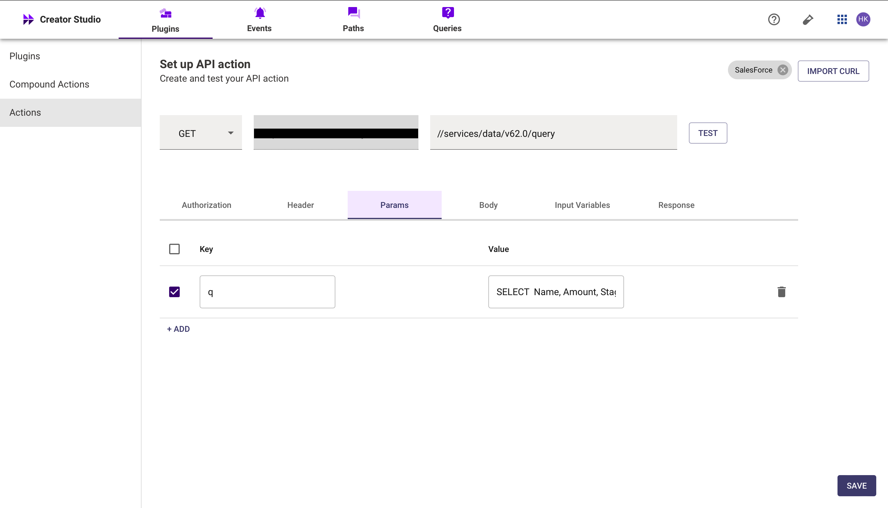
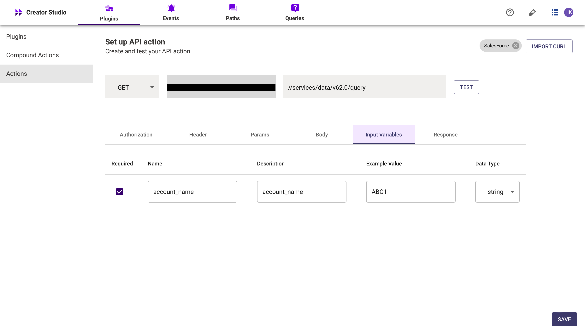
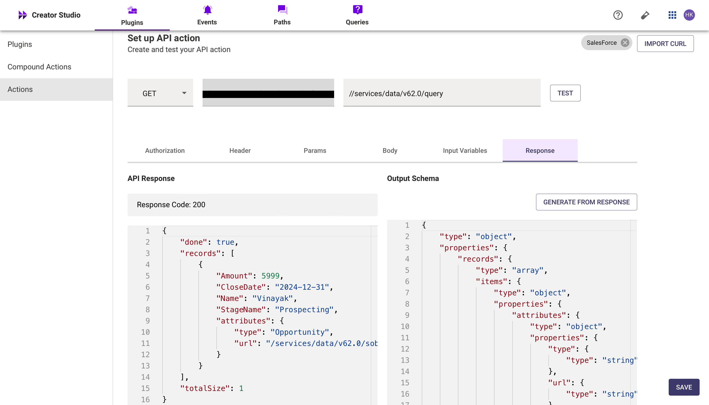
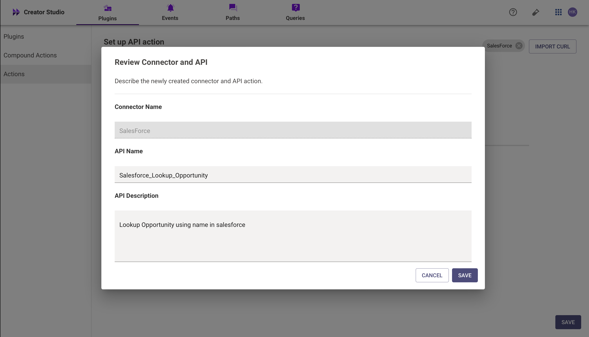
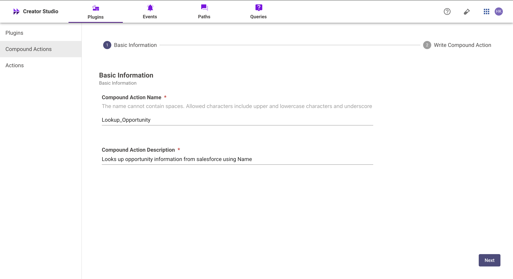
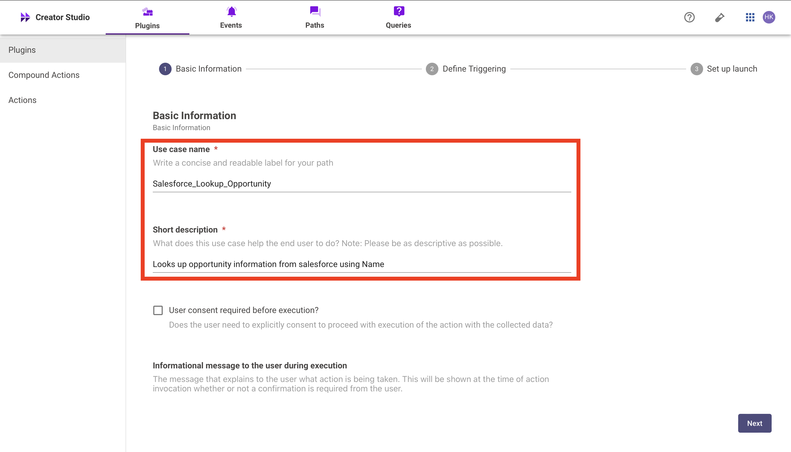
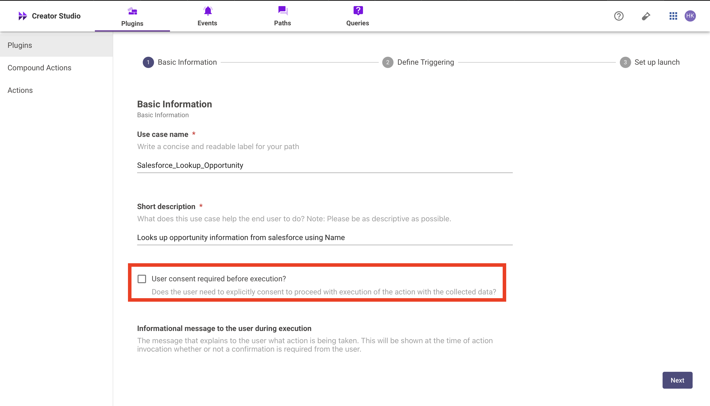

# Introduction

Salesforce is a CRM platform, and the "Look Up Opportunity Information in Salesforce" plugin helps you efficiently retrieve Opportunity details from your Salesforce account. By integrating this feature with your bot, users can quickly access and manage Opportunity information, enhancing productivity and organization.

This guide will show you how to add the "Look Up Opportunity Information in Salesforce" feature to your bot using Creator Studio. Let's get started!

# Prerequisites

- An API Testing Tool
- Salesforce Connector built in Creator Studio (follow the [Salesforce Authentication](https://developer.moveworks.com/creator-studio/resources/connector/?id=salesforce) guide to create your connector)

# What are we building?

### **Conversation Design**

This [purple chat](https://developer.moveworks.com/creator-studio/developer-tools/purple-chat-builder/?workspace=%7B%22title%22%3A%22My+Workspace%22%2C%22botSettings%22%3A%7B%7D%2C%22mocks%22%3A%5B%7B%22id%22%3A9335%2C%22title%22%3A%22Mock+1%22%2C%22transcript%22%3A%7B%22settings%22%3A%7B%22colorStyle%22%3A%22LIGHT%22%2C%22startTime%22%3A%2211%3A43+AM%22%2C%22defaultPerson%22%3A%22GWEN%22%2C%22editable%22%3Atrue%7D%2C%22messages%22%3A%5B%7B%22from%22%3A%22USER%22%2C%22text%22%3A%22%3Cp%3EI+want+to+look+up+the+opportunity+for+ABC+Co.%3C%2Fp%3E%22%7D%2C%7B%22from%22%3A%22ANNOTATION%22%2C%22text%22%3A%22%3Cp%3E%E2%9C%85+Working+on+%3Cb%3ESalesforce+-+Opportunities+%3C%2Fb%3E%3Cbr%3E%E2%8F%B3+Calling+Plugin+%3Cb%3ESalesforce+-+Opportunity%3C%2Fb%3E%3C%2Fp%3E%22%7D%2C%7B%22from%22%3A%22BOT%22%2C%22text%22%3A%22Here+are+the+details+for+the+opportunity+with+ABC+Co%3A%3Cbr%3E%3Cb%3EOpportunity+Name%3A%3C%2Fb%3E+ABC+Co+Technology+Refresh%3Cbr%3E%3Cb%3EStage%3A%3C%2Fb%3E+Negotiation%3Cbr%3E%3Cb%3EClose+Date%3A%3C%2Fb%3E+2023-12-15%3Cbr%3E%3Cb%3EAmount%3A%3C%2Fb%3E+%24500%2C000%3Cbr%3EWould+you+like+to+take+any+action+on+this+opportunity+in+Salesforce%3F%22%7D%2C%7B%22from%22%3A%22BOT%22%2C%22text%22%3A%22Choose+an+action+for+this+opportunity%3A%22%2C%22cards%22%3A%5B%7B%22title%22%3A%22Opportunity+Actions+in+Salesforce%22%2C%22text%22%3A%22Manage+this+opportunity+directly+in+Salesforce.%22%2C%22buttons%22%3A%5B%7B%22style%22%3A%22PRIMARY%22%2C%22text%22%3A%22Open+in+Salesforce%22%7D%2C%7B%22text%22%3A%22Set+Reminder%22%7D%2C%7B%22text%22%3A%22Nothing+for+now%22%7D%5D%7D%5D%7D%5D%7D%7D%5D%7D) shows the experience we are going to build.

# Creator Studio Components

- **Triggers:**
    1. **Natural Language**
    2. Identify user queries or commands related to lookup Opportunity information in Salesforce.
- **Slots:**
    1. **Account Name:** Query Account Name to look up Opportunity details.
- **Actions:**
    1. **Retrieve Opportunity Information:** Look up Opportunity details using the Account Name via Salesforce API.
- **Guidelines:**
    1. None.

# API Research

To build this use case, we will use one **API** to achieve the goal of creating a Salesforce account:


## API #1:Query the Opportunity by Name:

The Retrieve [Opportunity information by account name](https://developer.salesforce.com/docs/atlas.en-us.object_reference.meta/object_reference/sforce_api_objects_opportunity.htm) API retrieves Opportunity details for a given **Account Name** from Salesforce using a SOQL query. This API helps in accessing Opportunity information associated with specific Salesforce accounts.

- **Purpose**: Fetches Opportunity details based on **Account Name**.
- **Features**: Supports filtering by **Account Name** and returns relevant Opportunity information.
- **Example**: Queries Salesforce to retrieve Opportunity information for the specified **Account Name**

```yaml
curl --location 'https://<YOUR_DOMAIN>//services/data/v62.0/query?q=SELECT%20AccountId%2C%20Amount%2C%20StageName%2C%20CloseDate%2C%20Id%20FROM%20Opportunity%20WHERE%20Account.Name%20like%20ABC1%20ORDER%20BY%20CloseDate%20DESC%20LIMIT%201' \
--header 'Content-Type: application/json'
```

- **<YOUR_DOMAIN>**: Your Salesforce instance domain (e.g., yourcompany.my.salesforce.com).
- **<ACCOUNT_NAME>**: The name of the account used to look up Opportunity information in Salesforce.

# Steps

## **Step 1: Build HTTP Action**

Define your HTTP Actions for fetching the **Account ID** from Salesforce based on the provided **Account Name**.

1. **In Creator Studio, Create a New Action**:

- Navigate to **Plugins** section > **Actions** tab.
- Click on **CREATE** to define a new action.
    
    
    

Click on the IMPORT CURL option and paste the following cURL command:

```yaml
curl --location 'https://<YOUR_DOMAIN>//services/data/v62.0/query?q=SELECT  AccountId, Amount, StageName, CloseDate, Id FROM Opportunity WHERE Account.Name like 'ABC1' ORDER BY CloseDate DESC LIMIT 1' \
--header 'Authorization: Bearer' \
--header 'Content-Type: application/json'
```

- Click on Use Existing Connector> select the [Salesforce Connector](https://developer.moveworks.com/creator-studio/resources/connector/?id=salesforce) that you just created > Click on Apply. This will populate the Base URL and the Authorization section of the API Editor.
- **Query Parameters for Salesforce Opportunity Name Query**
- **Key ( q )**: Value (SELECT AccountId, Amount, StageName, CloseDate FROM Opportunity WHERE Name='{{Name}}’)
- This query filters Opportunity records associated with an account based on the **Account Name** and retrieves relevant Opportunity information (such as StageName, Amount, CloseDate etc.), ensuring that only the essential Opportunity details are returned for the specified account
    
    
    

- **Input Variables** :
    
         Name : Example Value (ABC1).
    
    
    
- Click on Test to check if the Connector setup was successful and expect a successful response as shown below. You will see the request response on the left side and the generated output schema on the right.
- If the output schema does not match the API response or fails to populate automatically, kindly click the GENERATE FROM RESPONSE button to refresh and align the schema with the API response.
    
    
    
- Add the **API Name** and **API Description** as shown below, then click the Save button
    
    
    

## **Step 2: Build Compound Action**

- Head over to the **Compound Actions** tab and click **CREATE**
    
    
    
- Give your Compound Action a **Name** and **Description** , then click Next Note: Name only letters, numbers, and underscores. We suggest using snake case or camel case formatting (e.g. Workflow_name or workflowName )
    
    
    

- Click on the Script editor tab. Here you will be able to build your compound action using the YAML syntax.
- At a high-level, this syntax provides actions (HTTP Request, APIthon Scripts) and workflow logic (switch statements, for each loops, return statements, parallel, try/catch). See the [Compound Action Syntax](https://developer.moveworks.com/creator-studio/reference/compound_actions_syntax/) Reference for more info.

```yaml
steps:
  - action:
      output_key: result
      action_name: Salesforce_Lookup_Opportunity
      progress_updates:
        on_complete: ON_COMPLETE_MESSAGE
        on_pending: ON_PENDING_MESSAGE
      input_args:
        account_name: data.account_name
  - return:
      output_mapper:
        StageName: data.result.records[0].StageName
        Amount: data.result.records[0].Amount
        CloseDate: data.result.records[0].CloseDate
        Name: data.result.records[0].Name

```

- Click on Input fields tab and click the +Add button. Here you will define the slots that you want to collect from users through the conversation and trigger your Workflow with. After defining the input fields, click the Submit button to save your changes.
    
    
    

## **Step 3: Publish Workflow to Plugin**

- Head over to the Compound Action tab and click on the kebab menu ( ︙ )
- Next, click on Publish Workflow to Plugin
- First, verify your Plugin **Name** & **Short description** . This is autofilled from the name & description of your compound action.
    
    
    

- Next, consider whether to select the User consent required before execution? checkbox. Enabling this option prompts the user to confirm all slot values before executing the plugin, which is widely regarded as a best practice.
    
    
    
- Click Next and set up your positive and negative triggering examples. This ensures that the bot triggers your plugin given a relevant utterance.
    - See our [guide](https://developer.moveworks.com/creator-studio/conversation-design/triggers/natural-language-triggers/#how-to-write-good-triggering-examples) on Triggering
- Lastly, click Next and set the **Launch Rules** you want your plugin to abide by.
    - See our [guide](https://developer.moveworks.com/creator-studio/administration/launch-options/) on Launch Rules

## **Step 4: See it in action!**

- After clicking the final Submit button, your plugin will be published to the bot and triggerable based on your **Launch Rules.**
- You should wait up to **5 minutes** after making changes before trying to test in your bot!
- If you run into an issue:
    1. Check our [troubleshooting guides](https://developer.moveworks.com/creator-studio/troubleshooting/support/)
    2. Understand your issue using Logs
    3. Reach out to Support

# **Congratulations!**

You've just added the "Lookup Opportunity Information" feature inside your Salesforce account to your Copilot! Explore our other guides for more inspiration on what to build next.