# Submit Quote for Approval

# Introduction

Salesforce is a CRM platform, and the "**Submit Quote for Approval in Salesforce**" plugin helps you efficiently submit the quote details for approval from your Salesforce account. By integrating this feature with your bot, users can quickly submit the quote details for approval, enhancing productivity and organization.

This guide will show you how to add the "**Submit Quote for Approval in Salesforce**" feature to your bot using Creator Studio. Let's get started!

# Prerequisites

- Salesforce Connector built in Creator Studio (follow the [Salesforce Authentication](https://developer.moveworks.com/creator-studio/resources/connector/?id=salesforce) guide to create your connector)
- The  **Salesforce** **Lookup Quote**  is a plugin built in **Creator Studio** that allows users to retrieve quote details for a specific account name. For setup instructions, refer to the [**Salesforce Lookup Quote](https://developer.moveworks.com/creator-studio/resources/plugin/?id=salesforce-lookup-all-quotes-for-account)** guide.

# What are we building?

### **Conversation Design**

This [purple chat]( https://developer.moveworks.com/creator-studio/developer-tools/purple-chat-builder/?workspace=%7B%22title%22%3A%22My+Workspace%22%2C%22botSettings%22%3A%7B%22name%22%3A%22%22%2C%22imageUrl%22%3A%22%22%7D%2C%22mocks%22%3A%5B%7B%22id%22%3A6254%2C%22title%22%3A%22New+Mock%22%2C%22transcript%22%3A%7B%22settings%22%3A%7B%22colorStyle%22%3A%22LIGHT%22%2C%22startTime%22%3A%2211%3A43+AM%22%2C%22defaultPerson%22%3A%22GWEN%22%2C%22editable%22%3Atrue%2C%22botName%22%3A%22%22%2C%22botImageUrl%22%3A%22%22%7D%2C%22messages%22%3A%5B%7B%22from%22%3A%22USER%22%2C%22text%22%3A%22I+need+to+get+approval+for+a+new+quote+for+Acme+Inc.%22%7D%2C%7B%22from%22%3A%22ANNOTATION%22%2C%22text%22%3A%22Searches+Salesforce+for+existing+quotes+related+to+Acme+Inc.%22%7D%2C%7B%22from%22%3A%22BOT%22%2C%22text%22%3A%22I+found+recent+quotes+for+Acme+Inc.+Which+one+do+you+need+approval+for%3F%22%2C%22cards%22%3A%5B%7B%22title%22%3A%22Quote+1%3A+%2425%2C000+-+New+cloud+infrastructure%22%2C%22text%22%3A%22Created+on%3A+2023-04-10%22%7D%2C%7B%22title%22%3A%22Quote+2%3A+%2415%2C000+-+Software+licenses+renewal%22%2C%22text%22%3A%22Created+on%3A+2023-04-08%22%7D%5D%7D%2C%7B%22from%22%3A%22USER%22%2C%22text%22%3A%22The+first+one.%22%7D%2C%7B%22from%22%3A%22BOT%22%2C%22text%22%3A%22To+submit+for+approval%2C+I+just+need+a+few+more+details.%22%2C%22cards%22%3A%5B%7B%22title%22%3A%22Please+confirm+the+quote+details%22%2C%22text%22%3A%22%3Cp%3E%3Cb%3ECompany%3A%3C%2Fb%3E+Acme+Inc.%3Cbr%3E%3Cb%3EQuote+Amount%3A%3C%2Fb%3E+%2425%2C000%3Cbr%3E%3Cb%3EDescription%3A%3C%2Fb%3E+New+cloud+infrastructure%3Cbr%3E%3C%2Fp%3E%22%2C%22buttons%22%3A%5B%7B%22style%22%3A%22PRIMARY%22%2C%22text%22%3A%22Submit+for+Approval%22%7D%2C%7B%22text%22%3A%22Edit+Details%22%7D%2C%7B%22text%22%3A%22Cancel%22%7D%5D%7D%5D%7D%5D%7D%7D%5D%7D) shows the experience we are going to build.

# **Creator Studio Components**

- **Triggers:**
    1. Natural Language
- **Slots**:
    1. Fetch quote ID
- **Actions**:
    1. **Submitting Quote for Approval**: Submitting the selected quote for Approval.
- **Guidelines:**
    1. Add a guideline to confirm that this plugin executes only after the **Salesforce Lookup Quote** plugin has successfully run.
    2. Ensure that this plugin always retrieves the **Quote ID** directly from the response of the **Salesforce Lookup Quote** plugin

# API Research

To efficiently implement the use case for **Submit Quote for Approval**, we utilize a single API along with the [**Salesforce Lookup Quote**](https://developer.moveworks.com/creator-studio/resources/plugin/?id=salesforce-lookup-all-quotes-for-account)  plugin.

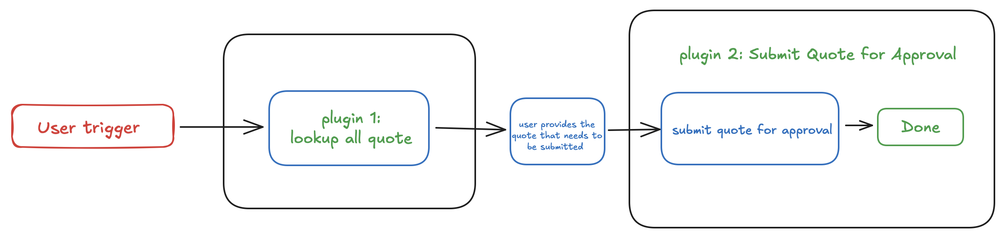

## **API #1: Submit Quote for Approval**

The [**Submit Quote for Approval**](https://developer.moveworks.com/creator-studio/resources/plugin?id=salesforce-submit-quote-approval) API allows you to submit a quote (or any other record) for approval in Salesforce. This API uses the **Process Approvals** endpoint to initiate the approval process.

- **Purpose**:
    - Submits a quote (or any record) for approval in Salesforce.
    - Allows you to specify the record ID, comments, and other parameters for the approval request.
- **Features**:
    - Supports submitting multiple approval requests in a single call.
    - Allows adding comments and specifying the context actor (the user initiating the approval).
    - Can skip entry criteria if needed.
- **Example**: Submits a quote for approval in Salesforce.

```yaml
curl --location 'https://<YOUR_DOMAIN>/services/data/v63.0/process/approvals/' \
--header 'Authorization: Bearer <ACCESS_TOKEN>' \
--header 'Content-Type: application/json' \
--data '{
"requests": [
{
"actionType": "Submit",
"contextId": "<QUOTE_ID>",
"comments": "<COMMENTS>",
"contextActorId": "<CONTEXT_ACTOR_ID>",
"skipEntryCriteria": "<TRUE_OR_FALSE>"
}
]
}'
```

### **Explanation of Fields**:

1. <YOUR_DOMAIN>: Replace this with your Salesforce instance domain (e.g., yourcompany.my.salesforce.com).
2. <QUOTE_ID>: The Salesforce ID of the quote (or record) you want to submit for approval. This is the contextID in the request.
3. <CONTEXT_ACTOR_ID>: The Salesforce ID of the user initiating the approval request. This is typically the current user.

# Steps

## **Step 1: Build HTTP Action**

Define your HTTP Actions for fetching the **Account ID** from Salesforce based on the provided **Account Name**.

### 1. Get the Quote ID using the Account Name

- Navigate to **Plugins** section > **Actions** tab.
- Click on **CREATE** to define a new action.
    
    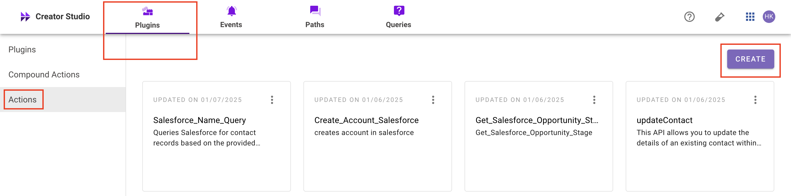
    
- Click on the IMPORT CURL option and paste the following cURL command:

```yaml
curl --location 'https://<YOUR_DOMAIN>/services/data/v63.0/process/approvals/' \
--header 'Authorization: Bearer <ACCESS_TOKEN>' \
--header 'Content-Type: application/json' \
--data '{
"requests": [
{
"actionType": "Submit",
"contextId": "<QUOTE_ID>",
"comments": "<COMMENTS>",
"contextActorId": "<CONTEXT_ACTOR_ID>",
"skipEntryCriteria": "<TRUE_OR_FALSE>"
}
]
}'
```

- Click on Use Existing Connector > select the [Salesforce Connector](https://developer.moveworks.com/creator-studio/resources/connector/?id=salesforce) that you just created > Click on Apply. This will populate the Base URL and the Authorization section of the API Editor.
- **Body:**
    - **actionType**: Specifies the action to perform, such as "Submit" for initiating an approval process.
    - **contextId**: The Salesforce ID of the record (e.g., Quote) being submitted for approval.
    - **comments**: Optional remarks or notes included with the approval request.
    - **contextActorId**: The Salesforce ID of the user initiating the approval request.
    - **skipEntryCriteria**: Determines whether to bypass entry criteria ("true") or enforce them ("false").
        
        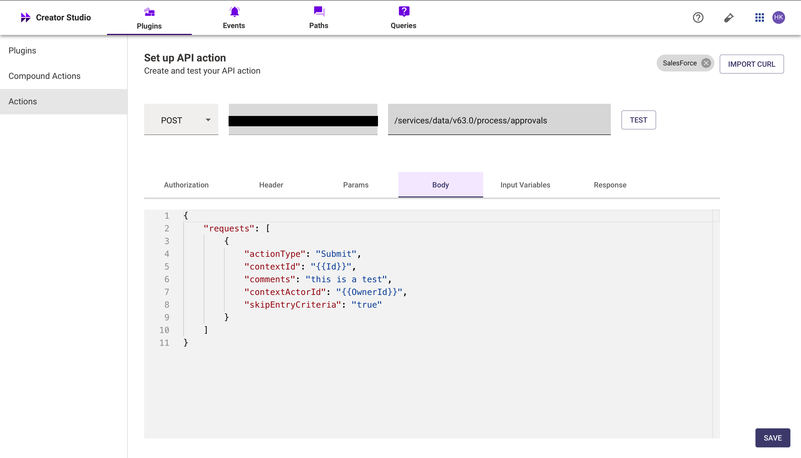
        

- **Input Variables** :
    - **Quote_Id :** Example Value ( **006IU00000kYK6lYAG**)
    - **Owner_Id :** Example Value ( **0Q04W000004we6ySAA**)
        
        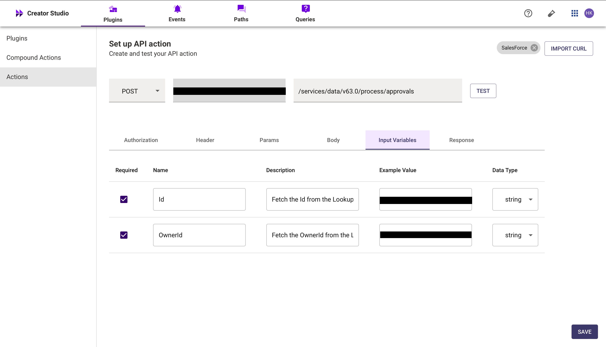
        
- Click on Test to check if the Connector setup was successful and expect a successful response as shown below. You will see the request response on the left side and the generated output schema on the right.
- If the output schema does not match the API response or fails to populate automatically, kindly click the GENERATE FROM RESPONSE button to refresh and align the schema with the API response.
    
    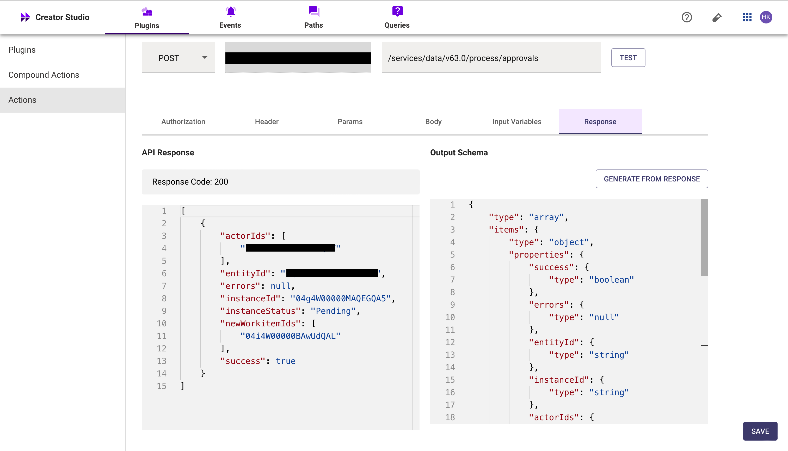
    
- Add the **API Name** and **API Description** as shown below, then click the Save button
    
    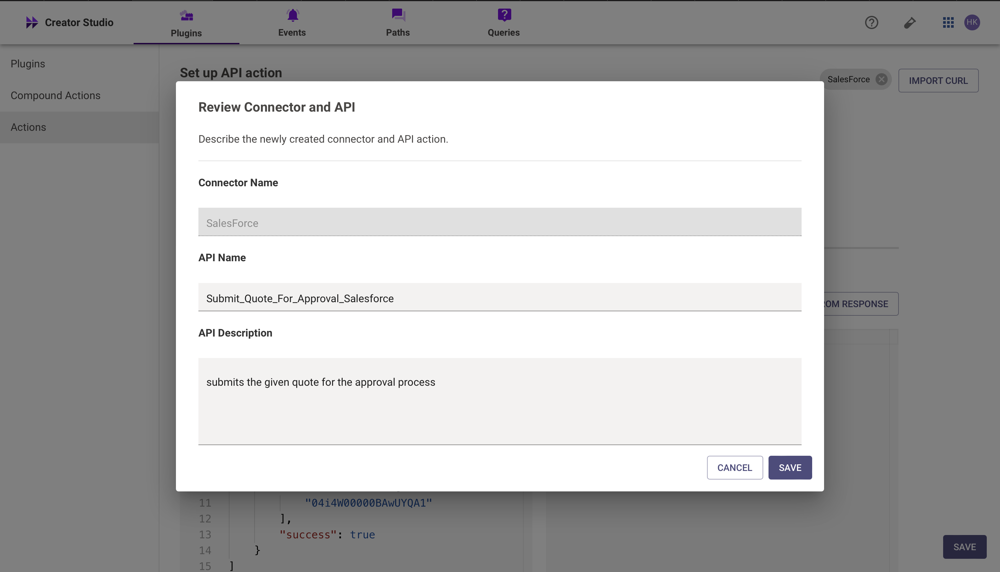
    

## **Step 2: Build Compound Action**

- Head over to the **Compound Actions** tab and click **CREATE**
    
    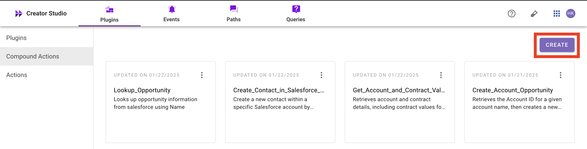
    
- Give your Compound Action a **Name** and **Description** , then click Next Note: Name only letters, numbers, and underscores. We suggest using snake case or camel case formatting (e.g. Workflow_name or workflowName )
    
    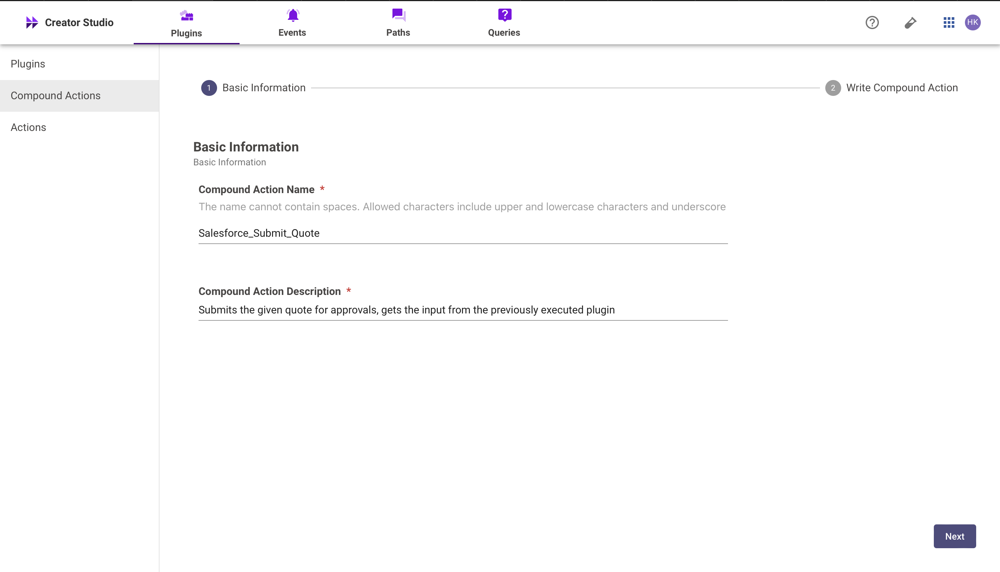
    
- Click on the Script editor tab. Here you will be able to build your compound action using the YAML syntax.
- At a high-level, this syntax provides actions (HTTP Request, APIthon Scripts) and workflow logic (switch statements, for each loops, return statements, parallel, try/catch). See the [Compound Action Syntax](https://developer.moveworks.com/creator-studio/reference/compound_actions_syntax/) Reference for more info.

```yaml
steps:
  - action:
      output_key: Submit_Quote_for_Approval_result
      action_name: Submit_Quote_For_Approval_Salesforce
      progress_updates:
        on_complete: Quote submitted for approval
        on_pending: Submitting Quote for approval
      input_args:
        OwnerId: data.OwnerId
        Id: data.Id

```

- Click on Input fields tab and click the +Add button. Here you will define the slots that you want to collect from users through the conversation and trigger your Workflow with. After defining the input fields, click the Submit button to save your changes.
    
    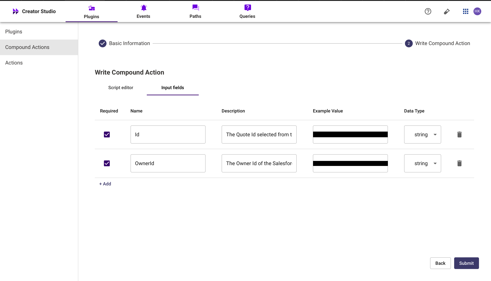
    

## **Step 3: Publish Workflow to Plugin**

- Head over to the Compound Actions tab and click on the kebab menu ( ︙ )
- Next, click on Publish Workflow to Plugin
- First, verify your Plugin **Name** & **Short description** . This is autofilled from the name & description of your compound action.
    
    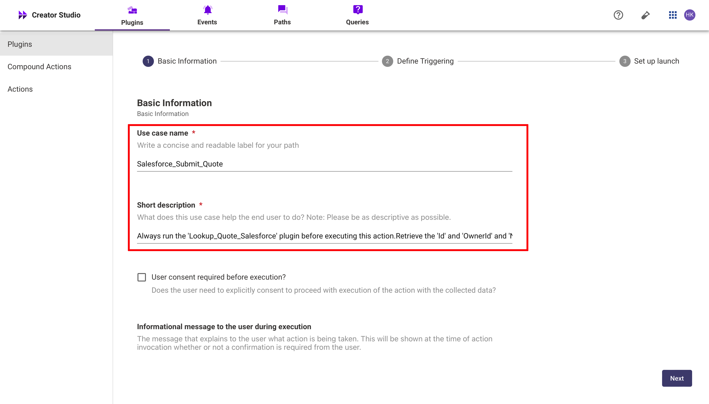
    
- Next, consider whether to select the User consent required before execution? checkbox. Enabling this option prompts the user to confirm all slot values before executing the plugin, which is widely regarded as a best practice.
    
    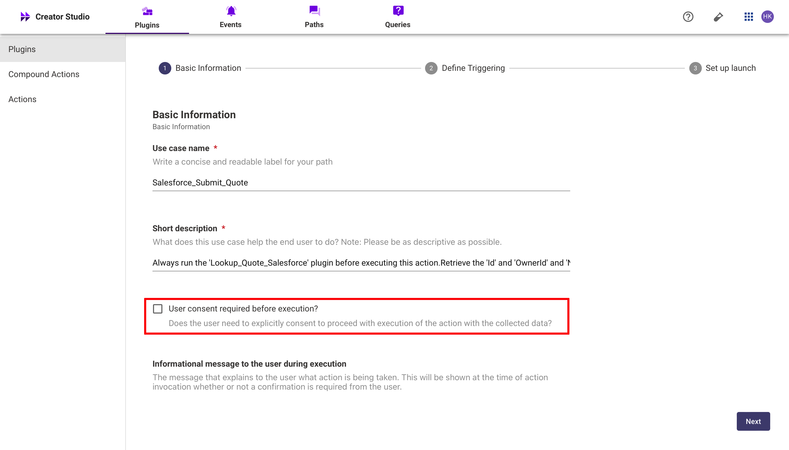
    
- Click Next and set up your positive and negative triggering examples. This ensures that the bot triggers your plugin given a relevant utterance.
    - See our [guide](https://developer.moveworks.com/creator-studio/conversation-design/triggers/natural-language-triggers/#how-to-write-good-triggering-examples) on Triggering
- Lastly, click Next and set the **Launch Rules** you want your plugin to abide by.
    - See our [guide](https://developer.moveworks.com/creator-studio/administration/launch-options/) on Launch Rules

## **Step 4: See it in action!**

- After clicking the final Submit button, your plugin will be published to the bot and triggerable based on your **Launch Rules.**
- You should wait up to **5 minutes** after making changes before trying to test in your bot!
- If you run into an issue:
    1. Check our [troubleshooting guides](https://developer.moveworks.com/creator-studio/troubleshooting/support/)
    2. Understand your issue using Logs
    3. Reach out to Support

# **Congratulations!**

You've just added the "**Submit Quote for Approval in Salesforce**" feature inside your Salesforce account to your Copilot! Explore our other guides for more inspiration on what to build next.