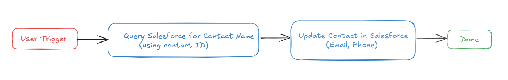
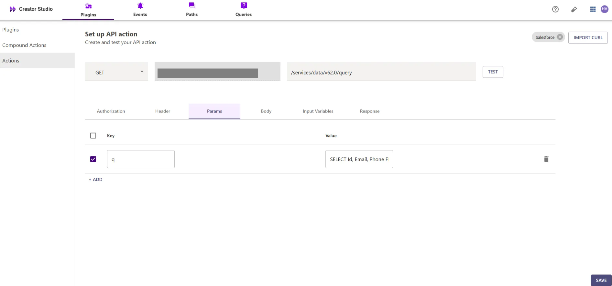
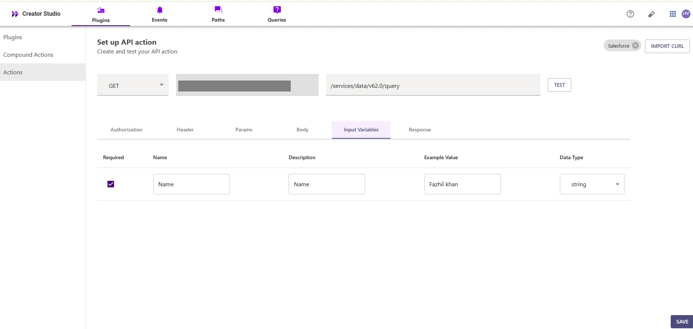
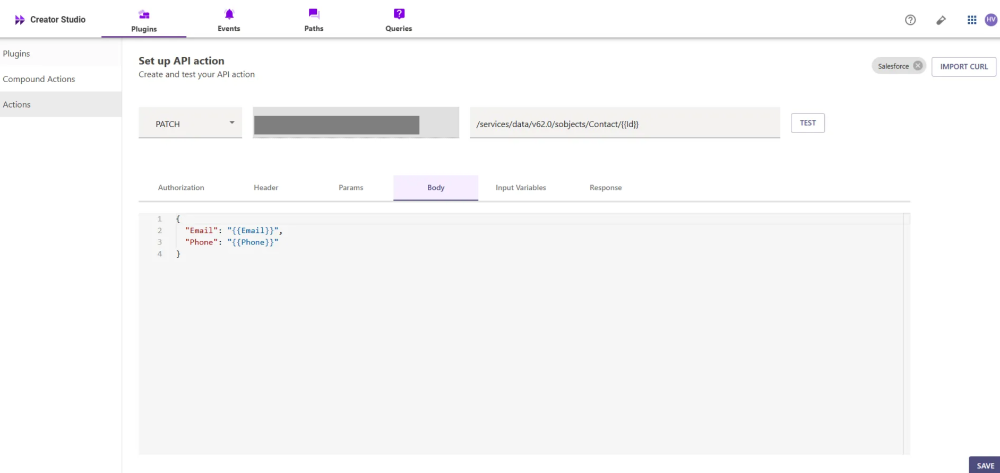
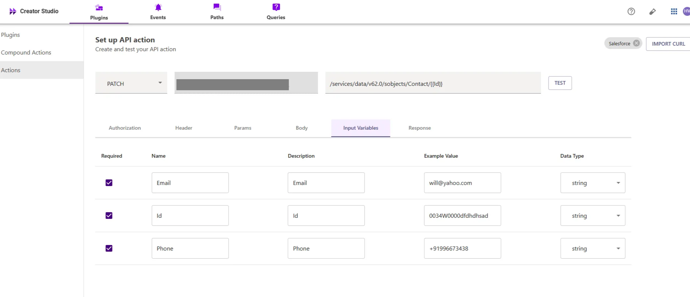
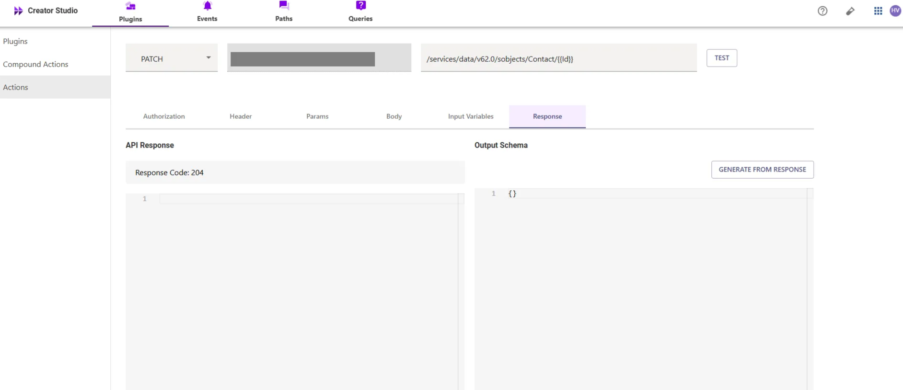

# Introduction:

Salesforce is a CRM platform, and the "Update Contact in Salesforce" plugin simplifies modifying existing contacts in your Salesforce account. By integrating this feature with your bot, users can easily update and manage contacts, enhancing efficiency and organization.

This guide will walk you through the process of adding the "Update Contact in Salesforce" feature to your bot using Creator Studio. Let's get started!

# **Prerequisites:**

- [Postman](https://www.postman.com/) or another API Testing Tool.
- Salesforce Connector built in Creator Studio (follow the [Salesforce Authentication](https://developer.moveworks.com/creator-studio/resources/connector/?id=salesforce) guide to create your connector for updating contacts in Salesforce).

# **What are we building?**

## **Conversation Design**

This [purple chat](https://developer.moveworks.com/creator-studio/developer-tools/purple-chat-builder/?workspace=%7B%22title%22%3A%22My+Workspace%22%2C%22botSettings%22%3A%7B%22name%22%3A%22test%22%2C%22imageUrl%22%3A%22www.google.com%22%7D%2C%22mocks%22%3A%5B%7B%22id%22%3A1291%2C%22title%22%3A%22New+Mock%22%2C%22transcript%22%3A%7B%22settings%22%3A%7B%22colorStyle%22%3A%22LIGHT%22%2C%22startTime%22%3A%2211%3A43+AM%22%2C%22defaultPerson%22%3A%22GWEN%22%2C%22editable%22%3Afalse%2C%22botName%22%3A%22test%22%2C%22botImageUrl%22%3A%22www.google.com%22%7D%2C%22messages%22%3A%5B%7B%22from%22%3A%22USER%22%2C%22text%22%3A%22I+need+to+update+the+contact+details+for+John+Doe+in+our+Palm+Hotels+account.%22%7D%2C%7B%22from%22%3A%22BOT%22%2C%22text%22%3A%22I%27ve+found+the+following+contact+details+for+John+Doe+in+Palm+Hotels.%3Cbr%3EWhat+would+you+like+to+update%3F%22%2C%22cards%22%3A%5B%7B%22title%22%3A%22John+Doe+-+Current+Details%22%2C%22text%22%3A%22%3Cb%3EEmail%3A%3C%2Fb%3E+john.doe%40example.com%3Cbr%3E%3Cb%3EPhone%3A%3C%2Fb%3E+123-456-7890%22%7D%5D%7D%2C%7B%22from%22%3A%22USER%22%2C%22text%22%3A%22Update+the+phone+number.%22%7D%2C%7B%22from%22%3A%22BOT%22%2C%22text%22%3A%22Please+provide+the+new+phone+number+for+John+Doe.%22%7D%2C%7B%22from%22%3A%22USER%22%2C%22text%22%3A%22987-654-3210%22%7D%2C%7B%22from%22%3A%22BOT%22%2C%22text%22%3A%22Okay%2C+I+can+update+John+Doe%27s+phone+number+to+987-654-3210.%3Cbr%3E%22%2C%22cards%22%3A%5B%7B%22title%22%3A%22Please+confirm+the+updates%22%2C%22text%22%3A%22%3Cb%3EContact%3A%3C%2Fb%3E+John+Doe%3Cbr%3E%3Cb%3ENew+Phone+Number%3A%3C%2Fb%3E+987-654-3210%3Cbr%3E%22%2C%22buttons%22%3A%5B%7B%22style%22%3A%22PRIMARY%22%2C%22text%22%3A%22Update+in+Salesforce%22%7D%2C%7B%22text%22%3A%22Edit+Details%22%7D%2C%7B%22text%22%3A%22Cancel%22%7D%5D%7D%5D%7D%5D%7D%7D%5D%7D) shows the experience we are going to build.

# **Creator Studio Components**

- **Triggers:**
    1. Natural Language
- **Slots:**
    1. **Contact Lookup:** Retrieve contact name.
- **Actions:**
    1. **Query Contact by Name:** Retrieve contact details using the provided contact name
    2. **Update Contact:** Update the existing contact with the new information.
- **Guidelines:**
    1. None

# **API Research**

To build this use case, we will use **two APIs** to achieve the goal of updating a contact within a Salesforce account:



## API #1: Query Contact by Name

The [**Query Contact by Name**](https://developer.salesforce.com/docs/atlas.en-us.soql_sosl.meta/soql_sosl/sforce_api_calls_soql_select_examples.htm) API retrieves the **Contact ID** and related details for a given **Contact Name** from Salesforce using a SOQL query. This API helps in finding specific contact records within an account for updating.

- **Purpose**: Fetches **Contact ID** and relevant details based on the **Contact Name**.
- **Features**: Supports querying by **Contact Name** and retrieves Email, and Phone number.
- **Example**: Queries Salesforce to get the contact details using the following SOQL query:

```bash
curl --location 'https://<YOUR_DOMAIN>/services/data/v62.0/query/?q=SELECT+ID+FROM+CONTACT+WHERE+NAME+LIKE+%27%25<CONTACT_NAME>%25%27' \
--header 'Content-Type: application/json' \
--header 'Authorization: Bearer <YOUR_AUTH_TOKEN>'
```

## API #2: Update Contact Inside Account

The [**Update Contact** API](https://help.salesforce.com/s/articleView?id=mktg.mc_jb_update_a_contact.htm&type=5) allows you to update an existing contact's email and phone number based on the contact's name using the **PATCH** method. This API ensures that the contact information is updated.

- **Purpose**: Updates the contact's email and phone number based on the contact's **Name**.
- **Features**: Supports updating the email and phone number fields for the contact.
- **Example**: Use the **PATCH** method to update the contact's email and phone number, querying the contact by name to retrieve the **Id** and passing the necessary fields

```bash
curl --location --request PATCH 'https://<YOUR_DOMAIN>/services/data/v62.0/sobjects/Contact/<CONTACT_ID>' \
--header 'Content-Type: application/json' \
--header 'Authorization: Bearer <YOUR_AUTH_TOKEN>' \
--data '{
    "Email": "<Email>",
    "Phone": "<Phone>"
}'
```

- `<YOUR_DOMAIN>` is your Salesforce instance domain (e.g., `yourcompany.my.salesforce.com`).
- `<CONTACT_ID>` is the unique ID of the contact you want to update.
- `<EMAIL>`, `<PHONE>` represent the updated **Email**, **Phone number** with the contact, respectively

# **Steps**

## **Step 1: Build HTTP Action**

Define your HTTP Actions for fetching the **Contact ID** from Salesforce based on the provided **Contact Name**.

### 1. **In Creator Studio, Create a New Action**:

- Navigate to **Plugins** section > **Actions** tab.
- Click on **CREATE** to define a new action.


- Click on the `IMPORT CURL` option and paste the following cURL command:

```bash
curl --location --request GET 'https://<YOUR_DOMAIN>/services/data/v63.0/query/?q=SELECT+ID+FROM+CONTACT+WHERE+NAME+LIKE+%27%25<CONTACT_NAME>%25%27'
```

- Click on `Use Existing Connector` > select the [Salesforce](https://developer.moveworks.com/creator-studio/resources/connector/?id=salesforce) [](https://developer.moveworks.com/creator-studio/resources/connector/?id=jira)[**connector**](https://developer.moveworks.com/creator-studio/resources/connector/?id=salesforce) that you just created > Click on `Apply`. This will populate the Base URL and the Authorization section of the API Editor
- **Query Parameters for Salesforce Contact Query**
- Key ( q ): Value (`SELECT Id,Email,Phone FROM Contact WHERE Name = '{{Name}}'`)
- This SOQL query filters contacts by the specified name, with the `{{Name}}` placeholder replaced by the actual contact name, and returns the contact's Id.
- It retrieves only the **Id** field for the contact, ensuring that the response contains only the essential information and limits unnecessary data retrieval.
- Key ( fields ): Value (`Id,Email,Phone`)
- This SOQL query specifies the fields to be retrieved from the Contact object, ensuring a focused dataset that includes only the necessary fields (Id, Email, and Phone).



- **Input Variables**:
        **Name**: The name of the contact (e.g., "John Doe").



- Click on `Test` to check if the Connector setup was successful and expect a successful response as shown below. You will see the request response on the left side and the generated output schema on the right.
- If the output schema does not match the API response or fails to populate automatically, kindly click the `GENERATE FROM RESPONSE` button to refresh and align the schema with the API response.


- Add the **API Name** and **API Description** as shown below, then click the `Save` button


### **2. Update Contact Inside Salesforce Account**

- Repeat the steps above to create another action.
- Click on the `IMPORT CURL` option and paste the following cURL command:

```bash
curl --location --request PATCH 'https://<YOUR_DOMAIN>/services/data/v63.0/sobjects/Contact/<CONTACT_ID>' \
--header 'Content-Type: application/json' \
--data-raw '{
  "Phone": "<PHONE_NUMBER>",
  "Email": "<EMAIL_ADDRESS>"
}'
```

- To update a contact in Salesforce, we send a PATCH request with the following body:



- **Phone**: The contact’s phone number.
- **Email**: The contact’s email address.
- Please ensure that these fields are not required to update the contact



- We have provided sample input variables for Email and Phone. Using these input variables, we tested the plugin by making a PATCH request to update a Contact in Salesforce



- After that, you can test the plugin by checking the response, which will include the Contact ID. If the contact has been successfully updated,
- the response will return a 204 status code, indicating successful update of the contact. If the output schema is incorrect or missing, click "GENERATE FROM RESPONSE" to update it


- Add the **API Name** and **API Description** as shown below, then click the `Save` button

## **Step 2: Build Compound Action**

- Head over to the **Compound Actions** tab and click **CREATE**


- Give your Compound Action a **Name** and **Description** , then click `Next` Note: Name only letters, numbers, and underscores. We suggest using snake case or camel case formatting (e.g. Workflow_name or workflowName )


- Click on the `Script editor` tab. Here you will be able to build your compound action using the YAML syntax.
- At a high-level, this syntax provides actions (HTTP Request, APIthon Scripts) and workflow logic (switch statements, for each loops, return statements, parallel, try/catch). See the [Compound Action Syntax](https://developer.moveworks.com/creator-studio/reference/compound_actions_syntax/) Reference for more info.

```yaml
steps:
  - action:
      output_key: Salesforce_Name_Query_result
      action_name: Salesforce_Name_Query
      progress_updates:
        on_complete: ON_COMPLETE_MESSAGE
        on_pending: ON_PENDING_MESSAGE
      input_args:
        Name: data.Name
  - action:
      output_key: updateContact_result
      action_name: updateContact
      progress_updates:
        on_complete: Contact update completed.
        on_pending: Updating contact in Salesforce.
      input_args:
        Phone: IF data.Phone THEN data.Phone ELSE
          data.Salesforce_Name_Query_result.records[0].Phone
        Id: data.Salesforce_Name_Query_result.records[0].Id
        Email: IF data.Email THEN data.Email ELSE
          data.Salesforce_Name_Query_result.records[0].Email
  - return:
      output_mapper:
        Phone: data.Phone
        Email: data.Email

```

- Click on `Input fields` tab and click the `+Add` button. Here you will define the slots that you want to collect from users through the conversation and trigger your Workflow with. After defining the input fields, click the `Submit` button to save your changes.


## **Step 3: Publish Workflow to Plugin**

- Head over to the `Compound Actions` tab and click on the kebab menu ( `︙` )
- Next, click on `Publish Workflow to Plugin`
- First, verify your Plugin **Name** & **Short description** . This is autofilled from the name & description of your compound action.


- Next, consider whether to select the `User consent required before execution?` checkbox. Enabling this option prompts the user to confirm all slot values before executing the plugin, which is widely regarded as a best practice.


- Click `Next` and set up your positive and negative triggering examples. This ensures that the bot triggers your plugin given a relevant utterance.
    - See our [guide](https://developer.moveworks.com/creator-studio/conversation-design/triggers/natural-language-triggers/#how-to-write-good-triggering-examples) on Triggering
- Lastly, click `Next` and set the **Launch Rules** you want your plugin to abide by.
    - See our [guide](https://developer.moveworks.com/creator-studio/administration/launch-options/) on Launch Rules

## **Step 4: See it in action!**

- After clicking the final `Submit` button, your plugin will be published to the bot and triggerable based on your **Launch Rules.**
- You should wait up to **5 minutes** after making changes before trying to test in your bot!
- If you run into an issue:
    1. Check our [troubleshooting guides](https://developer.moveworks.com/creator-studio/troubleshooting/support/)
    2. Understand your issue using Logs
    3. Reach out to Support

# **Congratulations!**

You've just added the "Update Contact" feature inside your Salesforce account to your Copilot! Explore our other guides for more inspiration on what to build next.