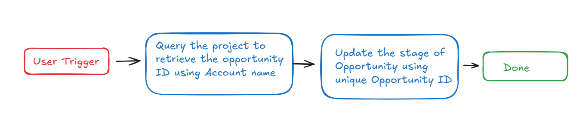
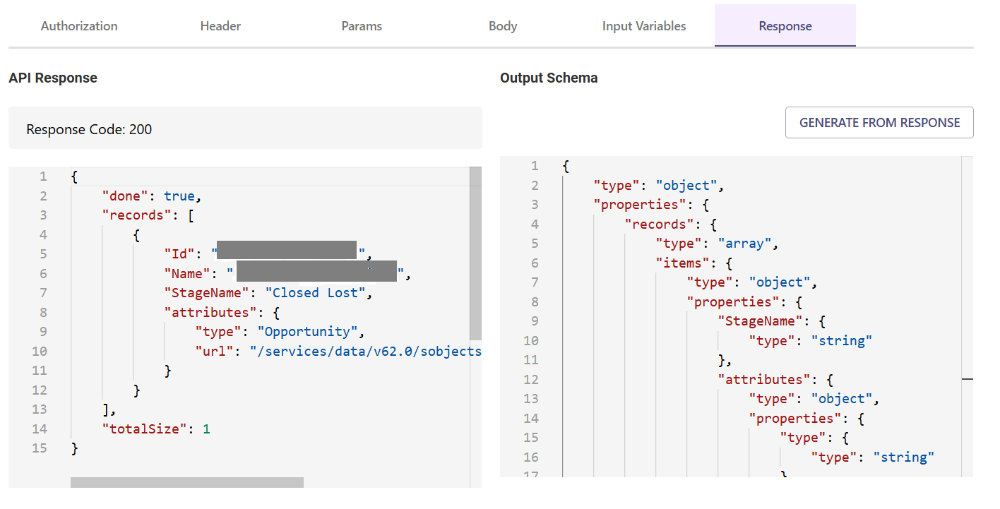

# **Introduction**

Salesforce is a leading CRM platform, and the "**Update Opportunity Stage in Salesforce**" plugin simplifies the process of updating the stage of an opportunity within your Salesforce account. By integrating this functionality into your bot, users can seamlessly update opportunity stages, enhancing efficiency and organization.

This guide provides step-by-step instructions on how to incorporate the "Update Opportunity Stage in Salesforce" feature into your bot using Creator Studio. 

Let’s begin!

# Prerequisites

- [Postman](https://www.postman.com/) or an API Testing Tool
- Salesforce Connector built in Creator Studio (follow the [Salesforce Authentication](https://developer.moveworks.com/creator-studio/resources/connector/?id=salesforce) guide to create your connector)

# What are we building?

## **Conversation Design**

This [purple chat](https://developer.moveworks.com/creator-studio/developer-tools/purple-chat-builder/?workspace=%7B%22title%22%3A%22My+Workspace%22%2C%22botSettings%22%3A%7B%22name%22%3A%22%22%2C%22imageUrl%22%3A%22%22%7D%2C%22mocks%22%3A%5B%7B%22id%22%3A7476%2C%22title%22%3A%22New+Mock%22%2C%22transcript%22%3A%7B%22settings%22%3A%7B%22colorStyle%22%3A%22LIGHT%22%2C%22startTime%22%3A%2211%3A43+AM%22%2C%22defaultPerson%22%3A%22GWEN%22%2C%22editable%22%3Atrue%2C%22botName%22%3A%22%22%2C%22botImageUrl%22%3A%22%22%7D%2C%22messages%22%3A%5B%7B%22from%22%3A%22USER%22%2C%22text%22%3A%22I+need+to+update+Acme+Corp+stage+of+the+opportunity%22%7D%2C%7B%22from%22%3A%22BOT%22%2C%22text%22%3A%22%3Cp%3ECould+you+please+provide+the+new+stage+name+for+the+opportunity%3F%3Cbr%3E%3C%2Fp%3E%22%7D%2C%7B%22from%22%3A%22USER%22%2C%22text%22%3A%22%3Cp%3EQualify%3Cbr%3E%3C%2Fp%3E%22%7D%2C%7B%22from%22%3A%22BOT%22%2C%22text%22%3A%22%3Cp%3EThe+stage+of+the+Acme+Corp+opportunity+has+been+successfully+updated+to+Qualify.%3Cbr%3E%3C%2Fp%3E%22%7D%5D%7D%7D%5D%7D) shows the experience we are going to build.

# **Creator Studio Components**

- **Triggers:**
    1. Natural Language
    2. Identify user inquiries or commands pertaining to updating the stage of an opportunity in Salesforce
- **Slots**:
    1. **Account Name :**  Represents the name of the account used to fetch the related opportunity ID.
    2. **Stage Name** : Represents the new stage name to be set for the opportunity using retrieved opportunity ID .
- **Actions**:
    1. **Retrieving Opportunity ID using Account Name :**  Retrieve the Opportunity ID associated with a specified Account Name by making an API request to Salesforce.
    2. **Updating Stage Name using Opportunity ID**: Update the Stage Name of an opportunity by providing the desired stage name and the retrieved Opportunity ID.
- **Guidelines:**
    1. None

# **API Research**

To build this use case, we will utilize two APIs. Since our goal is to fetch the opportunity details and update its stage, we'll focus on Salesforce's Opportunity-related APIs. Only two API calls are required to achieve this.



## API #1: Get **Opportunity ID using Account Name**

The Retrieve Opportunity ID from Account Name API fetches the opportunity ID associated with a specified Account Name from Salesforce using a SOQL query.

- **Purpose**: Retrieves the **Opportunity ID** for a given **Account Name**
- **Features**: Supports filtering by **Account Name** and returns a paginated list of opportunities.
- **Example**: Executes a query  to fetch the **Opportunity ID** based on the specified **Account Name**.

```bash
curl --request GET \
  --location 'https://<YOUR-DOMAIN>.my.salesforce.com/services/data/v63.0/query/?q=SELECT+Id%2C+Name%2C+StageName+FROM+Opportunity+WHERE+Account.Name+LIKE+%27%25{ACCOUNT_NAME}%25%27' \
  
```


## **API #2: Update Stage of Opportunity using Opportunity ID**

The Update Stage of Opportunity API allows you to update the stage of an existing Opportunity in Salesforce using the retrieved Opportunity ID. This API is designed to effectively manage and transition Opportunities, ensuring that their stages are accurately updated.

- **Purpose**: Updates the stage of an Opportunity in salesforce
- **Features**:  accurate updates to Opportunity stages
- **Example**: Utilizes the Opportunity ID to update the stage of an Opportunity in Salesforce,

```bash
curl --location --request PATCH 'https://<YOUR_DOMAIN>.my.salesforce.com/services/data/v63.0/sobjects/Opportunity/<OPPORTUNITY_ID>' \--data '{
  "StageName": "<STAGE_NAME>"
}
```

- **<YOUR_DOMAIN>**: Your Salesforce instance domain (e.g., `yourcompany.my.salesforce.com`).
- **<OPPORTUNITY_ID>** : Retrieved opportunity id.
- **<STAGE_NAME>** : Predefined Opportunity Stage Name in Salesforce to be updated.


# **Steps**

## **Step 1: Build HTTP Action**

 Define your HTTP Actions for fetching all the backlog ideas of a specific project :

### **1.**  Get **Opportunity ID using Account Name**

- In Creator Studio, create a new Action.
    - Navigate to `Plugins` section > `Actions` tab
    - Click on `CREATE` to define a new action


- Click on the `IMPORT CURL` option and paste the following cURL command:

   

```bash
curl --request GET \
  --location 'https://<YOUR-DOMAIN>.my.salesforce.com/services/data/v62.0/query/?q=SELECT+Id%2C+Name%2C+StageName+FROM+Opportunity+WHERE+Account.Name+LIKE+%27%25{ACCOUNT_NAME}%25%27' \
  --header 'Authorization: Bearer <ACCESS_TOKEN>' \
  --header 'Cookie: BrowserId=9VR-DLuzEe-k2PdqQgLCBA; CookieConsentPolicy=0:1; LSKey-c$CookieConsentPolicy=0:1'
```

  Click on `Use Existing Connector` > select the Salesforce [](https://developer.moveworks.com/creator-studio/resources/connector/?id=jira)connector that you just created > Click on `Apply`. This will populate the Base URL and the Authorization section of the API Editor.

- **Query Parameters for Salesforce Account**
    
    Key ( q ) **:** Value (  **SELECT Id, Name, StageName FROM Opportunity WHERE Account.Name ={{Account_Name}}’** )
    

This **SOQL query** filters out the accounts by searching for the one with a specific **Name** value. The `{{Account_name}}` is a dynamic placeholder that will be replaced with the actual account name when the query is executed. This query will return the **Opportunity** **Id** of the account that matches the provided name.


- **Input Variables** :
    - Account_Name : Example Value ( **Acme Corp** ).
    
    
    
- Click on `Test` to check if the Connector setup was successful and expect a successful response as shown below. You will see the request response on the left side and the generated output schema on the right. If the output schema does not match the API response or fails to populate automatically, kindly click the `GENERATE FROM RESPONSE` button to refresh and align the schema with the API response.



- Add the **API Name** and **API Description** as shown below, then click the `Save` button


### 2. Update Opportunity Stage

- Repeat the steps above to create another action.
- Click on the `IMPORT CURL` option and paste the following cURL command:

```bash
curl --location --request PATCH 'https://<YOUR_DOMAIN>.my.salesforce.com/services/data/v63.0/sobjects/Opportunity/<OPPORTUNITY_ID>' \
--header 'Authorization: Bearer <ACCESS_TOKEN>' \
--header 'Content-Type: application/json' \
--data '{
  "StageName": "<STAGE_NAME>"
}
'
```

- Use the existing connector by following the steps outlined in the previous point to populate the Base URL and Authorization section.

- **Body :**
    - **StageName** : Predefined Opportunity Stage Name in Salesforce to be updated.


- **Input Variables** :
    - **Opportunity_Id :** Example Value ( **006IU00000kYK6lYAG**)
    - **StageName :** Example Value ( **Qualify** )
    
    
    
- We have provided sample input variables for **Opportunity_Id**, **StageName** Using these input variables, we tested the plugin by making a **PATCH** request to **update stage of Opportunity** in Salesforce.


- After that, you can test the plugin by checking the response. If the stage of an opportunity has been successfully updated, the response will return a **204** status code. If the output schema is incorrect or missing, click `GENERATE FROM RESPONSE` to update it.


- Add the **API Name** and **API Description** as shown below, then click the `Save` button   ****

## **Step 2: Build Compound Action**

- Head over to the **Compound Actions** tab and click **CREATE**
    
    
    
- Give your Compound Action a **Name** and **Description** , then click `Next` Note: Name only letters, numbers, and underscores. We suggest using snake case or camel case formatting (e.g. Workflow_name or workflowName )


- Click on the `Script editor` tab. Here you will be able to build your compound action using the YAML syntax. At a high-level, this syntax provides actions (HTTP Request, APIthon Scripts) and workflow logic (switch statements, for each loops, return statements, parallel, try/catch). See the [Compound Action Syntax](https://developer.moveworks.com/creator-studio/reference/compound_actions_syntax/) Reference for more info.

```yaml
steps:
  - action:
      output_key: opportunity
      action_name: Get_Stage_Of_Opportunity
      progress_updates:
        on_complete: ON_COMPLETE_MESSAGE
        on_pending: ON_PENDING_MESSAGE
      input_args:
        Account_Name: data.Account_Name
  - return:
      output_mapper:
        Account_Name: data.Account_Name
        Current_Stage: data.opportunity.records[0].StageName
  - action:
      output_key: result
      action_name: Update_Opportunity_Details
      progress_updates:
        on_complete: ON_COMPLETE_MESSAGE
        on_pending: ON_PENDING_MESSAGE
      input_args:
        StageName: data.StageName
        Opportunity_Id: data.opportunity.records[0].Id

```

- Click on `Input fields` tab and click the `+Add` button. Here you will define the slots that you want to collect from users through the conversation and trigger your Workflow with. After defining the input fields, click the `Submit` button to save your changes.


## **Step 3: Publish Workflow to Plugin**

- Head over to the `Compound Actions` tab and click on the kebab menu ( `︙` )
- Next, click on `Publish Workflow to Plugin`
- First, verify your Plugin **Name** & **Short description** . This is autofilled from the name & description of your compound action.


- Next, consider whether to select the `User consent required before execution?` checkbox. Enabling this option prompts the user to confirm all slot values before executing the plugin, which is widely regarded as a best practice.


- Click `Next` and set up your positive and negative triggering examples. This ensures that the bot triggers your plugin given a relevant utterance.
    - See our [guide](https://developer.moveworks.com/creator-studio/conversation-design/triggers/natural-language-triggers/#how-to-write-good-triggering-examples) on Triggering
- Lastly, click `Next` and set the **Launch Rules** you want your plugin to abide by.
    - See our [guide](https://developer.moveworks.com/creator-studio/administration/launch-options/) on Launch Rules

## **Step 4: See it in action!**

- After clicking the final `Submit` button, your plugin will be published to the bot and triggerable based on your **Launch Rules.**
- You should wait up to **5 minutes** after making changes before trying to test in your bot!
- If you run into an issue:
    1. Check our [troubleshooting guides](https://developer.moveworks.com/creator-studio/troubleshooting/support/)
    2. Understand your issue using Logs
    3. Reach out to Support

# **Congratulations!**

You've just added the **"Update Stage of Opportunity"** feature inside your Salesforce account to your Copilot! Explore our other guides for more inspiration on what to build next.