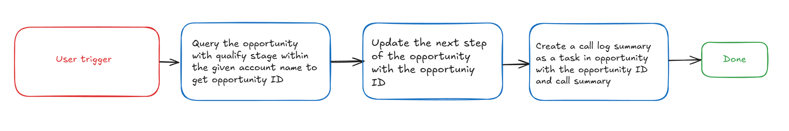
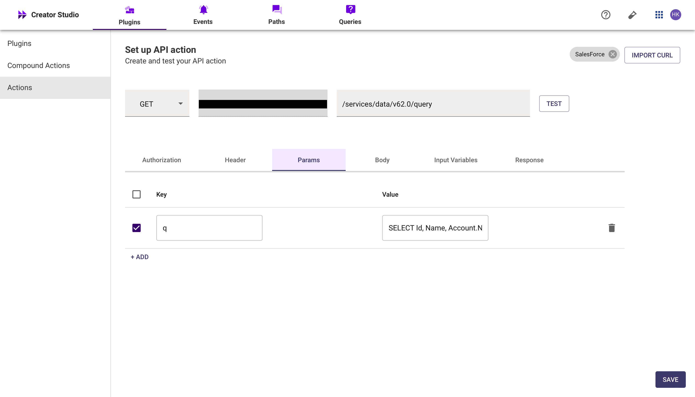
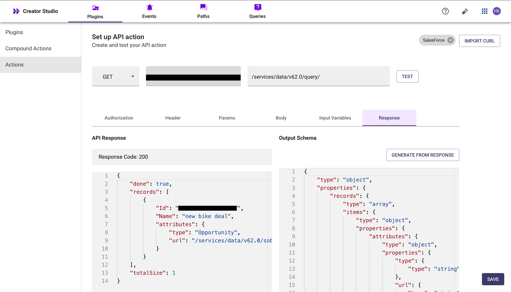
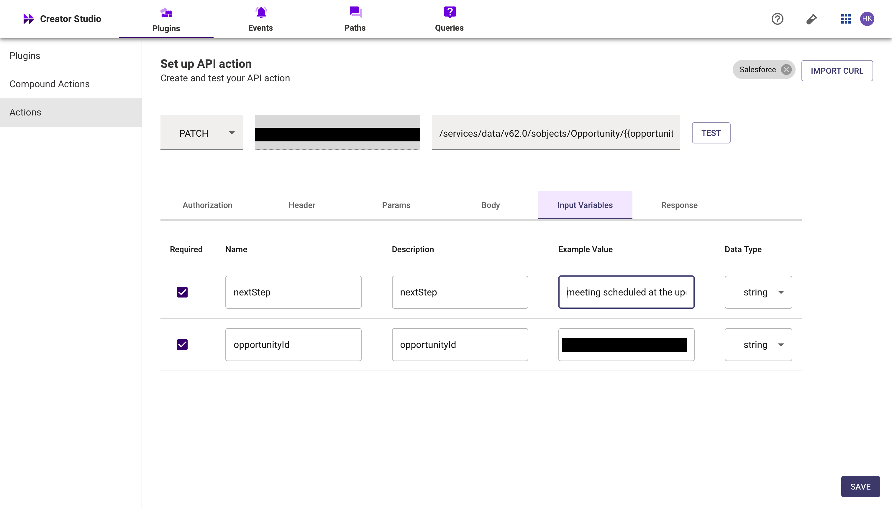
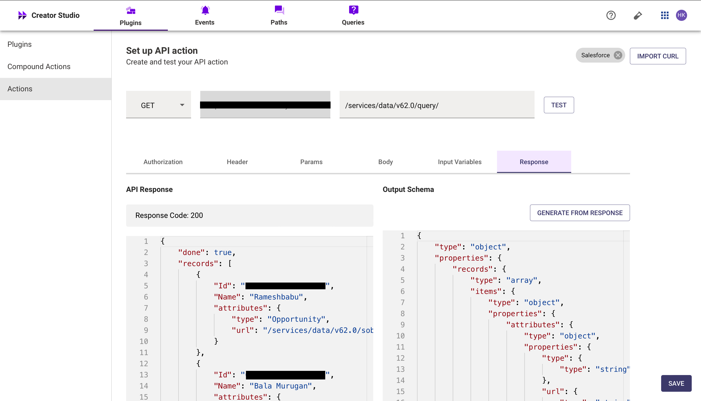
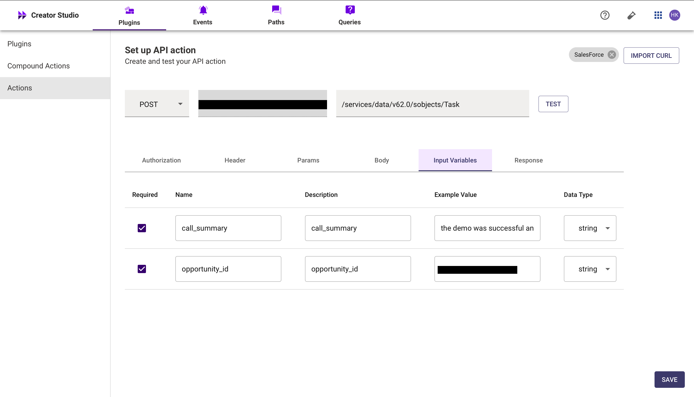
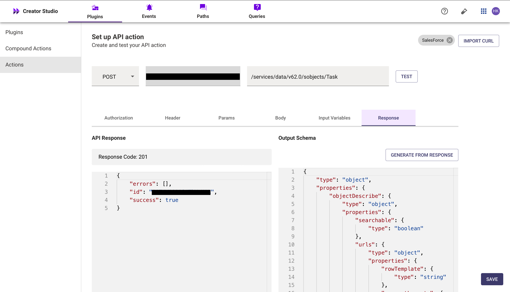

# **Introduction**

Salesforce is a leading cloud-based Customer Relationship Management (CRM) platform that helps businesses manage their customer interactions, sales processes, and business relationships more effectively. the **Update opportunity call summary and next step** plugin simplifies recording and keeping track of client interaction and opportunity’s progress in Salesforce.

This guide walks you through adding the call summary and next step in your Salesforce opportunity.

# **Prerequisites**

- [Postman](https://www.postman.com/) or and API testing tool.
- Salesforce Connector built in Creator Studio (follow the [Salesforce Authentication](https://developer.moveworks.com/creator-studio/resources/connector/?id=salesforce) guide to create your connector)

# **What are we building?**

### **Conversation Design**

This [purple chat](https://developer.moveworks.com/creator-studio/developer-tools/purple-chat-builder/?workspace=%7B%22title%22%3A%22My+Workspace%22%2C%22botSettings%22%3A%7B%22name%22%3A%22%22%2C%22imageUrl%22%3A%22%22%7D%2C%22mocks%22%3A%5B%7B%22id%22%3A5625%2C%22title%22%3A%22New+Mock%22%2C%22transcript%22%3A%7B%22messages%22%3A%5B%7B%22from%22%3A%22USER%22%2C%22text%22%3A%22%3Cp%3EJust+had+a+productive+call+with+Acme+Corp.+I+need+to+log+this+in+Salesforce.+We+discussed+the+product+roadmap+and+they%27re+interested+in+a+demo+next+week.+%3C%2Fp%3E%22%7D%2C%7B%22from%22%3A%22ANNOTATION%22%2C%22text%22%3A%22Gathers+details+for+Salesforce+update%22%7D%2C%7B%22from%22%3A%22BOT%22%2C%22text%22%3A%22%3Cp%3ELet%27s+update+Acme+Corp%27s+Salesforce+record.%3Cbr%3E%3C%2Fp%3E%22%2C%22cards%22%3A%5B%7B%22title%22%3A%22%3Cp%3EConfirm+call+summary+%26+next+actions%3A%3Cbr%3E%3C%2Fp%3E%22%2C%22text%22%3A%22%3Cp%3E%3Cb%3EAccount%3A%3C%2Fb%3E+Acme+Corp%3Cbr%3E%3Cb%3ECall+Summary%3A%3C%2Fb%3E+Discussed+product+updates%2C+showed+strong+interest.%3Cbr%3E%3Cb%3ENext+Steps%3A%3C%2Fb%3E+Schedule+a+product+demo+for+next+week.%3Cbr%3E%3C%2Fp%3E%22%2C%22buttons%22%3A%5B%7B%22style%22%3A%22PRIMARY%22%2C%22text%22%3A%22Update+in+Salesforce%22%7D%2C%7B%22text%22%3A%22Edit+Details%22%7D%2C%7B%22text%22%3A%22Cancel%22%7D%5D%7D%5D%7D%5D%2C%22settings%22%3A%7B%22colorStyle%22%3A%22LIGHT%22%2C%22startTime%22%3A%2211%3A43%2BAM%22%2C%22defaultPerson%22%3A%22GWEN%22%2C%22editable%22%3Atrue%2C%22botName%22%3A%22%22%2C%22botImageUrl%22%3A%22%22%7D%7D%7D%5D%7D) shows the experience we are going to build.

# **Creator Studio Components**

- **Triggers**:
  1. Natural Language
- **Slots**:
  1. Fetch Salesforce opportunity ID with the Account name.
  2. Get next step from the user
  3. Get call summary from the user
- **Actions**:
  1. Retrieve opportunity details:
     - Query the opportunity of the account name specified with stage as qualify
  2. Update the next step of the opportunity:
     - Update the next step field of the opportunity with the content provided by the user
  3. Create a call log summary in opportunity:
     - Create a task as call log in opportunity and the call summary as task comment
- **Guidelines**:
  1. None.

# **API Research**

To achieve this use case, we will use three API calls.



## **API #1: Get opportunity with “Qualify” stage of an Account:**

This API allows us to query the opportunity with qualify stage of the specified account name

```bash
curl --location 'https://<YOUR_DOMAIN>.my.Salesforce.com/services/data/v63.0/query/?q=SELECT%20Id%2C%20Name%20FROM%20Opportunity%20WHERE%20Account.Name%20%3D%20%27<ACCOUNT_NAME>%27%20AND%20StageName%20%3D%20%27Qualify%27' \
--header 'Authorization: Bearer <ACCESS_TOKEN>' \
--header 'Content-Type: application/json' \
```

## **API #2: Update the next step of the Opportunity:**

This API allows us to update the Opportunity’s next step with the user provided context.

```bash
curl --location --request PATCH 'https://<YOUR_DOMAIN>.my.Salesforce.com/services/data/v63.0/sobjects/Opportunity/<OPPORTUNITY_ID>' \
--header 'Authorization: Bearer <ACCESS_TOKEN>' \
--header 'Content-Type: application/json' \
--data '{
    "nextStep": "<NEXT_STEP>"
}'
```

## **API #3: Create a call summary as a task in the opportunity:**

This API allows us to create a task in Opportunity with a comment where the call summary is populated

```bash
curl --location 'https://<YOUR_DOMAIN>.my.Salesforce.com/services/data/v63.0/sobjects/Task' \
--header 'Authorization: Bearer <ACCESS_TOKEN>' \
--header 'Content-Type: application/json' \
--data '{
    "Subject": "Call Summary",
    "Description": "<CALL_SUMMARY>",
    "WhatId": "<OPPORTUNITY_ID>",
    "Status": "Completed"
}'
```

- **<YOUR_DOMAIN>**: Your Salesforce instance domain (e.g., `yourcompany.my.Salesforce.com`).
- **<ACCESS_TOKEN>**: The OAuth token used for authorization.
- <OPPORTUNITY_ID>, <CALL_SUMMARY>, <NEXT_STEP>: Opportunity ID and the opportunity details to be updated.

# Steps

## Step 1: Build HTTP action

1. **Get the opportunity of an account**

- In Creator studio, create a new action
  - Navigate to `Plugins` section > `Actions` tab
  - Click on `CREATE` to define a new action
    
  - Click on the `IMPORT CURL` option and paste the following cURL command:
  ```bash
  curl --location 'https://<YOUR_DOMAIN>.my.Salesforce.com/services/data/v63.0/query/?q=SELECT%20Id%2C%20Name%20FROM%20Opportunity%20WHERE%20Account.Name%20%3D%20%27<ACCOUNT_NAME>%27%20AND%20StageName%20%3D%20%27Qualify%27' \
  --header 'Content-Type: application/json' \
  ```

**Query** **Parameters** :

- Key (**q**): SELECT Id, Name FROM Opportunity WHERE [Account.Name](http://account.name/) = '{ account_name }' AND StageName = 'Qualify'
  - This query filters out the opportunity from an account with stage as “Qualify”
- **Input Variables** :

  - account_name: example value (**Express Logistics and Transport**)

  

- Click on `Test` to check if the Connector setup was successful and expect a successful response as shown below. You will see the request response on the left side and the generated output schema on the right. If the output schema does not match the API response or fails to populate automatically, kindly click the `GENERATE FROM RESPONSE` button to refresh and align the schema with the API response.

  

- Add the **API Name** and **API Description** as shown below, then click the `Save` button
  

1. **update the opportunity next step field**

   - Repeat the steps above to create another action.
   - Click on the `IMPORT CURL` option and paste the following cURL command:

   ```bash
   curl --location --request PATCH 'https://<YOUR_DOMAIN>.my.Salesforce.com/services/data/v63.0/sobjects/Opportunity/<OPPORTUNITY_ID>' \
   --header 'Content-Type: application/json' \
   --data '{
       "nextStep": "<NEXT_STEP>"
   }'
   ```

   - **Input variables:**
     - nextStep: Example value (meeting scheduled at coming Friday)
     - opportuniyId: Example value (006IU00100kYJwFYAZ)

   

   - Test the Connector setup as described earlier to verify the response. If the output schema is incorrect or missing, click `GENERATE FROM RESPONSE` to update it.

   

   - Add the **API Name** and **API Description** as shown below, then click the `Save` button

   

1. Create call summary in Salesforce opportunity

   - Repeat the steps above to create another action.
   - Click on the `IMPORT CURL` option and paste the following cURL command:

   ```bash
   curl --location 'https://<YOUR_DOMAIN>.my.Salesforce.com/services/data/v63.0/sobjects/Task' \
   --header 'Content-Type: application/json' \
   --data '{
       "Subject": "Call Summary",
       "Description": "<CALL_SUMMARY>",
       "WhatId": "<OPPORTUNITY_ID>",
       "Status": "Completed"
   }'
   ```

- **Input variables:**
  - call_summary: Example value (the demo was successful and the clients were interested in the purchase)
  - opportuniyId: Example value (006IU00100kYJwFYAZ)



- Test the Connector setup as described earlier to verify the response. If the output schema is incorrect or missing, click `GENERATE FROM RESPONSE` to update it.



## **Step 2: Build Compound Action**

- Head over to the **Compound Actions** tab and click **CREATE**


- Give your Compound Action a **Name** and **Description** , then click `Next` Note: Name only letters, numbers, and underscores. We suggest using snake case or camel case formatting (e.g. Workflow_name or workflowName )


- Click on the `Script editor` tab. Here you will be able to build your compound action using the YAML syntax. At a high-level, this syntax provides actions (HTTP Request, APIthon Scripts) and workflow logic (switch statements, for each loops, return statements, parallel, try/catch). See the [Compound Action Syntax](https://developer.moveworks.com/creator-studio/reference/compound_actions_syntax/) Reference for more info.

```yaml
steps:
  - action:
      output_key: opportunity
      action_name: GET_Oportunity_Of_A_Salesforce_Account
      progress_updates:
        on_complete: ON_COMPLETE_MESSAGE
        on_pending: ON_PENDING_MESSAGE
      input_args:
        account_name: data.account_name
  - action:
      output_key: Update_Opportunity_result
      action_name: Update_Opportunity
      progress_updates:
        on_complete: ON_COMPLETE_MESSAGE
        on_pending: ON_PENDING_MESSAGE
      input_args:
        nextStep: data.nextStep
        opportunityId: data.opportunity.records[0].Id
  - action:
      output_key: call_summary
      action_name: Update_call_summary_of_an_opportunity
      progress_updates:
        on_complete: ON_COMPLETE_MESSAGE
        on_pending: ON_PENDING_MESSAGE
      input_args:
        opportunity_id: data.opportunity.records[0].Id
        call_summary: data.call_summary
```

- Click on `Input fields` tab and click the `+Add` button. Here you will define the slots that you want to collect from users through the conversation and trigger your Workflow with. After defining the input fields, click the `Submit` button to save your changes.


## **Step 3: Publish Workflow to Plugin**

- Head over to the `Compound Actions` tab and click on the kebab menu ( `︙` )
- Next, click on `Publish Workflow to Plugin`
- First, verify your Plugin **Name** & **Short description** . This is autofilled from the name & description of your compound action.


- Next, consider whether to select the `User consent required before execution?` checkbox. Enabling this option prompts the user to confirm all slot values before executing the plugin, which is widely regarded as a best practice.


- Click `Next` and set up your positive and negative triggering examples. This ensures that the bot triggers your plugin given a relevant utterance.
  - See our [guide](https://developer.moveworks.com/creator-studio/conversation-design/triggers/natural-language-triggers/#how-to-write-good-triggering-examples) on Triggering
- Lastly, click `Next` and set the **Launch Rules** you want your plugin to abide by.
  - See our [guide](https://developer.moveworks.com/creator-studio/administration/launch-options/) on Launch Rules.

## **Step 4: See it in action!**

- After clicking the final `Submit` button, your plugin will be published to the bot and triggerable based on your **Launch Rules.**
- You should wait up to **5 minutes** after making changes before trying to test in your bot!
- If you run into an issue:
  1. Check our [troubleshooting guides](https://developer.moveworks.com/creator-studio/troubleshooting/support/)
  2. Understand your issue using Logs
  3. Reach out to Support

# **Congratulations!**

You’ve just added the Salesforce “**Update opportunity call summary and Next step**“ feature to your Copilot! Explore our other guides for more inspiration on what to build next.
