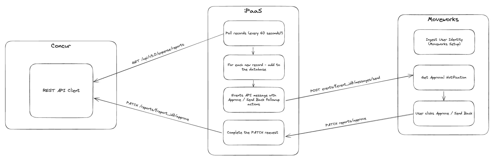

---
accreditations:
- DEFAULT
custom_tags:
- Polling Required
description: A plugin to notify managers when they have expense reports to approve
  or reject to streamline the process and simplify administrative workflows.
difficulty_level: ADVANCED
fidelity: TEMPLATE
name: Approve / Reject Expense Report
purple_chat_link: https://developer.moveworks.com/creator-studio/developer-tools/purple-chat-builder/?workspace=%7B%22title%22%3A%22My+Workspace%22%2C%22botSettings%22%3A%7B%22name%22%3A%22%22%2C%22imageUrl%22%3A%22%22%7D%2C%22mocks%22%3A%5B%7B%22id%22%3A3519%2C%22title%22%3A%22New+Mock%22%2C%22transcript%22%3A%7B%22settings%22%3A%7B%22colorStyle%22%3A%22LIGHT%22%2C%22startTime%22%3A%2211%3A43+AM%22%2C%22defaultPerson%22%3A%22GWEN%22%2C%22editable%22%3Afalse%2C%22botName%22%3A%22%22%2C%22botImageUrl%22%3A%22%22%7D%2C%22messages%22%3A%5B%7B%22from%22%3A%22ANNOTATION%22%2C%22text%22%3A%22%3Cp%3E%3Cb%3ETriggers%3C%2Fb%3E%3Cbr%3E1.+New+approval+queue+detected+while+polling+Concur%27s+Workflow+v4+API%3Cbr%3E2.+Middleware+initiated+trigger+%28polling+every+60+seconds%29%3Cbr%3E%3Cbr%3E%3Cb%3ESlots%3C%2Fb%3E%3Cbr%3E1.+%3Ci%3EApproval+ID%3C%2Fi%3E%3A+required+for+API+actions+to+work%3Cbr%3E%3Cb%3EActions%3C%2Fb%3E%3Cbr%3E1.+%3Ci%3EApprove+report%3C%2Fi%3E%3A+Approve+and+move+report+to+next+approver+in+report+chain%3Cbr%3E2.+%3Ci%3EReject+report%3C%2Fi%3E%3A+Reject+requisition+and+move+record+back+to+previous+approver+or+owner%3C%2Fp%3E%22%7D%2C%7B%22from%22%3A%22Bot%22%2C%22text%22%3A%22%3Cp%3EHi+Jamie%2C%3Cbr%3E%3Cbr%3E%3Cb%3E%F0%9F%92%B3+Concur+Expense+Report+Pending+Your+Approval%3C%2Fb%3E%3A%3Cbr%3E-+Name%3A+Dinner+with+ACME+client%3Cbr%3E-+%3Ci%3EDate%3C%2Fi%3E%3A+Aug+10%2C+2024%3Cbr%3E-+%3Ci%3ECreated+by%3C%2Fi%3E%3A+Sam+Stinson%3Cbr%3E-+%3Ci%3EAmount%3C%2Fi%3E%3A+USD+341.07%3Cbr%3E-+%3Ci%3ELast+Comment%3C%2Fi%3E%3A+Uploading+receipt+of+dinner%3Cbr%3E-+%3Ci%3EApproval+Status%3C%2Fi%3E%3A+Pending+Approval%3Cbr%3E-+%3Ci%3EReport+ID%3C%2Fi%3E%3A+14170%3C%2Fp%3E%22%2C%22cards%22%3A%5B%7B%22buttons%22%3A%5B%7B%22style%22%3A%22PRIMARY%22%2C%22text%22%3A%22Approve%22%7D%2C%7B%22text%22%3A%22Send+back%22%7D%5D%7D%5D%7D%5D%7D%7D%5D%7D
solution_tags:
- Approvals
- Finance
systems:
- sap-concur
time_in_minutes: 60
---

# Approve / Reject Expense Reports **with your Copilot**

Have expense reports approved or rejected on time in SAP Concur by looping in the right approvers at the right time to simplify administrative workflows.

Let's dive in!

# **Prerequisites**

1. Use [Moveworks Setup](https://help.moveworks.com/docs/ingest-users) to synchronize your employees' work email from your IDAM to Moveworks.
    - Follow [this guide](https://help.moveworks.com/docs/ingest-users#configuring-user-ingestions) to configure your connector and ingestion settings in [Moveworks Setup](https://help.moveworks.com/docs/ingest-users)
2. Ensure that your SAP Concur instance uses the same work email as your IDAM.
3. Review [how to implement a Creator Studio guide with your team](https://developer.moveworks.com/creator-studio/program-management/planning/#how-to-implement-a-creator-studio-guide).
4. Ensure that your SAP Concur administrator has the necessary permissions to configure API access.
5. Connect your middleware and APIM tools with Creator Studio using a [connector](https://developer.moveworks.com/creator-studio/integrations/outbound/connector-configuration/).

# Conversation Design

[This purple chat mock](https://developer.moveworks.com/creator-studio/developer-tools/purple-chat-builder/?workspace=%7B%22title%22%3A%22My+Workspace%22%2C%22botSettings%22%3A%7B%22name%22%3A%22%22%2C%22imageUrl%22%3A%22%22%7D%2C%22mocks%22%3A%5B%7B%22id%22%3A3519%2C%22title%22%3A%22New+Mock%22%2C%22transcript%22%3A%7B%22settings%22%3A%7B%22colorStyle%22%3A%22LIGHT%22%2C%22startTime%22%3A%2211%3A43+AM%22%2C%22defaultPerson%22%3A%22GWEN%22%2C%22editable%22%3Afalse%2C%22botName%22%3A%22%22%2C%22botImageUrl%22%3A%22%22%7D%2C%22messages%22%3A%5B%7B%22from%22%3A%22ANNOTATION%22%2C%22text%22%3A%22%3Cp%3E%3Cb%3ETriggers%3C%2Fb%3E%3Cbr%3E1.+New+approval+queue+detected+while+polling+Concur%27s+Workflow+v4+API%3Cbr%3E2.+Middleware+initiated+trigger+%28polling+every+60+seconds%29%3Cbr%3E%3Cbr%3E%3Cb%3ESlots%3C%2Fb%3E%3Cbr%3E1.+%3Ci%3EApproval+ID%3C%2Fi%3E%3A+required+for+API+actions+to+work%3Cbr%3E%3Cb%3EActions%3C%2Fb%3E%3Cbr%3E1.+%3Ci%3EApprove+report%3C%2Fi%3E%3A+Approve+and+move+report+to+next+approver+in+report+chain%3Cbr%3E2.+%3Ci%3EReject+report%3C%2Fi%3E%3A+Reject+requisition+and+move+record+back+to+previous+approver+or+owner%3C%2Fp%3E%22%7D%2C%7B%22from%22%3A%22Bot%22%2C%22text%22%3A%22%3Cp%3EHi+Jamie%2C%3Cbr%3E%3Cbr%3E%3Cb%3E%F0%9F%92%B3+Concur+Expense+Report+Pending+Your+Approval%3C%2Fb%3E%3A%3Cbr%3E-+Name%3A+Dinner+with+ACME+client%3Cbr%3E-+%3Ci%3EDate%3C%2Fi%3E%3A+Aug+10%2C+2024%3Cbr%3E-+%3Ci%3ECreated+by%3C%2Fi%3E%3A+Sam+Stinson%3Cbr%3E-+%3Ci%3EAmount%3C%2Fi%3E%3A+USD+341.07%3Cbr%3E-+%3Ci%3ELast+Comment%3C%2Fi%3E%3A+Uploading+receipt+of+dinner%3Cbr%3E-+%3Ci%3EApproval+Status%3C%2Fi%3E%3A+Pending+Approval%3Cbr%3E-+%3Ci%3EReport+ID%3C%2Fi%3E%3A+14170%3C%2Fp%3E%22%2C%22cards%22%3A%5B%7B%22buttons%22%3A%5B%7B%22style%22%3A%22PRIMARY%22%2C%22text%22%3A%22Approve%22%7D%2C%7B%22text%22%3A%22Send+back%22%7D%5D%7D%5D%7D%5D%7D%7D%5D%7D) shows the experience we are going to build.


# **Design Questions to Consider**

1. What fields would you like to show inside the approval request notification?
2. Which actions would you like the approver to be able to take on the notification?

# **SAP Concur Configuration**

Please review the [Connector Guide](https://developer.moveworks.com/creator-studio/resources/connector?id=sap-concur) to set up a new connector in Creator Studio that connects to your SAP Concur instance for using the Expense [Reports v3](https://developer.concur.com/api-reference/expense/expense-report/v3.reports.html) and [Reports v4](https://developer.concur.com/api-reference/expense/expense-report/v4.reports.html) APIs.


# **For Creator Studio Developers**

## **Step 1: Check if you have built a Creator Studio Connector for your middleware / APIM tool**

This step was outlined in the [Prerequisites section](#prerequisites) above, and should be completed before you begin building your plugin. If you do not have a connector for your middleware tool, you can learn more about how to build one in our [Connector Configuration Guide](https://developer.moveworks.com/creator-studio/integrations/outbound/connector-configuration/).

## Step 2: Test required APIs with Postman

Copy the cURL commands below into your API client like Postman for testing. Substitute any `{{placeholder text}}` with relevant SAP Concur API credentials or inputs.

### API 1: Authorization

```bash
curl --location 'https://us2.api.concursolutions.com/oauth2/v0/token' \
--header 'Content-Type: application/x-www-form-urlencoded' \
--data-urlencode 'client_id={client_id}' \
--data-urlencode 'client_secret={client_secret}' \
--data-urlencode 'refresh_token={refresh_token}' \
--data-urlencode 'grant_type=refresh_token'
```

### **API 2: Get all Pending Expense Reports**

```bash
curl --location --request GET 'https://us2.api.concursolutions.com/api/v3.0/expense/reports?user=ALL&submitDateAfter={modified_date_after}&ApprovalStatusCode=A_PEND' \
--header 'Accept: application/json' \
--header 'Authorization: Bearer {auth_token}' \
```

### **API 3: Moveworks Events API**

Please replace the `email@example.com` with the email address of the user who will receive the notification.

You can get the `{moveworks_event_id}` and `{moveworks_events_api_key}` from following the quickstart guide [here](https://developer.moveworks.com/creator-studio/quickstart/event-triggered-paths/).

```bash
curl --location 'https://api.moveworks.ai/rest/v1/events/{moveworks_event_id}/messages/send' \
--header 'Authorization: Bearer {moveworks_events_api_key}' \
--header 'Content-Type: application/json' \
--data-raw '{
    "message": "💸 New Concur Expense Report Approval Request ....\n",
    "recipients": [
        "email@example.com"
    ],
    "context": {
        "slots": {
            "report_id": "692D37074CAA42C2BE47"
        }
    }
}'
```

### **API 4: Approve Expense Report (as Approver)**

```bash
curl --location --request PATCH 'https://us2.api.concursolutions.com/expensereports/v4/users/{user_id}/context/MANAGER/reports/{report_id}/approve' \
--header 'Accept: application/json' \
--header 'Authorization: Bearer {auth_token}' \
--data '{
    "comment":"Approved through API"
}'
```

### **API 5: Send Back Expense Report (as Approver)**

```bash
curl --location --request PATCH 'https://us.api.concursolutions.com/expensereports/v4/users/{user_id}/context/MANAGER/reports/{report_id}/sendBack' \
--header 'Authorization: Bearer {auth_token}' \
--header 'Content-Type: application/json' \
--data '{
    "comment":"Rejecting",
    "expenseRejectedComment": "Rejecting Report through API"
}'
```

## Step 3: Write your Orchestration Code in your Middleware Platform

This diagram describes the flow we will build in this guide.

  

There are four steps to support Concur Expense Report approvals using Creator Studio:

1. Setup polling for new approvals (by default, every 60 seconds)
    - This is required to retrieve newly submitted expense reports
2. Send a notification to Moveworks with the expense report details and slots to approve or reject the report
3. Store approval notifications you have already sent in a database
    - If you don't do this, your employees will get notified every time you poll for new records
4. Actioning on the approvals based on the chosen action (approve/send back)

Here is an example of the code you can use to orchestrate the API calls to send new approval request notifications and collect approvals from Concur.

It is deployed as a Python FastAPI application on a server on Azure Virtual Network. You can modify this code to work with your middleware accordingly.

### Middleware Code (Python)

```python
import os
import json
from typing import Dict, List, Optional
from datetime import datetime, timedelta
import sqlite3

import asyncio
import httpx
from dotenv import load_dotenv
from fastapi import FastAPI, HTTPException, Depends, Request, BackgroundTasks
from fastapi.responses import JSONResponse
from pydantic import BaseModel, Field

# Load environment variables
load_dotenv()

# Config
CLIENT_ID = os.getenv("client_id")
CLIENT_SECRET = os.getenv("client_secret")
REFRESH_TOKEN = os.getenv("refresh_token")
EVENT_ID = os.getenv("event_id")
EVENT_API_KEY = os.getenv("event_api_key")
CONCUR_BASE_URL = "https://us2.api.concursolutions.com"
MOVEWORKS_BASE_URL = "https://api.moveworks.ai"
DATABASE_NAME = "pending_reports.db"
POLLING_INTERVAL = (
    60  # number of seconds to wait between polling expense reports
)

app = FastAPI()


# Database setup
def init_db():
    conn = sqlite3.connect(DATABASE_NAME)
    cursor = conn.cursor()
    cursor.execute(
        """
        CREATE TABLE IF NOT EXISTS pending_reports (
            report_id TEXT PRIMARY KEY,
            submit_date TEXT
        )
    """
    )
    conn.commit()
    conn.close()


init_db()


@app.on_event("startup")
async def startup_event():
    print("Starting up...")
    try:
        asyncio.create_task(continuous_polling())
        print("Continuous polling task started successfully")
    except Exception as e:
        print(f"Error starting continuous polling task: {str(e)}")


# Token storage
token_storage = {"access_token": None, "expires_at": None}


# Pydantic models for request validation
class NotificationContext(BaseModel):
    report_id: str


class NotificationRequest(BaseModel):
    message: str = Field(..., min_length=1)
    recipients: List[str] = Field(..., min_items=1)
    context: Optional[NotificationContext] = None


# Helper functions
def read_pending_reports():
    conn = sqlite3.connect(DATABASE_NAME)
    cursor = conn.cursor()
    cursor.execute("SELECT report_id, submit_date FROM pending_reports")
    results = cursor.fetchall()
    conn.close()
    return {row[0]: row[1] for row in results}


def write_pending_report(report_id, submit_date):
    conn = sqlite3.connect(DATABASE_NAME)
    cursor = conn.cursor()
    cursor.execute(
        "INSERT OR REPLACE INTO pending_reports (report_id, submit_date) VALUES (?, ?)",
        (report_id, submit_date),
    )
    conn.commit()
    conn.close()


def remove_pending_report(report_id):
    conn = sqlite3.connect(DATABASE_NAME)
    cursor = conn.cursor()
    cursor.execute(
        "DELETE FROM pending_reports WHERE report_id = ?", (report_id,)
    )
    conn.commit()
    conn.close()
    print(f"Report {report_id} removed from pending reports")


def is_report_pending(report_id, submit_date):
    conn = sqlite3.connect(DATABASE_NAME)
    cursor = conn.cursor()
    cursor.execute(
        "SELECT submit_date FROM pending_reports WHERE report_id = ?",
        (report_id,),
    )
    result = cursor.fetchone()
    conn.close()
    is_pending = result is not None and result[0] == submit_date
    print(f"Report {report_id} in pending reports: {is_pending}")
    return is_pending


async def make_request(
    method: str, url: str, headers: Dict, data: Optional[Dict] = None
) -> Dict:
    async with httpx.AsyncClient() as client:
        if method == "GET":
            response = await client.get(url, headers=headers)
        elif method == "POST":
            response = await client.post(
                url,
                headers=headers,
                data=(
                    data
                    if "x-www-form-urlencoded"
                    in headers.get("Content-Type", "")
                    else None
                ),
                json=(
                    data
                    if "x-www-form-urlencoded"
                    not in headers.get("Content-Type", "")
                    else None
                ),
            )
        elif method == "PATCH":
            response = await client.patch(url, headers=headers, json=data)
        else:
            raise ValueError(f"Unsupported HTTP method: {method}")

    if response.status_code not in [200, 204]:
        raise HTTPException(
            status_code=response.status_code,
            detail=f"API request failed: {response.text}",
        )

    return (
        response.json()
        if response.status_code == 200
        else {"status": "success"}
    )


async def refresh_auth_token() -> str:
    url = f"{CONCUR_BASE_URL}/oauth2/v0/token"
    payload = {
        "client_id": CLIENT_ID,
        "client_secret": CLIENT_SECRET,
        "refresh_token": REFRESH_TOKEN,
        "grant_type": "refresh_token",
    }
    headers = {"Content-Type": "application/x-www-form-urlencoded"}

    token_data = await make_request("POST", url, headers, payload)
    token_storage["access_token"] = token_data.get("access_token")
    token_storage["expires_at"] = datetime.now() + timedelta(
        seconds=token_data.get("expires_in", 3600)
    )

    return token_storage["access_token"]


async def get_valid_token() -> str:
    if (
        token_storage["access_token"] is None
        or token_storage["expires_at"] is None
        or token_storage["expires_at"] <= datetime.now()
    ):
        return await refresh_auth_token()
    return token_storage["access_token"]


def format_notification_message(report):
    return (
        f"<b>💸 New Concur Expense Report Approval Request</b>:\n"
        f"    - <i>Report Name</i>: {report['Name']}\n"
        f"    - <i>Owner</i>: {report['OwnerName']}\n"
        f"    - <i>Submit Date</i>: {report['SubmitDate']}\n"
        f"    - <i>Amount</i>: {report['CurrencyCode']} {report['Total']}\n"
        f"    - <i>Last Comment</i>: {report['LastComment']}\n"
        f"    - <i>Approval Status</i>: {report['ApprovalStatusName']}\n"
        f"    - <i>Report ID</i>: {report['ID']}\n"
    )


# API functions
async def get_all_expense_reports(
    auth_token: str, modified_date_after: str = None
) -> Dict:
    if not modified_date_after:
        modified_date_after = datetime.now().strftime("%Y-%m-%d")

    url = f"{CONCUR_BASE_URL}/api/v3.0/expense/reports?user=ALL&modifiedDateAfter={modified_date_after}&ApprovalStatusCode=A_PEND"
    headers = {
        "Accept": "application/json",
        "Authorization": f"Bearer {auth_token}",
    }
    return await make_request("GET", url, headers)


async def approve_report(
    auth_token: str, user_id: str, report_id: str
) -> Dict:
    url = f"{CONCUR_BASE_URL}/expensereports/v4/users/{user_id}/context/MANAGER/reports/{report_id}/approve"
    payload = {"comment": "Approved through API"}
    headers = {
        "Authorization": f"Bearer {auth_token}",
        "Content-Type": "application/json",
    }
    return await make_request("PATCH", url, headers, payload)


async def send_back_report(
    auth_token: str,
    user_id: str,
    report_id: str,
    # comment: str,
    # expense_rejected_comment: str,
) -> Dict:
    url = f"{CONCUR_BASE_URL}/expensereports/v4/users/{user_id}/context/MANAGER/reports/{report_id}/sendBack"
    payload = {
        "comment": "Rejecting from Moveworks",
        "expenseRejectedComment": "Rejecting Report through API",
    }
    headers = {
        "Authorization": f"Bearer {auth_token}",
        "Content-Type": "application/json",
    }
    return await make_request("PATCH", url, headers, payload)


async def send_moveworks_message(
    message: str,
    recipients: List[str],
    context: Optional[NotificationContext] = None,
) -> Dict:
    url = f"{MOVEWORKS_BASE_URL}/rest/v1/events/{EVENT_ID}/messages/send"
    headers = {
        "Authorization": f"Bearer {EVENT_API_KEY}",
        "Content-Type": "application/json",
    }

    payload = {"message": message, "recipients": recipients}

    if context and context.report_id:
        payload["context"] = {"slots": {"report_id": context.report_id}}

    return await make_request("POST", url, headers, payload)


async def continuous_polling():
    while True:
        try:
            await poll_reports()
        except Exception as e:
            print(f"Error in continuous polling: {str(e)}")
        await asyncio.sleep(POLLING_INTERVAL)


async def poll_reports():
    print("Polling for new reports...")
    try:
        auth_token = await get_valid_token()
        reports = await get_all_expense_reports(auth_token)
        for report in reports.get("Items", []):
            report_id = report["ID"]
            submit_date = report["SubmitDate"]
            print(
                f"Checking report ID: {report_id}, Submit Date: {submit_date}"
            )
            try:
                if submit_date and not is_report_pending(
                    report_id, submit_date
                ):
                    print(f"Report {report_id} not pending yet. Processing...")
                    approver_login_id = report["ApproverLoginID"]
                    if approver_login_id:
                        message = format_notification_message(report)
                        context = NotificationContext(report_id=report_id)
                        await send_moveworks_message(
                            message, [approver_login_id], context
                        )
                        print(f"Notification sent for report {report_id}")
                    write_pending_report(report_id, submit_date)
                    print(f"Report {report_id} marked as pending")
                    await asyncio.sleep(
                        1
                    )  # Add a small delay between processing reports
                else:
                    print(f"Report {report_id} already pending. Skipping.")
            except Exception as e:
                print(f"Error processing report {report_id}: {str(e)}")
    except Exception as e:
        print(f"Error during polling: {str(e)}")
        print(f"Error type: {type(e).__name__}")
        import traceback

        traceback.print_exc()
    print("Polling for new reports...")
    try:
        auth_token = await get_valid_token()
        reports = await get_all_expense_reports(auth_token)
        for report in reports.get("Items", []):
            report_id = report["ID"]
            submit_date = report["SubmitDate"]
            print(
                f"Checking report ID: {report_id}, Submit Date: {submit_date}"
            )
            try:
                if submit_date and not is_report_pending(
                    report_id, submit_date
                ):
                    print(f"Report {report_id} not pending yet. Processing...")
                    approver_login_id = report["ApproverLoginID"]
                    if approver_login_id:
                        message = format_notification_message(report)
                        context = NotificationContext(report_id=report_id)
                        await send_moveworks_message(
                            message, [approver_login_id], context
                        )
                        print(f"Notification sent for report {report_id}")
                    write_pending_report(report_id, submit_date)
                    print(f"Report {report_id} marked as pending")
                    await asyncio.sleep(
                        1
                    )  # Add a small delay between processing reports
                else:
                    print(f"Report {report_id} already pending. Skipping.")
            except Exception as e:
                print(f"Error processing report {report_id}: {str(e)}")
    except Exception as e:
        print(f"Error during polling: {str(e)}")
        print(f"Error type: {type(e).__name__}")
        import traceback

        traceback.print_exc()


# API routes
@app.patch("/reports/approve")
async def approve(
    user_id: str, report_id: str, auth_token: str = Depends(get_valid_token)
) -> Dict:
    result = await approve_report(auth_token, user_id, report_id)
    remove_pending_report(report_id)
    return result


@app.patch("/reports/send-back")
async def send_back(
    user_id: str,
    report_id: str,
    auth_token: str = Depends(get_valid_token),
) -> Dict:
    result = await send_back_report(auth_token, user_id, report_id)
    remove_pending_report(report_id)
    return result


# Error handling
@app.exception_handler(HTTPException)
async def http_exception_handler(request: Request, exc: HTTPException):
    return JSONResponse(
        status_code=exc.status_code,
        content={"detail": str(exc.detail), "status_code": exc.status_code},
    )


@app.exception_handler(Exception)
async def general_exception_handler(request: Request, exc: Exception):
    return JSONResponse(
        status_code=500,
        content={"detail": "An unexpected error occurred", "status_code": 500},
    )

if __name__ == "__main__":
    import uvicorn
    uvicorn.run(app, host="0.0.0.0", port=8000)
```

## Step 4: Build in Creator Studio

1. Create a new Event in Creator Studio named "Concur Expense Report Approvals".
    - Choose to add a followup action so that you can approve or send back the expense report.
2. Configure the API Connection:
    - Import the cURL command for the Middleware APIs that you have deployed.
    - Add necessary authorization headers.
3. Design the conversation flow:
    - Ask if the user wants to view pending approvals.
    - Display expense report details for approval.
    - Provide options to approve, reject, or view more details.
4. Follow our [Quickstart Guide](https://developer.moveworks.com/creator-studio/quickstart/event-triggered-paths/) to build an event with followup actions in Creator Studio, which can be called from your middleware.

# Congratulations!

You've just enabled your employees to manage expense report approvals through your Copilot. This streamlines your Finance administration processes and improves response times. Consider expanding this functionality to other SAP Concur modules like Purchase Orders for a comprehensive approval management solution.
