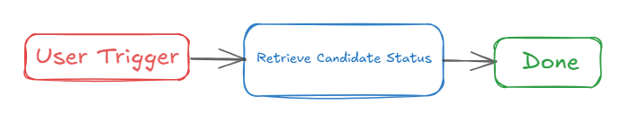
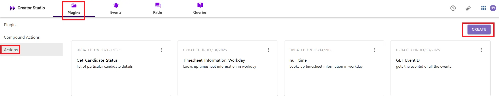
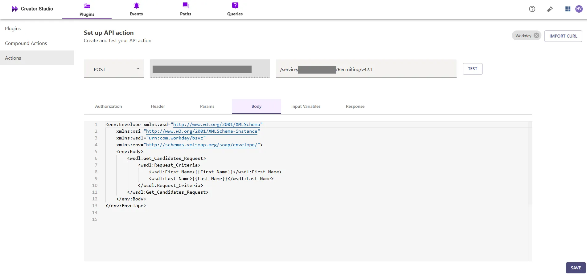
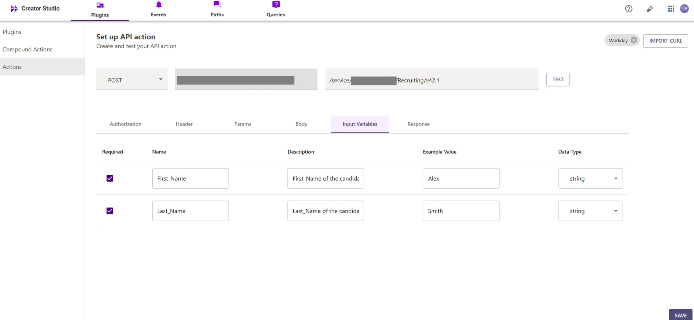
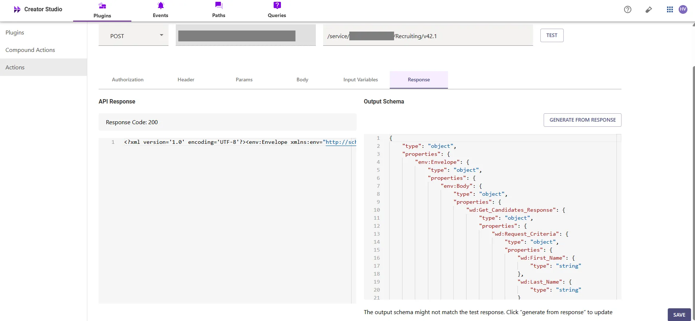
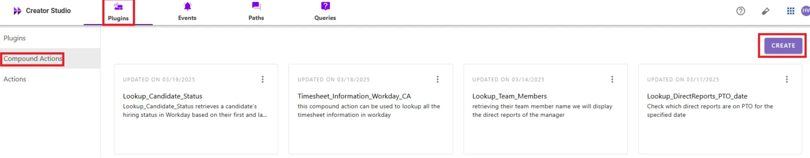
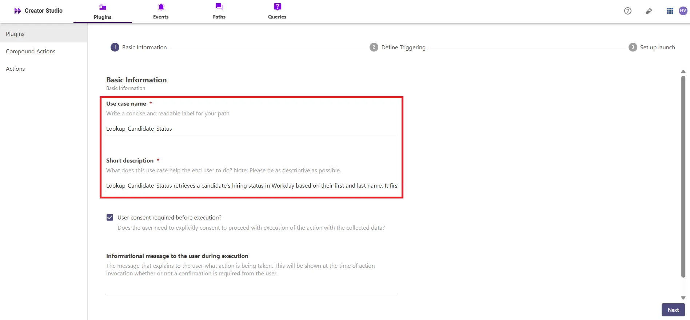
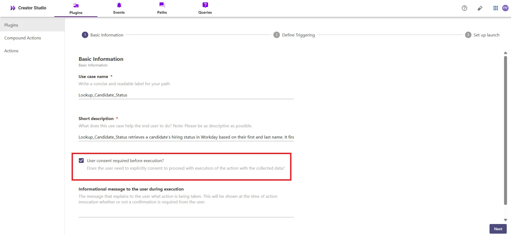

# Introduction:

Workday is an enterprise platform for human resources, and the "**Look Up Candidate Status**" feature allows you to quickly check the status of candidates. Integrating this feature with your bot helps streamline the hiring process, ensuring you have accurate visibility into candidate progress and hiring decisions.

This guide will show you how to add the "**Look Up Candidate Status**" feature to your bot using Creator Studio. Let’s get started!

# **Prerequisites:**

- Workday Connector built in Creator Studio (follow the [Workday Authentication](https://developer.moveworks.com/creator-studio/resources/connector/?id=workday) guide to create your connector)

# **What are we building?**

### **Conversation Design**

This [purple chat](https://developer.moveworks.com/creator-studio/developer-tools/purple-chat/?conversation=%7B%22startTimestamp%22%3A%2211%3A43+AM%22%2C%22messages%22%3A%5B%7B%22parts%22%3A%5B%7B%22richText%22%3A%22Can+I+view+the+status+of+candidates+for+a+role+I+posted%3F%22%7D%5D%2C%22role%22%3A%22user%22%7D%2C%7B%22parts%22%3A%5B%7B%22reasoningSteps%22%3A%5B%7B%22richText%22%3A%22Checking+your+access+to+recruitment+tools%22%2C%22status%22%3A%22success%22%7D%2C%7B%22richText%22%3A%22Locating+candidates+for+your+role%22%2C%22status%22%3A%22success%22%7D%2C%7B%22richText%22%3A%22Gathering+the+latest+updates+on+candidate+statuses%22%2C%22status%22%3A%22pending%22%7D%5D%7D%2C%7B%22richText%22%3A%22%3Cb%3ECandidate+Statuses%3C%2Fb%3E%3Cbr%3EStay+informed+about+the+progress+of+candidates+through+the+recruitment+process+for+the+role+you%27ve+posted.%22%7D%2C%7B%22richText%22%3A%22Here+are+the+latest+updates%3A%3Cbr%3E%3Cb%3EJane+Doe%3A%3C%2Fb%3E+Interview+scheduled+for+06%2F15+-+%3Ci%3EEngineering+Manager%3C%2Fi%3E%3Cbr%3E%3Cb%3EJohn+Smith%3A%3C%2Fb%3E+Offer+extended+-+%3Ci%3EProduct+Designer%3C%2Fi%3E%3Cbr%3E%3Cb%3EAlice+Johnson%3A%3C%2Fb%3E+Awaiting+reference+check+-+%3Ci%3EMarketing+Specialist%3C%2Fi%3E%3Cbr%3E%3Cb%3EBob+Williams%3A%3C%2Fb%3E+Application+under+review+-+%3Ci%3ESoftware+Developer%3C%2Fi%3E%22%7D%2C%7B%22buttons%22%3A%5B%7B%22buttonText%22%3A%22More+Details+on+Candidates%22%2C%22style%22%3A%22filled%22%7D%2C%7B%22buttonText%22%3A%22Post+Another+Role%22%2C%22style%22%3A%22outlined%22%7D%5D%7D%5D%2C%22role%22%3A%22assistant%22%7D%5D%7D) shows the experience we are going to build.

# **Creator Studio Components**

- **Triggers:**
    1. Natural Language
- **Slots:**
    1. **First Name:** Capture the candidate's first name to retrieve their status.
    2. **Last Name:** Capture the candidate's last name to retrieve their status.
- **Actions:**
    1. **Retrieve Candidate Status:** Use the candidate's first and last name to retrieve their status using Workday’s SOAP endpoint.
- **Guidelines:**
    1. None

# **API Research**

To build this use case, we will use a **single API** to achieve the goal of looking up a candidate's status in Workday’s SOAP endpoint



## **API #1: Retrieve Candidate Status**

The [Retrieve Candidate Status](https://community.workday.com/sites/default/files/file-hosting/productionapi/Recruiting/v44.0/Get_Candidates.html#Candidate_Request_CriteriaType) API in Workday’s SOAP endpoint retrieves candidate information based on the provided first and last name.

- **Purpose**: Fetches candidate status based on their first and last name.
- **Features**: Supports searching for candidates by name and returns relevant hiring status information.
- **Example**: Queries Workday’s SOAP endpoint to retrieve candidate status using the following CURL request.

```bash
curl --location --request POST 'https://<YOUR_DOMAIN>/service/<INSTANCE_ID>/Recruiting/v42.1' \
--header 'Content-Type: application/xml' \
--header 'Authorization: Bearer <ACCESS_TOKEN>' \
--data '<env:Envelope xmlns:xsd="http://www.w3.org/2001/XMLSchema"
    xmlns:xsi="http://www.w3.org/2001/XMLSchema-instance"
    xmlns:wsdl="urn:com.workday/bsvc"
    xmlns:env="http://schemas.xmlsoap.org/soap/envelope/">
    <env:Body>
        <wsdl:Get_Candidates_Request>
            <wsdl:Request_Criteria>
                <wsdl:First_Name>{{FIRST_NAME}}</wsdl:First_Name>
                <wsdl:Last_Name>{{LAST_NAME}}</wsdl:Last_Name>
            </wsdl:Request_Criteria>
        </wsdl:Get_Candidates_Request>
    </env:Body>
</env:Envelope>'

```

- **<YOUR_DOMAIN>**: Your Workday instance domain (e.g., `yourcompany.myworkday.com`).
- **<FIRST_NAME>, <LAST_NAME>, <ACCESS_TOKEN>**: The candidate’s first and last name along with the required authentication token for the request.

# **Steps**

## **Step 1: Build HTTP Action**

Define your HTTP action for fetching **candidate status** from Workday based on the provided **first name** and **last name**.

### 1. **In Creator Studio, Create a New Action**:

- Navigate to the **Plugins** section > **Actions** tab.
- Click on **CREATE** to define a new action.



- Click on the `IMPORT CURL` option and paste the following cURL command:

```bash
curl --location --request POST 'https://<YOUR_DOMAIN>/service/<INSTANCE_ID>/Recruiting/v42.1' \
--header 'Content-Type: application/xml' \
--header 'Authorization: Bearer <ACCESS_TOKEN>' \
--data '<env:Envelope xmlns:xsd="http://www.w3.org/2001/XMLSchema"
    xmlns:xsi="http://www.w3.org/2001/XMLSchema-instance"
    xmlns:wsdl="urn:com.workday/bsvc"
    xmlns:env="http://schemas.xmlsoap.org/soap/envelope/">
    <env:Body>
        <wsdl:Get_Candidates_Request>
            <wsdl:Request_Criteria>
                <wsdl:First_Name>{{FIRST_NAME}}</wsdl:First_Name>
                <wsdl:Last_Name>{{LAST_NAME}}</wsdl:Last_Name>
            </wsdl:Request_Criteria>
        </wsdl:Get_Candidates_Request>
    </env:Body>
</env:Envelope>'

```

- Click on `Use Existing Connector` > select the [Workday Connector](https://developer.moveworks.com/creator-studio/resources/connector/?id=workday) that you just created > Click on `Apply`. This will automatically populate the Base URL and the Authorization section of the API Editor.
- **Request Body for Retrieving Candidate Status**
- **First Name**: Value (`<FIRST_NAME>`)
- **Last Name**: Value (`<LAST_NAME>`)
- This request retrieves candidate status based on their first and last name, ensuring the response includes the relevant hiring status information.



**Input Variables**:

- **First_Name**: Example Value (`Alex`)
- **Last_Name**: Example Value (`Smith`)



- Click on `Test` to check if the Connector setup was successful and expect a successful response as shown below. You will see the request response on the left side and the generated output schema on the right.
- If the output schema does not match the API response or fails to populate automatically, kindly click the `GENERATE FROM RESPONSE` button to refresh and align the schema with the API response



- Add the **API Name** and **API Description** as shown below, then click the `Save` button


## **Step 2: Build Compound Action**

- Head over to the **Compound Actions** tab and click **CREATE**



- Give your Compound Action a **Name** and **Description** , then click `Next` Note: Name only letters, numbers, and underscores. We suggest using snake case or camel case formatting (e.g. Workflow_name or workflowName )


- Click on the `Script editor` tab. Here you will be able to build your compound action using the YAML syntax.
- At a high-level, this syntax provides actions (HTTP Request, APIthon Scripts) and workflow logic (switch statements, for each loops, return statements, parallel, try/catch). See the [Compound Action Syntax](https://developer.moveworks.com/creator-studio/reference/compound_actions_syntax/) Reference for more info.

```yaml
steps:
  - action:
      output_key: Get_Candidate_Status_result
      action_name: Get_Candidate_Status
      progress_updates:
        on_complete: ON_COMPLETE_MESSAGE
        on_pending: ON_PENDING_MESSAGE
      input_args:
        Last_Name: data.Last_Name
        First_Name: data.First_Name
  - return:
      output_mapper:
        items: data.Get_Candidate_Status_result["env:Envelope"]["env:Body"]["wd:Get_Candidates_Response"]["wd:Response_Data"]["wd:Candidate"]
```

- Click on `Input fields` tab and click the `+Add` button. Here you will define the slots that you want to collect from users through the conversation and trigger your Workflow with. After defining the input fields, click the `Submit` button to save your changes.


## **Step 3: Publish Workflow to Plugin**

- Head over to the `Compound Actions` tab and click on the kebab menu ( `︙` )
- Next, click on `Publish Workflow to Plugin`
- First, verify your Plugin **Name** & **Short description** . This is autofilled from the name & description of your compound action.



- Next, consider whether to select the `User consent required before execution?` checkbox. Enabling this option prompts the user to confirm all slot values before executing the plugin, which is widely regarded as a best practice.



- Click `Next` and set up your positive and negative triggering examples. This ensures that the bot triggers your plugin given a relevant utterance.
- See our [guide](https://developer.moveworks.com/creator-studio/conversation-design/triggers/natural-language-triggers/#how-to-write-good-triggering-examples) on Triggering
- Lastly, click `Next` and set the **Launch Rules** you want your plugin to abide by.
    - See our [guide](https://developer.moveworks.com/creator-studio/administration/launch-options/) on Launch Rules

## **Step 4: See it in action!**

- After clicking the final `Submit` button, your plugin will be published to the bot and triggerable based on your **Launch Rules.**
- You should wait up to **5 minutes** after making changes before trying to test in your bot!
    - If you run into an issue:
        1. Check our [troubleshooting guides](https://developer.moveworks.com/creator-studio/troubleshooting/support/)
        2. Understand your issue using Logs
        3. Reach out to Support

# **Congratulations!**

You've successfully added the **"Look Up Candidate Status"** feature to your Workday Copilot! Explore our other guides for more inspiration on what to build next.