# Check-In Workday

# **Introduction**

Workday is a comprehensive enterprise platform for human resources, and the **"Check-In Workday"** feature simplifies the process of tracking employee attendance, time entries, and work schedules. By integrating this feature with your bot, users can efficiently manage their work hours and ensure accurate payroll processing, all within a seamless conversational interface.

This guide will walk you through how to add the **"Check-In Workday"** feature to your bot using Creator Studio. Let’s get started!

# **Prerequisites**

- Workday Connector built in Creator Studio (follow the [Workday Authentication](https://developer.moveworks.com/creator-studio/resources/connector/?id=workday) guide to create your connector)
- The  **Workday TimeEntryCode**  is a plugin built in **Creator Studio** that allows users to retrieve TimeEntryCode details for a specific account name. For setup instructions, refer to the [Workday TimeEntryCode](https://developer.moveworks.com/creator-studio/resources/plugin/?id=workday-get-time-entry-codes-checkin) guide.

# What are we building?

### **Conversation Design**

This [purple chat](https://developer.moveworks.com/creator-studio/developer-tools/purple-chat?conversation=%7B%22startTimestamp%22%3A%2211%3A43+AM%22%2C%22messages%22%3A%5B%7B%22parts%22%3A%5B%7B%22richText%22%3A%22%3Cp%3EI+want+to+check+in+for+today.%3C%2Fp%3E%22%7D%5D%2C%22role%22%3A%22user%22%7D%2C%7B%22parts%22%3A%5B%7B%22richText%22%3A%22%3Cp%3ESure%2C+I+can+help+you+check+in.+Which+time+entry+code+would+you+like+to+use%3F%3C%2Fp%3E%5Cn%3Cul%3E%5Cn++%3Cli%3EREGULAR+-+Regular+Hours%3C%2Fli%3E%5Cn++%3Cli%3EOVERTIME+-+Overtime+Hours%3C%2Fli%3E%5Cn++%3Cli%3EPROJECT+%28IN%2FOUT%29+-+Project+Time%3C%2Fli%3E%5Cn%3C%2Ful%3E%22%7D%5D%2C%22role%22%3A%22assistant%22%7D%2C%7B%22parts%22%3A%5B%7B%22richText%22%3A%22%3Cp%3EProject+Time%3C%2Fp%3E%22%7D%5D%2C%22role%22%3A%22user%22%7D%2C%7B%22parts%22%3A%5B%7B%22richText%22%3A%22%3Cp%3EOkay%2C+checking+you+in+now.%3C%2Fp%3E%22%7D%2C%7B%22reasoningSteps%22%3A%5B%7B%22richText%22%3A%22Fetching+user%27s+timezone...%22%2C%22status%22%3A%22pending%22%7D%5D%7D%2C%7B%22reasoningSteps%22%3A%5B%7B%22richText%22%3A%22Received+User%27s+Timezone%22%2C%22status%22%3A%22success%22%7D%5D%7D%2C%7B%22reasoningSteps%22%3A%5B%7B%22richText%22%3A%22%3Cp%3EChecking+in+the+user...%3C%2Fp%3E%22%2C%22status%22%3A%22pending%22%7D%5D%7D%2C%7B%22apiBlock%22%3A%7B%22code%22%3A%22%7B%5Cn++%5C%22worker%5C%22%3A+%7B%5Cn++++%5C%22id%5C%22%3A+%5C%228360015c5e6daf6%5C%22%5Cn++%7D%2C%5Cn++%5C%22eventType%5C%22%3A+%7B%5Cn+++++%5C%22id%5C%22%3A+%5C%22d6ab0065ebe212fc0fe%5C%22%5Cn++%7D%2C%5Cn++%5C%22dateTime%5C%22%3A+%5C%222025-07-03T09%3A00%3A00Z%5C%22%2C%5Cn++%5C%22timeZone%5C%22%3A+%7B%5Cn++++%5C%22id%5C%22%3A+%5C%22dc10e678446c1%5C%22%5Cn++%7D%2C%5Cn+%5C%22timeEntryCode%5C%22%3A+%7B%5Cn++++%5C%22id%5C%22%3A+%5C%22314506534251c0fe%5C%22%5Cn+%7D%5Cn%7D%22%2C%22title%22%3A%22Checking-in+for+Jane+Doe+at+9%3A00+AM+ET+on+07%2F03%2F2025+ET+%28US+%26+Canada%29.++%22%2C%22connectorName%22%3A%22workday%22%7D%7D%2C%7B%22richText%22%3A%22%3Cp%3ECheck-in+successful+for+Jane+Doe+at+2025-07-03T09%3A00%3A00Z+in+Eastern+Time+%28US+%26amp%3B+Canada%29+with+time+entry+code+REGULAR.%3C%2Fp%3E%22%7D%5D%2C%22role%22%3A%22assistant%22%7D%5D%7D) shows the experience we are going to build.

# **Creator Studio Components**

- **Triggers:**
    1. **Natural Language**
- **Slots:**
    1. **Fetch Time Entry Code**
- **Actions:**
    1. **Search Worker and Time Zone**
        - Retrieve the worker’s details and their associated time zone using the Workday API.
- **Guidelines:**
    1. **Dependency on Time Entry Code Plugin**:
        - Ensure this plugin executes only after the **Time Entry Code Plugin** has successfully run.

# **API Research**

To efficiently implement the use case for Check-In in Workday, we utilize a two APIs along with the Workday Get Time Entry Code plugin.

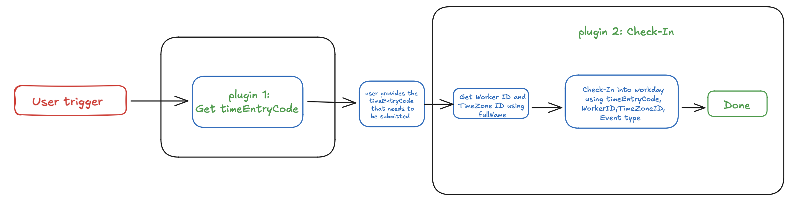

## **API #1: Retrieve user details by full name**

The **Retrieve User Details by Full Name** API facilitates the retrieval of a **Worker ID** and **Timezone ID** using a [WQL Query](https://community.workday.com/sites/default/files/file-hosting/restapi/#wql/v1/get-/data).

- **Purpose**: Retrieves the **Worker ID** and **Timezone ID** based on a user’s full name.
- **Features**: Filters data by **full name** and provides accurate results, even in large datasets.
- **Example**: Executes a query in Workday to identify the **Worker ID** and **Timezone ID**.

```yaml
curl --request POST
--location 'https://<DOMAIN>.myworkday.com/api/wql/v1/<INSTANCE>/data?offset=0&limit=1' \
--header 'Content-Type: application/json' \
--data '{ 
    "query": "SELECT workdayID, fullName, email_PrimaryWorkOrPrimaryHome, timeZoneOfLocationOfWorkersPrimaryPosition 
              FROM allWorkers 
              WHERE fullName LIKE '\''%{{fullName}}%'\''"  
}'
```

• **<YOUR_DOMAIN>**: Your workday domain (e.g., impl-services1.wd12.myworkday.com).

## **API #2: Check-In Workday**

The [**Check-In Workday**](https://community.workday.com/sites/default/files/file-hosting/restapi/#timeTracking/v3/get-/values/timeTypes/timeEntryCodes/) API allows you to log time entries for workers in Workday. This API uses the **Time Clock Events** endpoint to record check-ins, check-outs, and other time-related events.

- **Purpose**:
    - Logs time entries for workers in Workday.
    - Tracks work hours, breaks, and other time-related activities.
- **Features**:
    - Supports logging time entries with specific **event types** (e.g., check-in, check-out).
    - Allows specifying **time zones** for accurate time tracking.
    - Uses **time entry codes** to categorize time entries (e.g., regular hours, overtime).

```yaml
curl --location 'https://<YOUR_DOMAIN>/api/timeTracking/v3/moveworks_dpt1/timeClockEvents' \
--header 'Content-Type: application/json' \
--header 'Authorization: Bearer <ACCESS_TOKEN>' \
--data '{
    "worker": {
        "id": "{{worker_id}}"
    },
    "eventType": {
        "id": "{{eventType}}"
    },
    "timeZone": {
        "id": "{{timeZone}}"
    },
    "dateTime": "{{dateTime}}",
    "timeEntryCode": {
        "id": "{{timeEntryCode}}"
    }
}'
```

**Explanation of Fields:**

1. **<YOUR_DOMAIN>**:Replace this with your Workday instance domain (e.g., impl-services1.wd12.myworkday.com).
2. **<ACCESS_TOKEN>**:The OAuth 2.0 access token for authentication. This is obtained during the Workday login process.
3.  **<WORKER_ID>,<EVENTTYPE_ID>, <TIMEZONE_ID>, <DATETIME>**: The User details and datetime.
4. **<timeEntryCode_ID>**: The unique identifier for the time entry code (e.g., regular hours, overtime).

# **Steps**

### **Step 1: Build HTTP Action**

Define your HTTP Actions for fetching all the backlog ideas of a specific project :

### **1. Retrieve user details by full name**

- In Creator Studio, create a new Action.
    - Navigate to plugin section > Actions tab
    - Click on CREATE to define a new action
        
        
        

- Click on the IMPORT CURL option and paste the following cURL command:

```yaml
curl --request POST
--location 'https://<DOMAIN>.myworkday.com/api/wql/v1/<INSTANCE>/data?offset=0&limit=1' \
--header 'Content-Type: application/json' \
--data '{ 
    "query": "SELECT workdayID, fullName, email_PrimaryWorkOrPrimaryHome, timeZoneOfLocationOfWorkersPrimaryPosition 
              FROM allWorkers 
              WHERE fullName LIKE '\''%{{fullName}}%'\''"  
}'

```

- Click on Use Existing Connector > select the [Workday connector](https://developer.moveworks.com/creator-studio/resources/connector/?id=workday) that you just created > Click on Apply. This will populate the Base URL and the Authorization section of the API Editor.
- **Body :** { **"query": "SELECT workdayID, fullName, email_PrimaryWorkOrPrimaryHome, timeZoneOfLocationOfWorkersPrimaryPosition, check_InStatus FROM allWorkers WHERE fullName = '{{fullName}}'"** }
    
    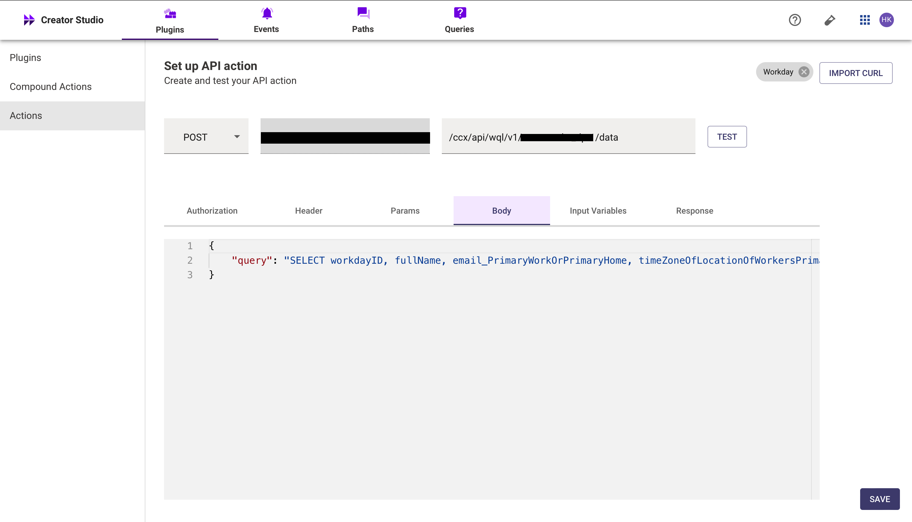
    
- **Input Variables** :
    - fullName : Example Value ( John).
    
    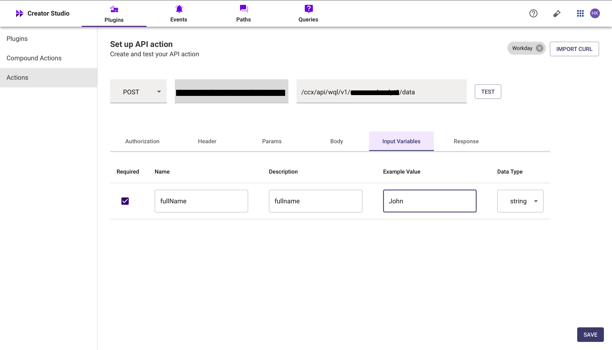
    
- Click on Test to check if the Connector setup was successful and expect a successful response as shown below. You will see the request response on the left side and the generated output schema on the right. If the output schema does not match the API response or fails to populate automatically, kindly click the GENERATE FROM RESPONSE button to refresh and align the schema with the API response.
    
    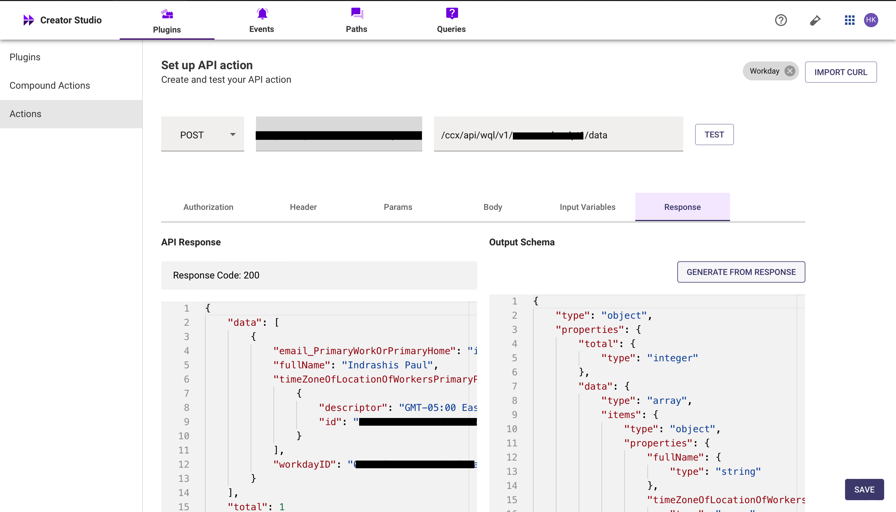
    
- Add the **API Name** and **API Description** as shown below, then click the Save button
    
    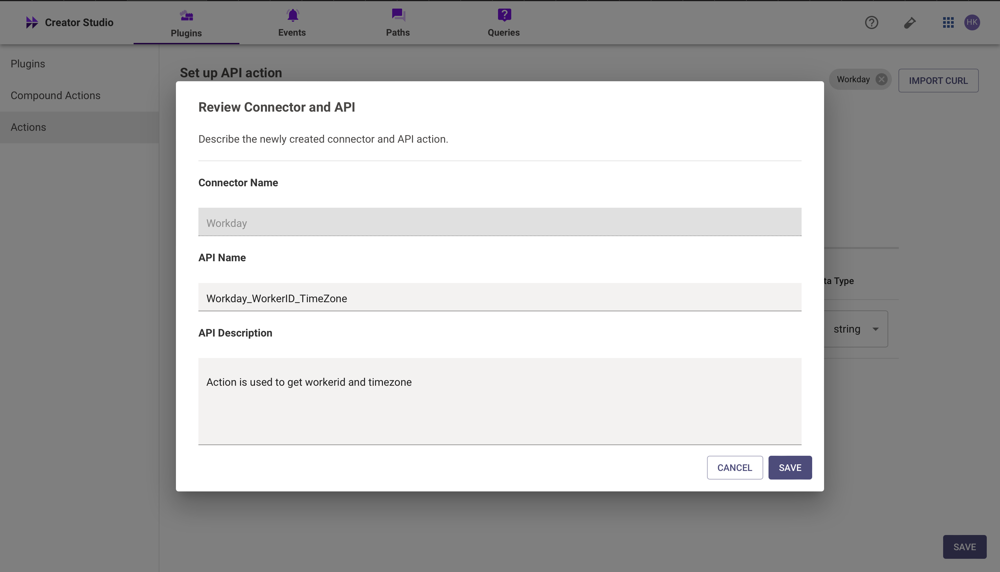
    

### **2. checking-In based on the given user details**

- Repeat the steps above to create another action.
- Click on the IMPORT CURL option and paste the following cURL command:

```yaml
curl --location 'https://<DOMAIN>.myworkday.com/api/timeTracking/v3/<INSTANCE>/timeClockEvents' \
--header 'Content-Type: application/json'
    "worker": {
        "id": "<WORKER_ID>"
    },
    "eventType": {
        "id": "3b6121e8f9804d6ab0065ebe212fc0fe"
    },
    "timeZone": {
        "id": "<TIMEZONE_ID>"
    },
    "dateTime": "<DATETIME>",
    "timeEntryCode": {
        "id": "<TimeEntryCodeID"
    }
}'
```

- Use the existing connector by following the steps outlined in the previous point to populate the Base URL and Authorization section.
- **Header :**
    - Key ( **Content-Type** ) : Value ( **application/json** )
    
    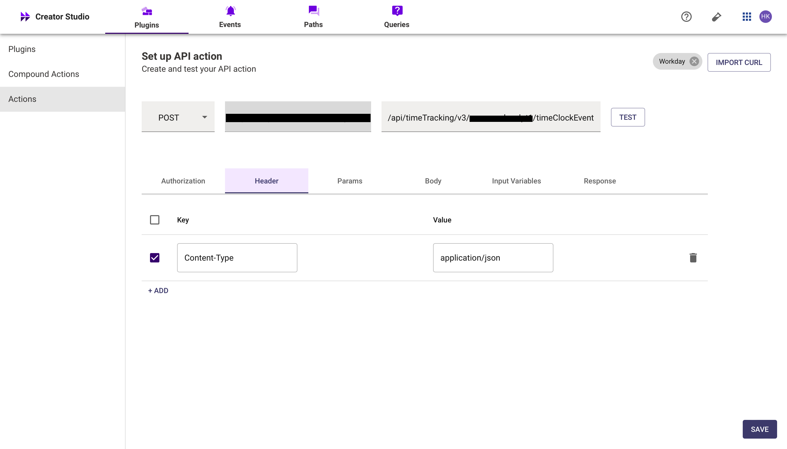
    

**Body :**

- **worker_id:** Retrieved Worker ID from full name.
- **eventType**: The EventType ID.
- **timeZone:** The ID of the timeZone.
- **dateTime:** The current date and time.
- timeEntryCode: The timeEntryCode ID retrieved from the timeEntryCode Plugin.
    
    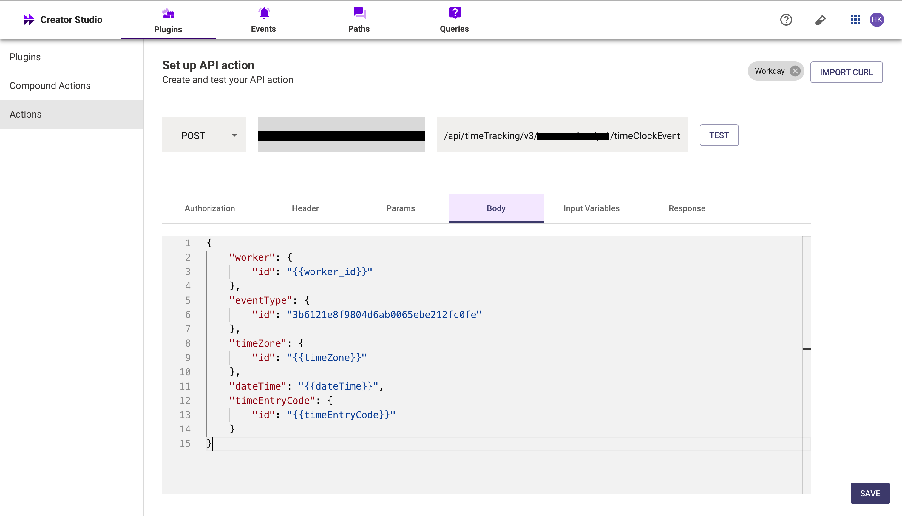
    

**Input Variables** :

- **worker_id :** Example Value ( 01756f8736e11014b3f0da1c7f4a0010)
- **eventType** : Example Value (a5b65f69843a456f800ae8277d1b95a1)
- **timeZone :** Example Value (dc10ea38446c11de98360015c5e6daf1)
- **dateTime :** Example Value ( 2024-11-27T14:19:00.000Z )

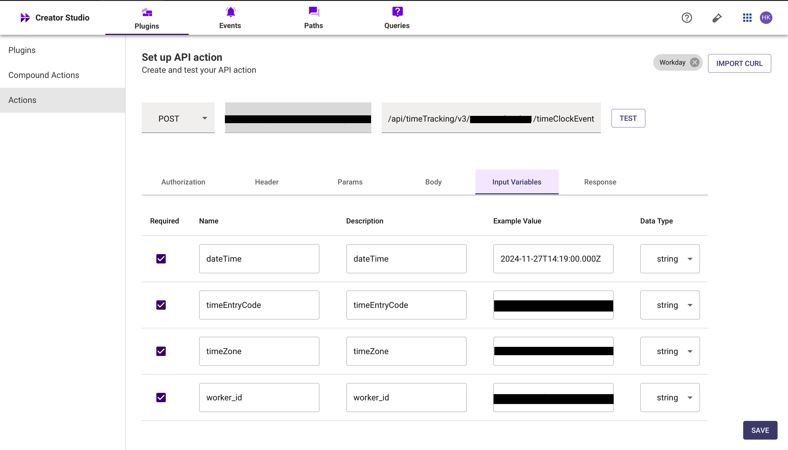

- We have provided sample input variables for **worker_id**, **eventType**, **timeZone** and **dateTime**. Using these input variables, we tested the plugin by making a **POST** request to check-in a user in workday.
- Test the Connector setup as described earlier to verify the response. If the output schema is incorrect or missing, click GENERATE FROM RESPONSE to update it.

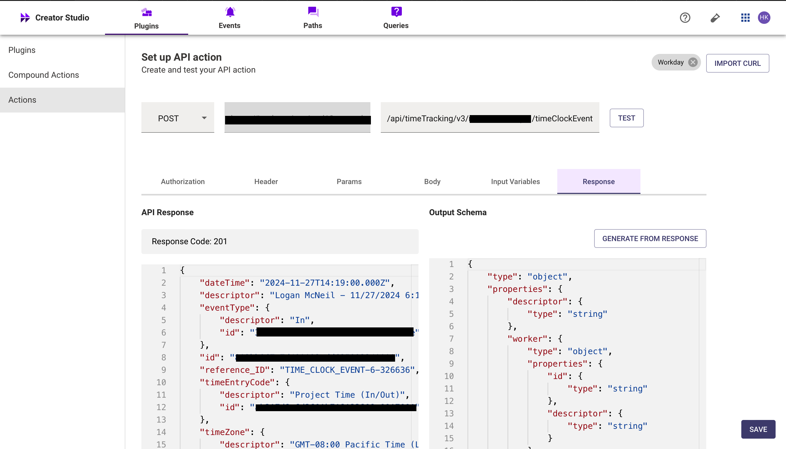

- Add the **API Name** and **API Description** as shown below, then click the Save Button.

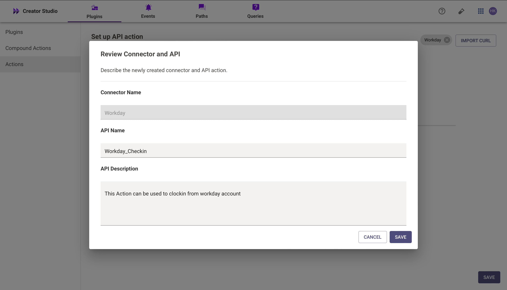

## **Step 2: Build Compound Action**

- Head over to the **Compound Actions** tab and click **CREATE**
    
    
    
- Give your Compound Action a **Name** and **Description** , then click Next Note: Name only letters, numbers, and underscores. We suggest using snake case or camel case formatting (e.g. Workflow_name or workflowName )
    
    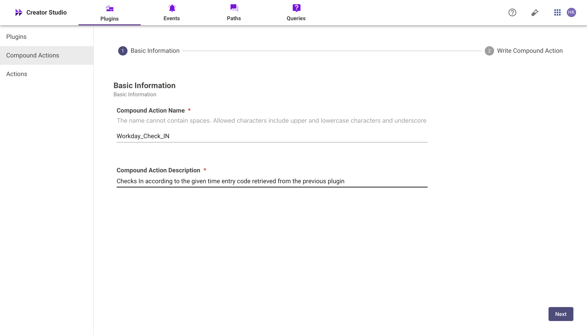
    
- Click on the Script editor tab. Here you will be able to build your compound action using the YAML syntax.
- At a high-level, this syntax provides actions (HTTP Request, APIthon Scripts) and workflow logic (switch statements, for each loops, return statements, parallel, try/catch). See the [Compound Action Syntax](https://developer.moveworks.com/creator-studio/reference/compound_actions_syntax/) Reference for more info.

```yaml
steps:
  - action:
      output_key: Workday_WorkerID_TimeZone_result
      action_name: Workday_WorkerID_TimeZone
      progress_updates:
        on_complete: Retrieved workerdata
        on_pending: Retrieving workerdata
      input_args:
        fullName: data.fullName
  - action:
      output_key: Get_Event_ID_by_Worker_ID_result
      action_name: Get_Event_ID_by_Worker_ID
      progress_updates:
        on_complete: Retrieved event id
        on_pending: Retrieving event id
      input_args:
        worker_id: data.Workday_WorkerID_TimeZone_result.data[0].workdayID
  - action:
      output_key: Workday_Clockin_result
      action_name: Workday_Checkin
      progress_updates:
        on_complete: Retrieved checkin data
        on_pending: Retrieving checkin data
      input_args:
        timeZone: data.Workday_WorkerID_TimeZone_result.data[0].timeZoneOfLocationOfWorkersPrimaryPosition[0].id
        worker_id: data.Workday_WorkerID_TimeZone_result.data[0].workdayID
        dateTime: $FORMAT_TIME($TIME())
        timeEntryCode: data.id
        eventType: data.Get_Event_ID_by_Worker_ID_result.data[0].id
  - return:
      output_mapper:
        clockin: data.Workday_Clockin_result.dateTime

```

- Click on Input fields tab and click the +Add button. Here you will define the slots that you want to collect from users through the conversation and trigger your Workflow with. After defining the input fields, click the Submit button to save your changes.

## **Step 3: Publish Workflow to Plugin**

- Head over to the Compound Actions tab and click on the kebab menu ( ︙ )
- Next, click on Publish Workflow to Plugin
- First, verify your Plugin **Name** & **Short description** . This is autofilled from the name & description of your compound action.
    
    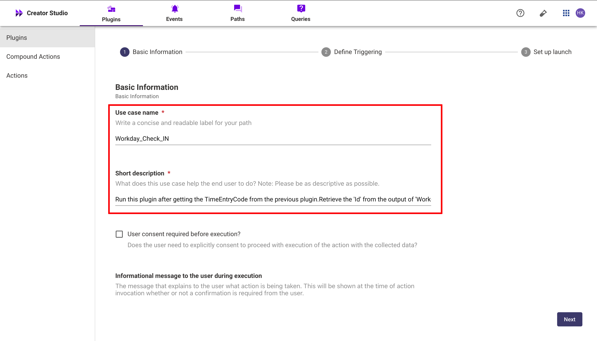
    
- Next, consider whether to select the User consent required before execution? checkbox. Enabling this option prompts the user to confirm all slot values before executing the plugin, which is widely regarded as a best practice.
    
    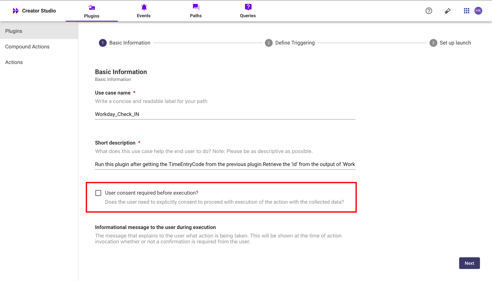
    
- Click Next and set up your positive and negative triggering examples. This ensures that the bot triggers your plugin given a relevant utterance.
    - See our [guide](https://developer.moveworks.com/creator-studio/conversation-design/triggers/natural-language-triggers/#how-to-write-good-triggering-examples) on Triggering
- Lastly, click Next and set the **Launch Rules** you want your plugin to abide by.
    - See our [guide](https://developer.moveworks.com/creator-studio/administration/launch-options/) on Launch Rules

## **Step 4: See it in action!**

- After clicking the final Submit button, your plugin will be published to the bot and triggerable based on your **Launch Rules.**
- You should wait up to **5 minutes** after making changes before trying to test in your bot!
- If you run into an issue:
    1. Check our [troubleshooting guides](https://developer.moveworks.com/creator-studio/troubleshooting/support/)
    2. Understand your issue using Logs
    3. Reach out to Support

# **Congratulations!**

You've just added the "**check-In Workday**" feature inside your workday account to your Copilot! Explore our other guides for more inspiration on what to build next.
