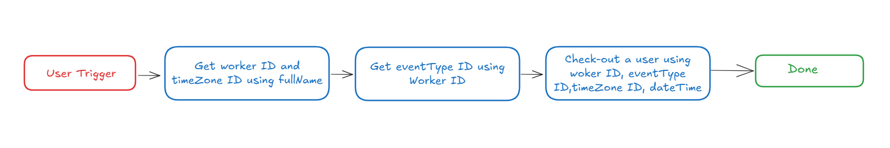

# **Introduction :**

Workday is an enterprise cloud platform for financial, HR, and business planning applications, and the “**Check_Out_in_workday”** plugin streamlines the process of checking out a specific user by leveraging their full name. By integrating this functionality into your bot, users can efficiently and seamlessly check out a user, thereby improving productivity and organization.

This guide provides detailed, step-by-step instructions on incorporating the “**Check_Out_in_workday”** feature into your bot using Creator Studio.

Let’s get started!

# Prerequisites :

- [Postman](https://www.postman.com/) or an API Testing Tool
- Follow the [Workday Connector guide](https://developer.moveworks.com/creator-studio/resources/connector?id=workday) to set up your Creator Studio Connector.

# What are we building?

## **Conversation Design**

This [purple chat](https://developer.moveworks.com/creator-studio/developer-tools/purple-chat?conversation=%7B%22startTimestamp%22%3A%2211%3A43+AM%22%2C%22messages%22%3A%5B%7B%22parts%22%3A%5B%7B%22richText%22%3A%22I+want+to+clock+out.%22%7D%5D%2C%22role%22%3A%22user%22%7D%2C%7B%22parts%22%3A%5B%7B%22richText%22%3A%22Okay%2C+clocking+you+out+now.%22%7D%2C%7B%22reasoningSteps%22%3A%5B%7B%22richText%22%3A%22Fetching+user%27s+timezone...%22%2C%22status%22%3A%22pending%22%7D%5D%7D%2C%7B%22reasoningSteps%22%3A%5B%7B%22richText%22%3A%22Received+User%27s+Timezone%22%2C%22status%22%3A%22success%22%7D%5D%7D%2C%7B%22reasoningSteps%22%3A%5B%7B%22richText%22%3A%22Clocking+out+the+user...%22%2C%22status%22%3A%22pending%22%7D%5D%7D%2C%7B%22apiBlock%22%3A%7B%22code%22%3A%22%7B%5Cn++%5C%22worker%5C%22%3A+%7B%5Cn++++%5C%22id%5C%22%3A+%5C%228360015c5e6daf6%5C%22%5Cn++%7D%2C%5Cn++%5C%22eventType%5C%22%3A+%7B%5Cn+++++%5C%22id%5C%22%3A+%5C%22d6ab0065ebe212fc0fe%5C%22%5Cn++%7D%2C%5Cn++%5C%22dateTime%5C%22%3A+%5C%222024-08-22T17%3A30%3A00Z%5C%22%2C%5Cn++%5C%22timeZone%5C%22%3A+%7B%5Cn++++%5C%22id%5C%22%3A+%5C%22dc10e678446c1%5C%22%5Cn++%7D%5Cn%7D%22%2C%22title%22%3A%22Clocking-out+for+Jane+Doe+at+5%3A30+PM+ET%22%2C%22connectorName%22%3A%22workday%22%7D%7D%2C%7B%22richText%22%3A%22Clock-out+successful+for+Jane+Doe+at+2024-08-22T17%3A30%3A00Z+in+Eastern+Time+%28US+%26+Canada%29.%22%7D%5D%2C%22role%22%3A%22assistant%22%7D%5D%7D) shows the experience we are going to build.

# **Creator Studio Components**

- **Triggers**:
    1. Natural Language
- **Slots**:
    1. Fetch worker ID and timezone ID
    2. Fetch event ID
- **Actions**:
    1. **Retrieve user details by full name:**
        - Query the user information by using the user’s full name to obtain unique worker ID.
    2. **Retrieve event ID by worker ID:**
        - Use the worker ID provided by the user to get the event ID for a specific event.
    3. **Fetching check-out details based on the given user details:**
        - Getting check-out details using user details such as Worker ID, Event Type ID, Timezone ID, and DateTime.
- **Guidelines:**
    1. None

# **API Research**

To build this use case, we will utilize three APIs. Since our goal is to fetch the Worker ID, eventType ID, timeZone ID, dateTime and check out a user, we'll focus on workday-related REST APIs. Only three API calls are required to achieve this.



## API #1: **Retrieve user details by full name**

The **Retrieve User Details by Full Name** API facilitates the retrieval of a **Worker ID** and **Timezone ID** using a user's full name.

- **Purpose**: Retrieves the **Worker ID** and **Timezone ID** based on a user’s full name.
- **Features**: Filters data by **full name** and provides accurate results, even in large datasets.
- **Example**: Executes a query in Workday to identify the **Worker ID** and **Timezone ID**.

```bash
curl --request POST
--location 'https://<DOMAIN>.myworkday.com/api/wql/v1/<INSTANCE>/data?offset=0&limit=1' \
--header 'Content-Type: application/json' \
--data '{ 
    "query": "SELECT workdayID, fullName, email_PrimaryWorkOrPrimaryHome, timeZoneOfLocationOfWorkersPrimaryPosition 
              FROM allWorkers 
              WHERE fullName LIKE '\''%{{fullName}}%'\''"  
}'

```
- **<YOUR_DOMAIN>**: Your workday domain (e.g., yourcompany.myworkday.com).

## **API #2: Retrieve event ID by worker ID**

The **Retrieve Event ID by Worker ID** API allows you to fetch the **eventType ID** for a specific worker ID in **Workday**. 

- **Purpose**: Retrieves the **eventType ID** for a worker based on their **Worker ID**.
- **Features**: Supports filtering by **Worker ID**, ensuring accurate retrieval of event details.
- **Example**: Queries Workday to fetch the **eventType ID** associated with a specific worker’s check event.

```bash
curl --request GET 
--location 'https://<DOMAIN>.myworkday.com/api/timeTracking/v3/<INSTANCE>/values/timeValues/outReason/?date=2025-02-28&inOutCodeOnly=true&offset=0&limit=10&worker=<WORKER_ID>'
```

- **<YOUR_DOMAIN>**: Your workday domain (e.g., yourcompany.myworkday.com).

## **API #3: Fetching check-out details based on the given user details**

The **Fetching Check-Out Details by User** API allows you to retrieve **check-out event details** in Workday based on the given **user details**, such as **Worker ID**, **Event Type ID**, **Time Zone ID**, and **DateTime**.

- **Purpose**: Retrieves check-out details for a specific worker based on the provided information.
- **Features**: Supports filtering by **Worker ID, Event Type ID, Time Zone ID, and DateTime** to ensure accurate retrieval of check-out records.
- **Example**: Queries Workday to fetch the **check-out event details** associated with a given worker.

```bash
curl --request POST 
--location --globoff 'https://<DOMAIN>.myworkday.com/api/timeTracking/v3/<INSTANCE>/timeClockEvents?worker={{WORKER_ID}}' 
--data '{ "worker": {
        "id": "<WORKER_ID>"
    },
    "eventType": {
        "id": "<EVENTTYPE_ID>"
    },
    "timeZone": {
        "id": "<TIMEZONE_ID>"
    },
    "dateTime": "<DATETIME>"
    }' 
```

- **<YOUR_DOMAIN>**: Your workday domain (e.g., yourcompany.myworkday.com).
- **<WORKER_ID>,<EVENTTYPE_ID>, <TIMEZONE_ID>, <DATETIME>**: The User details and datetime.

# **Steps**

## **Step 1: Build HTTP Action**

Define your HTTP Actions for fetching all the backlog ideas of a specific project :

### **1. Retrieve user details by full name**

- In Creator Studio, create a new Action.
    - Navigate to plugin section > Actions tab
    - Click on CREATE to define a new action
        
        
        
- Click on the  IMPORT CURL option and paste the following cURL command:
    
    ```bash
    curl --request POST
    --location 'https://<DOMAIN>.myworkday.com/api/wql/v1/<INSTANCE>/data?offset=0&limit=1' \
    --header 'Content-Type: application/json' \
    --data '{ 
        "query": "SELECT workdayID, fullName, email_PrimaryWorkOrPrimaryHome, timeZoneOfLocationOfWorkersPrimaryPosition 
                  FROM allWorkers 
                  WHERE fullName LIKE '\''%{{fullName}}%'\''"  
    }'
    
    ```
    
- Click on Use Existing Connector > select the Workday [](https://developer.moveworks.com/creator-studio/resources/connector/?id=jira)connector that you just created > Click on Apply. This will populate the Base URL and the Authorization section of the API Editor.
- **Body :**
    
    { **"query": "SELECT workdayID, fullName, email_PrimaryWorkOrPrimaryHome, timeZoneOfLocationOfWorkersPrimaryPosition, check_InStatus FROM allWorkers WHERE fullName = '{{fullName}}'"** }
    

  

- **Input Variables** :
    - fullName : Example Value ( John).
    
  
    
- Click on Test to check if the Connector setup was successful and expect a successful response as shown below. You will see the request response on the left side and the generated output schema on the right. If the output schema does not match the API response or fails to populate automatically, kindly click the GENERATE FROM RESPONSE button to refresh and align the schema with the API response.
    
    
    
- Add the **API Name** and **API Description** as shown below, then click the Save button
    
    
    

### 2. **Retrieve event ID by worker ID**

- Repeat the steps above to create another action.
- Click on the IMPORT CURL option and paste the following cURL command:
    
    ```bash
    curl --request GET 
    --location 'https://<DOMAIN>.myworkday.com/api/timeTracking/v3/<INSTANCE>/values/timeValues/outReason/?date=2025-02-28&inOutCodeOnly=true&offset=0&limit=10&worker=<WORKER_ID>'
    ```
    
- Use the existing connector by following the steps outlined in the previous point to populate the Base URL and Authorization section.
- **Params :**
    - Key ( **date** ) : Value ( **2025-02-28** )
    - Key ( **inOutCodeOnly**) : Value ( **true** )
    - Key ( **offset** ) : Value ( **0** )
    - Key ( **limit** ) : Value ( **10** )
    - Key ( **worker** ) : Value ( **f00affdd7e995dc9945dc9f7e** )
    
    
    

- Test the Connector setup as described earlier to verify the response. If the output schema is incorrect or missing, click GENERATE FROM RESPONSE to update it.
    
    
    
- Add the **API Name** and **API Description** as shown below, then click the `Save` button 
    
    
    

### 3. **Fetching check-out details based on the given user details**

- Repeat the steps above to create another action.
- Click on the IMPORT CURL option and paste the following cURL command:
    
    ```bash
    curl --request POST 
    --location --globoff 'https://<DOMAIN>.myworkday.com/api/timeTracking/v3/<INSTANCE>/timeClockEvents?worker={{WORKER_ID}}' 
    --data '{ "worker": {
            "id": "<WORKER_ID>"
        },
        "eventType": {
            "id": "<EVENTTYPE_ID>"
        },
        "timeZone": {
            "id": "<TIMEZONE_ID>"
        },
        "dateTime": "<DATETIME>"
        }' 
    ```
    
- Use the existing connector by following the steps outlined in the previous point to populate the Base URL and Authorization section.
- **Header :**
    - Key ( **Content-Type** ) : Value ( **application/json** )
    
    
    
- **Body :**
    - **worker_id:** Retrieved worker id from full name.
    - **eventType**: The eventType id.
    - **timeZone:** The id of the timeZone.
    - **dateTime:** The current date and time.
    
    
    
     
    
- **Input Variables** :
    - **worker_id :** Example Value ( 01756f8736e11014b3f0da1c7f4a0010)
    - **eventType** : Example Value (a5b65f69843a456f800ae8277d1b95a1)
    - **timeZone :** Example Value (dc10ea38446c11de98360015c5e6daf1)
    - **dateTime :** Example Value ( 2024-11-27T14:19:00.000Z )
    
    
    
- We have provided sample input variables for **worker_id**, **eventType**, **timeZone** and **dateTime**. Using these input variables, we tested the plugin by making a **POST** request to check-in a user in workday.
- Test the Connector setup as described earlier to verify the response. If the output schema is incorrect or missing, click GENERATE FROM RESPONSE to update it.
    
    
    
- Add the **API Name** and **API Description** as shown below, then click the `Save` button  
    
    
    

## **Step 2: Build Compound Action**

- Head over to the **Compound Actions** tab and click **CREATE**
    
    
    
- Give your Compound Action a **Name** and **Description** , then click Next Note: Name only letters, numbers, and underscores. We suggest using snake case or camel case formatting (e.g. Workflow_name or workflowName )
    
    
    
- Click on the Script editor tab. Here you will be able to build your compound action using the YAML syntax. At a high-level, this syntax provides actions (HTTP Request, APIthon Scripts) and workflow logic (switch statements, for each loops, return statements, parallel, try/catch). See the [Compound Action Syntax](https://developer.moveworks.com/creator-studio/reference/compound_actions_syntax/) Reference for more info.
    
    ```yaml
    steps:
      - action:
          output_key: Workday_WorkerID_TimeZone_result
          action_name: Workday_WorkerID_TimeZone
          progress_updates:
            on_complete: Retrieved workerdata
            on_pending: Retrieving workerdata
          input_args:
            fullName: meta_info.user.full_name
      - action:
          output_key: Get_Event_ID_by_Worker_ID_result
          action_name: Get_Event_ID_by_Worker_ID
          progress_updates:
            on_complete: Retrieved event id
            on_pending: Retrieving event id
          input_args:
            worker_id: data.Workday_WorkerID_TimeZone_result.data[0].workdayID
      - action:
          output_key: Check_Out_result
          action_name: Check_Out
          progress_updates:
            on_complete: Retrieved check-out data
            on_pending: Retrieving check-out data
          input_args:
            timeZone: data.Workday_WorkerID_TimeZone_result.data[0].timeZoneOfLocationOfWorkersPrimaryPosition[0].id
            worker_id: data.Workday_WorkerID_TimeZone_result.data[0].workdayID
            dateTime: $FORMAT_TIME($TIME())
            eventType: data.Get_Event_ID_by_Worker_ID_result.data[0].id
      - return:
          output_mapper:
            checkout: data.Check_Out_result.dateTime
    
    ```
    

## **Step 3: Publish Workflow to Plugin**

- Head over to the Compound Actions tab and click on the kebab menu ( ︙ )
- Next, click on Publish Workflow to Plugin
- First, verify your Plugin **Name** & **Short description** . This is autofilled from the name & description of your compound action.
    
    
    
- Next, consider whether to select the User consent required before execution? checkbox. Enabling this option prompts the user to confirm all slot values before executing the plugin, which is widely regarded as a best practice.
    
    
    
- Click Next and set up your positive and negative triggering examples. This ensures that the bot triggers your plugin given a relevant utterance.
    - See our [guide](https://developer.moveworks.com/creator-studio/conversation-design/triggers/natural-language-triggers/#how-to-write-good-triggering-examples) on Triggering
- Lastly, click Next and set the **Launch Rules** you want your plugin to abide by.
    - See our [guide](https://developer.moveworks.com/creator-studio/administration/launch-options/) on Launch Rules

## **Step 4: See it in action!**

- After clicking the final Submit button, your plugin will be published to the bot and triggerable based on your **Launch Rules.**
- You should wait up to **5 minutes** after making changes before trying to test in your bot!
- If you run into an issue:
    1. Check our [troubleshooting guides](https://developer.moveworks.com/creator-studio/troubleshooting/support/)
    2. Understand your issue using Logs
    3. Reach out to Support

# **Congratulations!**

You've just added the **"Check_Out_in_workday"** feature inside your workday to your Copilot! Explore our other guides for more inspiration on what to build next.