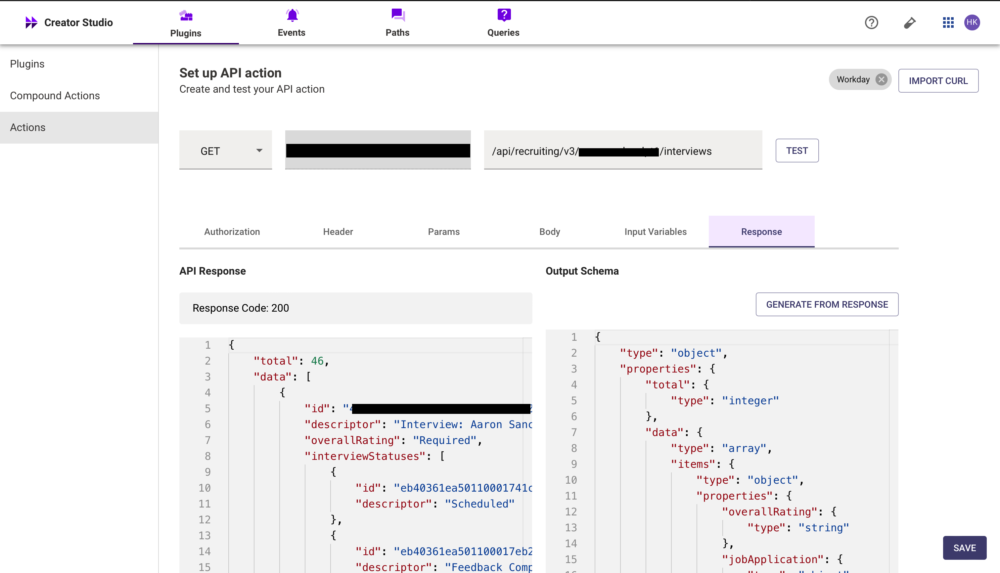

# Fetch Interview Feedback

# Introduction

Workday’s **"Fetch Interview Feedback"** feature enables recruiters and hiring managers to efficiently retrieve and review candidate interview evaluations within the Workday platform. By integrating this functionality into your bot, users can quickly access consolidated feedback, streamline decision-making, and enhance the hiring process—all through a simple conversational interface.

This guide will walk you through how to implement the **"Fetch Interview Feedback"** feature in your bot using Creator Studio. Let’s begin!

# **Prerequisites**

- Workday Connector built in Creator Studio (follow the [Workday Authentication](https://developer.moveworks.com/creator-studio/resources/connector/?id=workday) guide to create your connector)

# What are we building?

### **Conversation Design**

This [purple chat](https://developer.moveworks.com/creator-studio/developer-tools/purple-chat?conversation=%7B%22startTimestamp%22%3A%2211%3A43+AM%22%2C%22messages%22%3A%5B%7B%22parts%22%3A%5B%7B%22richText%22%3A%22Can+I+see+the+interview+feedback+for+John+Doe%3F%22%7D%5D%2C%22role%22%3A%22user%22%7D%2C%7B%22parts%22%3A%5B%7B%22richText%22%3A%22You+selected+%3Cb%3EJohn+Doe%3C%2Fb%3E.+Fetching+interview+feedback...%22%7D%5D%2C%22role%22%3A%22assistant%22%7D%2C%7B%22parts%22%3A%5B%7B%22richText%22%3A%22Here+are+the+interview+scorecards+for+%3Cb%3EJohn+Doe%3C%2Fb%3E%3A%22%7D%2C%7B%22richText%22%3A%22%F0%9F%93%8C+%3Cb%3ERound%3A+Hiring+Manager+Interview%3C%2Fb%3E%22%7D%2C%7B%22richText%22%3A%22%3Cul%3E%3Cli%3E%3Cb%3ESubmitted+By%3C%2Fb%3E%3A+%3Cb%3EMichael+Brown%3C%2Fb%3E%3C%2Fli%3E%3Cli%3E%3Cb%3ESubmitted+At%3C%2Fb%3E%3A+2025-02-22%3C%2Fli%3E%3Cli%3E%3Cb%3EOverall+Recommendation%3C%2Fb%3E%3A+%E2%AD%90%E2%AD%90%E2%AD%90%E2%98%86%E2%98%86+%283%2F5%29%3C%2Fli%3E%3Cli%3E%3Cb%3EKey+Attributes%3C%2Fb%3E%3A%3Cul%3E%3Cli%3E%3Cb%3ELeadership+Potential%3C%2Fb%3E%3A+%E2%9C%85+Yes%3C%2Fli%3E%3Cli%3E%3Cb%3ECommunication+Skills%3C%2Fb%3E%3A+%E2%9C%85+Yes%3C%2Fli%3E%3Cli%3E%3Cb%3EDecision+Making%3C%2Fb%3E%3A+%E2%9D%8C+No%3C%2Fli%3E%3C%2Ful%3E%3C%2Fli%3E%3Cli%3E%3Cb%3EComments%3C%2Fb%3E%3A+%3Ci%3E%5C%22Good+communication+and+leadership+potential%2C+but+hesitated+in+making+decisions.%5C%22%3C%2Fi%3E%3C%2Fli%3E%3C%2Ful%3E%22%7D%5D%2C%22role%22%3A%22assistant%22%7D%2C%7B%22parts%22%3A%5B%7B%22richText%22%3A%22Thanks%21%22%7D%5D%2C%22role%22%3A%22user%22%7D%2C%7B%22parts%22%3A%5B%7B%22richText%22%3A%22You%27re+welcome%21+Let+me+know+if+you+need+anything+else.%22%7D%5D%2C%22role%22%3A%22assistant%22%7D%5D%7D) shows the experience we are going to build.

# **Creator Studio Components**

- **Triggers:**
    1. **Natural Language**
- **Slots:**
    1. **Canditate Name**
- **Actions:**
    1. **Retrieve Interviews**: Retrieve the list of interviews to identify the correct **Interview ID**.
    2. **Fetch Interview Feedback**: Fetch the feedback, using the **Interview ID** (retrieved from the interviews list), along with the feedback comment and rating.
- **Guidelines:**
    1. None

# **API Research**

This build this use case, we will use **two APIs** to retrieve interview details and fetch feedback.


### **API #1: Retrieve Interviews**

The [**Retrieve Interviews**](https://community.workday.com/sites/default/files/file-hosting/restapi/#recruiting/v4/get-/interviews) API retrieves the list of interviews associated with a candidate, based on the provided criteria.

- **Purpose**: Fetches the list of interviews for a candidate to identify the correct interview ID.
- **Features**: Supports searching for interviews by candidate details and returns interview information.
- **Example**: Queries Workday’s API to retrieve interview details using the following CURL request

```yaml
curl --location 'https://<YOUR_DOMAIN>/api/recruiting/v3/<INSTANCE_ID>/interviews\
--header 'Content-Type: application/json' \
--header 'Authorization: Bearer <ACCESS_TOKEN>'
Copy
```

- **<YOUR_DOMAIN>**: Your Workday instance domain (e.g., [yourcompany.myworkday.com](http://yourcompany.myworkday.com/)).
- **<INSTANCE_ID>**: The Workday instance ID

### **API #2: Fetch Interview Feedback**

The [**Fetch Interview Feedback**](https://community.workday.com/sites/default/files/file-hosting/restapi/#recruiting/v4/get-/interviews/-ID-/feedback) API allows you to fetch feedback for a specific interview in Workday.

- **Purpose**: fetches the feedback, including comments and ratings, for a specific interview.
- **Features**: Retrieves the comment and overall rating for a particular interview using the **Interview ID.**
- **Example**: Fetches feedback for a specific interview using the following CURL request:

```yaml
curl --location 'https://<YOUR_DOMAIN>/ccx/api/recruiting/v4/<INSTANCE>/interviews/49440b62ccba100dc52c8143c8d00000/feedback' \
\
--header 'Authorization: Bearer <ACCESS_TOKEN>' \

```

- **<YOUR_DOMAIN>**: Your Workday instance domain (e.g., [yourcompany.myworkday.com](http://yourcompany.myworkday.com/) ).

# **Steps**

### **Step 1: Build HTTP Action**

Define your HTTP Actions for fetching all the backlog ideas of a specific project :

### **1. Retrieve interviews by Interview ID.**

- In Creator Studio, create a new Action.
    - Navigate to plugin section > Actions tab
    - Click on CREATE to define a new action
        
        
        

- Click on the IMPORT CURL option and paste the following cURL command:

```yaml
curl --location 'https://<YOUR_DOMAIN>/api/recruiting/v3/<INSTANCE_ID>/interviews\
--header 'Content-Type: application/json' \
--header 'Authorization: Bearer <ACCESS_TOKEN>'

```

- Click on Use Existing Connector > select the [Workday connector](https://developer.moveworks.com/creator-studio/resources/connector/?id=workday) that you just created > Click on Apply. This will populate the Base URL and the Authorization section of the API Editor.

- Click on Test to check if the Connector setup was successful and expect a successful response as shown below. You will see the request response on the left side and the generated output schema on the right.
- If the output schema does not match the API response or fails to populate automatically, kindly click the GENERATE FROM RESPONSE button to refresh and align the schema with the API response.
    
    
    
- Add the **API Name** and **API Description** as shown below, then click the Save button
    
    
    

### **2. Fetch Interview Feedback**

- Repeat the steps above to create another action.
- Click on the  IMPORT CURL option and paste the following cURL command:

```yaml
curl --location 'https://<YOUR_DOMAIN>/ccx/api/recruiting/v4/<INSTANCE>/interviews/<Interview_Id/feedback' \
\
--header 'Authorization: Bearer <ACCESS_TOKEN>' \

```

- To Fetch interview feedback, we send a **GET** request
- We have provided sample input variables for **InterviewID**
- Using these input variables, we tested the plugin by making a **GET** request to fetch interview feedback for a specific interview
    
    
    
- Test the Connector setup as described earlier to verify the response. If the output schema is incorrect or missing, click GENERATE FROM RESPONSE to update it.
    
    
    
- Add the **API Name** and **API Description** as shown below, then click the Save Button.
    
    
    

## **Step 2: Build Compound Action**

- Head over to the **Compound Actions** tab and click **CREATE**
    
    
    
- Give your Compound Action a **Name** and **Description** , then click Next Note: Name only letters, numbers, and underscores. We suggest using snake case or camel case formatting (e.g. Workflow_name or workflowName )
    
    
    
- Click on the Script editor tab. Here you will be able to build your compound action using the YAML syntax.
- At a high-level, this syntax provides actions (HTTP Request, APIthon Scripts) and workflow logic (switch statements, for each loops, return statements, parallel, try/catch). See the [Compound Action Syntax](https://developer.moveworks.com/creator-studio/reference/compound_actions_syntax/) Reference for more info.

```yaml
steps:
  - action:
      action_name: GET_INTERVIEWS
      progress_updates:
        on_complete: ON_COMPLETE_MESSAGE
        on_pending: ON_PENDING_MESSAGE
      output_key: GET_INTERVIEWS_result
  - action:
      output_key: Interview_Feedback_result
      action_name: Workday_Interview_Feedback
      progress_updates:
        on_complete: ON_COMPLETE_MESSAGE
        on_pending: ON_PENDING_MESSAGE
      input_args:
        interview_id: data.GET_INTERVIEWS_result.data.$FILTER(interview =>
          data.candidate_name IN interview.descriptor)[0].id
  - return:
      output_mapper:
        dateSubmitted: data.Interview_Feedback_result.data[0].dateSubmitted
        overallRating: data.Interview_Feedback_result.data[0].overallRating.descriptor
        comment: data.Interview_Feedback_result.data[0].comment
        id: data.Interview_Feedback_result.data[0].id
        Interview: data.Interview_Feedback_result.data[0].descriptor
```

- Click on Input fields tab and click the +Add button. Here you will define the slots that you want to collect from users through the conversation and trigger your Workflow with. After defining the input fields, click the Submit button to save your changes.

## **Step 3: Publish Workflow to Plugin**

- Head over to the Compound Actions tab and click on the kebab menu ( ︙ )
- Next, click on Publish Workflow to Plugin
- First, verify your Plugin **Name** & **Short description** . This is autofilled from the name & description of your compound action.
    
    
    
- Next, consider whether to select the User consent required before execution? checkbox. Enabling this option prompts the user to confirm all slot values before executing the plugin, which is widely regarded as a best practice.
    
    
    
- Click Next and set up your positive and negative triggering examples. This ensures that the bot triggers your plugin given a relevant utterance.
    - See our [guide](https://developer.moveworks.com/creator-studio/conversation-design/triggers/natural-language-triggers/#how-to-write-good-triggering-examples) on Triggering
- Lastly, click Next and set the **Launch Rules** you want your plugin to abide by.
    - See our [guide](https://developer.moveworks.com/creator-studio/administration/launch-options/) on Launch Rules

## **Step 4: See it in action!**

- After clicking the final Submit button, your plugin will be published to the bot and triggerable based on your **Launch Rules.**
- You should wait up to **5 minutes** after making changes before trying to test in your bot!
- If you run into an issue:
    1. Check our [troubleshooting guides](https://developer.moveworks.com/creator-studio/troubleshooting/support/)
    2. Understand your issue using Logs
    3. Reach out to Support

# **Congratulations!**

You've just added the "**Fetch Interview Feedback Workday**" feature inside your workday account to your Copilot! Explore our other guides for more inspiration on what to build next.