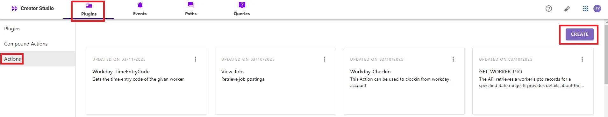
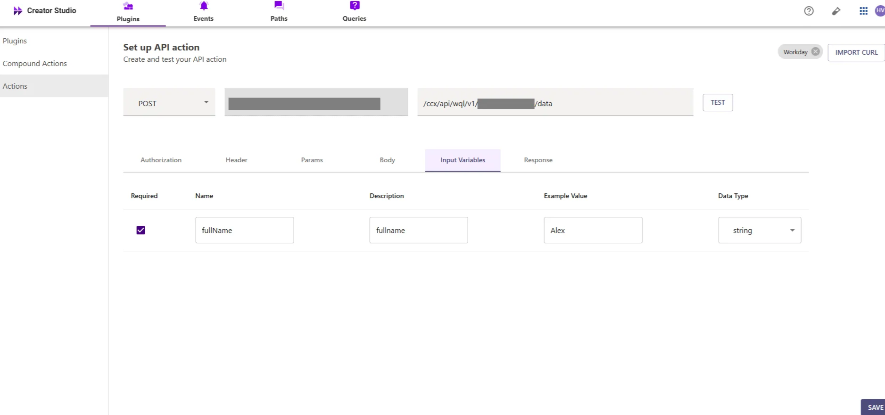
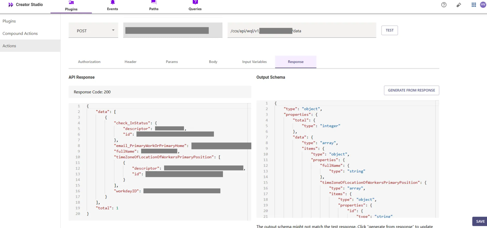
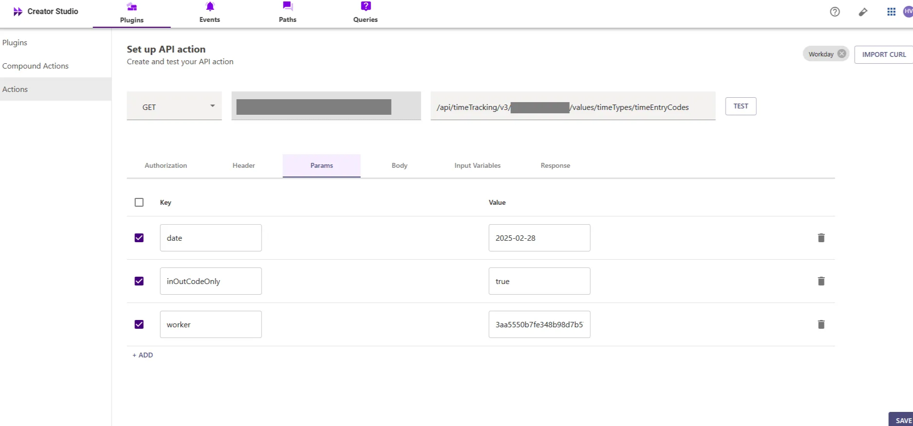
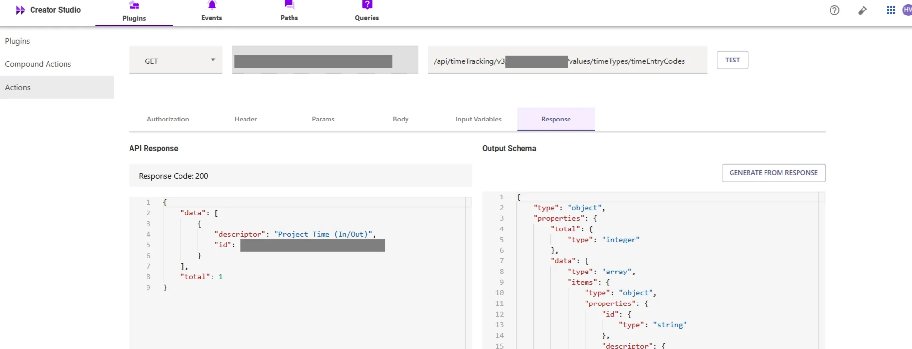
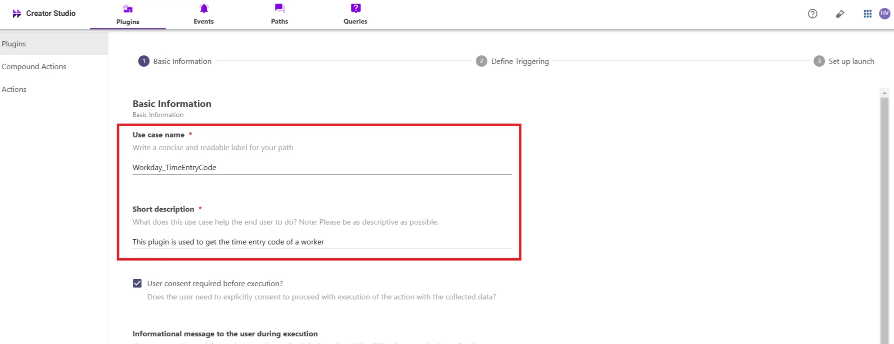
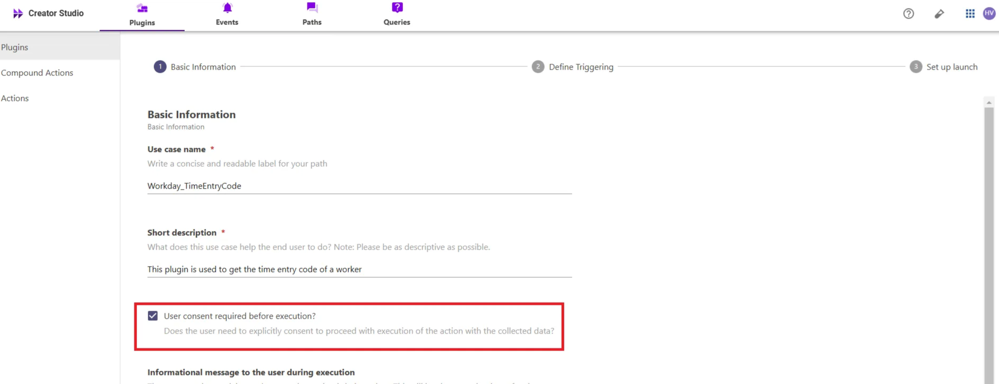

# Introduction:

Workday is an enterprise platform for human resources, and the "**Get TimeEntryCode**" feature simplifies retrieving time entry codes. By integrating this feature with your bot, users can efficiently access time entry codes, enhancing time tracking and productivity.

This guide will show you how to add the "**Get TimeEntryCode**" feature to your bot using Creator Studio. Let's get started!

# **Prerequisites:**

- Workday Connector built in Creator Studio (follow the [Workday Authentication](https://developer.moveworks.com/creator-studio/resources/connector/?id=workday) guide to create your connector)

# **What are we building?**

### **Conversation Design**

This [purple chat](https://developer.moveworks.com/creator-studio/developer-tools/purple-chat?conversation=%7B%22startTimestamp%22%3A%2211%3A43+AM%22%2C%22messages%22%3A%5B%7B%22parts%22%3A%5B%7B%22richText%22%3A%22%3Cp%3EWhat+are+my+eligible+time+entry+codes+for+today%3F%3C%2Fp%3E%22%7D%5D%2C%22role%22%3A%22user%22%7D%2C%7B%22parts%22%3A%5B%7B%22richText%22%3A%22%3Cp%3EOkay%2C+I+can+fetch+the+eligible+time+entry+codes+for+you+in+Workday+for+today%2C+March+7%2C+2025.%3C%2Fp%3E%22%7D%2C%7B%22apiBlock%22%3A%7B%22code%22%3A%22GET+%2Fvalues%2FtimeTypes%2FtimeEntryCodes%3Fdate%3D2025-03-07%26worker%3D3aa5550b7fe348b98d7b574%22%2C%22connectorName%22%3A%22workday%22%2C%22title%22%3A%22Fetch+Eligible+Time+Entry+Codes%22%7D%7D%2C%7B%22richText%22%3A%22%3Cp%3EHere+are+the+eligible+time+entry+codes+for+you%3A%3C%2Fp%3E%5Cn%3Cul%3E%5Cn++%3Cli%3EREGULAR%3A+Regular+Hours%3C%2Fli%3E%5Cn++%3Cli%3EOVERTIME%3A+Overtime+Hours%3C%2Fli%3E%5Cn++%3Cli%3EPROJECT_IN_OUT%3A+Project+Time%3C%2Fli%3E%5Cn++%3Cli%3ESICK%3A+Sick+Time%3C%2Fli%3E%5Cn%3C%2Ful%3E%22%7D%2C%7B%22richText%22%3A%22%3Cp%3E%3Cstrong%3EDo+you+want+to+check-in+for+any+of+the+above+time+entry+codes%3F%3C%2Fstrong%3E%3C%2Fp%3E%22%7D%2C%7B%22buttons%22%3A%5B%7B%22buttonText%22%3A%22Yes%22%7D%2C%7B%22buttonText%22%3A%22No%22%7D%5D%7D%5D%2C%22role%22%3A%22assistant%22%7D%5D%7D) shows the experience we are going to build.

# **Creator Studio Components**

- **Triggers:**
    1. **Natural Language**
- **Slots:**
    1. **Full Name:** Capture the name of the worker to retrieve their associated Time Entry Code
- **Actions:**
    1. **Search Worker by Name:** Retrieve worker details based on the worker's full name
    2. **Get Time Entry Code:** Retrieve the worker’s Time Entry Code based on their Worker ID
- **Guidelines:**
    1. None

# **API Research**

To build this use case, we will use **two APIs** to achieve the goal of retrieving the TimeEntryCode for a worker in Workday


## API #1: Search Worker by Name.

The [**Search Worker by Name**](https://marketplace-setup.workday.com/en-US/apps/414259/workday-query-language-(wql)/overview) API retrieves worker details based on a given worker's name from Workday. This API helps in identifying individual workers by their name, enabling the retrieval of relevant worker information, which is essential for looking up the TimeEntryCode.

- **Purpose**: Fetches worker details based on the worker's name.
- **Features**: Supports searching for workers by their name and returns important details such as Workday ID, email, timezone, and check-in status.
- **Example**: Queries Workday to retrieve worker details based on the name provided using the following API request:

```bash
curl --location 'https://<YOUR_DOMAIN>/ccx/api/wql/v1/<INSTANCE_ID>/query/?q=SELECT workdayID, fullName, email_PrimaryWorkOrPrimaryHome, timeZoneOfLocationOfWorkersPrimaryPosition, check_InStatus FROM allWorkers WHERE fullName = {{fullName}}' \
--header 'Content-Type: application/json' \
--header 'Authorization: Bearer <ACCESS_TOKEN>'

```

- **<YOUR_DOMAIN>**: Your Workday instance domain (e.g., `yourcompany.myworkday.com`).
- **<INSTANCE_ID>, <FULL_NAME>, <ACCESS_TOKEN>**: The Workday instance ID, the full name of the worker for your search request, and the authorization token required to authenticate the request to the Workday API.

## API #2: Get TimeEntryCode

The [**Get TimeEntryCode**](https://community.workday.com/sites/default/files/file-hosting/restapi/#timeTracking/v3/get-/values/timeTypes/timeEntryCodes/) API retrieves a worker's TimeEntryCode based on their Worker ID from Workday. This API is essential for fetching the worker's time entry codes for a specified date and in/out code.

- **Purpose**: Retrieves the worker’s TimeEntryCode based on their Worker ID.
- **Features**: Fetches the TimeEntryCode for the worker by passing parameters like date, in/out code, and Worker ID.
- **Example**: Queries Workday to retrieve a worker’s TimeEntryCode using the following API request

```bash
curl --location 'https://<YOUR_DOMAIN>/api/timeTracking/v3/<INSTANCE_ID>/values/timeTypes/timeEntryCodes?date=<DATE>&inOutCodeOnly=true&worker=<WORKER_ID>' \
--header 'Content-Type: application/json' \
--header 'Authorization: Bearer <ACCESS_TOKEN>'

```

- **<YOUR_DOMAIN>**: Your Workday instance domain (e.g., `yourcompany.myworkday.com`).
- **<INSTANCE_ID>, <DATE>, <WORKER_ID>, <ACCESS_TOKEN>**: The Workday instance ID, the date for the TimeEntryCode lookup, the worker's ID, and the authorization token required to authenticate the request to the Workday API

# **Steps**

## **Step 1: Build HTTP Action**

Define your HTTP Actions for fetching **TimeEntryCode** based on the provided **Worker ID** and **date**.

### 1. **In Creator Studio, Create a New Action**:

- Navigate to **Plugins** section > **Actions** tab.
- Click on **CREATE** to define a new action.



- Click on the `IMPORT CURL` option and paste the following cURL command:

```bash
curl --location 'https://<YOUR_DOMAIN>/ccx/api/wql/v1/<INSTANCE_ID>/query/?q=SELECT workdayID, fullName, email_PrimaryWorkOrPrimaryHome, timeZoneOfLocationOfWorkersPrimaryPosition, check_InStatus FROM allWorkers WHERE fullName = {{fullName}}' \
--header 'Content-Type: application/json' \
--header 'Authorization: Bearer <ACCESS_TOKEN>'

```

- Click on `Use Existing Connector` > select the [**Workday** **connector**](https://developer.moveworks.com/creator-studio/resources/connector/?id=workday) that you just created > Click on `Apply`. This will automatically populate the Base URL and the Authorization section of the API Editor.
- **Query Parameters for Retrieving Worker Details**
    - **Key (query)**: Value (`{"query": "SELECT workdayID, fullName, email_PrimaryWorkOrPrimaryHome, timeZoneOfLocationOfWorkersPrimaryPosition, check_InStatus FROM allWorkers WHERE fullName = '{{fullName}}'"}`)
    - This query retrieves worker details based on the **worker’s name**, ensuring the response includes relevant worker information such as **Workday ID**, **full name**, **email**, **timezone**, and **check-in status**.


  **Input Variables** :

- Full_Name: Example Value (Alex).



- Click on `Test` to check if the Connector setup was successful and expect a successful response as shown below. You will see the request response on the left side and the generated output schema on the right.
- If the output schema does not match the API response or fails to populate automatically, kindly click the `GENERATE FROM RESPONSE` button to refresh and align the schema with the API response.



- Add the **API Name** and **API Description** as shown below, then click the `Save` button


### **2.** Get TimeEntryCode

- Repeat the steps above to create another action.
- Click on the `IMPORT CURL` option and paste the following cURL command:

```bash
curl --location 'https://<YOUR_DOMAIN>/api/timeTracking/v3/<INSTANCE_ID>/values/timeTypes/timeEntryCodes?date=<DATE>&inOutCodeOnly=true&worker=<WORKER_ID>' \
--header 'Content-Type: application/json' \
--header 'Authorization: Bearer <ACCESS_TOKEN>'

```

- Click on `Use Existing Connector` > select the **Workday** **connector** that you just created > Click on `Apply`. This will automatically populate the Base URL and the Authorization section of the API Editor.
- This query retrieves the **TimeEntryCode** for the specified worker based on the provided **worker ID** and **date**. By using the `timeEntryCodes` endpoint, it fetches the worker's time entry code for the given date and in/out code



- Click on `Test` to check if the Connector setup was successful and expect a successful response as shown below. You will see the request response on the left side and the generated output schema on the right.
- If the output schema does not match the API response or fails to populate automatically, kindly click the `GENERATE FROM RESPONSE` button to refresh and align the schema with the API response.



- Add the **API Name** and **API Description** as shown below, then click the `Save` button


## **Step 2: Build Compound Action**

- Head over to the **Compound Actions** tab and click **CREATE**


- Give your Compound Action a **Name** and **Description** , then click `Next` Note: Name only letters, numbers, and underscores. We suggest using snake case or camel case formatting (e.g. Workflow_name or workflowName )


- Click on the `Script editor` tab. Here you will be able to build your compound action using the YAML syntax.
- At a high-level, this syntax provides actions (HTTP Request, APIthon Scripts) and workflow logic (switch statements, for each loops, return statements, parallel, try/catch). See the [Compound Action Syntax](https://developer.moveworks.com/creator-studio/reference/compound_actions_syntax/) Reference for more info.

```yaml
steps:
  - action:
      output_key: Workday_WorkerID_TimeZone_result
      action_name: Workday_WorkerID_TimeZone
      progress_updates:
        on_complete: Retrieved workerdata
        on_pending: Retrieving workerdata
      input_args:
        fullName: data.fullName
  - action:
      output_key: Workday_TimeEntryCode_result
      action_name: Workday_TimeEntryCode
      progress_updates:
        on_complete: Retrieved time data
        on_pending: Retrieving time data
      input_args:
        worker: data.Workday_WorkerID_TimeZone_result.data[0].workdayID
  - return:
      output_mapper:
        id: data.Workday_TimeEntryCode_result.data[0].id
        descriptor: data.Workday_TimeEntryCode_result.data[0].descriptor
```

- Click on `Input fields` tab and click the `+Add` button. Here you will define the slots that you want to collect from users through the conversation and trigger your Workflow with. After defining the input fields, click the `Submit` button to save your changes.

## **Step 3: Publish Workflow to Plugin**

- Head over to the `Compound Actions` tab and click on the kebab menu ( `︙` )
- Next, click on `Publish Workflow to Plugin`
- First, verify your Plugin **Name** & **Short description** . This is autofilled from the name & description of your compound action.



- Next, consider whether to select the `User consent required before execution?` checkbox. Enabling this option prompts the user to confirm all slot values before executing the plugin, which is widely regarded as a best practice.



- Click `Next` and set up your positive and negative triggering examples. This ensures that the bot triggers your plugin given a relevant utterance.
- See our [guide](https://developer.moveworks.com/creator-studio/conversation-design/triggers/natural-language-triggers/#how-to-write-good-triggering-examples) on Triggering
- Lastly, click `Next` and set the **Launch Rules** you want your plugin to abide by.
    - See our [guide](https://developer.moveworks.com/creator-studio/administration/launch-options/) on Launch Rules

## **Step 4: See it in action!**

- After clicking the final `Submit` button, your plugin will be published to the bot and triggerable based on your **Launch Rules.**
- You should wait up to **5 minutes** after making changes before trying to test in your bot!
    - If you run into an issue:
        1. Check our [troubleshooting guides](https://developer.moveworks.com/creator-studio/troubleshooting/support/)
        2. Understand your issue using Logs
        3. Reach out to Support
    
    # **Congratulations!**
    
    You've just added the "Get TimeEntryCode" feature inside your Workday platform to your Copilot! Explore our other guides for more inspiration on what to build next.