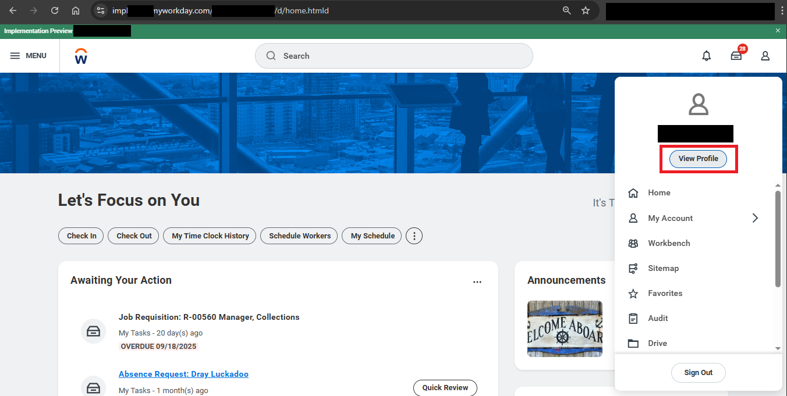
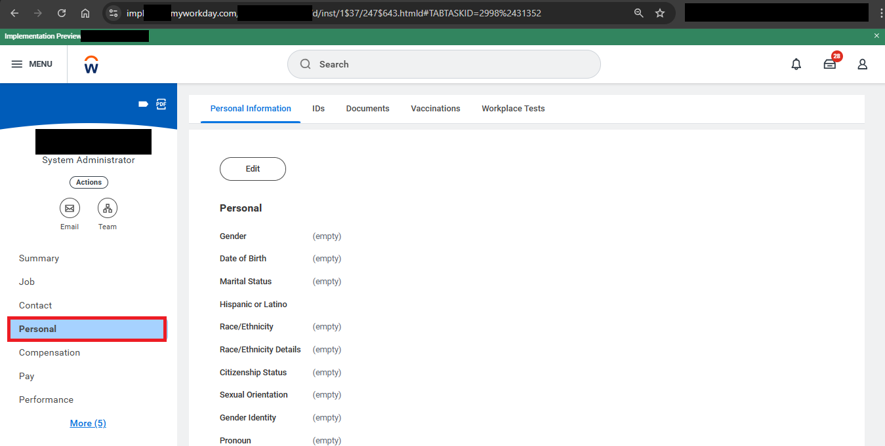
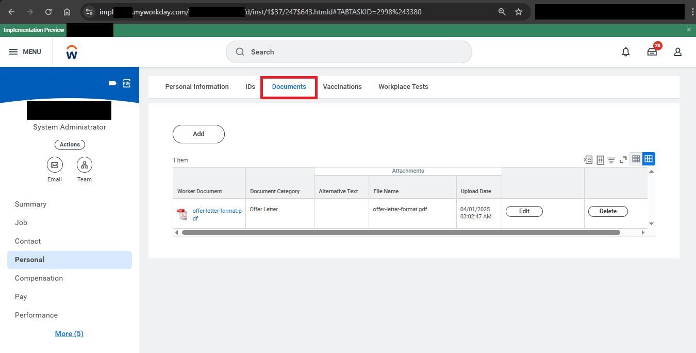
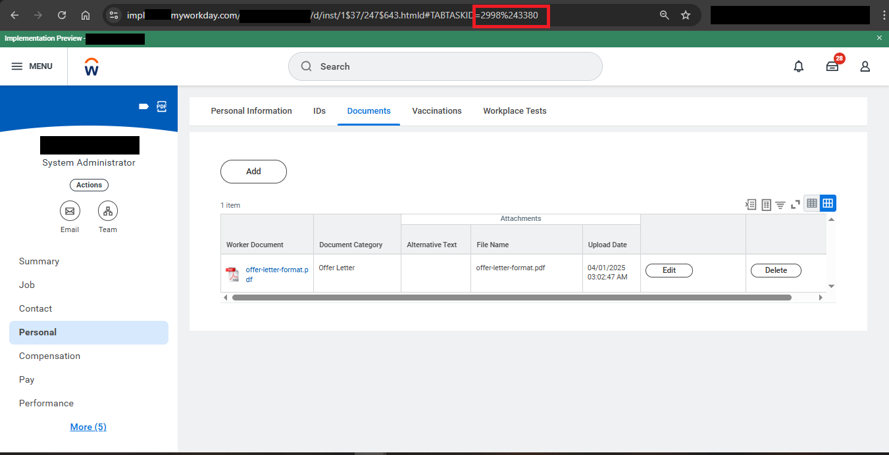
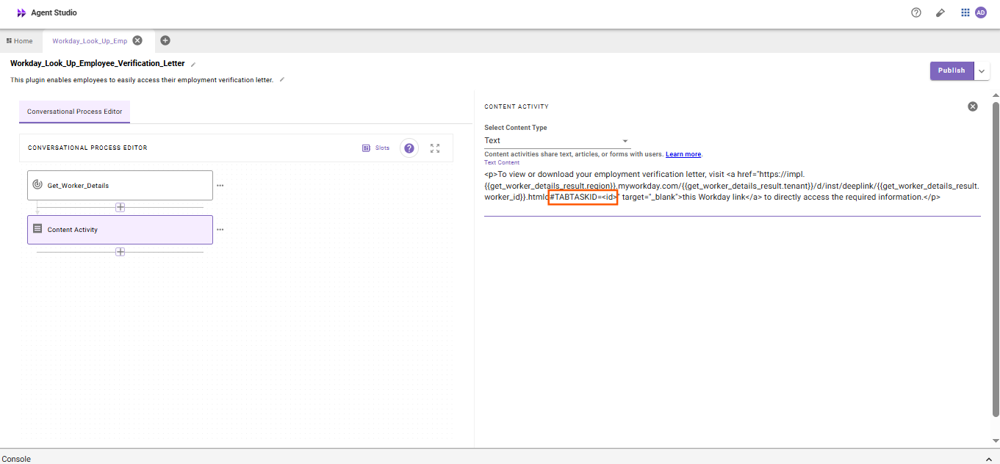

## Introduction

The **“Look Up Employee Verification Letter”** plugin enables employees to instantly access their employment verification letter directly through the Moveworks AI Assistant. It simplifies the process by eliminating the need to navigate multiple HR portals, allowing users to quickly view or download their verification letter in real time.

This guide will walk you through installing and configuring the plugin in **Agent Studio** in just a few minutes. Let’s get started!

## **Prerequisites**

- Access to Agent Studio

## **What are we building?**

### Agent Design

This [purple chat](https://marketplace.moveworks.com/purple-chat?conversation=%7B%22messages%22%3A%5B%7B%22role%22%3A%22user%22%2C%22parts%22%3A%5B%7B%22richText%22%3A%22Look+up+employment+verification+letter%22%7D%5D%7D%2C%7B%22role%22%3A%22assistant%22%2C%22parts%22%3A%5B%7B%22reasoningSteps%22%3A%5B%7B%22status%22%3A%22success%22%2C%22richText%22%3A%22Looking+up+details+for+an+employment+verification+letter+in+%3Cb+xmlns%3D%5C%22http%3A%2F%2Fwww.w3.org%2F1999%2Fxhtml%5C%22%3EWorkday%3C%2Fb%3E.%22%7D%5D%7D%2C%7B%22richText%22%3A%22%3Cp+xmlns%3D%5C%22http%3A%2F%2Fwww.w3.org%2F1999%2Fxhtml%5C%22%3EHere+is+the+link+to+view+or+download+your+latest+Employment+Verification+Letter%3A%3C%2Fp%3E%3Cul+xmlns%3D%5C%22http%3A%2F%2Fwww.w3.org%2F1999%2Fxhtml%5C%22%3E%3Cli%3E%3Cp%3EGo+to+this+%3Ca+rel%3D%5C%22noopener+noreferrer%5C%22+class%3D%5C%22editor-link+c-link%5C%22+href%3D%5C%22https%3A%2F%2Fapp.moveworks.ai%2Fr%3Fv2_employment_verification_letter_example%5C%22%3EView+Employment+Verification+Letter%3C%2Fa%3E+page+in+Workday+to+directly+access+the+required+information.%3C%2Fp%3E%3C%2Fli%3E%3C%2Ful%3E%3Cp+xmlns%3D%5C%22http%3A%2F%2Fwww.w3.org%2F1999%2Fxhtml%5C%22%3EIf+you+need+help+with+anything+else+related+to+employment+documents+or+Workday%2C+let+me+know%21%3C%2Fp%3E%22%7D%2C%7B%22citations%22%3A%5B%7B%22connectorName%22%3A%22workday%22%2C%22citationTitle%22%3A%22Employment+Verification+Letter%22%7D%5D%7D%5D%7D%5D%7D) shows the experience we are going to build.

## Installation Steps

While you can create a connector during plugin installation, we recommend setting up the connector in **Agent Studio** beforehand to streamline the process. Please follow our [**Workday Connector Guide**](https://developer.moveworks.com/marketplace/package/?id=workday&hist=home%2Cbrws#how-to-implement) for detailed instructions. Once completed, proceed to install the plugin and complete the setup efficiently.

For this plugin, ensure the Workday integration system user has the following permissions:

**Required Permissions:**

- **View access** to Worker Profile

**Tenant Configuration:**

All Workday API endpoints in this plugin use **`TENANT`** as a placeholder. After installation, replace **`TENANT`** in the action definitions with your actual Workday tenant name.

To find your tenant name:

- Log into Workday.
- Check the URL in your browser — the tenant name appears after `workday.com/`, e.g.:
    
    `https://impl.workday.com/**your_tenant**/...`
    

Make sure to update this across all actions that reference the Workday API.

**TAB TASK ID Configuration:**

This TAB TASK ID refers to the employee's 'Personal' worklet in which they will be able to see their Employee verification letter.

To ensure that the bot gives the URL that opens the employees' documents tab in Workday, follow the configuration steps below:

- **Click your Profile Icon**
    
    In the top-right corner of your Workday home page, click your **profile photo or initials** to open your profile menu.
    
    
    
- **Select “Personal”**
    
    Under your profile image, click on **Personal** to open your personal information section.
    
    
    
- **Open “Documents”**
    
    Within the Personal section, select **Documents**.
    
    This will display all documents associated with your profile, including your **Employment Verification Letter**.
    
    
    
- **Locate the URL**
    
    When the **Documents** page opens, look at the browser’s address bar.
    
    The link will look similar to this:
    `https://impl.xxx.myworkday.com/<TENANT>/d/inst/X$XX/XX$XX.htmld#TABTASKID=<ID>`
    
    
    
- **Copy the** `ID` , this is the **unique task identifier** that can be used to reference the Worker Documents page for your tenant.
- **In your plugin’s content activity, remove the placeholder `<id>` and replace it with your ID** (towards the end of your deep link).
    
    
    

After configuring the connector and updating your tenant, refer to our [plugin installation documentation](https://help.moveworks.com/docs/ai-agent-marketplace-installation) for more details on completing the setup.

## **Appendix**

### API#1: Get Worker Details by Email

```bash
curl --location 'https://<API_SERVER_DOMAIN>/ccx/api/wql/v1/<TENANT>/data' \
--header 'Authorization: Bearer <ACCESS_TOKEN>' \
--header 'Content-Type: application/json' \
--data '{
  "query": "SELECT workdayID, fullName, businessTitle, email_PrimaryWorkOrPrimaryHome as email, employeeID FROM allWorkers WHERE email_PrimaryWorkOrPrimaryHome = %27{{email}}%27"
}'
```

**Query Parameters:**

- `email` (string) – The email address of the worker used to look up their Workday ID

### API #2: Get Worker Details by Worker ID

```bash
curl --location 'https://<API_SERVER_DOMAIN>/ccx/api/v1/<TENANT>/workers/{{worker_id}}' \
--header 'Authorization: Bearer <ACCESS_TOKEN>' \
--header 'Content-Type: application/json'
```

**Path Parameters:**

- `worker_id` (string) – The Workday Worker ID of the employee whose profile details are being retrieved.