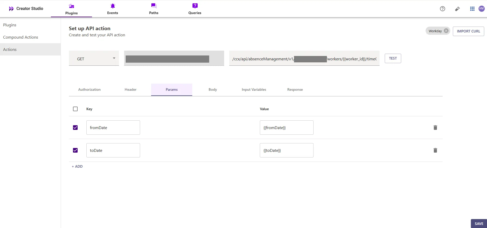
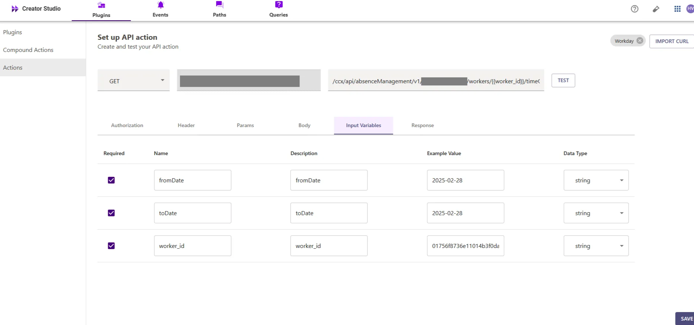
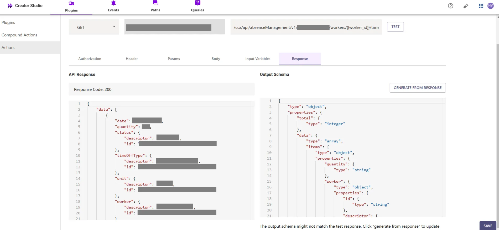
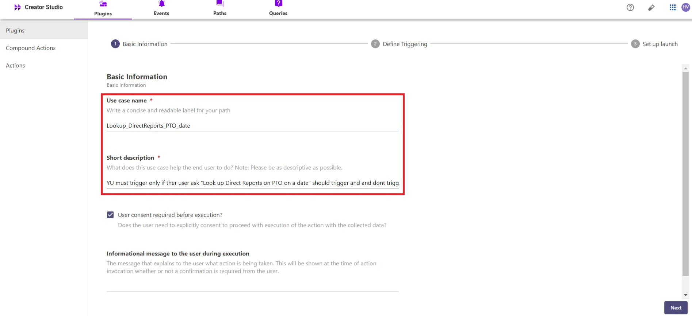

# Introduction:

Workday is an enterprise platform for human resources, and the "**Look up Direct Reports on PTO on a Specific Date**" feature allows you to quickly check which team members are on PTO on a given date. Integrating this feature with your bot helps streamline team management, ensuring you have accurate visibility into your team's availability, ultimately improving productivity.

This guide will show you how to add the "**Look up Direct Reports on PTO on a Specific Date**" feature to your bot using Creator Studio. Let’s get started!

# **Prerequisites:**

- Workday Connector built in Creator Studio (follow the [Workday Authentication](https://developer.moveworks.com/creator-studio/resources/connector/?id=workday) guide to create your connector)

# **What are we building?**

### **Conversation Design**

This [purple chat](https://developer.moveworks.com/creator-studio/developer-tools/purple-chat?conversation=%7B%22startTimestamp%22%3A%2211%3A43+AM%22%2C%22messages%22%3A%5B%7B%22parts%22%3A%5B%7B%22richText%22%3A%22Can+you+tell+me+which+of+our+team+members+are+on+PTO+today%3F%22%7D%5D%2C%22role%22%3A%22user%22%7D%2C%7B%22parts%22%3A%5B%7B%22reasoningSteps%22%3A%5B%7B%22richText%22%3A%22%3Cp%3E%E2%9C%85+Working+on+%3Cb%3ETeam+Members+PTO+Today%3C%2Fb%3E%3Cbr%3E%E2%8F%B3+Calling+Plugin+%3Cb%3ELookup+Team+On+PTO%3C%2Fb%3E%3C%2Fp%3E%22%2C%22status%22%3A%22success%22%7D%5D%7D%2C%7B%22richText%22%3A%22Today%2C+the+following+team+members+are+on+PTO%3A+%3Cbr%3E1.+Emily+Clark+%3Cbr%3E2.+Jordan+Smith+%3Cbr%3E3.+Alex+Lee%3Cbr%3ELet+me+know+if+there%27s+anything+else+I+can+help+with%21%22%7D%2C%7B%22citations%22%3A%5B%7B%22citationTitle%22%3A%22Workday%22%2C%22connectorName%22%3A%22workday%22%7D%5D%7D%5D%2C%22role%22%3A%22assistant%22%7D%5D%7D) shows the experience we are going to build.

# **Creator Studio Components**

- **Triggers:**
    1. Natural Language
- **Slots:**
    1. **Full name:** Capture the name of the worker to search for their direct reports and PTO details.
    2. **From Date:** Capture the start date for retrieving PTO details.
    3. **To Date:** Capture the end date for retrieving PTO details.
- **Actions:**
    1. **Search Worker by Name:** Use the worker's name to retrieve their unique worker ID.
    2. **Retrieve Direct Reports:** Retrieve the direct reports of the worker using the worker ID.
    3. **Retrieve PTO Details for Direct Reports:** Retrieve the PTO details for each direct report within the specified date range using the worker IDs of the direct reports.
- **Guidelines:**
    1. None

# **API Research**

To build this use case, we will use **three APIs** to achieve the goal of looking up direct reports' PTO details in Workday


## API #1: Search Worker by Name

The [**Search Worker by Name**](https://community.workday.com/sites/default/files/file-hosting/restapi/#common/v1/get-/workers/-ID-) API retrieves worker details based on a given worker's name from Workday. This API helps in identifying individual workers by their name, enabling a lookup of worker details based on the provided search term

- **Purpose**: Fetches worker details based on the worker's name.
- **Features**: Supports searching for workers by their name and returns relevant worker information.
- **Example**: Queries Workday to retrieve worker details based on the name provided using the following CURL request.

```bash
curl --location 'https://<YOUR_DOMAIN>/api/v1/<INSTANCE_ID>/workers?search=<WORKER_NAME>' \
--header 'Content-Type: application/json' \
--header 'Authorization: Bearer <ACCESS_TOKEN>'

```

- **<YOUR_DOMAIN>**: Your Workday instance domain (e.g., `yourcompany.myworkday.com`).
- **<INSTANCE_ID>, <WORKER_NAME>, <ACCESS_TOKEN>**: The Workday instance ID, name, and for your search request

## API #2: **Retrieve Direct Reports** by Worker ID

The [**Retrieve Direct Reports**](https://community.workday.com/sites/default/files/file-hosting/restapi/index.html#common/v1/get-/workers/-ID-/directReports) **API** allows you to retrieve the workers who directly report to a specific **Worker ID**. Using the provided W**orker ID**, this API fetches the list of team members under that worker.

- **Purpose**: Retrieves team members based on the **Worker ID**.
- **Features**: Fetches the direct reports of the worker, returning a list of their team members.
- **Example**: Queries to retrieve the team members under a given **Worker ID**.

```bash
curl --location 'https://<YOUR_DOMAIN>/api/v1/<INSTANCE_ID>/workers/<WORKER_ID>/directReports' \
--header 'Content-Type: application/json' \
--header 'Authorization: Bearer <ACCESS_TOKEN>'

```

- **<YOUR_DOMAIN>**: Your Workday instance domain (e.g., `yourcompany.myworkday.com`).
- **<WORKDAY_INSTANCE_ID>**, **<WORKER_ID>**: The Workday instance ID and the worker's ID.

## API #3: **Retrieve PTO Details** for Direct Reports

The [**Retrieve PTO Details**](https://community.workday.com/sites/default/files/file-hosting/restapi/index.html#absenceManagement-v1-get-workers-ID-timeOffDetails#absenceManagement/v1/get-/workers/-ID-/timeOffDetails) **API** allows you to retrieve the Paid Time Off (PTO) details for each direct report within a specified date range. Using the provided **Worker ID** and the date range (**fromDate** and **toDate**), this API fetches the PTO details of direct reports.

- **Purpose**: Retrieves PTO details for direct reports within a given date range based on the **Worker ID**.
- **Features**: Fetches the PTO information, including the date, time off type, status, and quantity, for each direct report.
- **Example**: Queries to retrieve the PTO details for direct reports under a given **Worker ID** within a specific date range.

```bash
curl --location 'https://<YOUR_DOMAIN>/api/v1/<INSTANCE_ID>/workers/<WORKER_ID>/timeOffDetails?fromDate=<FROM_DATE>&toDate=<TO_DATE>' \
--header 'Content-Type: application/json' \
--header 'Authorization: Bearer <ACCESS_TOKEN>'

```

- **<YOUR_DOMAIN>**: Your Workday instance domain (e.g., `yourcompany.myworkday.com`).
- **<INSTANCE_ID>, <WORKER_ID>**: The Workday instance ID and the worker's ID.
- **<FROM_DATE>, <TO_DATE>**: The start and end date of the range for which PTO details are to be retrieved.

# **Steps**

## **Step 1: Build HTTP Action**

Define your HTTP Actions for fetching **Direct Reports' PTO Information** from Workday based on the provided **worker Name** and the date range.

### 1. **In Creator Studio, Create a New Action**:

- Navigate to **Plugins** section > **Actions** tab.
- Click on **CREATE** to define a new action.


- Click on the `IMPORT CURL` option and paste the following cURL command:

```bash
curl --location 'https://<YOUR_DOMAIN>/api/v1/<INSTANCE_ID>/workers?search=<WORKER_NAME>' \
--header 'Content-Type: application/json' \
--header 'Authorization: Bearer <ACCESS_TOKEN>'

```

- Click on `Use Existing Connector` > select the   [Workday Connector](https://developer.moveworks.com/creator-studio/resources/connector/?id=workday) that you just created > Click on `Apply`. This will automatically populate the Base URL and the Authorization section of the API Editor.
- **Query Parameters for Retrieving Worker Details**
- **Key (q)**: Value (`<WORKER_NAME>`)
- This query retrieves worker details based on the worker's name, ensuring the response includes the relevant worker information.


**Input Variables** :

- Full_Name: Example Value (Alex).


- Click on `Test` to check if the Connector setup was successful and expect a successful response as shown below. You will see the request response on the left side and the generated output schema on the right.
- If the output schema does not match the API response or fails to populate automatically, kindly click the `GENERATE FROM RESPONSE` button to refresh and align the schema with the API response


- Add the **API Name** and **API Description** as shown below, then click the `Save` button


### **2.** Retrieve Team Members by Worker ID

- Repeat the steps above to create another action.
- Click on the `IMPORT CURL` option and paste the following cURL command:

```bash
curl --location 'https://<YOUR_DOMAIN>/api/v1/<INSTANCE_ID>/workers/<Worker_ID>/directReports' \
--header 'Content-Type: application/json' \
--header 'Authorization: Bearer <ACCESS_TOKEN>'

```

- Click on `Use Existing Connector` > select the [**Workday** **Connector**](https://developer.moveworks.com/creator-studio/resources/connector/?id=workday) that you just created > Click on `Apply`. This will automatically populate the Base URL and the Authorization section of the API Editor.
- This query retrieves the direct reports (team members) for the specified worker ID. By using the `directReports` endpoint, it fetches the workers who report directly to the specified worker.


- Click on `Test` to check if the Connector setup was successful and expect a successful response as shown below. You will see the request response on the left side and the generated output schema on the right.
- If the output schema does not match the API response or fails to populate automatically, kindly click the `GENERATE FROM RESPONSE` button to refresh and align the schema with the API response.


- Add the **API Name** and **API Description** as shown below, then click the `Save` button


### **3. Retrieve PTO Details** for Direct Reports

- Repeat the steps above to create another action.
- Click on the `IMPORT CURL` option and paste the following cURL command:

```bash
curl --location 'https://<YOUR_DOMAIN>/api/v1/<INSTANCE_ID>/workers/<WORKER_ID>/timeOffDetails?fromDate=<FROM_DATE>&toDate=<TO_DATE>' \
--header 'Content-Type: application/json' \
--header 'Authorization: Bearer <ACCESS_TOKEN>'

```

- Click on `Use Existing Connector` > select the [**Workday Connector**](https://developer.moveworks.com/creator-studio/resources/connector/?id=workday) that you just created > Click on `Apply`. This will automatically populate the Base URL and the Authorization section of the API Editor.
- **Query Parameters for Retrieving PTO Details**
    - **worker**: `<WORKER_ID>`
    - **fromDate**: `<FROM_DATE>`
    - **toDate**: `<TO_DATE>`
- This query retrieves the PTO details for the specified worker ID within the given date range, ensuring the response includes the worker's time-off information.



**Input Variables**:

- **Worker_Id**: Example Value (`gafgy1346afgh`)
- **From_Date**: Example Value (`2025-03-01`)
- **To_Date**: Example Value (`2025-03-10`)



- Click on `Test` to check if the Connector setup was successful and expect a successful response as shown below. You will see the request response on the left side and the generated output schema on the right.
- If the output schema does not match the API response or fails to populate automatically, kindly click the `GENERATE FROM RESPONSE` button to refresh and align the schema with the API response.



- Add the **API Name** and **API Description** as shown below, then click the `Save` button


## **Step 2: Build Compound Action**

- Head over to the **Compound Actions** tab and click **CREATE**


- Give your Compound Action a **Name** and **Description** , then click `Next` Note: Name only letters, numbers, and underscores. We suggest using snake case or camel case formatting (e.g. Workflow_name or workflowName )


- Click on the `Script editor` tab. Here you will be able to build your compound action using the YAML syntax.
- At a high-level, this syntax provides actions (HTTP Request, APIthon Scripts) and workflow logic (switch statements, for each loops, return statements, parallel, try/catch). See the [Compound Action Syntax](https://developer.moveworks.com/creator-studio/reference/compound_actions_syntax/) Reference for more info.

```yaml
steps:
  - action:
      output_key: Get_Worker_ID_result
      action_name: Get_Worker_ID
      progress_updates:
        on_complete: ON_COMPLETE_MESSAGE
        on_pending: ON_PENDING_MESSAGE
      input_args:
        full_name: meta_info.user.full_name
  - switch:
      cases:
        - steps:
            - action:
                output_key: Get_Worker_DirectReports_result
                action_name: Get_Worker_DirectReports
                progress_updates:
                  on_complete: ON_COMPLETE_MESSAGE
                  on_pending: ON_PENDING_MESSAGE
                input_args:
                  worker_id: data.Get_Worker_ID_result.data[0].id
            - for:
                each: direct_report
                steps:
                  - action:
                      action_name: GET_WORKER_PTO
                      input_args:
                        worker_id: direct_report.id
                        toDate: data.toDate
                        fromDate: data.fromDate
                      output_key: direct_report_pto_result
                index: direct_report_index
                in: data.Get_Worker_DirectReports_result.data
                output_key: GET_WORKER_PTO_result_list
            - return:
                output_mapper:
                  Team_PTO_Records: data.GET_WORKER_PTO_result_list
          condition: data.Get_Worker_ID_result.total > 0 and
            data.Get_Worker_ID_result.data != null
        - steps:
            - return:
                output_mapper:
                  No_Records_Message:
                    expression: "'No direct report PTO records found within the specified date
                      range.'"
          condition: "true"
      default:
        steps: []

```

- Click on `Input fields` tab and click the `+Add` button. Here you will define the slots that you want to collect from users through the conversation and trigger your Workflow with. After defining the input fields, click the `Submit` button to save your changes.


## **Step 3: Publish Workflow to Plugin**

- Head over to the `Compound Actions` tab and click on the kebab menu ( `︙` )
- Next, click on `Publish Workflow to Plugin`
- First, verify your Plugin **Name** & **Short description** . This is autofilled from the name & description of your compound action.



- Next, consider whether to select the `User consent required before execution?` checkbox. Enabling this option prompts the user to confirm all slot values before executing the plugin, which is widely regarded as a best practice.


- Click `Next` and set up your positive and negative triggering examples. This ensures that the bot triggers your plugin given a relevant utterance.
- See our [guide](https://developer.moveworks.com/creator-studio/conversation-design/triggers/natural-language-triggers/#how-to-write-good-triggering-examples) on Triggering
- Lastly, click `Next` and set the **Launch Rules** you want your plugin to abide by.
    - See our [guide](https://developer.moveworks.com/creator-studio/administration/launch-options/) on Launch Rules

## **Step 4: See it in action!**

- After clicking the final `Submit` button, your plugin will be published to the bot and triggerable based on your **Launch Rules.**
- You should wait up to **5 minutes** after making changes before trying to test in your bot!
    - If you run into an issue:
        1. Check our [troubleshooting guides](https://developer.moveworks.com/creator-studio/troubleshooting/support/)
        2. Understand your issue using Logs
        3. Reach out to Support

# **Congratulations!**

You've added the "Lookup Direct Reports on PTO for a Specific Date" feature to your Workday Copilot! Explore our other guides for more inspiration on what to build next.