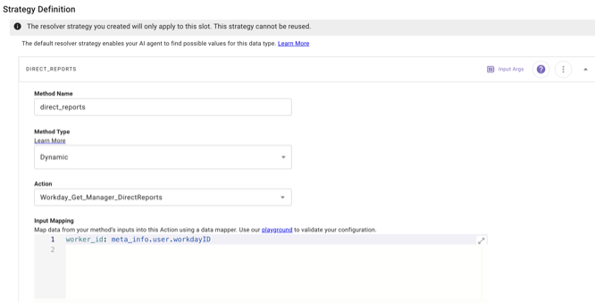

# **Description**

The “**Submit PTO Request**” plugin lets employees including managers with "on-behalf-of" submission permissions easily request, validate, and track Paid Time Off (PTO) directly in Workday using the Moveworks AI Assistant, eliminating HR portal hopping and making time‑off management fast and effortless.

# **User Experience Preview**

Please refer to the following [**Purple Chat**](https://marketplace.moveworks.com/purple-chat?conversation=%7B%22messages%22%3A%5B%7B%22role%22%3A%22user%22%2C%22parts%22%3A%5B%7B%22richText%22%3A%22I%27d+like+to+apply+for+some+leave.%22%7D%5D%7D%2C%7B%22role%22%3A%22assistant%22%2C%22parts%22%3A%5B%7B%22reasoningSteps%22%3A%5B%7B%22status%22%3A%22success%22%2C%22richText%22%3A%22Retrieving+available+leave+types+from+%3Cb%3EWorkday%3C%2Fb%3E...%22%2C%22connectorName%22%3A%22workday%22%7D%5D%7D%2C%7B%22richText%22%3A%22I+can+help+you+with+that.+What+type+of+leave+would+you+like+to+take%3F+Common+types+include%3A%5Cn%3Cul%3E%5Cn++%3Cli%3EVacation%3C%2Fli%3E%5Cn++%3Cli%3ESick+Leave%3C%2Fli%3E%5Cn++%3Cli%3EPersonal+Time%3C%2Fli%3E%5Cn%3C%2Ful%3E%5Cn%3Cp%3EPlease+also+let+me+know+the+%3Cb%3Edates%3C%2Fb%3E+and+if+these+will+be+%3Cb%3Efull+days%3C%2Fb%3E+or+%3Cb%3Epartial+days%3C%2Fb%3E.%3C%2Fp%3E%22%7D%5D%7D%2C%7B%22role%22%3A%22user%22%2C%22parts%22%3A%5B%7B%22richText%22%3A%22I%27ll+take+Vacation+from+October+10th+to+12th.+All+full+days.+My+comment+is+%27Taking+a+long+weekend%27.%22%7D%5D%7D%2C%7B%22role%22%3A%22assistant%22%2C%22parts%22%3A%5B%7B%22reasoningSteps%22%3A%5B%7B%22status%22%3A%22success%22%2C%22richText%22%3A%22Validating+leave+balance+and+drafting+request...%22%2C%22connectorName%22%3A%22workday%22%7D%5D%7D%2C%7B%22richText%22%3A%22%3Cp%3EOkay%2C+I%27ve+prepared+your+%3Cb%3EWorkday%3C%2Fb%3E+request%3A%3C%2Fp%3E%5Cn%3Cul%3E%5Cn++%3Cli%3E%3Cb%3EType%3A%3C%2Fb%3E+Vacation%3C%2Fli%3E%5Cn++%3Cli%3E%3Cb%3EDates%3A%3C%2Fb%3E+Oct+10%2C+2024+-+Oct+12%2C+2024%3C%2Fli%3E%5Cn++%3Cli%3E%3Cb%3EDuration%3A%3C%2Fb%3E+3+Full+Days%3C%2Fli%3E%5Cn++%3Cli%3E%3Cb%3EComment%3A%3C%2Fb%3E+Taking+a+long+weekend%3C%2Fli%3E%5Cn%3C%2Ful%3E%5Cn%3Cp%3EDoes+this+look+right%3F%3C%2Fp%3E%22%7D%2C%7B%22buttons%22%3A%5B%7B%22buttonText%22%3A%22Submit%22%2C%22style%22%3A%22filled%22%7D%2C%7B%22buttonText%22%3A%22Edit+Details%22%2C%22style%22%3A%22outlined%22%7D%2C%7B%22buttonText%22%3A%22Cancel%22%2C%22style%22%3A%22outlined%22%7D%5D%7D%5D%7D%2C%7B%22role%22%3A%22user%22%2C%22parts%22%3A%5B%7B%22richText%22%3A%22Submit+that.+Also%2C+I+need+to+log+1+day+of+sick+leave+for+yesterday+%28Sept+24%29+and+book+annual+leave+for+Nov+20-22.%22%7D%5D%7D%2C%7B%22role%22%3A%22assistant%22%2C%22parts%22%3A%5B%7B%22reasoningSteps%22%3A%5B%7B%22status%22%3A%22success%22%2C%22richText%22%3A%22Submitting+previous+request+and+drafting+new+ones...%22%2C%22connectorName%22%3A%22workday%22%7D%5D%7D%2C%7B%22richText%22%3A%22%3Cp%3ESubmitted%21+I+have+now+drafted+two+additional+requests+for+you%3A%3C%2Fp%3E%5Cn%3Cp%3E%3Cb%3ERequest+1%3C%2Fb%3E%3C%2Fp%3E%5Cn%3Cul%3E%5Cn++%3Cli%3E%3Cb%3EType%3A%3C%2Fb%3E+Sick+Leave%3C%2Fli%3E%5Cn++%3Cli%3E%3Cb%3EDate%3A%3C%2Fb%3E+Sept+24%2C+2024+%281+day%29%3C%2Fli%3E%5Cn%3C%2Ful%3E%5Cn%3Cp%3E%3Cb%3ERequest+2%3C%2Fb%3E%3C%2Fp%3E%5Cn%3Cul%3E%5Cn++%3Cli%3E%3Cb%3EType%3A%3C%2Fb%3E+Vacation+%28Annual+Leave%29%3C%2Fli%3E%5Cn++%3Cli%3E%3Cb%3EDates%3A%3C%2Fb%3E+Nov+20%2C+2024+-+Nov+22%2C+2024+%283+days%29%3C%2Fli%3E%5Cn%3C%2Ful%3E%5Cn%3Cp%3EWould+you+like+me+to+submit+both+of+these%3F%3C%2Fp%3E%22%7D%2C%7B%22citations%22%3A%5B%7B%22connectorName%22%3A%22workday%22%2C%22citationTitle%22%3A%22Time+Off+Request%3A+Oct+10-12%22%7D%5D%7D%2C%7B%22buttons%22%3A%5B%7B%22buttonText%22%3A%22Submit+Both%22%2C%22style%22%3A%22filled%22%7D%2C%7B%22buttonText%22%3A%22Cancel%22%2C%22style%22%3A%22outlined%22%7D%5D%7D%5D%7D%2C%7B%22role%22%3A%22user%22%2C%22parts%22%3A%5B%7B%22richText%22%3A%22Submit+both.+Actually%2C+can+you+also+put+in+a+vacation+request+for+my+report%2C+Sarah+Miller%3F+She%27s+out+Dec+1st.%22%7D%5D%7D%2C%7B%22role%22%3A%22assistant%22%2C%22parts%22%3A%5B%7B%22reasoningSteps%22%3A%5B%7B%22status%22%3A%22success%22%2C%22richText%22%3A%22Finding+direct+report+%3Cb%3ESarah+Miller%3C%2Fb%3E+and+checking+her+calendar...%22%2C%22connectorName%22%3A%22workday%22%7D%5D%7D%2C%7B%22richText%22%3A%22%3Cp%3EI%27ve+submitted+your+requests+and+prepared+a+new+one+for+your+direct+report.%3C%2Fp%3E%5Cn%3Cp%3E%3Cb%3ERequest+for+Sarah+Miller%3C%2Fb%3E%3C%2Fp%3E%5Cn%3Cul%3E%5Cn++%3Cli%3E%3Cb%3EType%3A%3C%2Fb%3E+Vacation%3C%2Fli%3E%5Cn++%3Cli%3E%3Cb%3EDate%3A%3C%2Fb%3E+Dec+1%2C+2024+%28Full+Day%29%3C%2Fli%3E%5Cn%3C%2Ful%3E%5Cn%3Cp%3EReady+to+submit+this+for+her%3F%3C%2Fp%3E%22%7D%2C%7B%22citations%22%3A%5B%7B%22connectorName%22%3A%22workday%22%2C%22citationTitle%22%3A%22Sarah+Miller%22%7D%5D%7D%2C%7B%22buttons%22%3A%5B%7B%22buttonText%22%3A%22Submit+for+Sarah%22%2C%22style%22%3A%22filled%22%7D%2C%7B%22buttonText%22%3A%22Cancel%22%2C%22style%22%3A%22outlined%22%7D%5D%7D%5D%7D%5D%7D) for a sample conversational experience between a user and the AI Assistant for this plugin.

# **Pre-requisites**

Before installing and using the **Submit PTO Request** plugin, please ensure the following requirements are met:

## **1. Workday Connector**

This plugin requires an active Workday connector using **OAuth 2.0 with Authorization Code Grant Type (User Consent Auth)** to communicate with your Workday instance. All API calls in this plugin — including WQL queries, REST lookups, and the SOAP PTO submission — execute under the authenticated **employee's or manager's own Workday identity**. No Integration System User (ISU) is required.

- If you have not already configured the connector, please follow the [Workday Connector Guide](https://marketplace.moveworks.com/connectors/workday#oauth-2-0-with-authorization-code-user-consent-auth-setup) available in the Moveworks Marketplace.
- The connector must be fully set up before installing this plugin.
- Once the connector is successfully configured, follow our [plugin installation documentation](https://help.moveworks.com/docs/ai-agent-marketplace-installation) for detailed steps on how to install and activate the plugin in Agent Studio.

## **2. Workday System Requirements**

The following configuration must be completed by a **Workday Administrator** before this plugin can function correctly. These are Workday-side requirements that govern what the authenticated employee or manager is permitted to do via API.

> **Note:** The plugin does not grant new permissions. It respects existing role-based permissions and policies already granted to the user in Workday.

### **a. OAuth 2.0 API Client — Functional Area Scopes**

The OAuth 2.0 (Authorization Code Grant) API Client registered in Workday must include the following **Functional Area Scopes**. These are required to look up worker details, retrieve eligible leave types, and submit PTO requests via WQL, REST, and SOAP APIs:

- **Staffing**
- **Time Off and Leave**
- **System**
- **Tenant Non-Configurable**
- **Public Data**
- **Worktags**
- **Organizations and Roles** *(required for fetching direct report lists)*

To verify: Search **"Register API Client for Integrations"** in Workday → locate the API Client used by the Moveworks connector → confirm all of the above are listed under **Scope (Functional Areas)**.

### **b. Domain Security — WQL for Workday Extend**

This plugin uses WQL to look up worker details by email. For employees and managers authenticating via OAuth (User Consent Auth) to run WQL queries through the API, the following access is required:

- **WQL for Workday Extend** domain → under **Integration Permissions**: **Employee As Self** and **Manager** must each have **Get** and **Put** access.

To configure:
1. Search **"Edit Domain Security Policy"** in Workday
2. Search **"WQL for Workday Extend"**
3. Under **Integration Permissions**, add **Employee As Self** (Get + Put) and **Manager** (Get + Put)
4. Save

> **Note:** By default, only ISU/ISSG groups have integration access to this domain. If these security groups are not listed, OAuth-authenticated users will receive 403 errors or empty results on WQL queries.

### **c. Domain Security — Worker Data: Public Worker Reports**

This domain controls access to base worker data (name, email, Workday ID) used to resolve the authenticated user or their direct reports in WQL.

- **Worker Data: Public Worker Reports** domain → **All Employees** must have **Report/Task View** access.

To verify: Search **"Domain Security Policy Summary"** in Workday → search **"Worker Data: Public Worker Reports"** → confirm **All Employees** has **Report/Task View** access.

> **Note:** If this permission is missing, WQL queries return zero rows with no error — requests appear to succeed but no worker data is returned.

### **d. Domain Security — Worker Data: Time Off**

This domain controls access to time off plan data and eligibility — required for the plugin to retrieve available leave types and validate balances before submission.

- **Worker Data: Time Off** domain → under **Integration Permissions**:
  - **Employee As Self** must have **Get** access *(for viewing own leave types and balance)*
  - **Manager** must have **Get** access *(for viewing direct report data when submitting on behalf of another employee)*

To verify: Search **"Domain Security Policy Summary"** in Workday → search **"Worker Data: Time Off"** → confirm the above groups and access levels under Integration Permissions.

### **e. Business Process Security Policy — Request Time Off**

For PTO submissions to succeed through the SOAP API (API #4), the "Request Time Off" business process must be configured to permit both employee self-service and manager on-behalf-of submissions.

Search **"View Business Process Security Policy"** in Workday → select **"Request Time Off"** under **Time Off and Leave**, then verify the following:

**Section: "Who Can Start the Business Process"**

Look for these initiation actions and confirm the security groups listed under each:

- **"Enter Time Off (Web Service)"** → **Employee As Self** must be listed.
  This is the initiation path used by the SOAP API when an employee submits their own PTO. If missing, API submissions fail for employees.
- **"Request Time Off for a Worker"** → **Management Chain** (or **Manager**) must be listed.
  This allows a manager to submit PTO on behalf of a direct report. Expand "More" if the full list is collapsed.
- **"Request Time Off for Self"** → **Employee As Self** should be listed.
  This covers the self-service submission path.

**Section: "Who Can Do Action Steps in the Business Process"**

- **Action Step: "Review Time Off Request"** → **Manager** and/or **Management Chain** must be listed under Security Groups.
  This is the approval routing step. Without it, submitted PTO requests will not route to the manager for approval. Expand "More" to see the full list.

### **f. Activate Pending Security Policy Changes**

After making any changes to Domain Security Policies or Business Process Security Policies in Workday:

- Search **"Activate Pending Security Policy Changes"** in Workday and run it.

> **Important:** Security changes in Workday do **not** take effect until this step is completed. This is the most common reason for "I changed the permission but it still doesn't work."

## **3. Workday User Identity Ingestion**

This plugin requires User Identity Ingestion from Workday in Moveworks. For Moveworks to complete actions across systems on behalf of a user, it needs to have knowledge of all system IDs for the given user. Setup information for User Identity can be found on [https://help.moveworks.com/docs/user-identity](https://help.moveworks.com/docs/user-identity).

The following attribute is required from this user ingestion:

1. Workday ID of the user

This attribute is utilized in the input mapping of the target_report_id slot's resolver strategy as shown below. Depending on your ingestion configuration, you might need to change this to point to the user's workday_id.



# **Implementation details**

## **Visual Representation of How the Plugin Works**


## **API Details**

To use the curl examples below be sure to update details for tenantUrl and tenantName. 

**You must update the TENANT placeholder in the API Actions imported during installation.**

As a Workday administrator, obtain these details as follows:

1. Log in to Workday
2. In the search bar, search for **Public Web Services**
3. Open it
4. Select **Actions → Web Services → View WSDL**
5. In the WSDL file, locate:
    
    ```
    soap:address location="https://<hostname>/ccx/service/<tenant>/..."
    ```
    

The <hostname> (tenantUrl) and <tenant> (tenantName) in this URL are your **true tenant URL components**.

### **API #1 : Fetch List of Direct Reports**

This REST API retrieves the list of a worker’s direct reports using the Workday Worker ID. This API is invoked only when the user is attempting to create a PTO request on behalf of another employee. The selected direct report’s Workday ID is then used to fetch the eligible PTO options.

```bash
curl -X GET"https://<tenantUrl>/api/v1/{tenantName}/workers/{worker_id}/directReports"\  -H"Content-Type: application/json"\
```

**Query Parameters**

- `WORKER_ID` *(string):* Workday Worker Id of either the logged-in user (Manager)

### **API #2: Lookup Workday ID by Email**

Retrieves the Workday details for a worker using an email address. This REST API is used when the user is submitting a PTO request for self, as the user’s Workday ID is required to fetch and present the eligible PTOs available for selection.

```bash
curl -X GET "https://<tenantUrl>/ccx/api/wql/v1/{tenantName}/data"\  -H"Content-Type: application/json"\  -d'{  "query": "SELECT workdayID, fullName, businessTitle, email_PrimaryWork as email, employeeID, supervisoryOrganization FROM allWorkers WHERE email_PrimaryWork = '{{email}}'"}'
```

---

**Query Parameters:**

- `email` *(string):* email address of the logged in user.

### **API #3: Fetch Eligible PTO Types**

This REST API retrieves the list of eligible PTO types for a worker using the worker’s Workday Worker ID. Since PTO eligibility varies by worker, this API is used to return the eligible PTO types for either the logged-in user (self request) or a selected direct report (on‑behalf‑of request). The PTO type selected from the returned list is then used in the final PTO submission.

```bash
curl -X GET"https://<tenantURL>/api/absenceManagement/v3/<tenantName>/workers/{{worker_id}}/eligibleAbsenceTypes?category=17bd6531c90c100016d4b06f2b8a07ce"\  -H"Content-Type: application/json"
```

---

**Query Parameters:**

- `WORKER_ID` *(string):* Workday Id of either the logged-in user (self request) or a selected direct report (on‑behalf‑of request)
- `category` *(string):* Workday GUID for Time Off event category which is static as per Workday documentation this case is : 17bd6531c90c100016d4b06f2b8a07ce.

### **API #4: Submit PTO**

Executes the final submission of a PTO request through a Workday SOAP API. It is called once the user or direct report is selected, PTO dates and per‑day quantities are confirmed, and any additional comments are provided by the user.

```bash
curl -X POST "https://<tenantUrl>/ccx/service/<tenantName>/Absence_Management/v45.1" \
  -H "Content-Type: text/xml" \
  -d "<soapenv:Envelope
    xmlns:soapenv='http://schemas.xmlsoap.org/soap/envelope/'
    xmlns:xsd='http://www.w3.org/2001/XMLSchema'>
    <soapenv:Body>
        <bsvc:Enter_Time_Off_Request xmlns:bsvc="urn:com.workday/bsvc" bsvc:version="v42.0">
            <bsvc:Business_Process_Parameters>
                <bsvc:Auto_Complete>false</bsvc:Auto_Complete>  
            </bsvc:Business_Process_Parameters>
            <bsvc:Enter_Time_Off_Data>
                <bsvc:Worker_Reference bsvc:Descriptor="string">
                    <bsvc:ID bsvc:type="WID">{{worker_id}}</bsvc:ID>
                </bsvc:Worker_Reference>
                {{{generated_xml_content}}}
            </bsvc:Enter_Time_Off_Data>
        </bsvc:Enter_Time_Off_Request>
    </soapenv:Body>
</soapenv:Envelope>"
```

---

**Query Parameters:**

- `WORKER_ID` *(string):* Workday Id of either the logged-in user (self request) or a selected direct report (on‑behalf‑of request)
- `{{{generated_xml_content}}}` (string): This is the xml payload that will be sent to Workday for every day of the leave that user is submitting. It is generated by script action used in the plugin.

Example format of xml:

```
<bsvc:Enter_Time_Off_Entry_Data>
        <bsvc:Date>{current_date}</bsvc:Date>
        <bsvc:Requested>{quantity}</bsvc:Requested>
        <bsvc:Time_Off_Reference bsvc:Descriptor="string">
            <bsvc:ID bsvc:type="WID">{pto_type_id}</bsvc:ID>
        </bsvc:Time_Off_Reference>
        <bsvc:Comment>{comment}</bsvc:Comment>
    </bsvc:Enter_Time_Off_Entry_Data>
```

- `current_date` *(string):* the date for which user wants to submit the PTO request.
- `quantity` *(string):* duration of the PTO. example: for leave type unit as hours (value can be 2,4,6,8) but for leave type unit as days (value can be 0.25,0.5,1).
- `pto_type_id` *(string):* this is the workday ID of the leave type that user is submitting the PTO for. collected from API#3.
- `comment` *(string):* any comments that user will need to enter while submitting the PTO.

### **API References**

This plugin uses a combination of **Workday APIs** and **Time Management REST APIs** to retrieve employee information, determine eligible PTO time types, and submit PTO requests.

For detailed information on request parameters, response formats, error handling, and versioning, please refer to the **official Workday API documentation** provided by Workday:

https://community.workday.com/sites/default/files/file-hosting/restapi/

https://community.workday.com/sites/default/files/file-hosting/productionapi/index.html

# **What Is In Scope for This Plugin?**

This plugin supports the following capabilities:

- Submit PTO requests for **limited leave types** (e.g., Vacation, Sick Leave, Casual Leave, Earned Leave, Comp Time).
- Request PTO for **past, current, or future dates**, including unplanned absences.
- Specify PTO using **natural language date expressions**, such as:
    - A specific date or date range
    - Days of the week or weeks within a month
    - Number of days within a given period
- Submit **multiple PTO requests** in a single interaction, as long as all requests are for limited leave types.
- Adding **comments or notes** to a PTO request.
- Submitting **partial-day or hourly PTO requests** (e.g., half-day, first half/second half, or specific hours).
- Submitting PTO requests **on behalf of another employee**, who directly report to the user.
- Submit PTO requests that respect **existing Workday policies, validations, and approval workflows**.

# **What Is Out of Scope for This Plugin?**

This plugin does **not** support the following:

- Requesting **non-limited or leave-of-absence types**, such as parental leave, FMLA, or long-term disability.
- **Warning when the requested PTO exceeds the available or projected balance** for the selected dates, so employees can avoid unintentionally requesting unpaid leave.
- **Warning when trying to submit a PTO request that overlaps with an existing leave record** as Workday allows submission of overlapping leave requests
- Uploading or linking **supporting documentation** (e.g., for Jury Duty).
- Viewing **complete PTO balances**, accrual schedules, or a full breakdown of all available leave types.
- Proactively surfacing **public holidays, weekends, or scheduled time-off conflicts** before submission.
- Displaying detailed **approval chain** information.
- Displaying **direct link to the submitted request** in Workday.
- Different units for different days in a single prompt for time off quantity
- Editing, canceling, or modifying existing PTO requests after submission.