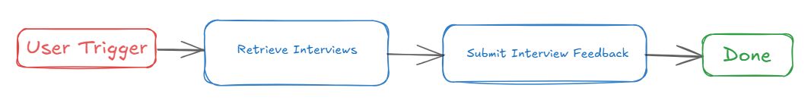
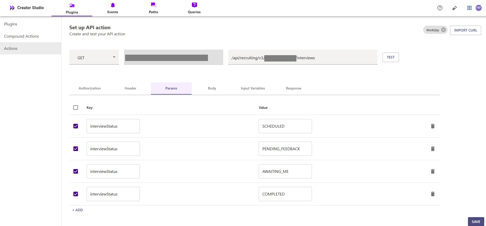
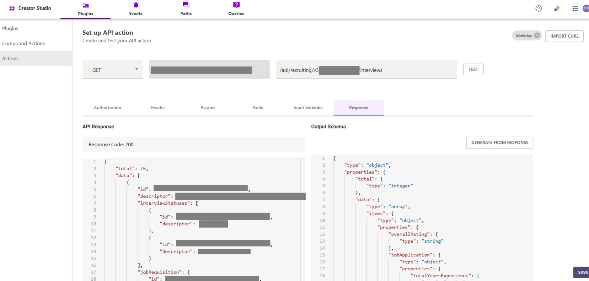
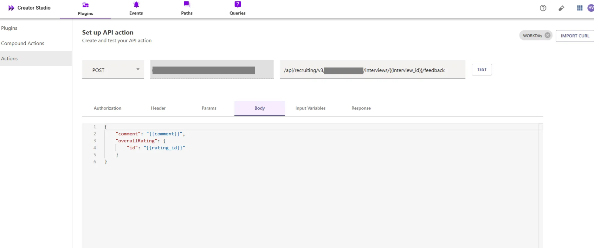
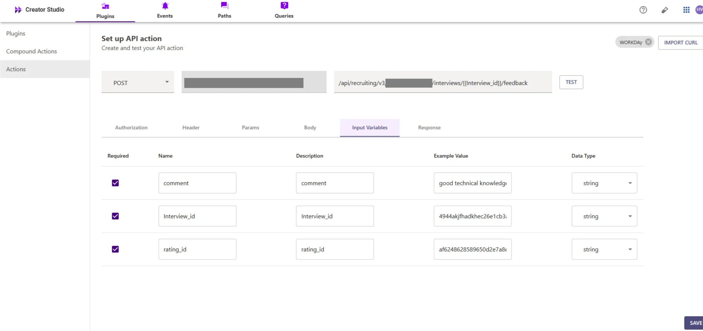
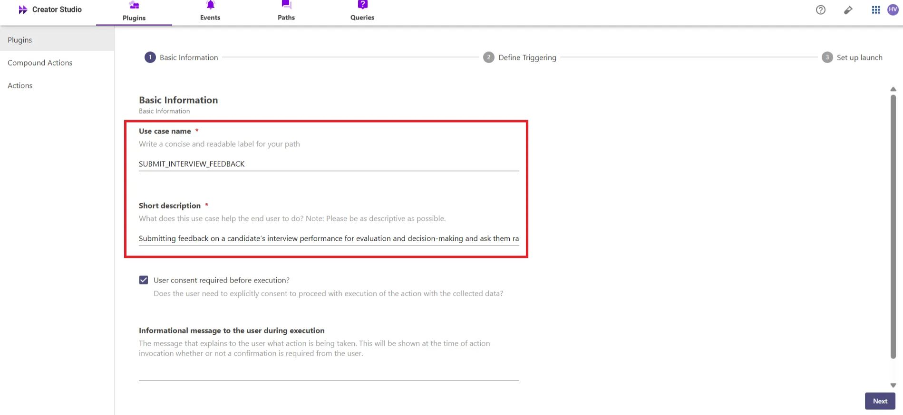
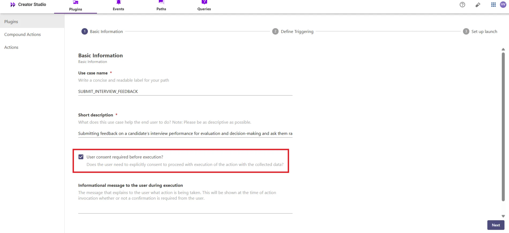

# Introduction:

Workday is an enterprise platform for human resources, and the "**Submit Interview Feedback**" feature allows you to efficiently provide feedback on candidates after interviews. Integrating this feature with your bot helps streamline the hiring process by ensuring timely and accurate feedback submission, enabling smoother decision-making and candidate evaluation.

This guide will show you how to add the "**Submit Interview Feedback**" feature to your bot using Creator Studio. Let’s get started!

# **Prerequisites:**

- Workday Connector built in Creator Studio (follow the [Workday Authentication](https://developer.moveworks.com/creator-studio/resources/connector/?id=workday) guide to create your connector)

# **What are we building?**

### **Conversation Design**

This [purple chat](https://developer.moveworks.com/creator-studio/developer-tools/purple-chat?conversation=%7B%22startTimestamp%22%3A%2211%3A43+AM%22%2C%22messages%22%3A%5B%7B%22role%22%3A%22user%22%2C%22parts%22%3A%5B%7B%22richText%22%3A%22%3Cp%3EJust+finished+my+interview+with+Jamie.+They+were+passable.%3Cbr%3E%3C%2Fp%3E%22%7D%5D%7D%2C%7B%22role%22%3A%22assistant%22%2C%22parts%22%3A%5B%7B%22richText%22%3A%22%3Cp%3ESounds+like+they%27re+a+%3Cb%3Ehire%3C%2Fb%3E+but+not+a+%3Cb%3Estrong+hire%3C%2Fb%3E+--+any+specific+notes%3F%3Cbr%3E%3C%2Fp%3E%22%7D%5D%7D%2C%7B%22role%22%3A%22user%22%2C%22parts%22%3A%5B%7B%22richText%22%3A%22%3Cp%3EYes+%E2%80%93+I+think+they+can+be+more+confident+when+speaking.+It%27s+an+important+skill+when+working+with+customers.%3Cbr%3E%3C%2Fp%3E%22%7D%5D%7D%2C%7B%22role%22%3A%22assistant%22%2C%22parts%22%3A%5B%7B%22richText%22%3A%22%3Cp%3EOkay%2C+I+can+submit+this+feedback+to+Workday.%3C%2Fp%3E%22%7D%2C%7B%22richText%22%3A%22%3Cb%3E%3Cp%3EPlease+confirm+your+feedback%3Cbr%3E%3C%2Fp%3E%3C%2Fb%3E%3Cbr%3E%3Cp%3E%3Cb%3EInterviewee%3C%2Fb%3E%3A+Jamie+Diaz+%28Application+%2372903%29%3Cbr%3E%3Cb%3ERating%3C%2Fb%3E%3A+Hire%3Cbr%3E%3Cb%3EFeedback%3A+%3C%2Fb%3EJamie+can+be+more+confident+when+speaking.+It%27s+an+important+skill+for+working+with+customers.%3Cbr%3E%3C%2Fp%3E%22%7D%2C%7B%22buttons%22%3A%5B%7B%22style%22%3A%22filled%22%2C%22buttonText%22%3A%22Yes%22%7D%2C%7B%22style%22%3A%22outlined%22%2C%22buttonText%22%3A%22No%22%7D%2C%7B%22style%22%3A%22outlined%22%2C%22buttonText%22%3A%22Edit+Request%22%7D%5D%7D%5D%7D%2C%7B%22role%22%3A%22user%22%2C%22parts%22%3A%5B%7B%22richText%22%3A%22%3Cp%3ESubmit+it%21%3Cbr%3E%3C%2Fp%3E%22%7D%5D%7D%2C%7B%22role%22%3A%22assistant%22%2C%22parts%22%3A%5B%7B%22richText%22%3A%22%3Cp%3EYour+feedback+for+Jamie+Diaz+has+been+submitted.%3Cbr%3E%3C%2Fp%3E%22%7D%5D%7D%5D%7D) shows the experience we are going to build.

# **Creator Studio Components**

- **Triggers:**
    1. **Natural Language**
- **Slots:**
    1. **Comment**: Capture the feedback comment for the interview.
    2. **Rating**: Capture the overall rating for the candidate, based on predefined rating options.
- **Actions:**
    1. **Retrieve Interviews**: Retrieve the list of interviews to identify the correct **Interview ID**.
    2. **Submit Interview Feedback**: Submit the feedback, using the **Interview ID** (retrieved from the interviews list), along with the feedback comment and rating.
- **Guidelines:**
    1. None

# **API Research**

This build this use case, we will use **two APIs** to retrieve interview details and submit feedback.



## **API #1: Retrieve Interviews**

The [**Retrieve Interviews**](https://community.workday.com/sites/default/files/file-hosting/restapi/#recruiting/v4/get-/interviews) API retrieves the list of interviews associated with a candidate, based on the provided criteria.

- **Purpose**: Fetches the list of interviews for a candidate to identify the correct interview ID.
- **Features**: Supports searching for interviews by candidate details and returns interview information.
- **Example**: Queries Workday’s API to retrieve interview details using the following CURL request

```bash
curl --location 'https://<YOUR_DOMAIN>/api/recruiting/v3/<INSTANCE_ID>/interviews?interviewStatus=SCHEDULED&interviewStatus=PENDING_FEEDBACK&interviewStatus=AWAITING_ME&interviewStatus=COMPLETED' \
--header 'Content-Type: application/json' \
--header 'Authorization: Bearer <ACCESS_TOKEN>'
```

- **<YOUR_DOMAIN>**: Your Workday instance domain (e.g., `yourcompany.myworkday.com`).
- **<INSTANCE_ID>**: The Workday instance ID

## **API #2: Submit Interview Feedback**

The [**Submit Interview Feedback**](https://community.workday.com/sites/default/files/file-hosting/restapi/#recruiting/v4/post-/interviews/-ID-/feedback) API allows you to submit feedback for a specific interview in Workday.

- **Purpose**: Submits the feedback, including comments and ratings, for a specific interview.
- **Features**: Allows submitting a comment and overall rating for a particular interview using the **Interview ID**.
- **Example**: Submits feedback for a specific interview using the following CURL request:

```bash
curl --location --request POST 'https://<YOUR_DOMAIN>/api/recruiting/v3/<INSTANCE_ID>/interviews/{{Interview_id}}/feedback' \
--header 'Content-Type: application/json' \
--header 'Authorization: Bearer <ACCESS_TOKEN>' \
--data '{
    "comment": "{{comment}}",
    "overallRating": {
        "id": "{{rating_id}}"
    }
}'
```

- **<YOUR_DOMAIN>**: Your Workday instance domain (e.g., `yourcompany.myworkday.com`).
- **<INSTANCE_ID>,<INTERVIEW_ID>,<COMMENT>,<RATING>**: Workday instance ID, Interview ID, comment, and candidate rating

# **Steps**

## **Step 1: Build HTTP Action**

Define your HTTP Actions for submitting feedback for a specific interview to Workday.

### 1. **In Creator Studio, Create a New Action**:

- Navigate to **Plugins** section > **Actions** tab.
- Click on **CREATE** to define a new action.


- Click on the `IMPORT CURL` option and paste the following cURL command:

```bash
curl --location 'https://<YOUR_DOMAIN>/api/recruiting/v3/<INSTANCE_ID>/interviews?interviewStatus=SCHEDULED&interviewStatus=PENDING_FEEDBACK&interviewStatus=AWAITING_ME&interviewStatus=COMPLETED' \
--header 'Content-Type: application/json' \
--header 'Authorization: Bearer <ACCESS_TOKEN>'
```

- Click on `Use Existing Connector` > select the [**Workday** **connector**](https://developer.moveworks.com/creator-studio/resources/connector/?id=workday) that you just created > Click on `Apply`. This will automatically populate the Base URL and the Authorization section of the API Editor.
- **Query Parameters for Retrieving Interview Details**
    - **Key (interviewStatus)**: Value (`<INTERVIEW_STATUS>`)
    - This query retrieves interviews based on the specified statuses, ensuring the response includes the relevant interview details needed for feedback submission



- Click on `Test` to check if the Connector setup was successful and expect a successful response as shown below. You will see the request response on the left side and the generated output schema on the right.
- If the output schema does not match the API response or fails to populate automatically, kindly click the `GENERATE FROM RESPONSE` button to refresh and align the schema with the API response



- Add the **API Name** and **API Description** as shown below, then click the `Save` button


### **2.** Submit Interview Feedback

- Repeat the steps above to create another action.
- Click on the `IMPORT CURL` option and paste the following cURL command:

```bash
curl --location --request POST 'https://<YOUR_DOMAIN>/api/recruiting/v3/<INSTANCE_ID>/interviews/{{Interview_id}}/feedback' \
--header 'Content-Type: application/json' \
--header 'Authorization: Bearer <ACCESS_TOKEN>' \
--data '{
    "comment": "{{comment}}",
    "overallRating": {
        "id": "{{rating_id}}"
    }
}'
```

- To submit interview feedback, we send a **POST** request with the following body



- **InterviewID**: The unique identifier of the interview for which feedback is being submitted.
- **Comment**: The feedback comment for the interview.
- **Rating**: The overall rating for the candidate based on your predefined scale.



- We have provided sample input variables for **InterviewID**, **Comment**, and **Rating**.
- Using these input variables, we tested the plugin by making a **POST** request to submit interview feedback for a specific interview


- After that, you can test the plugin by checking the response, which will include the **Feedback Submission Status**. If the feedback has been successfully submitted
- The response will return a **201** status code, indicating successful submission of the interview feedback. If the output schema is incorrect or missing, click `GENERATE FROM RESPONSE` to update it.


- Add the **API Name** and **API Description** as shown below, then click the `Save` button

## **Step 2: Build Compound Action**

- Head over to the **Compound Actions** tab and click **CREATE**


- Give your Compound Action a **Name** and **Description** , then click `Next` Note: Name only letters, numbers, and underscores. We suggest using snake case or camel case formatting (e.g. Workflow_name or workflowName )


- Click on the `Script editor` tab. Here you will be able to build your compound action using the YAML syntax.
- At a high-level, this syntax provides actions (HTTP Request, APIthon Scripts) and workflow logic (switch statements, for each loops, return statements, parallel, try/catch). See the [Compound Action Syntax](https://developer.moveworks.com/creator-studio/reference/compound_actions_syntax/) Reference for more info.

```yaml
steps:
  - action:
      action_name: GET_INTERVIEWS
      output_key: GET_INTERVIEWS_result
  - script:
      output_key: rating_info
      input_args:
        rating: data.rating
      code: |
        # Define the rating ID mapping based on the rating
        rating_map = {
            1: 'af9e3155ecc010650d2e7a94fc950cf3',  
            2: 'af9e3155ecc010650d2e7a8eb3710cf2',  
            3: 'af9e3155ecc010650d2e7a781c250cf1'   
        }

        normalized_rating = int(rating)  

        if normalized_rating in rating_map:
            rating_info = {'rating_id': rating_map[normalized_rating]}  
            return rating_info
        else:
            return {'rating_id': 'Invalid'}  
  - switch:
      cases:
        - steps:
            - action:
                action_name: Submit_Interview_Feedback
                input_args:
                  comment: data.comment
                  rating_id: data.rating_info.rating_id
                  Interview_id: data.GET_INTERVIEWS_result.data.$FILTER(interview =>
                    data.candidate_name IN interview.descriptor)[0].id
                output_key: Submit_Interview_Feedback_result
            - return:
                output_mapper:
                  Success_Message:
                    expression: "'Feedback submitted successfully.'"
          condition: data.GET_INTERVIEWS_result.data.$FILTER(interview =>
            data.candidate_name IN interview.descriptor) != null
        - steps:
            - return:
                output_mapper:
                  No_Interview_Found_Message:
                    expression: "'No interview found for the given candidate.'"
          condition: "true"
      default:
        steps: []

```

- Click on `Input fields` tab and click the `+Add` button. Here you will define the slots that you want to collect from users through the conversation and trigger your Workflow with. After defining the input fields, click the `Submit` button to save your changes.


## **Step 3: Publish Workflow to Plugin**

- HHead over to the `Compound Actions` tab and click on the kebab menu ( `︙` )
- Next, click on `Publish Workflow to Plugin`
- First, verify your Plugin **Name** & **Short description** . This is autofilled from the name & description of your compound action.



- Next, consider whether to select the `User consent required before execution?` checkbox. Enabling this option prompts the user to confirm all slot values before executing the plugin, which is widely regarded as a best practice.



- Click `Next` and set up your positive and negative triggering examples. This ensures that the bot triggers your plugin given a relevant utterance.
- See our [guide](https://developer.moveworks.com/creator-studio/conversation-design/triggers/natural-language-triggers/#how-to-write-good-triggering-examples) on Triggering
- Lastly, click `Next` and set the **Launch Rules** you want your plugin to abide by.
    - See our [guide](https://developer.moveworks.com/creator-studio/administration/launch-options/) on Launch Rules

## **Step 4: See it in action!**

- After clicking the final `Submit` button, your plugin will be published to the bot and triggerable based on your **Launch Rules.**
- You should wait up to **5 minutes** after making changes before trying to test in your bot!
    - If you run into an issue:
        1. Check our [troubleshooting guides](https://developer.moveworks.com/creator-studio/troubleshooting/support/)
        2. Understand your issue using Logs
        3. Reach out to Support

# **Congratulations!**

You’ve just added the "**Submit Interview Feedback**" feature inside your Workday platform to your Copilot! Explore our other guides for more inspiration on what to build next.