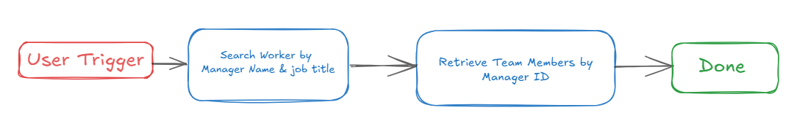
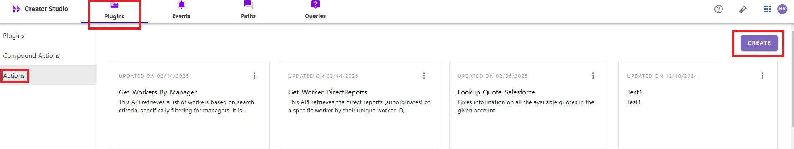
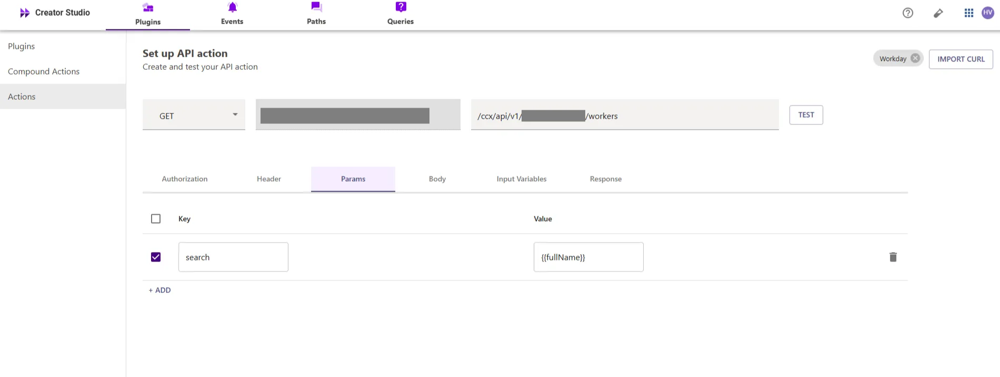
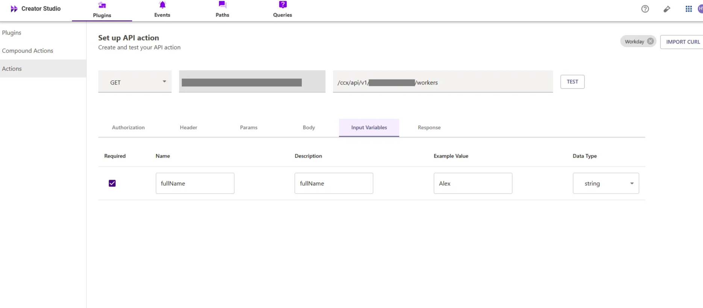
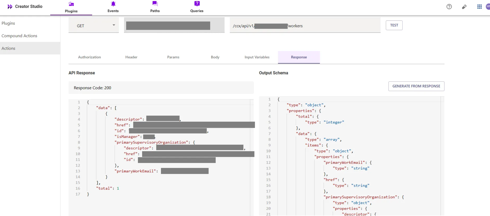
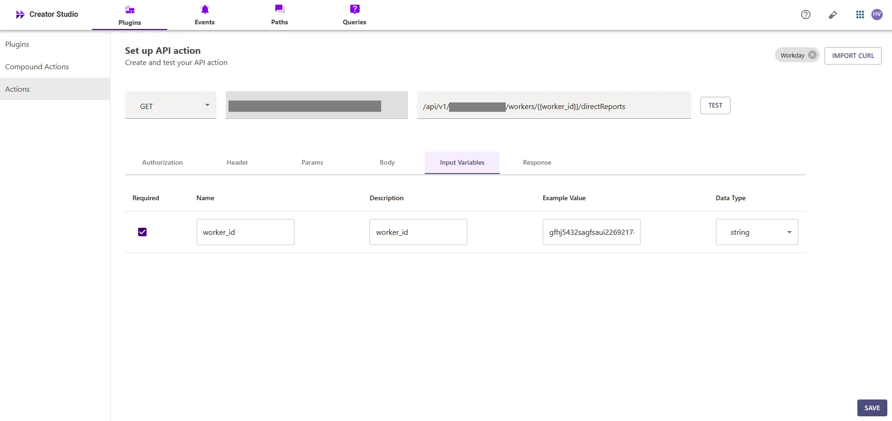
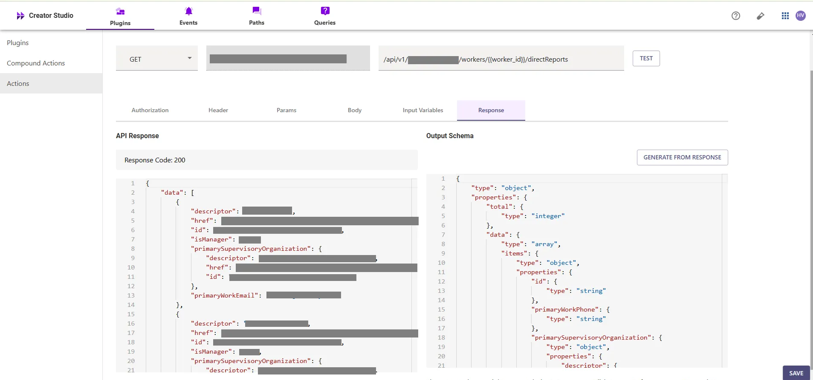
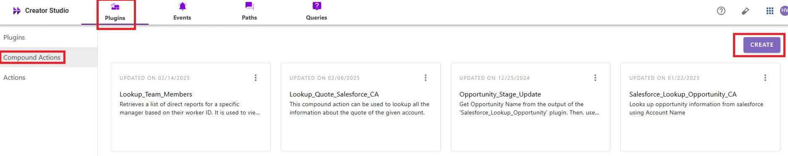
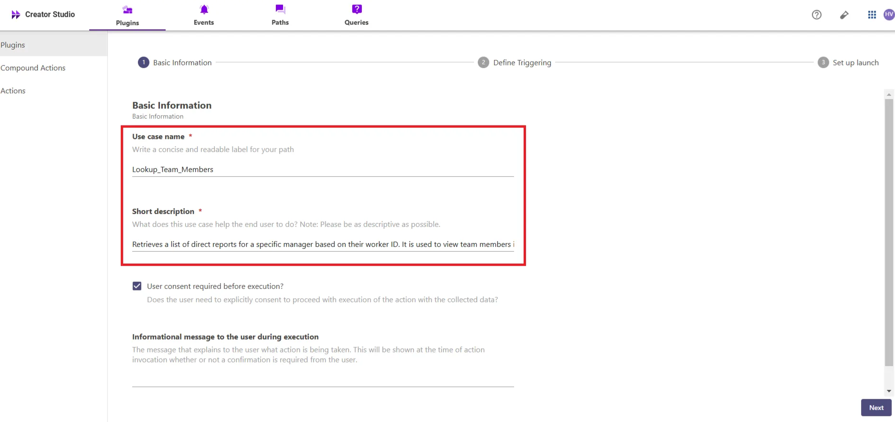
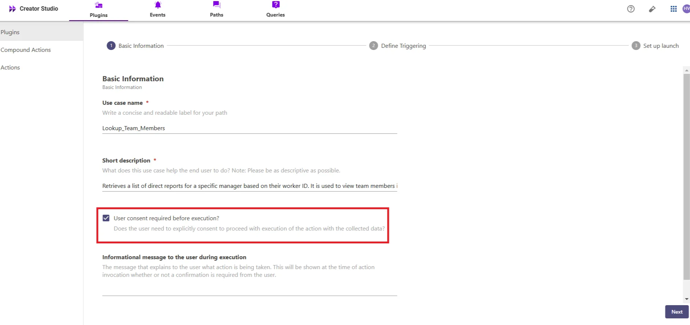

---
accreditations:
- sarthaksrinivas
- DEFAULT
description: A plugin which allows you to view team members (peers and delegates).
difficulty_level: INTERMEDIATE
fidelity: GUIDE
name: Look up Team Members
num_implementations: 1
purple_chat_link: https://developer.moveworks.com/creator-studio/developer-tools/purple-chat?conversation=%7B%22startTimestamp%22%3A%2211%3A43+AM%22%2C%22messages%22%3A%5B%7B%22role%22%3A%22user%22%2C%22parts%22%3A%5B%7B%22richText%22%3A%22%3Cp%3EWho+is+on+Ellen%27s+team%3F%3C%2Fp%3E%22%7D%5D%7D%2C%7B%22role%22%3A%22assistant%22%2C%22parts%22%3A%5B%7B%22reasoningSteps%22%3A%5B%7B%22status%22%3A%22success%22%2C%22richText%22%3A%22%3Cp%3ESearches+Workday+for+relevant+information+on+the+user%3C%2Fp%3E%22%7D%5D%7D%2C%7B%22richText%22%3A%22%3Cp%3EI+have+found+out+that+there+are+multiple+Ellens+in+your+organization.+For+whom+do+you+want+me+to+fetch+the+team+members+for%3F%3C%2Fp%3E%5Cn%3Cul%3E%5Cn++%3Cli%3EEllen+H%2C+Sales+Director%3C%2Fli%3E%5Cn++%3Cli%3EEllen+M%2C+Engineering+Lead%3C%2Fli%3E%5Cn%3C%2Ful%3E%22%7D%5D%7D%2C%7B%22role%22%3A%22user%22%2C%22parts%22%3A%5B%7B%22richText%22%3A%22%3Cp%3EI+want+to+see+the+team+members+of+Ellen+H+who+is+a+Sales+Director.%3C%2Fp%3E%22%7D%5D%7D%2C%7B%22role%22%3A%22assistant%22%2C%22parts%22%3A%5B%7B%22reasoningSteps%22%3A%5B%7B%22richText%22%3A%22%3Cp%3ESearches+Workday+for+team+members+information%3C%2Fp%3E%22%2C%22status%22%3A%22success%22%7D%5D%7D%2C%7B%22richText%22%3A%22%3Cp%3EHere+are+the+team+members+of+Ellen+H%2C+Sales+Director%3A%3C%2Fp%3E%5Cn%3Cul%3E%5Cn++%3Cli%3EJacob+R%3C%2Fli%3E%5Cn++%3Cli%3ERudolph+J%3C%2Fli%3E%5Cn%3C%2Ful%3E%22%7D%5D%7D%5D%7D
solution_tags:
- HR
- HR - Employee Records
- HR - Onboarding
systems:
- workday
time_in_minutes: 25
---

# Introduction:

Workday is an enterprise platform for human resources, and the "**Look up Team Members**" feature simplifies retrieving team member information. By integrating this feature with your bot, users can efficiently access team member details, enhancing organizational management and productivity.

This guide will show you how to add the "**Look up Team Members**" feature to your bot using Creator Studio. Let's get started!

# **Prerequisites:**

- Workday Connector built in Creator Studio (follow the [Workday Authentication](https://developer.moveworks.com/creator-studio/resources/connector/?id=workday) guide to create your connector)

# **What are we building?**

### **Conversation Design**

This [purple chat](https://developer.moveworks.com/creator-studio/developer-tools/purple-chat/?conversation=%7B%22startTimestamp%22%3A%2211%3A43+AM%22%2C%22messages%22%3A%5B%7B%22role%22%3A%22user%22%2C%22parts%22%3A%5B%7B%22richText%22%3A%22%3Cp%3EWho+is+on+Ellen%27s+team%3F%3C%2Fp%3E%22%7D%5D%7D%2C%7B%22role%22%3A%22assistant%22%2C%22parts%22%3A%5B%7B%22reasoningSteps%22%3A%5B%7B%22status%22%3A%22success%22%2C%22richText%22%3A%22%3Cp%3ESearches+Workday+for+relevant+information+on+the+user%3C%2Fp%3E%22%7D%5D%7D%2C%7B%22richText%22%3A%22%3Cp%3EI+have+found+out+that+there+are+multiple+Ellens+in+your+organization.+For+whom+do+you+want+me+to+fetch+the+team+members+for%3F%3C%2Fp%3E%5Cn%3Cul%3E%5Cn++%3Cli%3EEllen+H%2C+Sales+Director%3C%2Fli%3E%5Cn++%3Cli%3EEllen+M%2C+Engineering+Lead%3C%2Fli%3E%5Cn%3C%2Ful%3E%22%7D%5D%7D%2C%7B%22role%22%3A%22user%22%2C%22parts%22%3A%5B%7B%22richText%22%3A%22%3Cp%3EI+want+to+see+the+team+members+of+Ellen+H+who+is+a+Sales+Director.%3C%2Fp%3E%22%7D%5D%7D%2C%7B%22role%22%3A%22assistant%22%2C%22parts%22%3A%5B%7B%22reasoningSteps%22%3A%5B%7B%22richText%22%3A%22%3Cp%3ESearches+Workday+for+team+members+information%3C%2Fp%3E%22%2C%22status%22%3A%22success%22%7D%5D%7D%2C%7B%22richText%22%3A%22%3Cp%3EHere+are+the+team+members+of+Ellen+H%2C+Sales+Director%3A%3C%2Fp%3E%5Cn%3Cul%3E%5Cn++%3Cli%3EJacob+R%3C%2Fli%3E%5Cn++%3Cli%3ERudolph+J%3C%2Fli%3E%5Cn%3C%2Ful%3E%22%7D%5D%7D%5D%7D) shows the experience we are going to build.

# **Creator Studio Components**

- **Triggers:**
    1. Natural Language
- **Slots:**
    1. **Worker Name:** Capture the name of the worker you want to search for
    2. **Worker ID:** Capture the worker's ID to retrieve their direct reports.
- **Actions:**
    1. **Search Worker by Name:** Retrieve worker details based on the worker's name via Workday API
    2. **Get Direct Reports:** Retrieve the direct reports (team members) of the worker using the worker ID from the first action via Workday API.
- **Guidelines:**
    1. None

# **API Research**

To build this use case, we will use **two APIs** to achieve the goal of looking up team members in Workday



## API #1: Search Worker by Name.

The [**Search Worker by Name**](https://community.workday.com/sites/default/files/file-hosting/restapi/#common/v1/get-/workers/-ID-) API retrieves worker details based on a given worker's name from Workday. This API helps in identifying individual workers by their name, enabling a lookup of worker details based on the provided search term

- **Purpose**: Fetches worker details based on the worker's name.
- **Features**: Supports searching for workers by their name and returns relevant worker information.
- **Example**: Queries Workday to retrieve worker details based on the name provided using the following CURL request.

```bash
curl --location 'https://<YOUR_DOMAIN>/api/v1/<INSTANCE_ID>/workers?search=<WORKER_NAME>' \
--header 'Content-Type: application/json' \
--header 'Authorization: Bearer <ACCESS_TOKEN>'

```

- **<YOUR_DOMAIN>**: Your Workday instance domain (e.g., `yourcompany.myworkday.com`).
- **<INSTANCE_ID>, <WORKER_NAME>, <ACCESS_TOKEN>**: The Workday instance ID, name, and for your search request

## API #2: Retrieve Team Members by Worker ID

The [**Retrieve Team Members**](https://community.workday.com/sites/default/files/file-hosting/restapi/index.html#common/v1/get-/workers/-ID-/directReports) API allows you to retrieve the workers who directly report to a specific Worker ID. Using the provided Worker ID, this API fetches the list of team members under that worker.

- **Purpose**: Retrieves team members based on the **Worker ID**.
- **Features**: Fetches the direct reports of the worker, returning a list of their team members.
- **Example**: Queries to retrieve the team members under a given **Worker ID**.

```bash
curl --location 'https://<YOUR_DOMAIN>/api/v1/<INSTANCE_ID>/workers/<WORKER_ID>/directReports' \
--header 'Content-Type: application/json' \
--header 'Authorization: Bearer <ACCESS_TOKEN>'

```

- **<YOUR_DOMAIN>**: Your Workday instance domain (e.g., `yourcompany.myworkday.com`).
- **<WORKDAY_INSTANCE_ID>**, **<WORKER_ID>**: The Workday instance ID and the worker's ID.

# **Steps**

## **Step 1: Build HTTP Action**

Define your HTTP Actions for fetching **Worker Information** from Workday based on the provided **worker Name**

### 1. **In Creator Studio, Create a New Action**:

- Navigate to **Plugins** section > **Actions** tab.
- Click on **CREATE** to define a new action.



- Click on the `IMPORT CURL` option and paste the following cURL command:

```bash
curl --location 'https://<YOUR_DOMAIN>/api/v1/<INSTANCE_ID>/workers?search=<WORKER_NAME>' \
--header 'Content-Type: application/json' \
--header 'Authorization: Bearer <ACCESS_TOKEN>'

```

- Click on `Use Existing Connector` > select the [**Workday Connector**](https://developer.moveworks.com/creator-studio/resources/connector/?id=workday) that you just created > Click on `Apply`. This will automatically populate the Base URL and the Authorization section of the API Editor.
- **Query Parameters for Retrieving Worker Details**
- **Key (q)**: Value (`<WORKER_NAME>`)
- This query retrieves worker details based on the worker's name, ensuring the response includes the relevant worker information.



**Input Variables** :

- Full_Name: Example Value (Alex).



- Click on `Test` to check if the Connector setup was successful and expect a successful response as shown below. You will see the request response on the left side and the generated output schema on the right.
- If the output schema does not match the API response or fails to populate automatically, kindly click the `GENERATE FROM RESPONSE` button to refresh and align the schema with the API response.



- Add the **API Name** and **API Description** as shown below, then click the `Save` button


### **2.** Retrieve Team Members by Worker ID

- Repeat the steps above to create another action.
- Click on the `IMPORT CURL` option and paste the following cURL command:

```bash
curl --location 'https://<YOUR_DOMAIN>/api/v1/<INSTANCE_ID>/workers/<Worker_ID>/directReports' \
--header 'Content-Type: application/json' \
--header 'Authorization: Bearer <ACCESS_TOKEN>'

```

- Click on `Use Existing Connector` > select the  [**Workday Connector**](https://developer.moveworks.com/creator-studio/resources/connector/?id=workday) that you just created > Click on `Apply`. This will automatically populate the Base URL and the Authorization section of the API Editor.
- This query retrieves the direct reports (team members) for the specified worker ID. By using the `directReports` endpoint, it fetches the workers who report directly to the specified worker.



- Click on `Test` to check if the Connector setup was successful and expect a successful response as shown below. You will see the request response on the left side and the generated output schema on the right.
- If the output schema does not match the API response or fails to populate automatically, kindly click the `GENERATE FROM RESPONSE` button to refresh and align the schema with the API response.



- Add the **API Name** and **API Description** as shown below, then click the `Save` button


## **Step 2: Build Compound Action**

- Head over to the **Compound Actions** tab and click **CREATE**



- Give your Compound Action a **Name** and **Description** , then click `Next` Note: Name only letters, numbers, and underscores. We suggest using snake case or camel case formatting (e.g. Workflow_name or workflowName )


- Click on the `Script editor` tab. Here you will be able to build your compound action using the YAML syntax.
- At a high-level, this syntax provides actions (HTTP Request, APIthon Scripts) and workflow logic (switch statements, for each loops, return statements, parallel, try/catch). See the [Compound Action Syntax](https://developer.moveworks.com/creator-studio/reference/compound_actions_syntax/) Reference for more info.

```yaml
steps:
  - action:
      output_key: Get_Worker_ID_result
      action_name: Get_Worker_ID
      progress_updates:
        on_complete: ON_COMPLETE_MESSAGE
        on_pending: ON_PENDING_MESSAGE
      input_args:
        fullName: data.fullName
  - action:
      output_key: Get_Worker_DirectReports_result
      action_name: Get_Worker_DirectReports
      progress_updates:
        on_complete: ON_COMPLETE_MESSAGE
        on_pending: ON_PENDING_MESSAGE
      input_args:
        worker_id: data.Get_Worker_ID_result.data[0].id
  - return:
      output_mapper:
        MAP():
          converter:
            id: item.id
            name: item.descriptor.$TITLECASE()
          items: data.Get_Worker_DirectReports_result.data
  
```

- Click on `Input fields` tab and click the `+Add` button. Here you will define the slots that you want to collect from users through the conversation and trigger your Workflow with. After defining the input fields, click the `Submit` button to save your changes.

## **Step 3: Publish Workflow to Plugin**

- Head over to the `Compound Actions` tab and click on the kebab menu ( `︙` )
- Next, click on `Publish Workflow to Plugin`
- First, verify your Plugin **Name** & **Short description** . This is autofilled from the name & description of your compound action.



- Next, consider whether to select the `User consent required before execution?` checkbox. Enabling this option prompts the user to confirm all slot values before executing the plugin, which is widely regarded as a best practice.



- Click `Next` and set up your positive and negative triggering examples. This ensures that the bot triggers your plugin given a relevant utterance.
- See our [guide](https://developer.moveworks.com/creator-studio/conversation-design/triggers/natural-language-triggers/#how-to-write-good-triggering-examples) on Triggering
- Lastly, click `Next` and set the **Launch Rules** you want your plugin to abide by.
    - See our [guide](https://developer.moveworks.com/creator-studio/administration/launch-options/) on Launch Rules

## **Step 4: See it in action!**

- After clicking the final `Submit` button, your plugin will be published to the bot and triggerable based on your **Launch Rules.**
- You should wait up to **5 minutes** after making changes before trying to test in your bot!
    - If you run into an issue:
        1. Check our [troubleshooting guides](https://developer.moveworks.com/creator-studio/troubleshooting/support/)
        2. Understand your issue using Logs
        3. Reach out to Support

# **Congratulations!**

You've just added the "**Lookup Team Members**" feature inside your Workday platform to your Copilot! Explore our other guides for more inspiration on what to build next.
