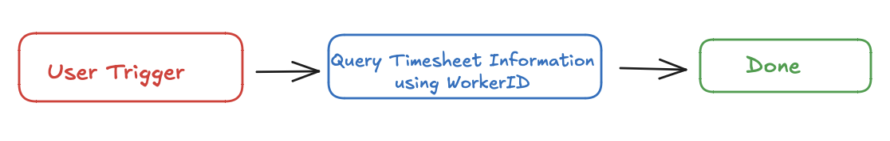
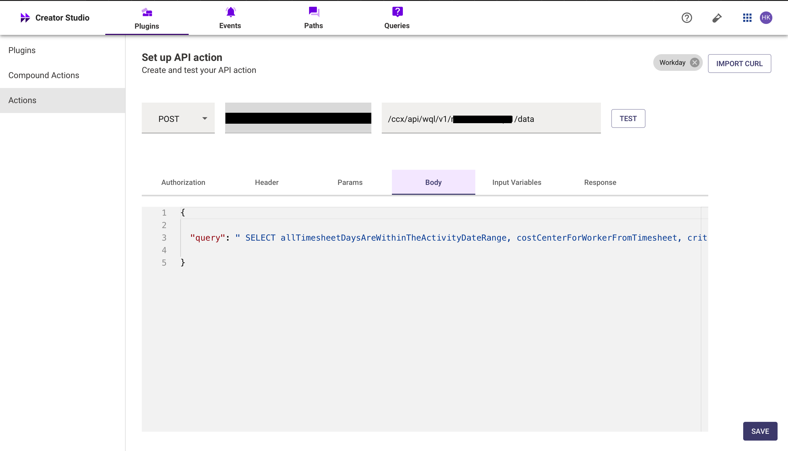
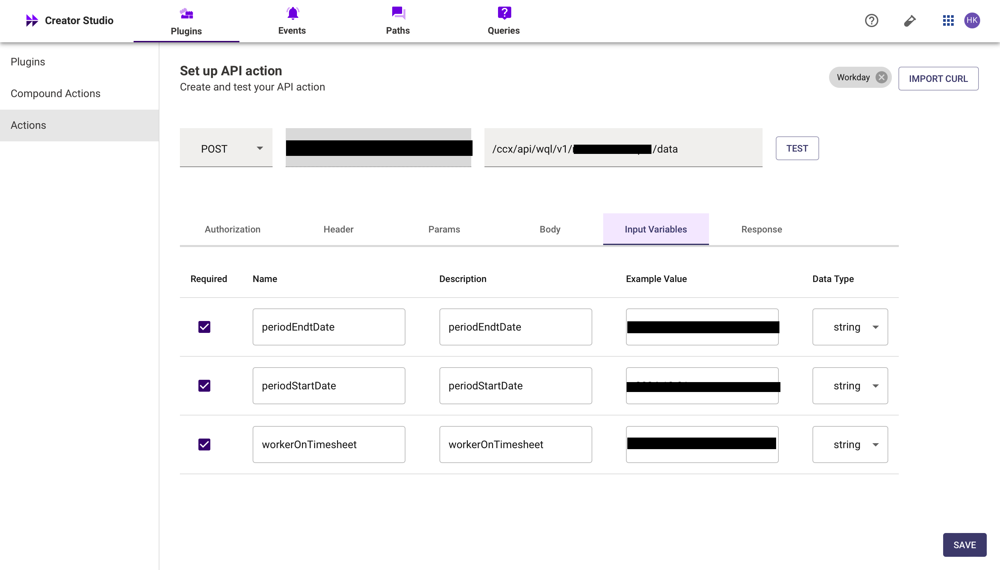
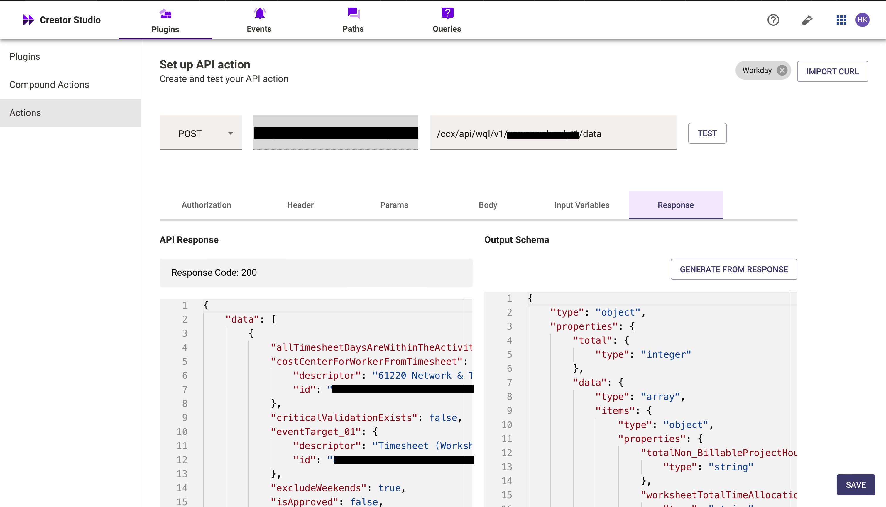
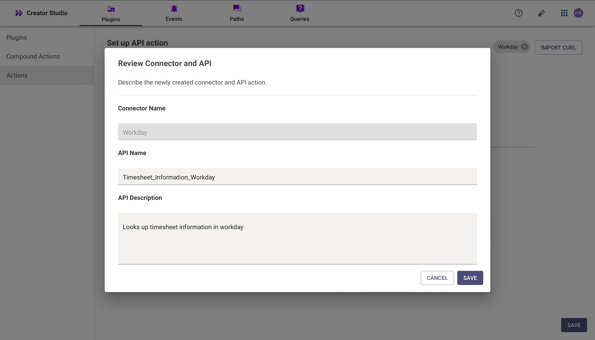
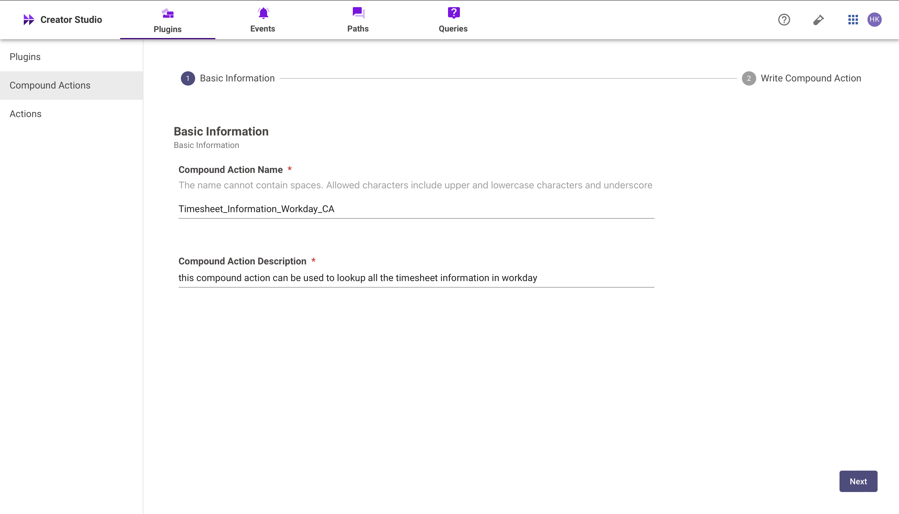
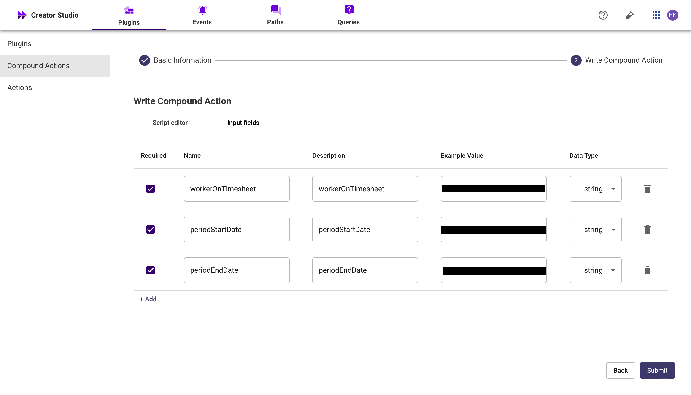
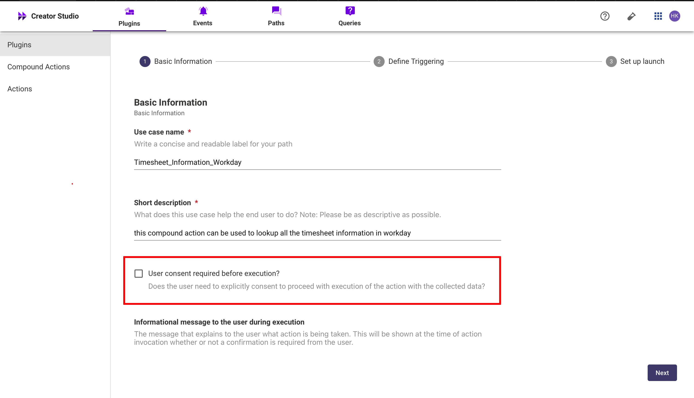
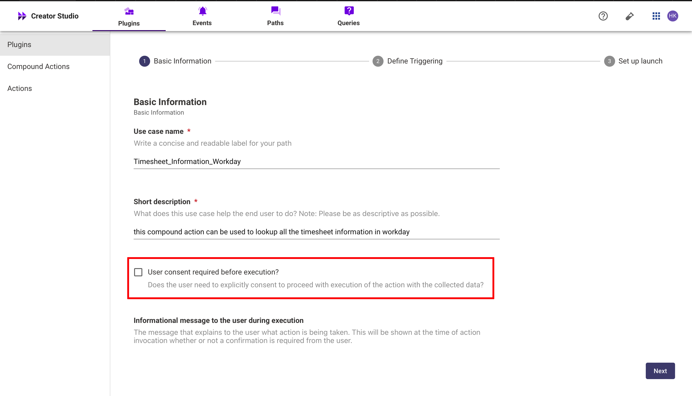

# **Introduction**

Workday is a comprehensive enterprise platform for human resources, and the "Lookup Timesheet Information" feature simplifies the process of accessing and reviewing employee timesheet data. By integrating this feature with your bot, users can effortlessly retrieve their work hours, project details, and timesheet statuses, all within a seamless conversational interface.

This guide will walk you through how to add the "Lookup Timesheet Information" feature to your bot using Creator Studio. Let’s get started!

# **Prerequisites**

- Workday Connector built in Creator Studio (follow the [Workday Authentication](https://developer.moveworks.com/creator-studio/resources/connector/?id=workday) guide to create your connector)

# What are we building?

### **Conversation Design**

This [purple chat](https://developer.moveworks.com/creator-studio/developer-tools/purple-chat-builder/?workspace=%7B%22title%22%3A%22My+Workspace%22%2C%22botSettings%22%3A%7B%7D%2C%22mocks%22%3A%5B%7B%22id%22%3A8559%2C%22title%22%3A%22Mock+1%22%2C%22transcript%22%3A%7B%22settings%22%3A%7B%22colorStyle%22%3A%22LIGHT%22%2C%22startTime%22%3A%2211%3A43+AM%22%2C%22defaultPerson%22%3A%22GWEN%22%2C%22editable%22%3Atrue%7D%2C%22messages%22%3A%5B%7B%22from%22%3A%22USER%22%2C%22text%22%3A%22Can+you+pull+my+timesheet+data+for+project+Hydrogen%3F%22%7D%2C%7B%22from%22%3A%22ANNOTATION%22%2C%22text%22%3A%22%3Cp%3E%E2%9C%85+Working+on+%3Cb%3EPull+Timesheet+Data%3C%2Fb%3E%3Cbr%3E%E2%8F%B3+Calling+Plugin+%3Cb%3ELookup+Time+Sheet+Information%3C%2Fb%3E%3C%2Fp%3E%22%7D%2C%7B%22from%22%3A%22BOT%22%2C%22text%22%3A%22You%27ve+spent+%3Cb%3E120+hours%3C%2Fb%3E+on+project+Hydrogen+this+month.+Do+you+need+detailed+timesheet+entries+or+any+other+project+data%3F%22%7D%5D%7D%7D%5D%7D) shows the experience we are going to build.

# **Creator Studio Components**

- **Triggers:**
    1. **Natural Language**
- **Slots:**
    1. WorkerID 
    2. Period Start Date
    3. Period End Date
- **Actions:**
    1. **Search Timesheet Information**
        - Retrieve the worker’s details and their associated timesheet information using the Workday WQL API.
- **Guidelines:**
    1. None.
    
    # **API Research**
    
    To efficiently implement the use case for Timesheet Information in Workday, we utilize a one API.
    
    
    

## **API #1: Retrieve Timesheet Information using WQL**

The [**Lookup Timesheet Information**](https://community.workday.com/sites/default/files/file-hosting/restapi/#wql/v1/get-/data) API allows you to retrieve timesheet data for workers in Workday. This API uses the **Timesheet Query** endpoint to fetch details such as work hours, project allocations, and timesheet statuses.

- **Purpose**:
    - Retrieves timesheet information for workers in Workday.
    - Provides insights into logged hours, project details, and timesheet approvals.
- **Features**:
    - Supports querying timesheets by specific **worker IDs** or date ranges.
    - Allows fetching detailed breakdowns of **time entries** (e.g., regular hours, overtime).
    - Provides **timesheet status** information (e.g., submitted, approved, rejected).

```yaml
curl --location '<YOUR_DOMAIN>'/ccx/api/wql/v1/<INSTANCE>/data' \
--header 'Content-Type: application/json' \
--header 'Authorization: Bearer 
--data '{

  "query": " SELECT allTimesheetDaysAreWithinTheActivityDateRange, costCenterForWorkerFromTimesheet, criticalValidationExists, eventTarget_01, excludeWeekends, isApproved, isJobExempt, isPayrollTimesheet, isProjectTimesheet, isProjectWorksheet, isTimeInTimeOutTimesheet, lockedInWorkday, moreThan24HoursWorkedInADay, multi_WorkerTimesheetForTimesheet, payrollProcessing, payrollTimesheetLinesAreMissingACostCenter, payrollTimesheetLinesAreMissingAPosition, periodIsInUseByAnotherProjectTimesheetForThisWorker, positionsFilledByWorkerAsOfTimesheetPeriodEndDate, projectTimesheetDefaultDefaultHoursPerDay, projectTimesheetDefaultsSumOfDefaultsHours, projectTimesheetIsDuplicateOfPriorProjectTimesheet, projectTimesheetLinesForTimesheet, referenceID1, savedCustomValidationResult, supervisoryOrganizationOfMulti_WorkerTimesheetForWorkerTimeCard, timeInTimeOut, timesheet, timesheetApprovalDateTime, timesheetDays, timesheetDefaultLinesForTimesheet, timesheetLinesForTimesheet, timesheetPeriod, timesheetPeriodEndDate, timesheetPeriodStartDate, timesheetStatus, totalBillableProjectHoursLogged, totalDaysOffRequestedForTimesheetPeriod, totalHoursLoggedForTimeInTimeOutTimesheetIncludesUnapproved, totalHoursLoggedForTimesheet, totalHoursLoggedForTimesheetApproved, totalHoursOffRequestedForTimesheetPeriod, totalNon_BillableProjectHoursLogged, validationErrorsAndWarnings, workerDefaultWeeklyHours, workerOnTimesheet, workerScheduledWeeklyHours, worksheetLinesAreMissingTheTask, worksheetTotalTimeAllocationPercent, worktagsFromTimesheetDefaultLines FROM timesheets (periodStartDate = ''{{periodStartDate}}'', periodEndDate = ''{{periodEndDate}}'' ) WHERE workerOnTimesheet = ''{{workeronTimesheet}}''

}
'
```

- **<YOUR_DOMAIN>**: Your workday instance domain (e.g., yourcompany.workday.com).
- **<INSTANCE>:**  Your workday instance (e.g, moveworks_dpt1)

# **Steps**

### **Step 1: Build HTTP Action**

Define your HTTP Actions for fetching all the backlog ideas of a specific project :

### **1. Retrieve user details by full name**

- In Creator Studio, create a new Action.
    - Navigate to plugin section > Actions tab
    - Click on CREATE to define a new action
        
        
        

- Click on the IMPORT CURL option and paste the following cURL command:

```yaml
curl --location '<YOUR_DOMAIN>'/ccx/api/wql/v1/<INSTANCE>/data' \
--header 'Content-Type: application/json' \
--header 'Authorization: Bearer 
--data '{

   "query": " SELECT allTimesheetDaysAreWithinTheActivityDateRange, costCenterForWorkerFromTimesheet, criticalValidationExists, eventTarget_01, excludeWeekends, isApproved, isJobExempt, isPayrollTimesheet, isProjectTimesheet, isProjectWorksheet, isTimeInTimeOutTimesheet, lockedInWorkday, moreThan24HoursWorkedInADay, multi_WorkerTimesheetForTimesheet, payrollProcessing, payrollTimesheetLinesAreMissingACostCenter, payrollTimesheetLinesAreMissingAPosition, periodIsInUseByAnotherProjectTimesheetForThisWorker, positionsFilledByWorkerAsOfTimesheetPeriodEndDate, projectTimesheetDefaultDefaultHoursPerDay, projectTimesheetDefaultsSumOfDefaultsHours, projectTimesheetIsDuplicateOfPriorProjectTimesheet, projectTimesheetLinesForTimesheet, referenceID1, savedCustomValidationResult, supervisoryOrganizationOfMulti_WorkerTimesheetForWorkerTimeCard, timeInTimeOut, timesheet, timesheetApprovalDateTime, timesheetDays, timesheetDefaultLinesForTimesheet, timesheetLinesForTimesheet, timesheetPeriod, timesheetPeriodEndDate, timesheetPeriodStartDate, timesheetStatus, totalBillableProjectHoursLogged, totalDaysOffRequestedForTimesheetPeriod, totalHoursLoggedForTimeInTimeOutTimesheetIncludesUnapproved, totalHoursLoggedForTimesheet, totalHoursLoggedForTimesheetApproved, totalHoursOffRequestedForTimesheetPeriod, totalNon_BillableProjectHoursLogged, validationErrorsAndWarnings, workerDefaultWeeklyHours, workerOnTimesheet, workerScheduledWeeklyHours, worksheetLinesAreMissingTheTask, worksheetTotalTimeAllocationPercent, worktagsFromTimesheetDefaultLines FROM timesheets (periodStartDate = ''{{periodStartDate}}'', periodEndDate = ''{{periodEndDate}}'' ) WHERE workerOnTimesheet = ''{{workeronTimesheet}}''

}
'
```

- Click on Use Existing Connector > select the [Workday connector](https://developer.moveworks.com/creator-studio/resources/connector/?id=workday) that you just created > Click on Apply. This will populate the Base URL and the Authorization section of the API Editor.
- **Body :** {"query": " SELECT allTimesheetDaysAreWithinTheActivityDateRange, costCenterForWorkerFromTimesheet, criticalValidationExists, eventTarget_01, excludeWeekends, isApproved, isJobExempt, isPayrollTimesheet, isProjectTimesheet, isProjectWorksheet, isTimeInTimeOutTimesheet, lockedInWorkday, moreThan24HoursWorkedInADay, multi_WorkerTimesheetForTimesheet, payrollProcessing, payrollTimesheetLinesAreMissingACostCenter, payrollTimesheetLinesAreMissingAPosition, periodIsInUseByAnotherProjectTimesheetForThisWorker, positionsFilledByWorkerAsOfTimesheetPeriodEndDate, projectTimesheetDeeklyHours, workerOnTimesheet, workerScheduledWeeklyHours, worksheetLinesAreMissingTheTask, worksheetTotalTimeAllocationPercent, worktagsFromTimesheetDefaultLines FROM timesheets (periodStartDate = '{{periodStartDate}}', periodEndDate = '{{periodEndDate}}') WHERE workerOnTimesheet = '{{workeronTimesheet}}'"}
    
    
    
- **Input Variables** :
    
         Name : Example Value (Julie Bowles).
    
    
    
- Click on Test to check if the Connector setup was successful and expect a successful response as shown below. You will see the request response on the left side and the generated output schema on the right.
- If the output schema does not match the API response or fails to populate automatically, kindly click the GENERATE FROM RESPONSE button to refresh and align the schema with the API response.
    
    
    
- Add the **API Name** and **API Description** as shown below, then click the Save button
    
    
    

## **Step 2: Build Compound Action**

- Head over to the **Compound Actions** tab and click **CREATE**
    
    
    
- Give your Compound Action a **Name** and **Description** , then click Next Note: Name only letters, numbers, and underscores. We suggest using snake case or camel case formatting (e.g. Workflow_name or workflowName )
    
    
    
- Click on the Script editor tab. Here you will be able to build your compound action using the YAML syntax.
- At a high-level, this syntax provides actions (HTTP Request, APIthon Scripts) and workflow logic (switch statements, for each loops, return statements, parallel, try/catch). See the [Compound Action Syntax](https://developer.moveworks.com/creator-studio/reference/compound_actions_syntax/) Reference for more info.

```yaml
steps:
  - action:
      output_key: Timesheet_Information_Workday_result
      action_name: Timesheet_Information_Workday
      progress_updates:
        on_complete: ON_COMPLETE_MESSAGE
        on_pending: ON_PENDING_MESSAGE
      input_args:
        workerOnTimesheet: data.workerOnTimesheet
  - return:
      output_mapper:
        list:
          MAP():
            converter:
              timesheetStatus: item.timesheetStatus
              timesheetPeriodStartDate: item.timesheetPeriodStartDate
              workerDefaultWeeklyHours: item.workerDefaultWeeklyHours
              timesheetPeriodEndDate: item.timesheetPeriodEndDate
              costCenterForWorkerFromTimesheet: item.costCenterForWorkerFromTimesheet
              totalHoursLoggedForTimesheetApproved: item.totalHoursLoggedForTimesheetApproved
              timesheetDefaultLinesForTimesheet: id.timesheetDefaultLinesForTimesheet
              workerOnTimesheet: item.workerOnTimesheet
              totalHoursLoggedForTimesheet: item.totalHoursLoggedForTimesheet
              totalDaysOffRequestedForTimesheetPeriod: item.totalDaysOffRequestedForTimesheetPeriod
              isApproved: item.isApproved
            items: data.Timesheet_Information_Workday_result.data

```

- Click on Input fields tab and click the +Add button. Here you will define the slots that you want to collect from users through the conversation and trigger your Workflow with. After defining the input fields, click the Submit button to save your changes



## **Step 3: Publish Workflow to Plugin**

- Head over to the Compound Actions tab and click on the kebab menu ( ︙ )
- Next, click on Publish Workflow to Plugin
- First, verify your Plugin **Name** & **Short description** . This is autofilled from the name & description of your compound action.
    
    
    
- Next, consider whether to select the User consent required before execution? checkbox. Enabling this option prompts the user to confirm all slot values before executing the plugin, which is widely regarded as a best practice.
    
    
    
- Click Next and set up your positive and negative triggering examples. This ensures that the bot triggers your plugin given a relevant utterance.
    - See our [guide](https://developer.moveworks.com/creator-studio/conversation-design/triggers/natural-language-triggers/#how-to-write-good-triggering-examples) on Triggering
- Lastly, click Next and set the **Launch Rules** you want your plugin to abide by.
    - See our [guide](https://developer.moveworks.com/creator-studio/administration/launch-options/) on Launch Rules

## **Step 4: See it in action!**

- After clicking the final Submit button, your plugin will be published to the bot and triggerable based on your **Launch Rules.**
- You should wait up to **5 minutes** after making changes before trying to test in your bot!
- If you run into an issue:
    1. Check our [troubleshooting guides](https://developer.moveworks.com/creator-studio/troubleshooting/support/)
    2. Understand your issue using Logs
    3. Reach out to Support

# **Congratulations!**

You've just added the "Look Up Timesheet Information in Workday" feature inside your Workday account to your Copilot! Explore our other guides for more inspiration on what to build next.