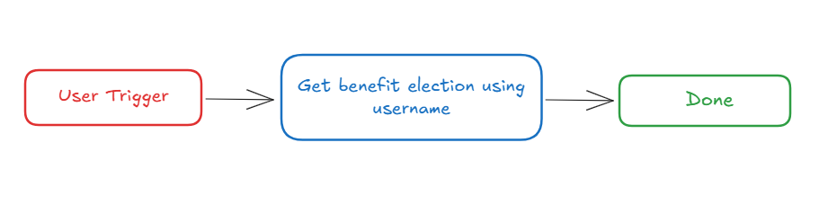

# **Introduction :**

Workday is a enterprise cloud platform for financial, HR, and business planning applications. The “**View Benefit Elections**” plugin streamlines the process of retrieving employee benefit election details using a username. By integrating this feature into your bot, users can quickly access benefits data, enhancing efficiency and decision-making.

This guide provides step-by-step instructions on incorporating the **“View Benefit Elections”** plugin into your bot using Creator Studio.

Let’s get started!

# Prerequisites :

- [Postman](https://www.postman.com/) or an API Testing Tool
- Follow the [Workday Connector guide](https://developer.moveworks.com/creator-studio/resources/connector?id=workday) to set up your Creator Studio Connector.

# What are we building?

## **Conversation Design**

This [purple chat](https://developer.moveworks.com/creator-studio/developer-tools/purple-chat?conversation=%7B%22startTimestamp%22%3A%2211%3A43+AM%22%2C%22messages%22%3A%5B%7B%22role%22%3A%22user%22%2C%22parts%22%3A%5B%7B%22richText%22%3A%22What+are+my+healthcare+benefits+elections+again%3F%22%7D%5D%7D%2C%7B%22role%22%3A%22assistant%22%2C%22parts%22%3A%5B%7B%22richText%22%3A%22%3Cp%3EChecking+your+benefits+details+in+Workday.%3Cbr%3E%3C%2Fp%3E%22%7D%5D%7D%2C%7B%22role%22%3A%22assistant%22%2C%22parts%22%3A%5B%7B%22richText%22%3A%22%3Cp%3EHere+are+your+benefits+details%3A%3Cbr%3E%3C%2Fp%3E%22%7D%2C%7B%22richText%22%3A%22%3Cb%3E%3Cp%3E%3Cb%3EHealth+Insurance%3C%2Fb%3E%3Cbr%3E%3C%2Fp%3E%3C%2Fb%3E%3Cbr%3E%3Cp%3E%3Cb%3EPlan%3A%3C%2Fb%3E+Family+Coverage%3Cbr%3E%3Cb%3EEnrollment+Status%3A%3C%2Fb%3E+Active%3Cbr%3E%3Cb%3EDeductible%3A%3C%2Fb%3E+%241%2C200%3Cbr%3E%3C%2Fp%3E%22%7D%5D%7D%5D%7D) shows the experience we are going to build.

# **Creator Studio Components**

- **Triggers**:
    1. Natural Language
- **Slots**:
    1. Fetch Benefit elections details from Username
- **Actions**:
    1. **Retrieve Benefit elections by Username:**
        - Retrieve benefit election details using the username to obtain information on the user's benefit selections.
- **Guidelines:**
    1. None

# **API Research**

To implement this use case, we will utilize a single API. Since our objective is to retrieve benefit election details associated with a specified username, we will leverage Workday's All Workers-related APIs. Only one API call is necessary to accomplish this task.



## API #1: **Retrieve Benefit elections by Username:**

The **View Benefit Elections** API facilitates the retrieval of an employee’s **benefit election details** from Workday using a specified **username**. By leveraging Workday’s data query capabilities, this API ensures efficient and accurate data retrieval, even in environments with a large number of employees.

- **Purpose**: Retrieves the **benefit election details** associated with a specified **username**.
- **Features**: Filters data by **username** and provides precise results, even in extensive datasets.
- **Example**: Executes a query to identify the **benefit elections** linked to a given **username**.

```bash
curl --request POST \
curl --location 'https://<DOMAIN>.myworkday.com/api/wql/v1/<INSTANCE>/data?offset=0&limit=1' \
--header 'Content-Type: application/json' \
--data '{
    "query": "SELECT workdayID, fullName, email_PrimaryWork, benefitElections{benefitPlan, coverage, dependents, beneficiaries_All, coverageBeginDateForBenefitPlan, deductionBeginDateForBenefitPlan, employerContributionPerBenefitPlanFrequency, employeeCostPerBenefitPlanFrequency}, benefitPlans_CurrentlyEnrolled FROM indexedAllWorkers (dataSourceFilter = indexedAllWorkersFilter, includeSubordinateOrganizations = true, isActive = false) WHERE fullName LIKE '\''{{fullname}}'\''"
}'

```

# **Steps**

## **Step 1: Build HTTP Action**

Define your HTTP Actions for fetching all the backlog ideas of a specific project :

### **1. Retrieve Benefit elections by Username**

- In Creator Studio, create a new Action.
    - Navigate to plugin section > Actions tab
    - Click on CREATE to define a new action
        
        
        
- Click on the  IMPORT CURL option and paste the following cURL command:
    
    ```bash
    curl --request POST \
    curl --location 'https://<DOMAIN>.myworkday.com/api/wql/v1/<INSTANCE>/data?offset=0&limit=1' \
    --header 'Content-Type: application/json' \
    --data '{
        "query": "SELECT workdayID, fullName, email_PrimaryWork, benefitElections{benefitPlan, coverage, dependents, beneficiaries_All, coverageBeginDateForBenefitPlan, deductionBeginDateForBenefitPlan, employerContributionPerBenefitPlanFrequency, employeeCostPerBenefitPlanFrequency}, benefitPlans_CurrentlyEnrolled FROM indexedAllWorkers (dataSourceFilter = indexedAllWorkersFilter, includeSubordinateOrganizations = true, isActive = false) WHERE fullName LIKE '\''{{fullname}}'\''"
    }'
    
    ```
    
- Click on Use Existing Connector > select the workday connector that you just created > Click on Apply. This will populate the Base URL and the Authorization section of the API Editor.
- **Body :**
    - { "query": "SELECT email_PrimaryWork, benefitElections{benefitPlan, coverage, dependents, beneficiaries_All, coverageBeginDateForBenefitPlan, deductionBeginDateForBenefitPlan, employerContributionPerBenefitPlanFrequency, employeeCostPerBenefitPlanFrequency} FROM indexedAllWorkers (dataSourceFilter = indexedAllWorkersFilter, includeSubordinateOrganizations = false, isActive = false) WHERE fullName = '{{fullName}}'"
    }
    
    
    
- **Input Variables** :
    - fullName : Example Value ( john ).
    
    
    
- Click on Test to check if the Connector setup was successful and expect a successful response as shown below. You will see the request response on the left side and the generated output schema on the right.
- If the output schema does not match the API response or fails to populate automatically, kindly click the GENERATE FROM RESPONSE button to refresh and align the schema with the API response.
    
    
    
- Add the **API Name** and **API Description** as shown below, then click the Save button
    
    
    

## **Step 2: Build Compound Action**

- Head over to the **Compound Actions** tab and click **CREATE**
    
    
    
- Give your Compound Action a **Name** and **Description** , then click Next Note: Name only letters, numbers, and underscores. We suggest using snake case or camel case formatting (e.g. Workflow_name or workflowName )
    
    
    
- Click on the Script editor tab. Here you will be able to build your compound action using the YAML syntax. At a high-level, this syntax provides actions (HTTP Request, APIthon Scripts) and workflow logic (switch statements, for each loops, return statements, parallel, try/catch). See the [Compound Action Syntax](https://developer.moveworks.com/creator-studio/reference/compound_actions_syntax/) Reference for more info.
    
    ```yaml
    steps:
      - action:
          output_key: Get_Benefits_by_Name_result
          action_name: Get_Benefits_by_Name
          progress_updates:
            on_complete: Retrieved benefits
            on_pending: Retrieving benefits
          input_args:
            fullName: meta_info.user.full_name
      - return:
          output_mapper:
            list:
              MAP():
                converter:
                  benefitsList:
                    MAP():
                      converter:
                        EmployeeCostPerBenefitPlan: item.employeeCostPerBenefitPlanFrequency.value
                        DeductionBeginDate: item.deductionBeginDateForBenefitPlan
                        CoverageBeginDate: item.coverageBeginDateForBenefitPlan
                        Coverage: item.coverage
                        Plan: item.benefitPlan.descriptor
                        EmployerContributionPerBenefitPlan: item.employerContributionPerBenefitPlanFrequency.value
                      items: item.benefitElections
                items: data.Get_Benefits_by_Name_result.data
    
    ```
    
- Click on Input fields tab and click the +Add button. Here you will define the slots that you want to collect from users through the conversation and trigger your Workflow with. After defining the input fields, click the Submit button to save your changes.
    
    
    

## **Step 3: Publish Workflow to Plugin**

- Head over to the Compound Actions tab and click on the kebab menu ( ︙ )
- Next, click on Publish Workflow to Plugin
- First, verify your Plugin **Name** & **Short description** . This is autofilled from the name & description of your compound action.
    
    
    
- Next, consider whether to select the User consent required before execution? checkbox. Enabling this option prompts the user to confirm all slot values before executing the plugin, which is widely regarded as a best practice.
    
    
    
- Click Next and set up your positive and negative triggering examples. This ensures that the bot triggers your plugin given a relevant utterance.
    - See our [guide](https://developer.moveworks.com/creator-studio/conversation-design/triggers/natural-language-triggers/#how-to-write-good-triggering-examples) on Triggering
- Lastly, click Next and set the **Launch Rules** you want your plugin to abide by.
    - See our [guide](https://developer.moveworks.com/creator-studio/administration/launch-options/) on Launch Rules

## **Step 4: See it in action!**

- After clicking the final Submit button, your plugin will be published to the bot and triggerable based on your **Launch Rules.**
- You should wait up to **5 minutes** after making changes before trying to test in your bot!
- If you run into an issue:
    1. Check our [troubleshooting guides](https://developer.moveworks.com/creator-studio/troubleshooting/support/)
    2. Understand your issue using Logs
    3. Reach out to Support

# **Congratulations!**

You've just added the **"View Benefit Elections"** feature inside your workday account to your Copilot! Explore our other guides for more inspiration on what to build next.