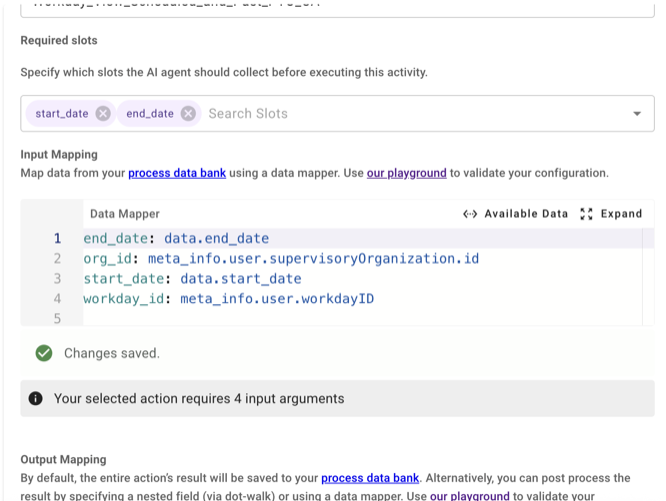
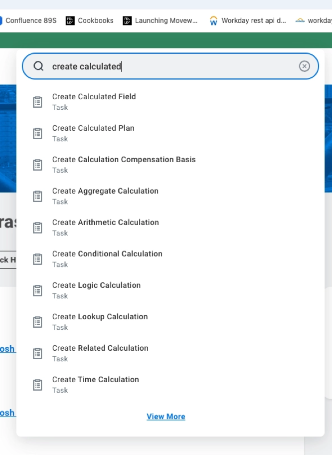
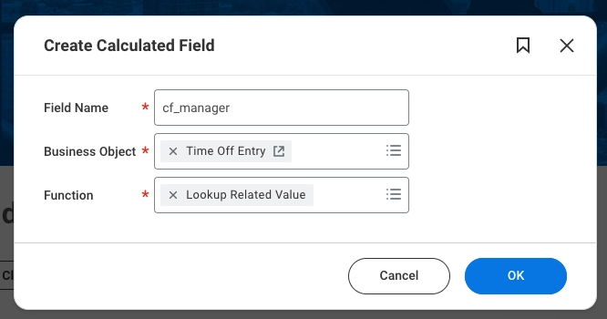
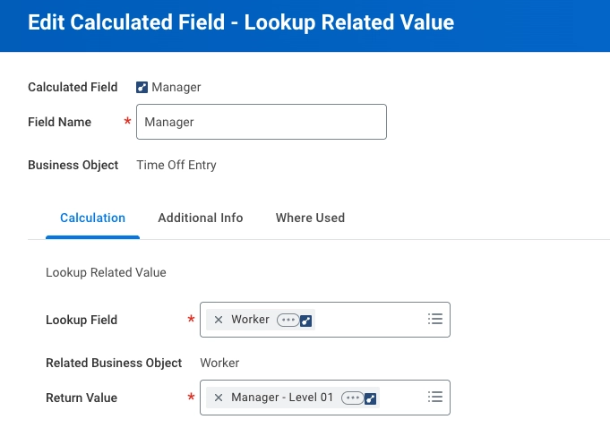

# Description

The **“View Scheduled and Past PTO”** plugin makes it easy for users to check their PTO details directly through the bot, without needing to log in to Workday. It shows upcoming approved PTOs that are already scheduled, as well as past PTO records, based on the date range the user selects.

# **User Experience Preview**

Please refer to the following [Purple Chat](https://marketplace.moveworks.com/purple-chat?conversation=%7B%22messages%22%3A%5B%7B%22role%22%3A%22user%22%2C%22parts%22%3A%5B%7B%22richText%22%3A%22I%27d+like+to+see+my+approved+PTO+records.%22%7D%5D%7D%2C%7B%22role%22%3A%22assistant%22%2C%22parts%22%3A%5B%7B%22richText%22%3A%22%3Cp%3EI+can+certainly+look+that+up+for+you.+what+date+range+%28including+past+and+future+dates%29+would+you+like+me+to+check%3F%3C%2Fp%3E%22%7D%5D%7D%2C%7B%22role%22%3A%22user%22%2C%22parts%22%3A%5B%7B%22richText%22%3A%22Show+me+everything+from+May+2025+to+December+2026.%22%7D%5D%7D%2C%7B%22role%22%3A%22assistant%22%2C%22parts%22%3A%5B%7B%22reasoningSteps%22%3A%5B%7B%22status%22%3A%22success%22%2C%22richText%22%3A%22Identifying+session+user+in+%3Cb%3EWorkday%3C%2Fb%3E...%22%2C%22connectorName%22%3A%22workday%22%7D%2C%7B%22status%22%3A%22success%22%2C%22richText%22%3A%22Validated+employee%3A+%3Cb%3EMaya+Patel+%28Senior+Analyst%29%3C%2Fb%3E%22%2C%22connectorName%22%3A%22workday%22%7D%2C%7B%22status%22%3A%22success%22%2C%22richText%22%3A%22Retrieving+approved+records+from+May+1%2C+2025%2C+to+Dec+31%2C+2026...%22%2C%22connectorName%22%3A%22workday%22%7D%5D%7D%2C%7B%22richText%22%3A%22%3Cp%3EHere+are+the+approved+PTO+records+for+%3Cstrong%3EMaya+Patel%3C%2Fstrong%3E+from+May+01%2C+2025%2C+to+Dec+31%2C+2026%3A%3C%2Fp%3E%3Cp%3E%3Cstrong%3EVacation%3C%2Fstrong%3E%3C%2Fp%3E%3Cul%3E%3Cli%3E%3Cp%3EJul+10%2C+2025+%E2%80%93+Jul+15%2C+2025+%28Past%29%3C%2Fp%3E%3C%2Fli%3E%3Cli%3E%3Cp%3EDec+22%2C+2025+%E2%80%93+Dec+30%2C+2025+%28Past%29%3C%2Fp%3E%3C%2Fli%3E%3Cli%3E%3Cp%3EAug+14%2C+2026+%E2%80%93+Aug+21%2C+2026+%28Upcoming%29%3C%2Fp%3E%3C%2Fli%3E%3C%2Ful%3E%3Cp%3E%3Cstrong%3ESick+Leave%3C%2Fstrong%3E%3C%2Fp%3E%3Cul%3E%3Cli%3E%3Cp%3ENov+02%2C+2025+%28Past%29%3C%2Fp%3E%3C%2Fli%3E%3Cli%3E%3Cp%3EMar+14%2C+2026+%28Past%29%3C%2Fp%3E%3C%2Fli%3E%3C%2Ful%3E%3Cp%3E%3Cstrong%3ECasual+Leave%3C%2Fstrong%3E%3C%2Fp%3E%3Cul%3E%3Cli%3E%3Cp%3ESep+05%2C+2025+%28Past%29%3C%2Fp%3E%3C%2Fli%3E%3C%2Ful%3E%3Cp%3E%3C%2Fp%3E%22%7D%2C%7B%22citations%22%3A%5B%7B%22connectorName%22%3A%22workday%22%2C%22citationTitle%22%3A%22Maya+Patel+%28Senior+Analyst%29%22%7D%5D%7D%5D%7D%5D%7D) for a sample conversational experience between a user and the AI Assistant for this plugin.

# **Pre-requisites**

Before installing and using the **View Scheduled and Past PTO** plugin, please ensure the following requirements are met:

## **1. Workday Connector**

This plugin requires an active Workday connector to communicate with your Workday instance. We recommend creating a connector which utilizes OAuth 2.0 with Authorization Code Grant Type flow. 

- If you have not already configured the connector, please follow the [Workday Connector Guide](https://marketplace.moveworks.com/connectors/workday#oauth-2-0-with-authorization-code-user-consent-auth-setup) available in the Moveworks Marketplace.
- The connector must be fully set up and before installing this plugin.
- Once the connector is successfully configured, follow our [plugin installation documentation](https://help.moveworks.com/docs/ai-agent-marketplace-installation) for detailed steps on how to install and activate the plugin in Agent Studio.

## **2. Workday System Requirements**

### **a. End User Permissions**

To view scheduled and past PTO request through this plugin, employees must already have permission to view time off in Workday — the same permissions required to view through the Workday UI.

At a minimum, users must have:

- The ability to view available Time Off types.
- Eligibility to access PTO requests in accordance with company time‑off policies.

Note: The plugin does not grant new permissions. It respects existing role-based permissions and policies granted to the user in Workday.

### **b. API Permissions**

The Workday connector uses the Workday API Client to process PTO requests through Workday APIs. The API Client must have the following permissions (or their equivalent in your tenant):

- Organizations and Roles
- Public Data
- Staffing
- System
- Tenant Non-Configurable
- Time Off and Leave
- Worktags

These permissions are typically configured through the Register API Client task.
## **3. Workday User Identity Ingestion**

This plugin requires User Identity Ingestion from workday in Moveworks. For Moveworks to complete actions across systems on the behalf of a user, it needs to have knowledge of all of the system IDs for the given user.
Setup information for User identity can be found on https://help.moveworks.com/docs/user-identity.

Below mandatory attributes are needed from this user ingestion.

1. workday ID of the user.
2. organization id of the user.

These attributes are utilized in the input mapping as shown below. Depending on your ingestion configuration, you might need to change these to point to the user's workday_id and Workday org_id.



## **4. Workday Custom field creation cf_manager**

This is a custom field created under time off entry business object which is used by the plugin. Please follow the below steps to create this custom field in Workday.

1. Login as Workday admin

2. In search, type: **Create Calculated Field**

   

3. Enter the below fields as shown in screenshot.
    - **Business Object** → Time Off Entry
    - **Field Name** → `Manager`
    - **Function** → Lookup Related Value
    
    
    <br></br>
    
4. Click on OK and enter the below fields and click OK. Your custom field is created.

    
    <br></br>

# **Implementation details**

## **Visual Representation of How the Plugin Works**


## **API Details**

To use the curl examples below be sure to update details for tenantUrl and tenantName. 

**You must update the TENANT placeholder in the API Actions imported during installation.**

As a Workday administrator, obtain these details as follows:

1. Log in to Workday
2. In the search bar, search for **Public Web Services**
3. Open it
4. Select **Actions → Web Services → View WSDL**
5. In the WSDL file, locate:
    
    ```
    soap:address location="https://<hostname>/ccx/service/<tenant>/..."
    ```
    

The <hostname> (tenantUrl) and <tenant> (tenantName) in this URL are your **true tenant URL components**.


### **API: Fetch scheduled and past approved PTO**

Fetches all the approved PTOs of the user either upcoming or in the past according to the dates provided by the worker or the fallout value of the dates which is +-90(3months) from the current date.

```bash
curl -X POST -d '{
"query": "SELECT status, workerRequestingPaidTimeOff, timeOffDate, timeOffTypeForTimeOffEntry, cf_Manager, timeOffEvent, supervisoryOrganization FROM timeOffByDateTaken (organizations= ({{org_ids}}), includeSubordinateOrganizations = true, startDate =('\''{{start_date}}'\''), endDate=('\''{{end_date}}'\'')) WHERE status in (0391102bd1b542538d996936c8fa2fa7) AND latestTimeOffEntry is not null AND totalUnits > 0 AND workerRequestingPaidTimeOff = ({{employee_workday_id}}) GROUP BY status, timeOffDate, workerRequestingPaidTimeOff, timeOffTypeForTimeOffEntry, cf_Manager, supervisoryOrganization, timeOffEvent"
}' 'https://<tenantUrl>/ccx/api/wql/v1/<tenantName>/data'
```

**Note**

In this API, we filter status by this WorkdayID '0391102bd1b542538d996936c8fa2fa7', which is the ID for the 'Approved' status. This ID might be different for your instance. To find the 'Approved' status ID for your tenant, run the WQL without the "status in (0391102bd1b542538d996936c8fa2fa7) AND" clause. 

This should return PTO with all statuses. You can then find a PTO with an 'Approved' status, note down the corresponding ID and replace it in the above WQL. 

**Query Parameters**

- `ORG_IDS` *(string):* organisation ID of the logged in user fetched from user identity object.
- `START_DATE` *(string):* date entered by the user for fetching the approved PTOs. If not provided then default is -90 days.
- `END_DATE` *(string):* date entered by the user for fetching the approved PTOs. If not provided then default is +90 days.
- `EMPLOYEE_WORKDAY_ID` *(string):* Employee’s Workday ID to fetch PTO records specific to that worker.
- `$select`: Limits the response to required user fields only:
    - `status`
    - `workerRequestingPaidTimeOff`
    - `workersPreferredName`
    - `timeOffDate`
    - `timeOffTypeForTimeOffEntry`
    - `cf_Manager`
    - `timeOffEvent`
    - `supervisoryOrganization`

### **API References**

This plugin uses WQL to retrieve employee information, determine eligible PTO time types, and submit PTO requests.

For detailed information on request parameters, response formats, error handling, and versioning, please refer to the **official Workday API documentation** provided by Workday.

[WQL API](https://doc.workday.com/admin-guide/en-us/reporting-and-analytics/custom-reports-and-analytics/workday-query-language-wql-/aht1611188422513.html)

# **What Is In Scope for This Plugin?**

This plugin **supports** the following capabilities:

- View both upcoming and past PTOs **limited leave types** (e.g., Vacation, Sick Leave, Casual Leave, Earned Leave, Comp Time).
- View approved scheduled and past PTOs based on the date range specified by user. If no date range is specified, the Default date range is ±90 days.
- Specify PTO using **natural language date expressions**, such as:
    - A specific date or date range
    - Days of the week or weeks within a month
    - Number of days within a given period
- View approved scheduled and past PTOs for an **employee’s own PTO only**.
- View approved scheduled and past PTOs requests that respect **existing Workday policies, validations, and approval workflows**.

# **What Is Out of Scope for This Plugin?**

This plugin **does not support** the following:

- Displaying pending or tentative PTO requests so as to not confuse the user
- Viewing **complete PTO balances**, accrual schedules, or a full breakdown of all available leave types.
- Displaying detailed **approval chain** information.
- Displaying **direct link to the view PTO** in Workday.