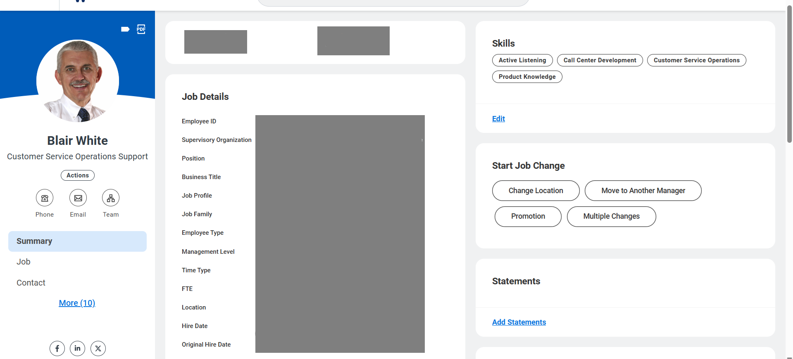
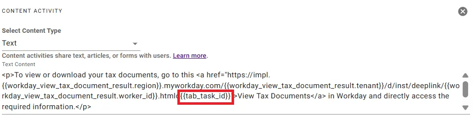

## Introduction

The **“View Tax Document”** plugin enables employees to conveniently access their tax documents directly within **Workday** through the Moveworks AI Assistant. This eliminates the need to manually search through Workday, allowing users to quickly retrieve important tax-related information with ease and efficiency.

This guide will walk you through installing and configuring the plugin in **Agent Studio** in just a few minutes. Let’s get started!

## **Prerequisites**

- Access to Agent Studio

### Agent Design

This [purple chat](https://developer.moveworks.com/creator-studio/developer-tools/purple-chat/?conversation=%7B%22startTimestamp%22%3A%2211%3A43+AM%22%2C%22messages%22%3A%5B%7B%22parts%22%3A%5B%7B%22richText%22%3A%22Where+can+I+find+my+tax+forms%3F%22%7D%5D%2C%22role%22%3A%22user%22%7D%2C%7B%22parts%22%3A%5B%7B%22reasoningSteps%22%3A%5B%7B%22richText%22%3A%22The+user+is+asking+for+their+tax+documents.%22%2C%22status%22%3A%22success%22%7D%2C%7B%22richText%22%3A%22Looking+up+user+profile...%22%2C%22status%22%3A%22success%22%7D%2C%7B%22richText%22%3A%22Searching+for+tax+documents+for+indrashis.paul%40moveworks.ai+in+Workday...%22%2C%22status%22%3A%22pending%22%7D%5D%7D%5D%2C%22role%22%3A%22assistant%22%7D%2C%7B%22parts%22%3A%5B%7B%22richText%22%3A%22%3Cp%3EThe+tax+document+link+is+available.+You+can+access+it+directly+here%3A%3C%2Fp%3E%5Cn%3Cp%3E%3Ca+href%3D%5C%22%23%5C%22%3EView+Tax+Document%3C%2Fa%3E%3C%2Fp%3E%5Cn%3Cp%3EIf+you+need+further+assistance+or+have+another+request%2C+please+let+me+know%21%3C%2Fp%3E%22%7D%2C%7B%22citations%22%3A%5B%7B%22citationTitle%22%3A%22Tax+Documents+-+Indrashis+Paul%22%2C%22connectorName%22%3A%22workday%22%7D%5D%7D%5D%2C%22role%22%3A%22assistant%22%7D%5D%7D) shows the experience we are going to build.

## Installation Steps

While you can create a connector during plugin installation, we recommend setting up the connector in **Agent Studio** beforehand to streamline the process. Please follow our [**Workday Connector Guide**](https://developer.moveworks.com/marketplace/package/?id=workday&hist=home%2Cbrws#how-to-implement) for detailed instructions. Once completed, proceed to install the plugin and complete the setup efficiently.

For this plugin, ensure the Workday integration system user has the following permissions:

**Required Permissions:**

- **View access** to Worker Profile

**Tenant Configuration:**

All Workday API endpoints in this plugin use **`TENANT`** as a placeholder. After installation, replace **`TENANT`** in the action definitions with your actual Workday tenant name.

To find your tenant name:

- Log into Workday.
- Check the URL in your browser — the tenant name appears after `workday.com/`, e.g.: [https://impl.workday.com/**your_tenant**/...](https://impl.workday.com/**your_tenant**/...)
    

Make sure to update this across all actions that reference the Workday API.

**TAB TASK ID Configuration:**

This **TAB TASK ID** refers to the employee's **'Pay'** worklet, where they can access their **Tax Documents**.

To ensure the plugin provides the correct URL that opens the employee’s **Tax Documents** tab in Workday, follow the configuration steps below:

1. Open the **Worker Summary** page for the user.



2. Click the **'Pay'** worklet under the **Worker Profile**.


3. Select **'Tax Documents'** to access the tax forms.


4. **Get the TAB TASK ID** from the URL or interface element.


5. **In your plugin’s content activity, remove the placeholder `{{tab_task_id}}` and replace it with your TAB TASK ID** (towards the end of your deep link).



After configuring the connector and updating your tenant, refer to our [plugin installation documentation](https://help.moveworks.com/docs/ai-agent-marketplace-installation) for more details on completing the setup.

## **Appendix**

### **API#1:  Get Worker Details by Email**

```bash
curl --location 'https://<API_SERVER_DOMAIN>/ccx/api/wql/v1/<TENANT>/data' \
--header 'Authorization: Bearer <ACCESS_TOKEN>' \
--header 'Content-Type: application/json' \
--data '{
  "query": "SELECT workdayID, fullName, businessTitle, email_PrimaryWorkOrPrimaryHome as email, employeeID FROM allWorkers WHERE email_PrimaryWorkOrPrimaryHome = %27{{email}}%27"
}'
```

**Query Parameters:**

- `email` (string) – The email address of the worker used to look up their Workday ID

### **API #2: Get Worker Details by Worker ID**

```bash
curl --location 'https://<API_SERVER_DOMAIN>/ccx/api/v1/<TENANT>/workers/{{worker_id}}' \
--header 'Authorization: Bearer <ACCESS_TOKEN>' \
--header 'Content-Type: application/json'
```

**Path Parameters:**

- `worker_id` (string) – The Workday Worker ID of the employee whose profile details are being retrieved.