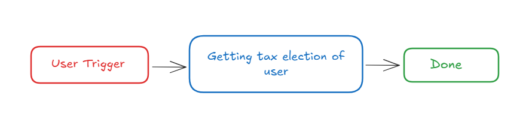

# **Introduction :**

Workday is a leading enterprise management platform, and the **“View Tax Elections”** feature allows users to view current tax election. Integrating this functionality into your bot enables users to seamlessly browse job listings, enhancing efficiency and organization.

This guide provides step-by-step instructions for incorporating the **View Tax Elections** feature into your bot using Creator Studio.

Let's get started!

# Prerequisites :

- [Postman](https://www.postman.com/) or an API Testing Tool
- Follow the [Workday Connector guide](https://developer.moveworks.com/creator-studio/resources/connector?id=workday) to set up your Creator Studio Connector.

# What are we building?

## **Conversation Design**

This [purple chat](https://developer.moveworks.com/creator-studio/developer-tools/purple-chat-builder/?workspace=%7B%22title%22%3A%22My+Workspace%22%2C%22botSettings%22%3A%7B%22name%22%3A%22%22%2C%22imageUrl%22%3A%22%22%7D%2C%22mocks%22%3A%5B%7B%22id%22%3A8421%2C%22title%22%3A%22New+Mock%22%2C%22transcript%22%3A%7B%22messages%22%3A%5B%7B%22from%22%3A%22USER%22%2C%22text%22%3A%22%3Cp%3EI+want+to+view+my+tax+elections.%3Cbr%3E%3C%2Fp%3E%22%7D%2C%7B%22from%22%3A%22BOT%22%2C%22text%22%3A%22%3Cp%3EI%27ll+retrieve+your+tax+elections+from+Workday.%3Cbr%3E%3C%2Fp%3E%22%7D%2C%7B%22from%22%3A%22ANNOTATION%22%2C%22text%22%3A%22Fetching+tax+elections+from+Workday%22%7D%2C%7B%22from%22%3A%22BOT%22%2C%22text%22%3A%22%3Cp%3EHere+are+your+current+tax+elections%3A%3Cbr%3E%3C%2Fp%3E%22%2C%22cards%22%3A%5B%7B%22title%22%3A%22Federal+Tax+Election%22%2C%22text%22%3A%22%3Cb%3EStatus%3A+%3C%2Fb%3E+Married%3Cbr%3E%3Cb%3EAllowances%3A+%3C%2Fb%3E+2%3Cbr%3E%3Cb%3EAdditional+withholding%3A+%3C%2Fb%3E+%24100%3Cbr%3E%22%7D%2C%7B%22title%22%3A%22State+Tax+Election%22%2C%22text%22%3A%22%3Cb%3EState%3A+%3C%2Fb%3E+California%3Cbr%3E%3Cb%3EStatus%3A+%3C%2Fb%3E+Single%3Cbr%3E%3Cb%3EAllowances%3A+%3C%2Fb%3E+1%3Cbr%3E%3Cb%3EAdditional+withholding%3A+%3C%2Fb%3E+%2450%3Cbr%3E%22%7D%5D%7D%5D%2C%22settings%22%3A%7B%22colorStyle%22%3A%22LIGHT%22%2C%22startTime%22%3A%2211%3A43%2BAM%22%2C%22defaultPerson%22%3A%22GWEN%22%2C%22editable%22%3Atrue%2C%22botName%22%3A%22%22%2C%22botImageUrl%22%3A%22%22%7D%7D%7D%5D%7D) shows the experience we are going to build.

# **Creator Studio Components**

- **Triggers**:
    1. Natural Language
- **Slots**:
    1. Fetch tax election.
- **Actions**:
    1. **Fetch tax election:**
        - The process of retrieving a tax election of user.
- **Guidelines:**
    1. None

# **API Research**

To build this use case, we will utilize one API. Since our goal is to fetch the tax election, we will focus on workday-related APIs. Only a single API call is required to achieve this.



## API #1: **Fetch tax election**

The **View Tax Elections** API enables users to retrieve comprehensive details about tax elections from Workday. By leveraging Workday's reporting and APIs, this functionality ensures efficient and accurate data retrieval, even in complex environments.

- **Purpose**: Retrieves detailed tax election data, including **Status, Allowances, and Additional Withholding Amount**.
- **Features**: Provides tax election details based on **Status, Allowances, and Additional Withholding Amount**., ensuring precise and relevant results.
- **Example**: Fetch tax election details based on specific criteria such as **Status, Allowances, and Additional Withholding Amount**.

```bash
curl --request GET
--location 'https://<DOMAIN>/api/wql/v1/<INSTANCE>/data?query=SELECT%20stateWithholdingOtherTaxElection%2C%20workerTaxWithholdingElections%2C%20workerAnnualFederalTaxElections%2C%20email_PrimaryWorkOrPrimaryHome%2C%20workdayID%2C%20fullName%2C%20federalWithholdingW_4_NoWageNoTaxExempt%2C%20federalWithholdingW_4_LastUpdatedDate%2C%20federalWithholdingW_4_NumberOfAllowances%2C%20federalWithholdingW_4_AdditionalAmount%2C%20stateWithholdingResident_MaritalStatus%2C%20stateWithholdingDomicile_MaritalStatus%2C%20stateWithholdingWork_MaritalStatus%2C%20stateWithholdingDomicile_NumberOfAdditionalAllowances%2C%20stateWithholdingDomicile_NumberOfAllowances%2C%20stateWithholdingResident_NumberOfAdditionalAllowances%2C%20stateWithholdingResident_NumberOfAllowances%2C%20stateWithholdingWork_AdditionalAmount%2C%20stateWithholdingResident_WH_4Filed%2C%20stateWithholdingResident_WH_47Filed%2C%20stateWithholdingWork_WH_4Filed%2C%20stateWithholdingWork_WH_47Filed%2C%20localCityWithholdingResident_City%2C%20stateWithholdingResident_CertificateOfResidence%2C%20workerStateTaxWithholdingElections%2C%20federalWithholdingW_4_MaritalStatus%20FROM%20workerFromName%20(name%20%3D%20%27<NAME>%27)' \
--header 'Content-Type: application/json'
```

# **Steps**

## **Step 1: Build HTTP Action**

Define your HTTP Actions for fetching all the backlog ideas of a specific project :

### **1. Fetch open jobs**

- In Creator Studio, create a new Action.
    - Navigate to plugin section > Actions tab
    - Click on CREATE to define a new action
        
        
        
- Click on the  IMPORT CURL option and paste the following cURL command:
    
    ```bash
    curl --request GET
    --location 'https://<DOMAIN>/api/wql/v1/<INSTANCE>/data?query=SELECT%20stateWithholdingOtherTaxElection%2C%20workerTaxWithholdingElections%2C%20workerAnnualFederalTaxElections%2C%20email_PrimaryWorkOrPrimaryHome%2C%20workdayID%2C%20fullName%2C%20federalWithholdingW_4_NoWageNoTaxExempt%2C%20federalWithholdingW_4_LastUpdatedDate%2C%20federalWithholdingW_4_NumberOfAllowances%2C%20federalWithholdingW_4_AdditionalAmount%2C%20stateWithholdingResident_MaritalStatus%2C%20stateWithholdingDomicile_MaritalStatus%2C%20stateWithholdingWork_MaritalStatus%2C%20stateWithholdingDomicile_NumberOfAdditionalAllowances%2C%20stateWithholdingDomicile_NumberOfAllowances%2C%20stateWithholdingResident_NumberOfAdditionalAllowances%2C%20stateWithholdingResident_NumberOfAllowances%2C%20stateWithholdingWork_AdditionalAmount%2C%20stateWithholdingResident_WH_4Filed%2C%20stateWithholdingResident_WH_47Filed%2C%20stateWithholdingWork_WH_4Filed%2C%20stateWithholdingWork_WH_47Filed%2C%20localCityWithholdingResident_City%2C%20stateWithholdingResident_CertificateOfResidence%2C%20workerStateTaxWithholdingElections%2C%20federalWithholdingW_4_MaritalStatus%20FROM%20workerFromName%20(name%20%3D%20%27<NAME>%27)' \
    --header 'Content-Type: application/json'
    ```
    
- Click on Use Existing Connector > select the Workday [](https://developer.moveworks.com/creator-studio/resources/connector/?id=jira)connector that you just created > Click on Apply. This will populate the Base URL and the Authorization section of the API Editor.
- **Params :**
    - Key ( **query** ) : Value ( **SELECT stateWithholdingOtherTaxElection,workerTaxWithholdingElections, workerAnnualFederalTaxElections, email_PrimaryWorkOrPrimaryHome, workdayID, fullName, federalWithholdingW_4_NoWageNoTaxExempt, federalWithholdingW_4_LastUpdatedDate, federalWithholdingW_4_NumberOfAllowances, federalWithholdingW_4_AdditionalAmount, stateWithholdingResident_MaritalStatus, stateWithholdingDomicile_MaritalStatus, stateWithholdingWork_MaritalStatus, stateWithholdingDomicile_NumberOfAdditionalAllowances, stateWithholdingDomicile_NumberOfAllowances, stateWithholdingResident_NumberOfAdditionalAllowances, stateWithholdingResident_NumberOfAllowances, stateWithholdingWork_AdditionalAmount, stateWithholdingResident_WH_4Filed, stateWithholdingResident_WH_47Filed, stateWithholdingWork_WH_4Filed, stateWithholdingWork_WH_47Filed, localCityWithholdingResident_City, stateWithholdingResident_CertificateOfResidence, workerStateTaxWithholdingElections, federalWithholdingW_4_MaritalStatus FROM workerFromName (name = '<NAME>')** )
    
    
    
- Click on Test to check if the Connector setup was successful and expect a successful response as shown below. You will see the request response on the left side and the generated output schema on the right. If the output schema does not match the API response or fails to populate automatically, kindly click the GENERATE FROM RESPONSE button to refresh and align the schema with the API response.
    
    
    
- Add the **API Name** and **API Description** as shown below, then click the Save button
    
    
    

## **Step 2: Build Compound Action**


- Head over to the **Compound Actions** tab and click **CREATE**
    
    
    
- Give your Compound Action a **Name** and **Description** , then click Next Note: Name only letters, numbers, and underscores. We suggest using snake case or camel case formatting (e.g. Workflow_name or workflowName )
    
    
    
- Click on the Script editor tab. Here you will be able to build your compound action using the YAML syntax. At a high-level, this syntax provides actions (HTTP Request, APIthon Scripts) and workflow logic (switch statements, for each loops, return statements, parallel, try/catch). See the [Compound Action Syntax](https://developer.moveworks.com/creator-studio/reference/compound_actions_syntax/) Reference for more info.
    
    ```yaml
    steps:
      - action:
          output_key: Tax_Elections_result
          action_name: Tax_Elections
          progress_updates:
            on_complete: Retrieved tax data
            on_pending: Retrieving tax data
          input_args:
            fullName: meta_info.user.full_name
      - return:
          output_mapper:
            FederalTaxElection:
              Allowances: data.Tax_Elections_result.data[0].federalWithholdingW_4_NumberOfAllowances
              Status: data.Tax_Elections_result.data[0].federalWithholdingW_4_MaritalStatus.descriptor
              Additionalwithholding: data.Tax_Elections_result.data[0].federalWithholdingW_4_AdditionalAmount
            StateTaxElection:
              Allowances: data.Tax_Elections_result.data[0].stateWithholdingResident_NumberOfAllowances
              Status: data.Tax_Elections_result.data[0].stateWithholdingResident_MaritalStatus
              Additionalwithholding: data.Tax_Elections_result.data[0].stateWithholdingWork_AdditionalAmount.value
    
    ```
    

## **Step 3: Publish Workflow to Plugin**

- Head over to the Compound Actions tab and click on the kebab menu ( ︙ )
- Next, click on Publish Workflow to Plugin
- First, verify your Plugin **Name** & **Short description** . This is auto filled from the name & description of your compound action.
    
    
    
- Next, consider whether to select the User consent required before execution? checkbox. Enabling this option prompts the user to confirm all slot values before executing the plugin, which is widely regarded as a best practice.
    
    
    
- Click Next and set up your positive and negative triggering examples. This ensures that the bot triggers your plugin given a relevant utterance.
    - See our [guide](https://developer.moveworks.com/creator-studio/conversation-design/triggers/natural-language-triggers/#how-to-write-good-triggering-examples) on Triggering
- Lastly, click Next and set the **Launch Rules** you want your plugin to abide by.
    - See our [guide](https://developer.moveworks.com/creator-studio/administration/launch-options/) on Launch Rules

## **Step 4: See it in action!**

- After clicking the final Submit button, your plugin will be published to the bot and triggerable based on your **Launch Rules.**
- You should wait up to **5 minutes** after making changes before trying to test in your bot!
- If you run into an issue:
    1. Check our [troubleshooting guides](https://developer.moveworks.com/creator-studio/troubleshooting/support/)
    2. Understand your issue using Logs
    3. Reach out to Support

# **Congratulations!**

You've just added the **"View Tax Elections"** feature inside your workday to your Copilot! Explore our other guides for more inspiration on what to build next.